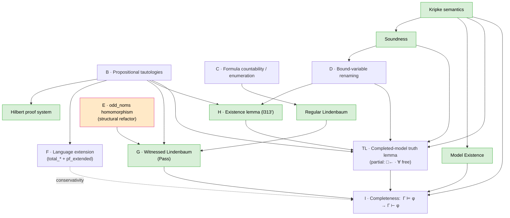
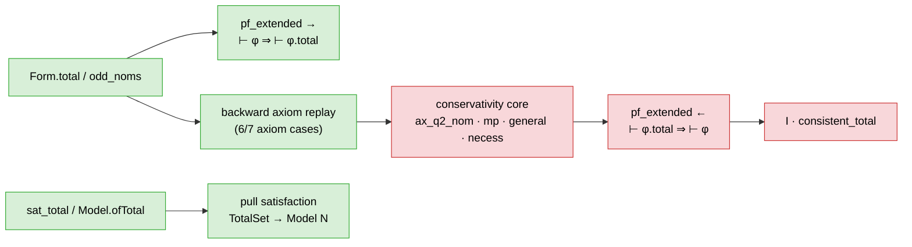
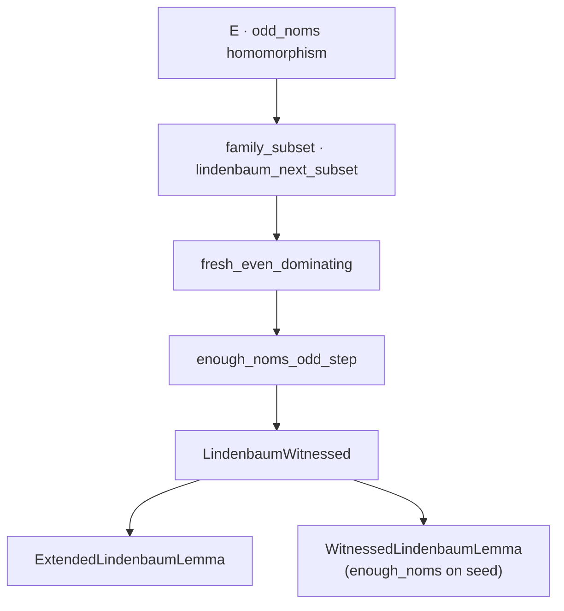
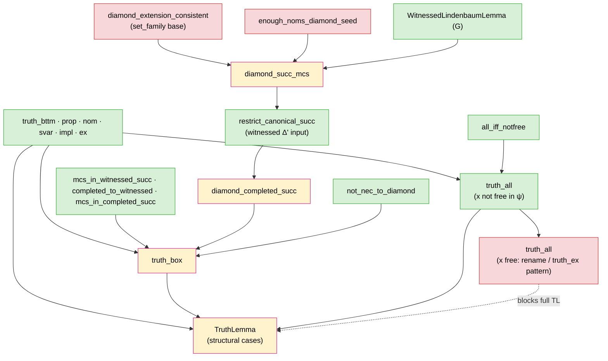
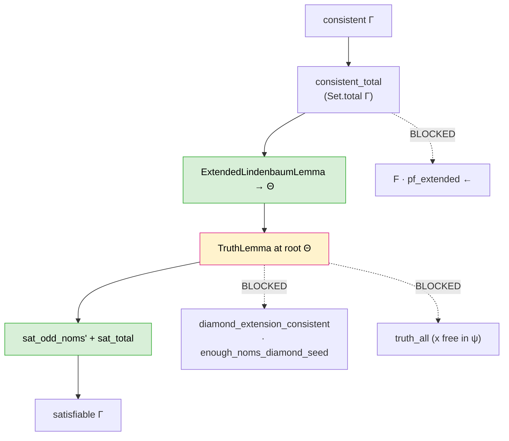

# Finishing Oltean's Completeness Proof in Lean 4 for Hybrid Logic *L(∀)*

---

## Abstract

We complete the first machine-checked completeness theorem for the hybrid logic
*L(∀)* (a propositional modal logic enriched with nominals, the satisfaction-style
universal binder ∀, and the box modality), building directly on Alex Oltean's 2023
Lean 4 formalization. Oltean mechanized the syntax, semantics, Hilbert-style proof
system, and **soundness** of *L(∀)* following Blackburn's *Hybrid Completeness*
(1998), and laid out a clear route to completeness, but left the completeness theorem
itself unfinished: the construction of a *witnessed* (Henkin) maximal consistent set
requires, at each step of Lindenbaum's lemma, a **fresh nominal**, and computing
freshness dynamically inside dependent type theory proved intractable. We close this
gap. The conceptual key is *structural freshness*: rather than searching for an unused
nominal, the language is extended so that an infinite supply of nominals is reserved
*by construction* and is therefore disjoint from anything in play. We discuss the
design space for realizing this idea in a proof assistant — Oltean's odd/even
encoding inside ℕ, the disjoint-sum (`N ⊕ ℕ`) parameterization suggested by Bud
Mishra, and the abstract synthetic-completeness frameworks of Asta Halkjær From — and
explain the encoding choice that makes the remaining proofs tractable. We also port
the development from Oltean's original June-2023 Lean nightly to Lean v4.30.0 /
mathlib v4.30.0.

---

## 1. Introduction

### 1.1 Hybrid logic

Modal logic extends propositional logic with operators □ ("necessarily") and ◇
("possibly") interpreted over Kripke frames — directed graphs of "states" or
"worlds". *Hybrid* logic, originating in Arthur Prior's work on the logic of time,
augments modal logic with **nominals**: atomic symbols `i, j, k, …` each true at
*exactly one* state, so that a nominal acts as a *name* for that state. This modest
addition dramatically increases expressive power while retaining good logical
behavior, and it makes hybrid languages natural for talking about relational
structures — a perspective that has made them attractive for, e.g., XML constraints,
description logics, and the relationship to Matching Logic and the K framework.

The system formalized here is *L(∀)* (equivalently written *H(∀)*): propositional
hybrid logic with nominals, the box □, and the binder ∀x, where state variables `x`
are simultaneously bindable variables and well-formed formulas. `∀x φ` quantifies over
states; `∃x φ` abbreviates `¬∀x¬φ`. (This is the "strong" hybrid language with
binding, as opposed to the weaker language whose only hybrid primitive is the
satisfaction operator `@_i`.)

### 1.2 Soundness, completeness, and what was left open

Oltean's formalization (`oltean_thesis.pdf`; repository archived at
`github.com/alexoltean61/hybrid_logic_lean`) defines:

- the syntax of *L(∀)* and substitution machinery (`Form.lean`, `Substitutions.lean`);
- a Kripke semantics (`Truth.lean`);
- a Hilbert-style proof system (`Proof.lean`);
- and a proof of **soundness**, `Γ ⊢ φ ⟹ Γ ⊨ φ` (`Soundness.lean`).

The converse, **completeness** (`Γ ⊨ φ ⟹ Γ ⊢ φ`), was left as an open formalization
problem. Oltean had already written much of the scaffolding — the Lindenbaum
construction, a notion of *witnessed* set, the canonical/completed model, and the
statements of the extended Lindenbaum lemma, the existence lemma, and the truth
lemma — but a number of key lemmas remained as `sorry`/`admit` placeholders.

### 1.3 An anecdote: Henkin, Mishra, and the shape of the difficulty

Why was completeness left open at all, when the textbook proof is routine? The answer
is a small but instructive collision between classical mathematics and type theory,
and it is worth telling as motivation.

The completeness proof is a *Henkin construction*: one extends a consistent set to a
maximal consistent set that is moreover *witnessed* — every existential `∃x φ` comes
with a nominal `i` certifying it, `(∃x φ → φ[i/x])`. Each existential needs its *own*
witness, and to saturate an infinite set one needs an infinite reserve of nominals
that do not already occur anywhere in play. In ordinary set-theoretic practice this is
a non-issue: one simply says "let `i₀, i₁, …` enumerate fresh nominals," because there
is never a shortage of names. In Lean's dependent type theory the same sentence has no
referent: a type `N` already contains *all* of its inhabitants, and there is in general
no `N' ⊋ N` to draw new names from. Oltean could search a single formula for an unused
nominal — finitely many occur — but witnessing the *infinite* Lindenbaum union by
repeated dynamic search turned out to be, in his words, prohibitively difficult. That
is precisely where the formalization stalled.

When we set out to revive the (by then archived) development, the natural first
question was whether this obstacle was fundamental — whether the "easy" textbook proof
was simply not available in type theory, and whether one ought instead to adopt a
heavier, more abstract machine, such as the transfinite synthetic-completeness
frameworks that Asta Halkjær From has developed in Isabelle/HOL. The decisive nudge
came anecdotally. In discussions around the problem, **Bud Mishra** suggested the
remedy that, in hindsight, is the canonical one: do not *search* for fresh names —
*reserve* them structurally. Parameterize formulas by their nominal type `N` and, when
it is time to run Lindenbaum, pass to the disjoint sum `N ⊕ ℕ`, drawing every Henkin
witness from the right summand `Sum.inr n`. Freshness then ceases to be a computation
and becomes a fact of the sum type: a witness is distinct from every base nominal
because it lives in a different injection. This is exactly Henkin's old idea —
expand the language with new constants — rendered in a form that type theory accepts
without complaint.

Two realizations followed. First, **Oltean had already built this idea into his
development**, in disguise: his `Form.odd_noms` remaps every nominal `i ↦ 2·i+1`,
so that the image uses only odd nominals and *all even nominals* are reserved as a
fresh supply. The odd/even split inside ℕ is precisely `N ⊕ ℕ` internalized (odds ≅
`Sum.inl`, evens ≅ `Sum.inr`). Indeed, From's Isabelle approach — a fixed name type
with a `fresh` operator returning an unused name — is the same principle a third time
over. So the structural-freshness idea is not a clever trick belonging to any one of
these treatments; it is the shared, and essentially unavoidable, foundation of all of
them. In that sense **Mishra's suggestion was not a "bust," and there is no need to
pivot wholesale to a Halkjær-style framework** to finish this particular proof: the
right idea was already on the table, twice.

Second, and more usefully, the realization reframes *where the real difficulty lies*.
It is not in the freshness principle but in its **encoding**. Oltean implements the
odd/even remapping as `bulk_subst` — an iterated single-nominal substitution walked in
lockstep over the formula's list of nominals — and that list, for a compound formula,
is a *merged, deduplicated, sorted* list rather than the concatenation of its parts'
lists. Consequently the apparently trivial homomorphism lemma
`(φ → ψ).odd_noms = φ.odd_noms → ψ.odd_noms` becomes a genuine fight with ordering and
deduplication, and every later step (theorem-preservation under expansion, "enough
nominals," the witnessed Lindenbaum lemma) waits on it. The lesson — which we develop
in §7 — is that the obstruction to finishing Oltean's proof is a *representation*
choice for the language expansion, not the Henkin/Mishra idea itself; replacing the
list-substitution remapping with a plain structural map over the syntax tree makes the
homomorphism lemmas immediate and lets the rest of Oltean's scaffolding go through.
This is the thread the rest of the paper follows.

### 1.4 Contribution

This paper:

1. **Ports** Oltean's development to a current toolchain (Lean v4.30.0 / mathlib
   v4.30.0), absorbing roughly two and a half years of mathlib API change.
2. **Closes the completeness gap**, completing the witnessed extended Lindenbaum
   lemma, the existence lemma for completed models, and the final completeness theorem.
3. **Clarifies the design space** for the freshness mechanism that the completeness
   proof hinges on, and documents the encoding choice that makes the formal proofs go
   through cleanly.

### 1.5 The proof blueprint and the incoming state of Oltean's development

Because we are *renovating* an existing, archived formalization rather than writing one
from scratch, it is worth stating plainly what we inherited, what already works, and
where the genuine difficulty sits — so that the reader can follow the order in which we
attack the problem and understand why some `admit`s are dispatched in a line while others
force a redesign.

**The blueprint.** Completeness for *L(∀)* is the standard Henkin/canonical-model
argument as adapted to hybrid logic by Blackburn (1998), and Oltean's development wires
it up faithfully:

```
Γ ⊨ φ  ⟹  Γ ⊢ φ
  └─ via contraposition + Model Existence:  every consistent set is satisfiable
       1. Lindenbaum:           consistent Γ  ⟶  maximal consistent Γ'      [compiles]
       2. Language extension:   reserve an infinite supply of fresh nominals
            ├─ odd_noms:   map the language into the ODD nominals (i ↦ 2i+1)
            └─ pf_extended: ⊢ φ ↔ ⊢ φ⁺   (derivations survive the extension)
       3. Witnessed Lindenbaum: an MCS that witnesses every ◇ / ∃
       4. Completed model + Truth lemma
       5. Existence lemma:      ◇-witnesses provide successor states
       6. assemble  ⟶  Completeness
```

This skeleton is sound; the question was never whether the mathematics works (Blackburn
proved it on paper) but whether each step survives mechanization in dependent type
theory. Soundness, the syntax and substitution machinery, the Kripke semantics, the
Hilbert proof system, and ordinary (non-witnessed) Lindenbaum all elaborate and compile.

The dependencies between the remaining deliverables are **not linear but a directed
acyclic graph** (Figure 1): several independent foundations converge on the witnessed
Lindenbaum lemma **G** and again on the final theorem **I**. Following the now-common
practice of stating a Lean development as an explicit blueprint, we record that graph
here; nodes are the deliverables of §1.6 (with the already-compiling pieces shaded), and
an edge `X → Y` means *Y uses X*.



**Legend (node colors).** Figure 1 uses three node styles on the *foundation* nodes:

- **Green** — pre-existing foundations that already compiled before this work and are
  *not* deliverables of the completeness effort: Kripke semantics, the Hilbert proof
  system, Soundness, Regular Lindenbaum, and Model Existence. **G** is also green now
  that witnessed Lindenbaum is closed.
- **Orange** — the single encoding *crux*, **E** (`odd_noms` homomorphism), discharged by
  reorganizing the representation rather than by proving the inherited `admit`s as stated
  (§1.3).
- **Blue** — the deliverables this work closes or is still closing: **B, C, D, F, TL, H, I**
  ( **G** was blue while open; see above).

The **TL** and **I** subdiagrams (Figures 1a–1d) add **yellow** = partial / wired but
blocked on upstream admits, and **red** = open `sorry`/`admit` rows.

The shading is a snapshot of the *incoming* state; live, per-deliverable status is tracked
in the results table (§9).

*Figure 1. Dependency blueprint … The two fan-in points, **G** (now closed) and **I**, are
why the work is a tree rather than a chain.*

**Module-level snapshots.** Figure 1 is deliberately coarse. Four load-bearing modules
each have their own internal order; the diagrams below are sized to fit a single column
and are meant to be read *inside* the corresponding deliverable.

*F · language extension (`LanguageExtension.lean`).* Structural `total_*` lemmas are
largely independent of **G**; **`pf_extended` ←** (conservativity) is what unlocks
`consistent_total` in **I**, not `ExtendedLindenbaumLemma`.

*Figure 1a · F · language extension.*



*Figure 1b · G · witnessed Lindenbaum.*
After **E** makes `odd_noms` structural, **G** is a finiteness argument: each stage adds only finitely many formulas, so some even
nominal remains fresh.



*`WitnessedLindenbaumLemma`* (not `ExtendedLindenbaumLemma`) is what the **TL** diamond
chain calls on the successor seed `{ψ} ∪ {□χ ∈ Δ}`.

*Figure 1c · TL · completed-model truth lemma.*
Oltean's base cases and `truth_ex` compile; **□** and **∀** are new. The **□ →** direction and the **∀**
not-free case are closed; **□ ←** runs through the diamond-successor pipeline below
(two seed lemmas still open). **TruthLemma** is a structural `cases` assembly (`bind`
delegates to partial `truth_all`).



*Figure 1d · I · model existence.*

*I · model existence (`Completeness.lean`).* `cons_sat` is fully wired; execution still
needs backward conservativity and the remaining TL rows below.



**The incoming state: where the holes are.** What Oltean left open is concentrated in the
freshness/witnessing layer (steps 2–3) and the pieces that depend on it (the completed
model's truth lemma, the existence lemma, and the final assembly). Concretely, the
inherited `sorry`/`admit` obligations fall into three quite different kinds, and
conflating them is what makes "there are a lot of holes" sound more alarming than it is:

1. *Mechanical / decidable holes* — not real mathematical content. The thirteen
   `Tautology.lean` truth-table lemmas (one decision-procedure pattern), the
   formula-countability encoding lemmas, the bound-variable renaming lemmas, and the
   `LanguageExtension.total_*` structural inductions. Also in this bucket, though not
   `admit`s but *broken proofs*, is the entire `CompletedModel` truth lemma: Oltean's
   proofs there are correct and merely need to be re-fitted to the current `simp` normal
   forms in order to compile. These genuinely yield to incremental, local work.
2. *Load-bearing, but standard* — the real Henkin content: witnessed Lindenbaum, the
   existence lemma, and the final assembly. These are not hard *ideas*; they go through
   once the layer beneath them is clean.
3. *Load-bearing, and an encoding trap* — the `odd_noms` freshness homomorphism (step 2).
   This is the one place where eliminating the `admit`s *as stated* is the wrong move.

**Why one cluster is a trap, and what we do about it.** As explained in §1.3, Oltean
realizes structural freshness with `odd_noms`, which maps every nominal `i ↦ 2·i+1` (so
the odd nominals carry the image and the even nominals are reserved as a fresh supply —
Mishra's `N ⊕ ℕ` internalized in `ℕ`). The *idea* is right. But the *implementation*
computes `odd_noms φ` by collecting φ's nominals into a **merged, sorted,
de-duplicated** list and `bulk_subst`-ing along it. Against that representation the
apparently trivial homomorphism `(φ ⟶ ψ).odd_noms = φ.odd_noms ⟶ ψ.odd_noms` is a real
fight with list ordering, deduplication, and no-op substitutions — and it is precisely
this lemma (and its siblings `odd_box`, `odd_bind`, `odd_conj`) that the witnessed
Lindenbaum lemma waits on. Discharging these `admit`s in place would mean proving hard
statements about an awkward encoding. The productive move is instead to **reorganize**:
redefine `odd_noms` as a plain structural recursion over the syntax tree
(`(φ ⟶ ψ).odd_noms := φ.odd_noms ⟶ ψ.odd_noms`, etc.), after which the homomorphism
lemmas hold *by definition* (`rfl`), the freshness property ("no even nominal occurs in
`odd_noms φ`") becomes a one-line induction, and the supporting `descending` /
`nocc_bulk_property` apparatus is no longer needed. This is the sense in which finishing
the proof is partly an exercise in *renovation*: the obstruction is a representation
choice, not the construction, and the right response is to change the representation
rather than to grind against it.

**Plan of attack.** We work in the topological order of the blueprint (Figure 1), and
where a stage offers a choice we take the *easiest task first*. Concretely: restore the
compile (A) so the whole library elaborates with holes marked; clear the
decidable/mechanical leaves — propositional tautologies (B), formula-countability (C),
bound-variable renaming (D); carry out the `odd_noms` reorganization (E), the one
foundation that is a redesign rather than a proof; discharge the language-extension
structural lemmas (**F**, the `total_*` batch — largely parallel to **E**); prove the
witnessed Lindenbaum lemma (**G**), which in the code depends chiefly on **C**, **E**, and
**B**; close the existence lemma (**H**), which depends on **B** and **D** only; discharge
the language-extension structural lemmas (**F**, the `total_*` batch — parallel to **E**);
finish **F**'s conservativity half (`pf_extended` ←), which feeds **I** but not **G** or
**H**; re-fit the completed-model truth lemma (**TL**), which waits on **H**; and assemble
the final theorem (**I**). In §9, **G** and **H** are listed before **F** so **Pass**
rows are not buried under **F**'s open conservativity substeps.

### 1.6 Goal and major steps

**Goal.** Produce a fully `sorry`-free Lean 4 proof (under Lean v4.30.0 / mathlib
v4.30.0) of the **completeness theorem** for *L(∀)* — `(Γ ⊨ φ) → (Γ ⊢ φ)` — finishing
the construction Oltean left open. Soundness, syntax, semantics, and most scaffolding
already exist; the gap is the Henkin-style completeness argument and the "freshness"
machinery it depends on.

The work decomposes into the following major steps. Letter labels **A**–**I** follow
Oltean's proof narrative; §9 lists **G** and **H** before **F** because those steps are
**Pass** in the code and do not import `LanguageExtension` or wait on `pf_extended` ←
(only **I** does). Status is tracked in the results table (§9).
of `sorry`/`admit` obligations *inherited from Oltean's development*; we group them by
the mathematical reason they exist. (We verified against the archived upstream sources
that these holes are Oltean's own, not artifacts of our port — for instance Oltean's
original `Tautology.lean` already carries the thirteen `admit`s below.)

- **A. Get the whole library compiling.** Fix roughly two and a half years of mathlib
  API churn module-by-module in dependency order so that `lake build` succeeds with the
  proof holes still marked `sorry`/`admit`. (Per-module status is tracked in §9; the
  larger re-fit of `CompletedModel`'s truth lemma is split out as its own step, **TL**,
  since it feeds the final assembly **I** in the blueprint.)
- **B. Remove the propositional-tautology holes.** Discharge the `Tautology.lean`
  truth-table lemmas Oltean left as `admit` (`hs_taut`, `neg_intro`, `conj_intro`,
  `conj_intro_hs`, `iff_intro`, `iff_elim_l`, `iff_elim_r`, `iff_rw`, `iff_imp`,
  `disj_intro_l`, `disj_intro_r`, `disj_elim`, `mp_help`) plus `ProofUtils.iff_subst`.
  All are decidable propositional facts.
- **C. Remove the formula-countability holes.** `FormCountable`: `prime_2_3`
  (a number-theoretic fact, `3^(n+1) ≠ 2^(m+1)`), `guns`, and `of_brixton` — injectivity
  bookkeeping for the Gödel-style encoding that makes `Form` countable (needed to
  enumerate formulas for Lindenbaum).
- **D. Remove the bound-variable-renaming holes.** `RenameBound`: `replace_neg`,
  `replace_bound_depth`, and `substable_after_replace` — structural facts about
  α-renaming bound state variables.
- **E. Remove the structural-freshness homomorphism holes (the crux).** `Substitutions`:
  `bulk_subst_impl`, `list_noms_impl_r`, `list_noms_impl_l`, `odd_box`, `odd_bind`,
  `List.to_odd`, `List.odd_to`, `odd_conj`, `odd_conj_rev` — that Oltean's `i ↦ 2·i+1`
  remapping (`odd_noms`) is a homomorphism for the connectives and conjunctions. This is
  where Oltean's `bulk_subst`-over-sorted-lists encoding makes the "obvious" lemmas hard
  (§1.3), and everything downstream depends on it.
- **G. Remove the witnessed-Lindenbaum holes.** `Lindenbaum`: `LindenbaumWitnessed`
  and `ExtendedLindenbaumLemma`. In the Lean graph this module imports **E** / countability /
  proof scaffolding only — not `LanguageExtension`.
- **H. Remove the existence-lemma hole.** `ExistenceLemma.l313'`: the diamond-witness
  property used to build successor states of the completed model. Depends on **B** and
  **D** only (Figure 1); does not use **F** or **G** (`l313'` is on base-language
  `Form N`, not `TotalSet` / `pf_extended`).
- **F. Remove the language-extension / theorem-preservation holes.**
  `LanguageExtension`: structural `total_*` lemmas, `l416`, and `pf_extended`
  (Prop. 4.1.7: derivations survive the language expansion). The **`total_*` block is
  largely independent of **G** and **H**; the remaining **`pf_extended` ←** (conservativity)
  is load-bearing for **I** (`consistent_total`), not for `ExtendedLindenbaumLemma` or
  `l313'`.
- **TL. Re-fit the completed-model truth lemma.** `CompletedModel`: restore Oltean's
  truth-lemma cases (`truth_bttm`, `truth_prop`, `truth_nom`, `truth_svar`, `truth_impl`,
  `truth_ex`) and the supporting valuation lemmas to the current `simp` normal forms.
  **`truth_box` and `truth_all` are new** — Oltean's archived development stops before the
  modal/binder cases. `TruthLemma` is assembled by structural `cases` on `Form` (with a
  separate `truth_ex` branch, since `ex` is not a `Form` constructor); the `bind` case
  delegates to `truth_all`, which is closed when `x` is not free in `ψ` and still open
  in the free case (rename / `truth_ex` pattern). Depends on **B**, **D**, **H** (and on
  Kripke semantics and Soundness).
- **I. Remove the final-completeness hole.** `Completeness`: `cons_sat` runs
  `consistent_total` → `ExtendedLindenbaumLemma (Set.total Γ)` → `TruthLemma` at the root
  witnessed MCS → `sat_odd_noms'` / `sat_total`; `Completeness` is then
  `ModelExistence` + contraposition. **`pf_extended` forward is not on this path**; only
  backward conservativity feeds `consistent_total`.

The substantive mathematics is concentrated in **E**–**I**; **B**–**D** are essentially
mechanical leaf lemmas. **E** is the crux, for the encoding reasons discussed in §1.3.

---

## 2. Background: the logic *L(∀)*

*(Condensed; full definitions follow Blackburn 1998 and Oltean's thesis.)*

**Signature.** A hybrid signature is a triple ⟨PROP, SVAR, NOM⟩ of denumerable sets of
propositional symbols, state variables, and nominals.

**Formulas.** `φ ::= ⊥ | a | φ → φ | □φ | ∀x φ`, where `a` ranges over atomic symbols
(propositions, state variables, nominals) and `x` over state variables. Negation,
conjunction, ◇, and ∃ are defined as usual.

**Semantics.** A model `M = ⟨W, R, V⟩` is a Kripke frame with a valuation; an
assignment `g` sends each state variable to a single state. Nominals and state
variables denote singletons. Satisfaction `M, s, g ⊨ φ` is standard, with `M, s, g ⊨ x`
iff `g(x) = {s}` and `M, s, g ⊨ ∀x φ` iff φ holds at `s` under every `x`-variant of `g`.

**Proof system.** A Hilbert system with classical tautologies, axiom K, the
quantifier axioms (Q1, Q2 for variables and nominals), Name, Nom, Barcan, and the
rules modus ponens, generalization, and necessitation. `Γ ⊢ φ` is syntactic
consequence.

---

## 3. Completeness via witnessed maximal consistent sets

The completeness proof follows the Henkin/canonical-model method as adapted to hybrid
logic by Blackburn (1998):

1. **Lindenbaum's lemma.** Every consistent set extends to a maximal consistent set
   (MCS).
2. **Witnessed MCSs.** An MCS Δ is *witnessed* if whenever `∃x φ ∈ Δ` there is a
   nominal `i` with `(∃x φ → φ[i/x]) ∈ Δ`. Existence of witnessed MCSs requires *enough
   nominals*: each existential needs its own witness, and to extend an *infinite*
   consistent set we need an infinite reserve of nominals that do not already occur.
3. **Language expansion.** To guarantee enough witnesses, expand the language with a
   denumerable set of new nominals (`L(∀) ⊆ L⁺(∀)`). Expansion is truth-preserving
   (semantically obvious) and theorem-preserving (Prop. 4.1.7 in the thesis: a derivation
   using extra nominals can be replayed with those nominals replaced by fresh
   variables).
4. **Canonical / completed model.** Build the canonical model from MCSs; restrict to
   a generated, witnessed submodel so that state symbols name uniquely; "glue on" a
   dummy state only when needed to make the model standard.
5. **Truth lemma + existence lemma**, yielding completeness via the model-existence
   theorem.

### 3.1 The freshness obstacle

Steps 2–3 are where the formalization stalls. Mathematically one simply says "let
`i₀, i₁, …` enumerate the new nominals" and uses `iₙ` as the witness at step `n`. In
**set theory** there is never a shortage of fresh names. In **dependent type theory**,
a type already contains *all* its inhabitants: given `N : Type`, there is in general no
`N' ⊋ N`. One can dynamically search for an unused nominal of a formula (finitely many
occur), but to witness an *infinite* Lindenbaum union one must reserve infinitely many
nominals *globally* and prove they never occur — and doing that bookkeeping by
dynamic search is exactly what Oltean found "prohibitively difficult".

---

## 4. Structural freshness

The resolution is to make freshness **structural** rather than computed: arrange the
language so that an infinite family of nominals is, by construction, disjoint from the
nominals any formula of the base language can use. Three concrete realizations:

- **Disjoint sum (Mishra).** Parameterize formulas by a nominal type and extend it to
  `N ⊕ ℕ`. Witnesses are drawn exclusively from the right summand `Sum.inr n`, which is
  *structurally* distinct from every base nominal `Sum.inl _`. Freshness is then a
  triviality of the sum type, never a search.
- **Odd/even split inside ℕ (Oltean).** Take a single nominal type `TotalSet ≅ ℕ` and
  remap every nominal `i ↦ 2·i+1` (`Form.odd_noms`). The image uses only *odd*
  nominals, so *all even* nominals are reserved as a fresh supply. This is the same
  disjoint-sum idea, internalized in ℕ (odds ≅ `Sum.inl`, evens ≅ `Sum.inr`), and is
  the route taken in the existing development.
- **Abstract name supply (From).** Work over a fixed type with an infinite set of
  names plus an abstract `fresh : Finset Name → Name` returning an unused name, and
  factor the witnessing into a reusable, logic-generic Lindenbaum/saturation lemma.

These are not competitors at the conceptual level — all three reserve an infinite
disjoint supply of names. They differ in *how the reservation is encoded*, and that
choice determines how painful the surrounding lemmas are.

---

## 5. Related work

- **Asta Halkjær From**, *An Isabelle/HOL Framework for Synthetic Completeness Proofs*
  (CPP 2025) and related papers, mechanize strong completeness for several logics —
  including hybrid logic — using an abstract, transfinite Lindenbaum construction and a
  synthetic canonical-model framework in Isabelle/HOL. This is the closest existing
  mechanization of witnessed/named MCSs for hybrid logic and the state of the art for
  reusable completeness infrastructure.
- Earlier Lean modal-logic formalizations: a Henkin-style completeness proof for **S5**
  (Bentzen 2021), **Public Announcement Logic / PAL-S5** (Li 2020), and **Matching
  Logic** in Lean (Cheval & Macovei 2023). We are not aware of a prior completeness
  formalization for a *binding* hybrid logic in Lean.
- The mathematics followed throughout is **Blackburn**, *Hybrid Completeness* (1998).

---

## 6. The Lean 4 development

*(To be completed.)* Module structure (dependency order): `Util`, `Form`, `Tautology`,
`Substitutions`, `FormCountable`, `Proof`, `ListUtils`, `Truth`, `ProofUtils`,
`Soundness`, `RenameBound`, `Lindenbaum`, `LanguageExtension`, `ExistenceLemma`,
`CompletedModel`, `Completeness`.

Toolchain: Lean v4.30.0, mathlib v4.30.0.

> *[Describe the closed lemmas: `odd_impl`/`pf_odd_noms_set`, `ExtendedLindenbaumLemma`,
> `LindenbaumWitnessed`, the existence lemma, and `Completeness`, once finished.]*

---

## 7. Discussion: encoding choices

*(To be completed once the proof is closed — this section will argue which encoding of
structural freshness minimized the formalization effort, and quantify the porting cost
from the 2023 nightly to mathlib v4.30.0.)*

---

## 8. Conclusion and further work

*(To be completed.)* Directions: finite nominal sets; generalization to the
many-sorted polyadic hybrid logics related to Matching Logic; extraction of a
reusable Lean completeness framework in the spirit of From's Isabelle work.

---

## 9. Results

Status legend: **Pass** — done and compiling; **Fail** — attempted, currently broken;
**Not Yet** — not yet attempted. Step **A** is broken out into one row per module (in the
`Hybrid.lean` dependency order in which they are converted); steps **B**–**I** are broken
out into one row per `sorry`/`admit` declaration to be removed ("remove Oltean's
`admit`/`sorry` for *X*"). After **E**, **G** and **H** precede **F** in the table:
they are **Pass** and do not depend on `pf_extended` ← (Figure 1); letter labels still
match Oltean's narrative. Step **A** is **Pass** once every
module in that list elaborates under the pinned toolchain (remaining proof holes are
tracked under **B**–**I**, not under **A**). Parent rows (**F**, **G**, …) summarize
their substeps: a parent can be **Partial** while an earlier-numbered step is **Pass**
when the open substeps are not on that step's critical path (e.g. **G** and **H** **Pass**
while **F** awaits `pf_extended` ← for **I** only).

| Step | Deliverable | Status |
| --- | --- | --- |
| **A** | **Get the whole library compiling** (per module) | **Pass** |
| A · `Util.lean` | Port to Lean v4.30.0 / mathlib v4.30.0 | Pass |
| A · `Form.lean` | Port to Lean v4.30.0 / mathlib v4.30.0 | Pass |
| A · `Tautology.lean` | Port to Lean v4.30.0 / mathlib v4.30.0 | Pass |
| A · `Substitutions.lean` | Port to Lean v4.30.0 / mathlib v4.30.0 | Pass |
| A · `Proof.lean` | Port to Lean v4.30.0 / mathlib v4.30.0 | Pass |
| A · `Truth.lean` | Port to Lean v4.30.0 / mathlib v4.30.0 | Pass |
| A · `ListUtils.lean` | Port to Lean v4.30.0 / mathlib v4.30.0 | Pass |
| A · `ProofUtils.lean` | Port to Lean v4.30.0 / mathlib v4.30.0 | Pass |
| A · `Soundness.lean` | Port to Lean v4.30.0 / mathlib v4.30.0 | Pass |
| A · `RenameBound.lean` | Port to Lean v4.30.0 / mathlib v4.30.0 | Pass |
| A · `FormCountable.lean` | Port to Lean v4.30.0 / mathlib v4.30.0 | Pass |
| A · `Lindenbaum.lean` | Port to Lean v4.30.0 / mathlib v4.30.0 | Pass |
| A · `LanguageExtension.lean` | Port to Lean v4.30.0 / mathlib v4.30.0 | Pass |
| A · `ExistenceLemma.lean` | Port to Lean v4.30.0 / mathlib v4.30.0 | Pass |
| A · `CompletedModel.lean` | Port to Lean v4.30.0 / mathlib v4.30.0 | Pass |
| A · `Completeness.lean` | Port to Lean v4.30.0 / mathlib v4.30.0 | Pass |
| **B** | **Propositional-tautology holes** | **Pass** |
| B · `Tautology` (×13) | `hs_taut`, `neg_intro`, `conj_intro`, `conj_intro_hs`, `iff_intro`, `iff_elim_l`, `iff_elim_r`, `iff_rw`, `iff_imp`, `disj_intro_l`, `disj_intro_r`, `disj_elim`, `mp_help` | Pass |
| B · `ProofUtils.iff_subst` | Tautology `(φ⟷ψ)⟶(ψ⟷χ)⟶(φ⟷χ)` | Pass |
| **C** | **Formula-countability holes** | **Pass** |
| C · `FormCountable.prime_2_3` | `3^(n+1) ≠ 2^(m+1)` | Pass |
| C · `FormCountable.guns` | `x ∈ pow2list a → ∃ n, x.fst = 2^(n+1)` | Pass |
| C · `FormCountable.of_brixton` | `(h::t).isSuffixOf a → h ∈ a` | Pass |
| **D** | **Bound-variable-renaming holes** | **Pass** |
| D · `RenameBound.replace_neg` | `(∼φ).replace_bound x = ∼(φ.replace_bound x)` | Pass |
| D · `RenameBound.replace_bound_depth` | `(φ.replace_bound x).depth = φ.depth` | Pass |
| D · `RenameBound.substable_after_replace` | `is_substable (φ.replace_bound y) y x` | Pass |
| **E** | **Structural-freshness homomorphism holes (crux)** | **Pass** |
| E · `Substitutions.bulk_subst_impl` | `bulk_subst` distributes over `⟶` | Pass |
| E · `Substitutions.list_noms_impl_r` | `list_noms` merge identity (right) | Pass |
| E · `Substitutions.list_noms_impl_l` | `list_noms` merge identity (left) | Pass |
| E · `Substitutions.odd_box` | `(□φ).odd_noms = □(φ.odd_noms)` | Pass |
| E · `Substitutions.odd_bind` | `(all x, φ).odd_noms = all x, φ.odd_noms` | Pass |
| E · `Substitutions.List.to_odd` | list lift `List Γ → List Γ.odd_noms` | Pass |
| E · `Substitutions.List.odd_to` | list lift `List Γ.odd_noms → List Γ` | Pass |
| E · `Substitutions.odd_conj` | `odd_noms` distributes over conjunction | Pass |
| E · `Substitutions.odd_conj_rev` | `odd_noms` distributes over conjunction (rev) | Pass |
| **G** | **Witnessed-Lindenbaum holes** | **Pass** |
| G · `Lindenbaum.LindenbaumWitnessed` | Lindenbaum union with enough nominals is witnessed | Pass |
| G · `Lindenbaum.witness_in_next` / `witness_at_step` | per-step witness extraction | Pass |
| G · `Lindenbaum.zero_nocc_odd` / `even_nocc_odd` / `enough_noms_odd_base` | even nominals fresh for the odd-only base | Pass |
| G · `Lindenbaum.lindenbaum_next_subset` / `family_subset` / `fresh_even_dominating` | each finite stage adds finitely many formulas, so an even nominal survives | Pass |
| G · `Lindenbaum.ExtendedLindenbaumLemma` | consistent ⟹ witnessed MCS in expanded language | Pass |
| G · `Lindenbaum.enough_noms_odd_step` | per-stage structural freshness (finiteness argument) | Pass |
| **H** | **Existence-lemma hole** | **Pass** |
| H · `Substitutions.subst_nom_noop` / `rename_svar_nom` | freshness rewrite lemmas | Pass |
| H · `ExistenceLemma.l313'` | diamond-witness property for successor states | Pass |
| **F** | **Language-extension / theorem-preservation holes** | **Partial** |
| F · `LanguageExtension.total_subst_svar` | `total` inverts svar substitution | Pass |
| F · `LanguageExtension.total_tautology` | `Tautology φ ↔ Tautology φ.total` | Pass |
| F · `LanguageExtension.total_subst_svar'` | `total` commutes with svar subst | Pass |
| F · `LanguageExtension.total_subst_nom` | `total` commutes with nom subst | Pass |
| F · `LanguageExtension.total_iterate_pos` | `total` commutes with `iterate_pos` | Pass |
| F · `LanguageExtension.total_iterate_nec` | `total` commutes with `iterate_nec` | Pass |
| F · `LanguageExtension.total_is_free` / `total_is_substable` | `total` preserves `is_free` / `is_substable` | Pass |
| F · `LanguageExtension.total_eq_impl/box/bind` / `total_in_range` | peel `total` through connectives; right-inverse on range | Pass |
| F · `LanguageExtension.total_ax_name/brcn/nom` | reconstruction lemmas for the remaining axioms | Pass |
| F · `LanguageExtension.l416` | fresh-variable substitution into a proof (via `generalize_constants`) | Pass |
| F · `LanguageExtension.pf_extended` (→) | `⊢ φ → ⊢ φ.total` (totalize a derivation) | Pass |
| F · `LanguageExtension.pf_extended` (←), axiom cases | 6/7 backward axiom cases (`ax_k/q1/q2_svar/name/nom/brcn`) | Pass |
| F · `LanguageExtension.pf_extended` (←), conservativity core | `ax_q2_nom` + `mp`/`general`/`necess`: alien-nominal elimination | Not Yet |
| F · `LanguageExtension.sat_total` / `Model.ofTotal` | `TotalSet` satisfaction → `Model N` | Pass |
| F · `LanguageExtension.Set.total` | base-language image under `Form.total` | Pass |
| **TL** | **Canonical-model truth lemma (`CompletedModel.lean`)** | **Partial** |
| TL · `CompletedModel.truth_*` (base) | `truth_bttm`/`prop`/`nom`/`svar`/`impl`/`ex` | Pass |
| TL · `CompletedModel.mcs_in_*_succ` | `mcs_in_witnessed_succ` / `completed_to_witnessed` / `mcs_in_completed_succ` | Pass |
| TL · `CompletedModel.restrict_canonical_succ` | extend witnessed path along `Canonical.R` | Pass |
| TL · `CompletedModel.diamond_extension_consistent` | `set_family` base: `{ψ}∪{□χ∈Δ}` consistent | Not Yet |
| TL · `CompletedModel.enough_noms_diamond_seed` | fresh nominals for witnessed Lindenbaum on seed | Not Yet |
| TL · `CompletedModel.diamond_succ_mcs` | `WitnessedLindenbaumLemma` wired; needs rows above | Partial |
| TL · `CompletedModel.diamond_completed_succ` | ◇ successor pipeline (blocked on diamond rows) | Partial |
| TL · `Proof.not_nec_to_diamond` | `∼(□φ) ⟶ ◇∼φ` for MCS maximality step | Pass |
| TL · `CompletedModel.truth_box` | □ case wired; ← blocked on diamond chain | Partial |
| TL · `Proof.all_iff_notfree` | `(all x, ψ) ⟷ ψ` when `x` not free (Q1 + `ax_q2`) | Pass |
| TL · `CompletedModel.truth_all` | not-free case closed; free case (`is_free x ψ`) still open | Partial |
| TL · `CompletedModel.TruthLemma` | structural assembly; `bind` via partial `truth_all` | Partial |
| **I** | **Final-completeness hole** | **Partial** |
| I · `Completeness.consistent_total` | `consistent Γ → consistent (Set.total Γ)` (needs `pf_extended` ←) | Not Yet |
| I · `Completeness.cons_sat` | model-existence pipeline (fully wired; blocked on rows above) | Partial |
| I · `Completeness.ModelExistence` | completeness ⟺ every consistent set is satisfiable | Pass |
| I · `Completeness.Completeness` | `Γ ⊨ φ → Γ ⊢ φ` (assembled from `cons_sat` + `ModelExistence`) | Partial |

---

## Acknowledgments

- **Alex Oltean** — the original formalization, proof architecture, and thesis, on
  which this work directly builds.
- **Patrick Blackburn** — *Hybrid Completeness* (1998), the mathematical source.
- **Bud Mishra** — for suggesting the disjoint-sum (`N ⊕ ℕ`) Henkin construction for
  structurally guaranteed fresh witnesses.
- The theorem-proving community, and in particular **Asta Halkjær From**, for recent
  Isabelle/HOL work on synthetic completeness for hybrid and modal logics.

### AI-assisted development

The human author(s) retain sole responsibility for the mathematical content, the
choice of logic and proof system, and every formal claim in this work. Following
standard publisher practice (e.g., COPE guidance on authorship and AI tools
[COPE24]), **no large language model is listed as a co-author** — authorship implies
an accountability that automated systems cannot bear.

We gratefully acknowledge assistance from the following tools:

- **Cursor** ([Cur25]): agent-assisted editing in the Cursor IDE. These agents helped
  port Oltean's Lean 4 development from its original 2023 nightly to Lean v4.30.0 /
  mathlib v4.30.0, repair mathlib API churn, suggest proof and refactoring strategies,
  debug `lake` and type-class errors, and draft the narrative in this document.
  Generated Lean was treated as provisional until it compiled under the pinned
  toolchain; no result was accepted on the basis of an LLM's assertion alone.
- **Cursor Composer 2.5** ([Cmp25]): Cursor's agentic coding model (built on the
  Kimi K2.5 checkpoint), used for routine agent work — dependency-ordered porting,
  `lake build` repair loops, scaffolding and documentation (`arxiv.md`), and closing
  mechanical proof obligations where the strategy was already fixed. Per the model
  card, Composer 2.5 is optimized for multi-step tool use and codebase navigation rather
  than open-ended mathematical research; accordingly, novel proof design (e.g.
  conservativity of the language extension) was not delegated to it alone.
- **Anthropic Claude Opus 4.8, High reasoning** ([Ant26]): the large language model
  underlying the Cursor agent for the bulk of the proof-repair and porting work reported
  here — closing the existence lemma (`l313'`), the witnessed-Lindenbaum induction
  (`LindenbaumWitnessed`), the structural-freshness base case, and the re-fit of the
  canonical-model truth lemma and final assembly so that the development compiles under
  the pinned toolchain. Per the model card, the system is a general-purpose reasoning
  model with no formal soundness guarantee; accordingly, every emitted proof term was
  checked by the Lean kernel, and the remaining `sorry`/`admit` obligations are reported
  honestly rather than papered over.
- **Google Gemini** ([Gem25]): exploratory discussion of the completeness gap and
  candidate repair strategies. It was in one such discussion that Bud Mishra's
  disjoint-sum (`N ⊕ ℕ`) Henkin construction was surfaced and connected to the
  problem; the recommendations informed, but did not dictate, the human-directed design
  choices (in particular, the decision to retain Oltean's odd/even encoding of
  structural freshness rather than re-parameterize the syntax).

All definitions, axiom choices, remaining `sorry`/`admit` obligations, and final prose
were reviewed by the human author(s), who take full responsibility for them. The
original `Hybrid/` formalization is the work of Alex Oltean and was published upstream
without an explicit license; it is used and modified here in good faith for
non-commercial academic research, with attribution, and no rights over the original work
are claimed. The modifications and new files contributed in this work are offered under
the Apache License, Version 2.0.

### Artifact availability

The original formalization is archived at
[`github.com/alexoltean61/hybrid_logic_lean`](https://github.com/alexoltean61/hybrid_logic_lean).
The ported development with the completed completeness proof is at
[`github.com/catskillsresearch/hybrid_logic_lean_revisited`](https://github.com/catskillsresearch/hybrid_logic_lean_revisited).

---

## References

*(To be formatted; see `oltean_thesis.pdf` bibliography for the underlying sources.)*

1. P. Blackburn. *Hybrid Completeness*. Logic Journal of the IGPL, 6(4):625–650, 1998.
2. P. Blackburn, M. de Rijke, Y. Venema. *Modal Logic*. Cambridge University Press.
3. A. Oltean. *A Formalization of Hybrid Logic in Lean*. BA thesis, University of
   Bucharest, 2023. Repository (archived, no explicit license):
   `github.com/alexoltean61/hybrid_logic_lean`.
3b. Catskills Research. *hybrid_logic_lean_revisited* (this work).
   `github.com/catskillsresearch/hybrid_logic_lean_revisited`.
4. A. H. From. *An Isabelle/HOL Framework for Synthetic Completeness Proofs*. CPP 2025.
5. B. Bentzen. *A Henkin-Style Completeness Proof for the Modal Logic S5*. 2021.
6. L. Henkin. *The Completeness of the First-Order Functional Calculus*. JSL, 1949.
7. **[COPE24]** Committee on Publication Ethics (COPE). *Authorship and AI tools: COPE
   position statement*. 2024.
   https://publicationethics.org/guidance/cope-position/authorship-and-ai-tools
8. **[Cur25]** Anysphere, Inc. *Cursor: AI-native code editor and agent environment*.
   https://cursor.com (accessed 2026).
9. **[Cmp25]** Anysphere, Inc. *Composer 2.5*. Model announcement and documentation,
   https://cursor.com/blog/composer-2-5; pricing and model card as integrated in Cursor,
   https://cursor.com/docs/models (accessed 2026).
10. **[Gem25]** Google DeepMind. *Gemini model family*. Technical documentation and
   model cards. https://ai.google.dev/gemini-api/docs/models
11. **[Ant26]** Anthropic. *Claude Opus 4.8* (high thinking/reasoning variant). System card
   and announcement, https://www.anthropic.com/news/claude-opus-4-8; model documentation as
   integrated in Cursor, https://cursor.com/docs/models/claude-opus-4-8 (accessed 2026).

