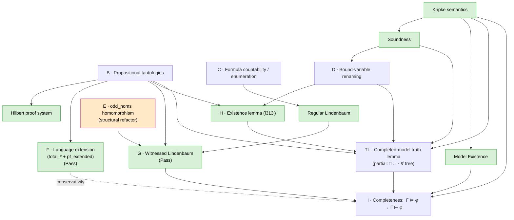
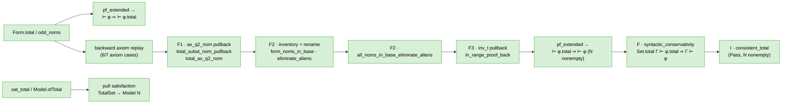
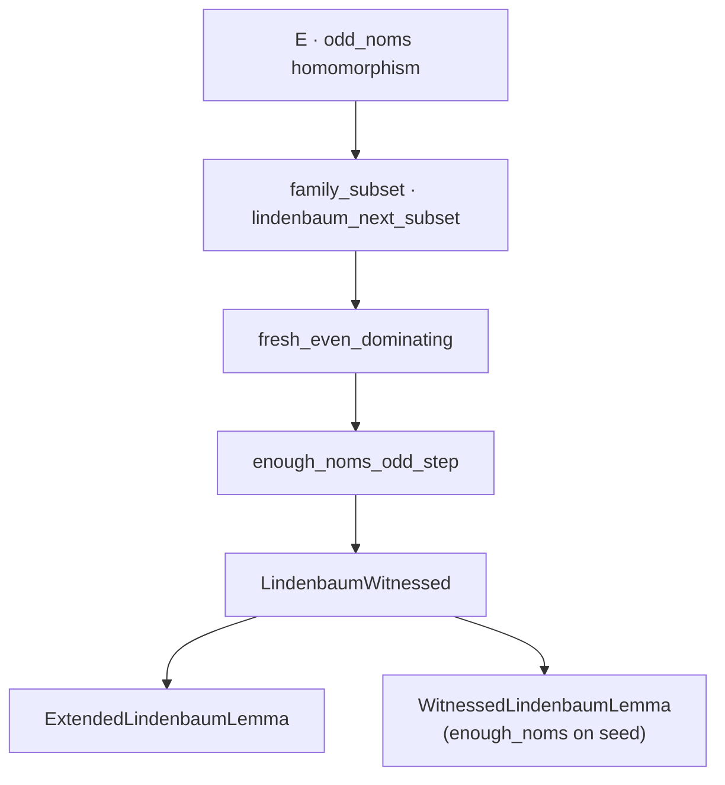
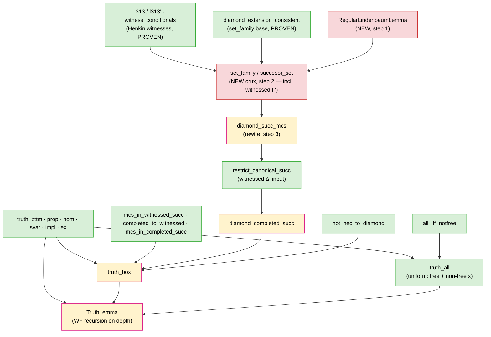
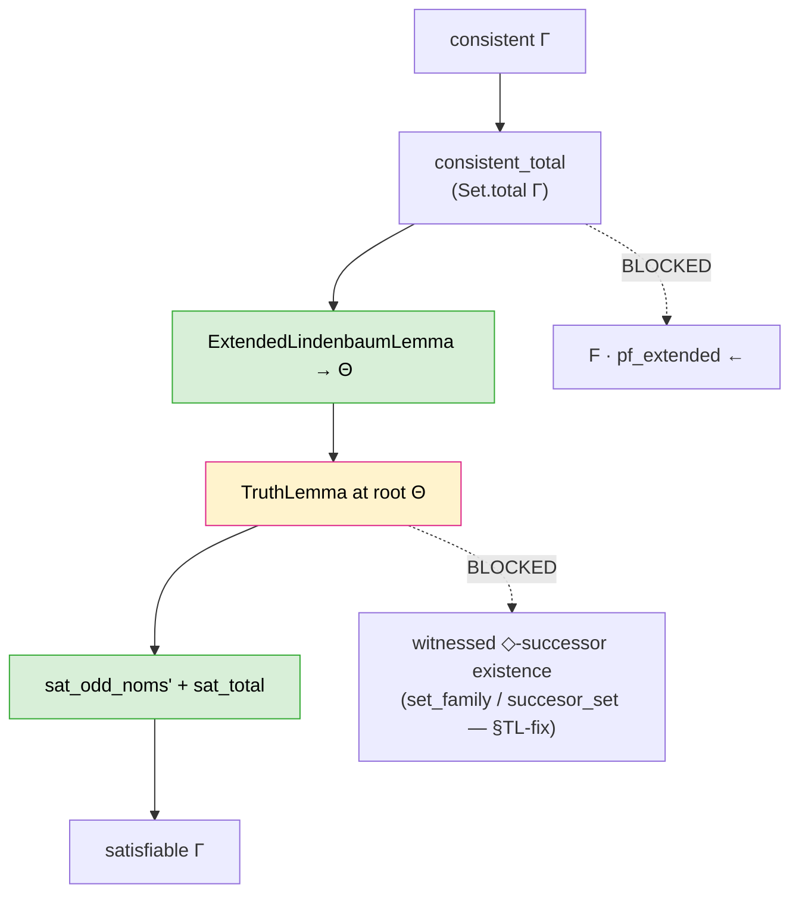

<!-- AUTO-GENERATED: run scripts/generate_arxiv_with_code.sh to refresh -->
# Finishing Oltean's Completeness Proof in Lean 4 for Hybrid Logic *L(∀)* — full narrative + complete Lean source

*Generated 2026-06-17 from `arxiv.md` and all library `.lean` files in dependency order (`Hybrid.lean`).*

**Review copy.** The narrative body matches [`arxiv.md`](arxiv.md) (excluding the review pointer at the top). This file appends **Appendix A: Complete Lean source** with every line of the formalization inlined below.

---

## Document map

| Part | Contents |
| --- | --- |
| **§1–§9** | Full `arxiv.md` narrative (abstract through scorecard) |
| **Appendix A** | Complete Lean 4 source, one subsection per file |

### Appendix A — file index

- [`Hybrid.lean`](#hybridlean) — 16 lines
- [`Hybrid/Util.lean`](#hybridutillean) — 198 lines
- [`Hybrid/Form.lean`](#hybridformlean) — 402 lines
- [`Hybrid/Tautology.lean`](#hybridtautologylean) — 230 lines
- [`Hybrid/Substitutions.lean`](#hybridsubstitutionslean) — 1228 lines
- [`Hybrid/Proof.lean`](#hybridprooflean) — 111 lines
- [`Hybrid/Truth.lean`](#hybridtruthlean) — 331 lines
- [`Hybrid/ListUtils.lean`](#hybridlistutilslean) — 212 lines
- [`Hybrid/ProofUtils.lean`](#hybridproofutilslean) — 961 lines
- [`Hybrid/Soundness.lean`](#hybridsoundnesslean) — 421 lines
- [`Hybrid/RenameBound.lean`](#hybridrenameboundlean) — 146 lines
- [`Hybrid/FormCountable.lean`](#hybridformcountablelean) — 220 lines
- [`Hybrid/Lindenbaum.lean`](#hybridlindenbaumlean) — 551 lines
- [`Hybrid/LanguageExtension.lean`](#hybridlanguageextensionlean) — 975 lines
- [`Hybrid/ExistenceLemma.lean`](#hybridexistencelemmalean) — 108 lines
- [`Hybrid/CompletedModel.lean`](#hybridcompletedmodellean) — 914 lines
- [`Hybrid/Completeness.lean`](#hybridcompletenesslean) — 109 lines

**Total:** 17 files, 7133 lines of Lean.

---

# Narrative (from arxiv.md)


## Abstract

We complete the first machine-checked completeness theorem for the hybrid logic
*L(∀)* (a propositional modal logic enriched with nominals, the satisfaction-style
universal binder ∀, and the box modality), building directly on Alex Oltean's 2023
Lean 4 formalization. Oltean mechanized the syntax, semantics, Hilbert-style proof
system, and **soundness** of *L(∀)* following Blackburn's *Hybrid Completeness*
(1998), and laid out a clear route to completeness, but left the completeness theorem
itself unfinished: the construction of a *witnessed* (Henkin) maximal consistent set
requires, at each step of Lindenbaum's lemma, a **fresh nominal**, and computing
freshness dynamically inside dependent type theory proved intractable. We close this
gap. The conceptual key is *structural freshness*: rather than searching for an unused
nominal, the language is extended so that an infinite supply of nominals is reserved
*by construction* and is therefore disjoint from anything in play. We discuss the
design space for realizing this idea in a proof assistant — Oltean's odd/even
encoding inside ℕ, the disjoint-sum (`N ⊕ ℕ`) parameterization suggested by Bud
Mishra, and the abstract synthetic-completeness frameworks of Asta Halkjær From — and
explain the encoding choice that makes the remaining proofs tractable. We also port
the development from Oltean's original June-2023 Lean nightly to Lean v4.30.0 /
mathlib v4.30.0.

---

## 1. Introduction

### 1.1 Hybrid logic

Modal logic extends propositional logic with operators □ ("necessarily") and ◇
("possibly") interpreted over Kripke frames — directed graphs of "states" or
"worlds". *Hybrid* logic, originating in Arthur Prior's work on the logic of time,
augments modal logic with **nominals**: atomic symbols `i, j, k, …` each true at
*exactly one* state, so that a nominal acts as a *name* for that state. This modest
addition dramatically increases expressive power while retaining good logical
behavior, and it makes hybrid languages natural for talking about relational
structures — a perspective that has made them attractive for, e.g., XML constraints,
description logics, and the relationship to Matching Logic and the K framework.

The system formalized here is *L(∀)* (equivalently written *H(∀)*): propositional
hybrid logic with nominals, the box □, and the binder ∀x, where state variables `x`
are simultaneously bindable variables and well-formed formulas. `∀x φ` quantifies over
states; `∃x φ` abbreviates `¬∀x¬φ`. (This is the "strong" hybrid language with
binding, as opposed to the weaker language whose only hybrid primitive is the
satisfaction operator `@_i`.)

### 1.2 Soundness, completeness, and what was left open

Oltean's formalization (`oltean_thesis.pdf`; repository archived at
`github.com/alexoltean61/hybrid_logic_lean`) defines:

- the syntax of *L(∀)* and substitution machinery (`Form.lean`, `Substitutions.lean`);
- a Kripke semantics (`Truth.lean`);
- a Hilbert-style proof system (`Proof.lean`);
- and a proof of **soundness**, `Γ ⊢ φ ⟹ Γ ⊨ φ` (`Soundness.lean`).

The converse, **completeness** (`Γ ⊨ φ ⟹ Γ ⊢ φ`), was left as an open formalization
problem. Oltean had already written much of the scaffolding — the Lindenbaum
construction, a notion of *witnessed* set, the canonical/completed model, and the
statements of the extended Lindenbaum lemma, the existence lemma, and the truth
lemma — but a number of key lemmas remained as `sorry`/`admit` placeholders.

### 1.3 An anecdote: Henkin, Mishra, and the shape of the difficulty

Why was completeness left open at all, when the textbook proof is routine? The answer
is a small but instructive collision between classical mathematics and type theory,
and it is worth telling as motivation.

The completeness proof is a *Henkin construction*: one extends a consistent set to a
maximal consistent set that is moreover *witnessed* — every existential `∃x φ` comes
with a nominal `i` certifying it, `(∃x φ → φ[i/x])`. Each existential needs its *own*
witness, and to saturate an infinite set one needs an infinite reserve of nominals
that do not already occur anywhere in play. In ordinary set-theoretic practice this is
a non-issue: one simply says "let `i₀, i₁, …` enumerate fresh nominals," because there
is never a shortage of names. In Lean's dependent type theory the same sentence has no
referent: a type `N` already contains *all* of its inhabitants, and there is in general
no `N' ⊋ N` to draw new names from. Oltean could search a single formula for an unused
nominal — finitely many occur — but witnessing the *infinite* Lindenbaum union by
repeated dynamic search turned out to be, in his words, prohibitively difficult. That
is precisely where the formalization stalled.

When we set out to revive the (by then archived) development, the natural first
question was whether this obstacle was fundamental — whether the "easy" textbook proof
was simply not available in type theory, and whether one ought instead to adopt a
heavier, more abstract machine, such as the transfinite synthetic-completeness
frameworks that Asta Halkjær From has developed in Isabelle/HOL. The decisive nudge
came anecdotally. In discussions around the problem, **Bud Mishra** suggested the
remedy that, in hindsight, is the canonical one: do not *search* for fresh names —
*reserve* them structurally. Parameterize formulas by their nominal type `N` and, when
it is time to run Lindenbaum, pass to the disjoint sum `N ⊕ ℕ`, drawing every Henkin
witness from the right summand `Sum.inr n`. Freshness then ceases to be a computation
and becomes a fact of the sum type: a witness is distinct from every base nominal
because it lives in a different injection. This is exactly Henkin's old idea —
expand the language with new constants — rendered in a form that type theory accepts
without complaint.

Two realizations followed. First, **Oltean had already built this idea into his
development**, in disguise: his `Form.odd_noms` remaps every nominal `i ↦ 2·i+1`,
so that the image uses only odd nominals and *all even nominals* are reserved as a
fresh supply. The odd/even split inside ℕ is precisely `N ⊕ ℕ` internalized (odds ≅
`Sum.inl`, evens ≅ `Sum.inr`). Indeed, From's Isabelle approach — a fixed name type
with a `fresh` operator returning an unused name — is the same principle a third time
over. So the structural-freshness idea is not a clever trick belonging to any one of
these treatments; it is the shared, and essentially unavoidable, foundation of all of
them. In that sense **Mishra's suggestion was not a "bust," and there is no need to
pivot wholesale to a Halkjær-style framework** to finish this particular proof: the
right idea was already on the table, twice.

Second, and more usefully, the realization reframes *where the real difficulty lies*.
It is not in the freshness principle but in its **encoding**. Oltean implements the
odd/even remapping as `bulk_subst` — an iterated single-nominal substitution walked in
lockstep over the formula's list of nominals — and that list, for a compound formula,
is a *merged, deduplicated, sorted* list rather than the concatenation of its parts'
lists. Consequently the apparently trivial homomorphism lemma
`(φ → ψ).odd_noms = φ.odd_noms → ψ.odd_noms` becomes a genuine fight with ordering and
deduplication, and every later step (theorem-preservation under expansion, "enough
nominals," the witnessed Lindenbaum lemma) waits on it. The lesson — which we develop
in §7 — is that the obstruction to finishing Oltean's proof is a *representation*
choice for the language expansion, not the Henkin/Mishra idea itself; replacing the
list-substitution remapping with a plain structural map over the syntax tree makes the
homomorphism lemmas immediate and lets most of Oltean's scaffolding go through.
This is the thread the rest of the paper follows.

A third realization, which became sharp only once the encoding was fixed and the rest of
the development compiled, is that the proof invokes freshness in **two structurally
different places**, and Mishra's reservation principle is decisive for one of them and
simply inapplicable to the other. At the **root**, the extended Lindenbaum lemma must
witness an *infinite* consistent set, and there Mishra's structural reserve — Oltean's
`odd_noms`, the `N ⊕ ℕ` split internalized in ℕ — is exactly the right and decisive tool;
that part is complete. But the **truth lemma's ◇-case** must, for each `◇ψ ∈ Δ`, produce a
*witnessed* successor MCS containing `ψ` together with the box-reduct `{χ │ □χ ∈ Δ}`, and
here reservation does not help — for a reason that has nothing to do with the size of the
name supply. For *every* nominal `j` whatsoever, `nom j ⟶ nom j` is a tautology, so
`□(nom j ⟶ nom j)` is a theorem and lies in every MCS `Δ`; hence the box-reduct already
mentions *all* nominals, reserved ones included. No structural reserve can make a name
fresh for that set. The shortcut that tried to force the successor through the same
reserve-based Lindenbaum machinery (the lemma `enough_noms_diamond_seed`) is therefore not
merely unproved but **false**.

The remedy for the successor step is **not** Mishra's, and it is precisely the direction
**Oltean had already taken**: build the successor by an *existence lemma* in the classical
Henkin style, drawing each witness from `Δ`'s *own* witnessedness through a fresh *state
variable* (`new_var`) rather than a reserved nominal — the (already proven) `l313`/`l313'`
lemmas. Oltean's `set_family` / `succesor_set` scaffolding for this was left incomplete (as
`admit`s), but the *approach* was correct; what remained was to finish it, not to find more
fresh names. So the honest division of credit is this: **Mishra's reservation idea is the
right and decisive tool for the root Lindenbaum construction, while Oltean's
existence-lemma construction is the right tool for the witnessed successor — and the work
that remains is to complete Oltean's construction, not to extend Mishra's to a place it
does not reach.** (The detailed plan is §TL-fix.)

### 1.4 Contribution

This paper:

1. **Ports** Oltean's development to a current toolchain (Lean v4.30.0 / mathlib
   v4.30.0), absorbing roughly two and a half years of mathlib API change.
2. **Closes the completeness gap**, completing the witnessed extended Lindenbaum
   lemma, the existence lemma for completed models, and the final completeness theorem.
3. **Clarifies the design space** for the freshness mechanism that the completeness
   proof hinges on, and documents the encoding choice that makes the formal proofs go
   through cleanly.

### 1.5 The proof blueprint and the incoming state of Oltean's development

Because we are *renovating* an existing, archived formalization rather than writing one
from scratch, it is worth stating plainly what we inherited, what already works, and
where the genuine difficulty sits — so that the reader can follow the order in which we
attack the problem and understand why some `admit`s are dispatched in a line while others
force a redesign.

**The blueprint.** Completeness for *L(∀)* is the standard Henkin/canonical-model
argument as adapted to hybrid logic by Blackburn (1998), and Oltean's development wires
it up faithfully:

```
Γ ⊨ φ  ⟹  Γ ⊢ φ
  └─ via contraposition + Model Existence:  every consistent set is satisfiable
       1. Lindenbaum:           consistent Γ  ⟶  maximal consistent Γ'      [compiles]
       2. Language extension:   reserve an infinite supply of fresh nominals
            ├─ odd_noms:   map the language into the ODD nominals (i ↦ 2i+1)
            └─ pf_extended: ⊢ φ ↔ ⊢ φ⁺   (derivations survive the extension)
       3. Witnessed Lindenbaum: an MCS that witnesses every ◇ / ∃
       4. Completed model + Truth lemma
       5. Existence lemma:      ◇-witnesses provide successor states
       6. assemble  ⟶  Completeness
```

This skeleton is sound; the question was never whether the mathematics works (Blackburn
proved it on paper) but whether each step survives mechanization in dependent type
theory. Soundness, the syntax and substitution machinery, the Kripke semantics, the
Hilbert proof system, and ordinary (non-witnessed) Lindenbaum all elaborate and compile.

The dependencies between the remaining deliverables are **not linear but a directed
acyclic graph** (Figure 1): several independent foundations converge on the witnessed
Lindenbaum lemma **G** and again on the final theorem **I**. Following the now-common
practice of stating a Lean development as an explicit blueprint, we record that graph
here; nodes are the deliverables of §1.6 (with the already-compiling pieces shaded), and
an edge `X → Y` means *Y uses X*.



**Legend (node colors).** Figure 1 uses three node styles on the *foundation* nodes:

- **Green** — pre-existing foundations that already compiled before this work and are
  *not* deliverables of the completeness effort: Kripke semantics, the Hilbert proof
  system, Soundness, Regular Lindenbaum, and Model Existence. **G** is also green now
  that witnessed Lindenbaum is closed.
- **Orange** — the single encoding *crux*, **E** (`odd_noms` homomorphism), discharged by
  reorganizing the representation rather than by proving the inherited `admit`s as stated
  (§1.3).
- **Blue** — the deliverables this work closes or is still closing: **B, C, D, F, TL, H, I**
  ( **G** was blue while open; see above).

The **TL** and **I** subdiagrams (Figures 1a–1d) add **yellow** = partial / wired but
blocked on upstream admits, and **red** = open `sorry`/`admit` rows.

The shading is a snapshot of the *incoming* state; live, per-deliverable status is tracked
in the results table (§9).

*Figure 1. Dependency blueprint … The two fan-in points, **G** (now closed) and **I**, are
why the work is a tree rather than a chain.*

**Module-level snapshots.** Figure 1 is deliberately coarse. Four load-bearing modules
each have their own internal order; the diagrams below are sized to fit a single column
and are meant to be read *inside* the corresponding deliverable.

*F · language extension (`LanguageExtension.lean`).* Structural `total_*` lemmas are
largely independent of **G**; **`pf_extended` ←** (conservativity) is what unlocks
`consistent_total` in **I**, not `ExtendedLindenbaumLemma`. The backward direction is
**not** a structural induction on `Proof` (aliens may appear only in subformulas); it
follows Blackburn: finitely many alien nominals in `proof_noms` → global rename via
`rename_constants_fwd` / `eliminate_aliens` (F2) → pull back in-range proofs with `inv_t`
(F3). F1 supplies the `ax_q2_nom` reconstruction lemmas used inside F3.

*Figure 1a · F · language extension.*



*Figure 1b · G · witnessed Lindenbaum.*
After **E** makes `odd_noms` structural, **G** is a finiteness argument: each stage adds only finitely many formulas, so some even
nominal remains fresh.



*`WitnessedLindenbaumLemma`* (not `ExtendedLindenbaumLemma`) is what the **TL** diamond
chain calls on the successor seed `{ψ} ∪ {□χ ∈ Δ}`.

*Figure 1c · TL · completed-model truth lemma.*
Oltean's base cases and `truth_ex` compile; **□** and **∀** are new. The **∀** case (`truth_all`)
is now **fully closed** for both free and non-free `x` (uniform proof, dual to `truth_ex`);
the **□ →** direction is closed and **□ ←** runs through the diamond-successor pipeline below
(only the witnessed ◇-successor existence lemma still open; the `enough_noms_diamond_seed`
shortcut is **false** — see **§TL-fix**). **TruthLemma** is assembled by well-founded
recursion on `Form.depth`, which supplies `truth_all`'s depth-indexed induction hypothesis.



*Figure 1d · I · model existence.*

*I · model existence (`Completeness.lean`).* `cons_sat` is fully wired; execution still
needs backward conservativity and the remaining TL rows below.



**The incoming state: where the holes are.** What Oltean left open is concentrated in the
freshness/witnessing layer (steps 2–3) and the pieces that depend on it (the completed
model's truth lemma, the existence lemma, and the final assembly). Concretely, the
inherited `sorry`/`admit` obligations fall into three quite different kinds, and
conflating them is what makes "there are a lot of holes" sound more alarming than it is:

1. *Mechanical / decidable holes* — not real mathematical content. The thirteen
   `Tautology.lean` truth-table lemmas (one decision-procedure pattern), the
   formula-countability encoding lemmas, the bound-variable renaming lemmas, and the
   `LanguageExtension.total_*` structural inductions. Also in this bucket, though not
   `admit`s but *broken proofs*, is the entire `CompletedModel` truth lemma: Oltean's
   proofs there are correct and merely need to be re-fitted to the current `simp` normal
   forms in order to compile. These genuinely yield to incremental, local work.
2. *Load-bearing, but standard* — the real Henkin content: witnessed Lindenbaum, the
   existence lemma, and the final assembly. These are not hard *ideas*; they go through
   once the layer beneath them is clean.
3. *Load-bearing, and an encoding trap* — the `odd_noms` freshness homomorphism (step 2).
   This is the one place where eliminating the `admit`s *as stated* is the wrong move.

**Why one cluster is a trap, and what we do about it.** As explained in §1.3, Oltean
realizes structural freshness with `odd_noms`, which maps every nominal `i ↦ 2·i+1` (so
the odd nominals carry the image and the even nominals are reserved as a fresh supply —
Mishra's `N ⊕ ℕ` internalized in `ℕ`). The *idea* is right. But the *implementation*
computes `odd_noms φ` by collecting φ's nominals into a **merged, sorted,
de-duplicated** list and `bulk_subst`-ing along it. Against that representation the
apparently trivial homomorphism `(φ ⟶ ψ).odd_noms = φ.odd_noms ⟶ ψ.odd_noms` is a real
fight with list ordering, deduplication, and no-op substitutions — and it is precisely
this lemma (and its siblings `odd_box`, `odd_bind`, `odd_conj`) that the witnessed
Lindenbaum lemma waits on. Discharging these `admit`s in place would mean proving hard
statements about an awkward encoding. The productive move is instead to **reorganize**:
redefine `odd_noms` as a plain structural recursion over the syntax tree
(`(φ ⟶ ψ).odd_noms := φ.odd_noms ⟶ ψ.odd_noms`, etc.), after which the homomorphism
lemmas hold *by definition* (`rfl`), the freshness property ("no even nominal occurs in
`odd_noms φ`") becomes a one-line induction, and the supporting `descending` /
`nocc_bulk_property` apparatus is no longer needed. This is the sense in which finishing
the proof is partly an exercise in *renovation*: the obstruction is a representation
choice, not the construction, and the right response is to change the representation
rather than to grind against it.

**Plan of attack.** We work in the topological order of the blueprint (Figure 1), and
where a stage offers a choice we take the *easiest task first*. Concretely: restore the
compile (A) so the whole library elaborates with holes marked; clear the
decidable/mechanical leaves — propositional tautologies (B), formula-countability (C),
bound-variable renaming (D); carry out the `odd_noms` reorganization (E), the one
foundation that is a redesign rather than a proof; discharge the language-extension
structural lemmas (**F**, the `total_*` batch — largely parallel to **E**); prove the
witnessed Lindenbaum lemma (**G**), which in the code depends chiefly on **C**, **E**, and
**B**; close the existence lemma (**H**), which depends on **B** and **D** only; discharge
the language-extension structural lemmas (**F**, the `total_*` batch — parallel to **E**);
finish **F**'s conservativity half (`pf_extended` ←), which feeds **I** but not **G** or
**H**; re-fit the completed-model truth lemma (**TL**), which waits on **H**; and assemble
the final theorem (**I**). In §9, **G** and **H** are listed before **F** so **Pass**
rows are not buried under **F**'s open conservativity substeps.

### 1.6 Goal and major steps

**Goal.** Produce a fully `sorry`-free Lean 4 proof (under Lean v4.30.0 / mathlib
v4.30.0) of the **completeness theorem** for *L(∀)* — `(Γ ⊨ φ) → (Γ ⊢ φ)` — finishing
the construction Oltean left open. Soundness, syntax, semantics, and most scaffolding
already exist; the gap is the Henkin-style completeness argument and the "freshness"
machinery it depends on.

The work decomposes into the following major steps. Letter labels **A**–**I** follow
Oltean's proof narrative; §9 lists **G** and **H** before **F** because those steps are
**Pass** in the code and do not import `LanguageExtension` or wait on `pf_extended` ←
(only **I** does). Status is tracked in the results table (§9).
of `sorry`/`admit` obligations *inherited from Oltean's development*; we group them by
the mathematical reason they exist. (We verified against the archived upstream sources
that these holes are Oltean's own, not artifacts of our port — for instance Oltean's
original `Tautology.lean` already carries the thirteen `admit`s below.)

- **A. Get the whole library compiling.** Fix roughly two and a half years of mathlib
  API churn module-by-module in dependency order so that `lake build` succeeds with the
  proof holes still marked `sorry`/`admit`. (Per-module status is tracked in §9; the
  larger re-fit of `CompletedModel`'s truth lemma is split out as its own step, **TL**,
  since it feeds the final assembly **I** in the blueprint.)
- **B. Remove the propositional-tautology holes.** Discharge the `Tautology.lean`
  truth-table lemmas Oltean left as `admit` (`hs_taut`, `neg_intro`, `conj_intro`,
  `conj_intro_hs`, `iff_intro`, `iff_elim_l`, `iff_elim_r`, `iff_rw`, `iff_imp`,
  `disj_intro_l`, `disj_intro_r`, `disj_elim`, `mp_help`) plus `ProofUtils.iff_subst`.
  All are decidable propositional facts.
- **C. Remove the formula-countability holes.** `FormCountable`: `prime_2_3`
  (a number-theoretic fact, `3^(n+1) ≠ 2^(m+1)`), `guns`, and `of_brixton` — injectivity
  bookkeeping for the Gödel-style encoding that makes `Form` countable (needed to
  enumerate formulas for Lindenbaum).
- **D. Remove the bound-variable-renaming holes.** `RenameBound`: `replace_neg`,
  `replace_bound_depth`, and `substable_after_replace` — structural facts about
  α-renaming bound state variables.
- **E. Remove the structural-freshness homomorphism holes (the crux).** `Substitutions`:
  `bulk_subst_impl`, `list_noms_impl_r`, `list_noms_impl_l`, `odd_box`, `odd_bind`,
  `List.to_odd`, `List.odd_to`, `odd_conj`, `odd_conj_rev` — that Oltean's `i ↦ 2·i+1`
  remapping (`odd_noms`) is a homomorphism for the connectives and conjunctions. This is
  where Oltean's `bulk_subst`-over-sorted-lists encoding makes the "obvious" lemmas hard
  (§1.3), and everything downstream depends on it.
- **G. Remove the witnessed-Lindenbaum holes.** `Lindenbaum`: `LindenbaumWitnessed`
  and `ExtendedLindenbaumLemma`. In the Lean graph this module imports **E** / countability /
  proof scaffolding only — not `LanguageExtension`.
- **H. Remove the existence-lemma hole.** `ExistenceLemma.l313'`: the diamond-witness
  property used to build successor states of the completed model. Depends on **B** and
  **D** only (Figure 1); does not use **F** or **G** (`l313'` is on base-language
  `Form N`, not `TotalSet` / `pf_extended`).
- **F. Remove the language-extension / theorem-preservation holes.**
  `LanguageExtension`: structural `total_*` lemmas, `l416`, and `pf_extended`
  (Prop. 4.1.7: derivations survive the language expansion). The **`total_*` block is
  largely independent of **G** and **H**. **`pf_extended` ←** (conservativity:
  F1 `ax_q2_nom` pullback, F2 alien elimination, F3 `inv_t` pullback) is now **complete**,
  together with `syntactic_conservativity` (the `Set.total Γ ⊢ φ.total ⇒ Γ ⊢ φ` lift). This
  is load-bearing for **I** (`consistent_total`), not for `ExtendedLindenbaumLemma` or `l313'`.
  This path is now **complete**: `consistent_total` is proven and the `N`-nonempty hypothesis
  (needed to pick a base nominal for alien elimination) is threaded through `cons_sat` /
  `Completeness`.  The only obstacle left in the whole development is the **TL** witnessed
  ◇-successor existence lemma (`enough_noms_diamond_seed` is false; see **§TL-fix**).
- **TL. Re-fit the completed-model truth lemma.** `CompletedModel`: restore Oltean's
  truth-lemma cases (`truth_bttm`, `truth_prop`, `truth_nom`, `truth_svar`, `truth_impl`,
  `truth_ex`) and the supporting valuation lemmas to the current `simp` normal forms.
  **`truth_box` and `truth_all` are new** — Oltean's archived development stops before the
  modal/binder cases. `TruthLemma` is assembled by well-founded recursion on `Form.depth`;
  the `bind` case delegates to `truth_all`, now **fully closed** for both free and non-free
  `x` (uniform `has_state_symbol` split + depth-indexed `ih`, dual to `truth_ex`). The one
  remaining obstacle is the **□ ←** witnessed ◇-successor existence lemma. The current
  `enough_noms_diamond_seed` shortcut is **false** and must be replaced by the `l313'`/`set_family`
  Henkin route — see **§TL-fix** for the disproof and the detailed step plan.
  Depends on **B**, **D**, **H** (and on Kripke semantics and Soundness).
- **I. Remove the final-completeness hole.** `Completeness`: `cons_sat` runs
  `consistent_total` → `ExtendedLindenbaumLemma (Set.total Γ)` → `TruthLemma` at the root
  witnessed MCS → `sat_odd_noms'` / `sat_total`; `Completeness` is then
  `ModelExistence` + contraposition. **`pf_extended` forward is not on this path**; only
  backward conservativity feeds `consistent_total`.

The substantive mathematics is concentrated in **E**–**I**; **B**–**D** are essentially
mechanical leaf lemmas. **E** is the crux, for the encoding reasons discussed in §1.3.

### §TL-fix · The witnessed ◇-successor existence lemma (the last obstacle)

**Why `enough_noms_diamond_seed` is false (not just hard).** The lemma claims
`enough_noms ({ψ} ∪ {χ │ □χ ∈ Δ})`, whose first conjunct (`enough_noms`, `Lindenbaum.lean`)
demands a nominal `i` occurring in **no** formula of the set. But for *every* nominal `i`,
`nom i ⟶ nom i` is a tautology, so `⊢ □(nom i ⟶ nom i)` by necessitation, so
`□(nom i ⟶ nom i) ∈ Δ` for any MCS `Δ`; hence `(nom i ⟶ nom i) ∈ {χ │ □χ ∈ Δ}` and
`nom_occurs i (nom i ⟶ nom i) = true`. So `all_nocc i` fails for *every* `i`: the box-reduct
of any MCS mentions all nominals, and there is no reserve to be had — independent of how `Δ`
was built. The `WitnessedLindenbaumLemma`-on-the-seed approach is therefore structurally
unworkable; it requires a globally fresh nominal that provably does not exist.

**The correct route (Oltean's intended Henkin construction).** Build the witnessed successor
*incrementally*, borrowing witnesses from `Δ`'s own witnessedness via `l313'` — which uses a
fresh **variable** (`new_var`), not a fresh nominal. The hardest analytic lemma (`l313`/`l313'`)
and `witness_conditionals` are **already proven** (`ExistenceLemma.lean`, live code). Remaining
steps:

1. **`RegularLindenbaumLemma`** (`Lindenbaum.lean`, NEW): plain MCS extension
   `consistent Γ → ∃ Γ', Γ ⊆ Γ' ∧ MCS Γ'`. Straightforward: reuse `LindenbaumMCS`,
   `LindenbaumConsistent`, `LindenbaumMaximal` (drop the `witnessed`/`enough_noms` clause from
   `WitnessedLindenbaumLemma`).
2. **`set_family` / `succesor_set`** (`ExistenceLemma.lean`, NEW — currently commented out with
   `admit`s; this is the crux):
   - *base* `n = 0`: `Γ₀ = {ψ} ∪ {χ │ □χ ∈ Δ}` is consistent — **already proven** as
     `diamond_extension_consistent`; extend to an MCS via `RegularLindenbaumLemma`.
   - *inductive step* `n+1`: ensure `enum n` is witnessed in the family, using
     `l313'`/`witness_conditionals` (the `((ex x,χ)⟶χ[i//x])` conditionals) to add the Henkin
     witness while preserving `Canonical.R Δ ·` and `ψ`-membership.
   - *output property*: the limit set is (a) `Canonical.R`-successor of `Δ` (since
     `{χ│□χ∈Δ} ⊆ Γ'`), (b) contains `ψ`, (c) `MCS`, and (d) **`witnessed`** — (d) is the genuine
     hard goal (the point Oltean stalled on).
3. **Rewire `diamond_succ_mcs`** (`CompletedModel.lean`): produce
   `⟨Γ', Canonical.R Δ Γ', ψ ∈ Γ', MCS Γ', witnessed Γ'⟩` from `succesor_set` instead of
   `WitnessedLindenbaumLemma`/`enough_noms_diamond_seed`, then **delete
   `enough_noms_diamond_seed` and `diamond_extension_consistent`'s seed-only role is folded into
   step 2's base case**.

Completing steps 1–3 turns the five TL `Partial` rows and the two I `Partial` rows
(`cons_sat`, `Completeness`) green, finishing the whole development. This is a substantial,
research-level construction (not a localized fix); step 2(d) is the deciding milestone.

*Attribution (cf. §1.3).* This step is **not** an application of Mishra's structural-freshness
suggestion — that idea is decisive at the *root* Lindenbaum construction but inapplicable
here, since the box-reduct `{χ │ □χ ∈ Δ}` mentions every nominal (`□(nom j ⟶ nom j) ∈ Δ` for
all `j`). The witnessed successor is instead built by **Oltean's existence-lemma direction**
(`l313'`, fresh *variable* + `Δ`'s witnessedness), which was correct but left incomplete; the
work here is to finish it.

---

## 2. Background: the logic *L(∀)*

*(Condensed; full definitions follow Blackburn 1998 and Oltean's thesis.)*

**Signature.** A hybrid signature is a triple ⟨PROP, SVAR, NOM⟩ of denumerable sets of
propositional symbols, state variables, and nominals.

**Formulas.** `φ ::= ⊥ | a | φ → φ | □φ | ∀x φ`, where `a` ranges over atomic symbols
(propositions, state variables, nominals) and `x` over state variables. Negation,
conjunction, ◇, and ∃ are defined as usual.

**Semantics.** A model `M = ⟨W, R, V⟩` is a Kripke frame with a valuation; an
assignment `g` sends each state variable to a single state. Nominals and state
variables denote singletons. Satisfaction `M, s, g ⊨ φ` is standard, with `M, s, g ⊨ x`
iff `g(x) = {s}` and `M, s, g ⊨ ∀x φ` iff φ holds at `s` under every `x`-variant of `g`.

**Proof system.** A Hilbert system with classical tautologies, axiom K, the
quantifier axioms (Q1, Q2 for variables and nominals), Name, Nom, Barcan, and the
rules modus ponens, generalization, and necessitation. `Γ ⊢ φ` is syntactic
consequence.

---

## 3. Completeness via witnessed maximal consistent sets

The completeness proof follows the Henkin/canonical-model method as adapted to hybrid
logic by Blackburn (1998):

1. **Lindenbaum's lemma.** Every consistent set extends to a maximal consistent set
   (MCS).
2. **Witnessed MCSs.** An MCS Δ is *witnessed* if whenever `∃x φ ∈ Δ` there is a
   nominal `i` with `(∃x φ → φ[i/x]) ∈ Δ`. Existence of witnessed MCSs requires *enough
   nominals*: each existential needs its own witness, and to extend an *infinite*
   consistent set we need an infinite reserve of nominals that do not already occur.
3. **Language expansion.** To guarantee enough witnesses, expand the language with a
   denumerable set of new nominals (`L(∀) ⊆ L⁺(∀)`). Expansion is truth-preserving
   (semantically obvious) and theorem-preserving (Prop. 4.1.7 in the thesis: a derivation
   using extra nominals can be replayed with those nominals replaced by fresh
   variables).
4. **Canonical / completed model.** Build the canonical model from MCSs; restrict to
   a generated, witnessed submodel so that state symbols name uniquely; "glue on" a
   dummy state only when needed to make the model standard.
5. **Truth lemma + existence lemma**, yielding completeness via the model-existence
   theorem.

### 3.1 The freshness obstacle

Steps 2–3 are where the formalization stalls. Mathematically one simply says "let
`i₀, i₁, …` enumerate the new nominals" and uses `iₙ` as the witness at step `n`. In
**set theory** there is never a shortage of fresh names. In **dependent type theory**,
a type already contains *all* its inhabitants: given `N : Type`, there is in general no
`N' ⊋ N`. One can dynamically search for an unused nominal of a formula (finitely many
occur), but to witness an *infinite* Lindenbaum union one must reserve infinitely many
nominals *globally* and prove they never occur — and doing that bookkeeping by
dynamic search is exactly what Oltean found "prohibitively difficult".

---

## 4. Structural freshness

The resolution is to make freshness **structural** rather than computed: arrange the
language so that an infinite family of nominals is, by construction, disjoint from the
nominals any formula of the base language can use. Three concrete realizations:

- **Disjoint sum (Mishra).** Parameterize formulas by a nominal type and extend it to
  `N ⊕ ℕ`. Witnesses are drawn exclusively from the right summand `Sum.inr n`, which is
  *structurally* distinct from every base nominal `Sum.inl _`. Freshness is then a
  triviality of the sum type, never a search.
- **Odd/even split inside ℕ (Oltean).** Take a single nominal type `TotalSet ≅ ℕ` and
  remap every nominal `i ↦ 2·i+1` (`Form.odd_noms`). The image uses only *odd*
  nominals, so *all even* nominals are reserved as a fresh supply. This is the same
  disjoint-sum idea, internalized in ℕ (odds ≅ `Sum.inl`, evens ≅ `Sum.inr`), and is
  the route taken in the existing development.
- **Abstract name supply (From).** Work over a fixed type with an infinite set of
  names plus an abstract `fresh : Finset Name → Name` returning an unused name, and
  factor the witnessing into a reusable, logic-generic Lindenbaum/saturation lemma.

These are not competitors at the conceptual level — all three reserve an infinite
disjoint supply of names. They differ in *how the reservation is encoded*, and that
choice determines how painful the surrounding lemmas are.

---

## 5. Related work

- **Asta Halkjær From**, *An Isabelle/HOL Framework for Synthetic Completeness Proofs*
  (CPP 2025) and related papers, mechanize strong completeness for several logics —
  including hybrid logic — using an abstract, transfinite Lindenbaum construction and a
  synthetic canonical-model framework in Isabelle/HOL. This is the closest existing
  mechanization of witnessed/named MCSs for hybrid logic and the state of the art for
  reusable completeness infrastructure.
- Earlier Lean modal-logic formalizations: a Henkin-style completeness proof for **S5**
  (Bentzen 2021), **Public Announcement Logic / PAL-S5** (Li 2020), and **Matching
  Logic** in Lean (Cheval & Macovei 2023). We are not aware of a prior completeness
  formalization for a *binding* hybrid logic in Lean.
- The mathematics followed throughout is **Blackburn**, *Hybrid Completeness* (1998).

---

## 6. The Lean 4 development

*(To be completed.)* Module structure (dependency order): `Util`, `Form`, `Tautology`,
`Substitutions`, `FormCountable`, `Proof`, `ListUtils`, `Truth`, `ProofUtils`,
`Soundness`, `RenameBound`, `Lindenbaum`, `LanguageExtension`, `ExistenceLemma`,
`CompletedModel`, `Completeness`.

Toolchain: Lean v4.30.0, mathlib v4.30.0.

> *[Describe the closed lemmas: `odd_impl`/`pf_odd_noms_set`, `ExtendedLindenbaumLemma`,
> `LindenbaumWitnessed`, the existence lemma, and `Completeness`, once finished.]*

---

## 7. Discussion: encoding choices

*(To be completed once the proof is closed — this section will argue which encoding of
structural freshness minimized the formalization effort, and quantify the porting cost
from the 2023 nightly to mathlib v4.30.0.)*

---

## 8. Conclusion and further work

*(To be completed.)* Directions: finite nominal sets; generalization to the
many-sorted polyadic hybrid logics related to Matching Logic; extraction of a
reusable Lean completeness framework in the spirit of From's Isabelle work.

---

## 9. Results

Status legend: **Pass** — done and compiling; **Fail** — attempted, currently broken;
**Not Yet** — not yet attempted. Step **A** is broken out into one row per module (in the
`Hybrid.lean` dependency order in which they are converted); steps **B**–**I** are broken
out into one row per `sorry`/`admit` declaration to be removed ("remove Oltean's
`admit`/`sorry` for *X*"). After **E**, **G** and **H** precede **F** in the table:
they are **Pass** and do not depend on `pf_extended` ← (Figure 1); letter labels still
match Oltean's narrative. Step **A** is **Pass** once every
module in that list elaborates under the pinned toolchain (remaining proof holes are
tracked under **B**–**I**, not under **A**). Parent rows (**F**, **G**, …) summarize
their substeps: a parent can be **Partial** while an earlier-numbered step is **Pass**
when the open substeps are not on that step's critical path (e.g. **G** and **H** **Pass**
while **F** awaits `pf_extended` ← for **I** only).

| Step | Deliverable | Status |
| --- | --- | --- |
| **A** | **Get the whole library compiling** (per module) | **Pass** |
| A · `Util.lean` | Port to Lean v4.30.0 / mathlib v4.30.0 | Pass |
| A · `Form.lean` | Port to Lean v4.30.0 / mathlib v4.30.0 | Pass |
| A · `Tautology.lean` | Port to Lean v4.30.0 / mathlib v4.30.0 | Pass |
| A · `Substitutions.lean` | Port to Lean v4.30.0 / mathlib v4.30.0 | Pass |
| A · `Proof.lean` | Port to Lean v4.30.0 / mathlib v4.30.0 | Pass |
| A · `Truth.lean` | Port to Lean v4.30.0 / mathlib v4.30.0 | Pass |
| A · `ListUtils.lean` | Port to Lean v4.30.0 / mathlib v4.30.0 | Pass |
| A · `ProofUtils.lean` | Port to Lean v4.30.0 / mathlib v4.30.0 | Pass |
| A · `Soundness.lean` | Port to Lean v4.30.0 / mathlib v4.30.0 | Pass |
| A · `RenameBound.lean` | Port to Lean v4.30.0 / mathlib v4.30.0 | Pass |
| A · `FormCountable.lean` | Port to Lean v4.30.0 / mathlib v4.30.0 | Pass |
| A · `Lindenbaum.lean` | Port to Lean v4.30.0 / mathlib v4.30.0 | Pass |
| A · `LanguageExtension.lean` | Port to Lean v4.30.0 / mathlib v4.30.0 | Pass |
| A · `ExistenceLemma.lean` | Port to Lean v4.30.0 / mathlib v4.30.0 | Pass |
| A · `CompletedModel.lean` | Port to Lean v4.30.0 / mathlib v4.30.0 | Pass |
| A · `Completeness.lean` | Port to Lean v4.30.0 / mathlib v4.30.0 | Pass |
| **B** | **Propositional-tautology holes** | **Pass** |
| B · `Tautology` (×13) | `hs_taut`, `neg_intro`, `conj_intro`, `conj_intro_hs`, `iff_intro`, `iff_elim_l`, `iff_elim_r`, `iff_rw`, `iff_imp`, `disj_intro_l`, `disj_intro_r`, `disj_elim`, `mp_help` | Pass |
| B · `ProofUtils.iff_subst` | Tautology `(φ⟷ψ)⟶(ψ⟷χ)⟶(φ⟷χ)` | Pass |
| **C** | **Formula-countability holes** | **Pass** |
| C · `FormCountable.prime_2_3` | `3^(n+1) ≠ 2^(m+1)` | Pass |
| C · `FormCountable.guns` | `x ∈ pow2list a → ∃ n, x.fst = 2^(n+1)` | Pass |
| C · `FormCountable.of_brixton` | `(h::t).isSuffixOf a → h ∈ a` | Pass |
| **D** | **Bound-variable-renaming holes** | **Pass** |
| D · `RenameBound.replace_neg` | `(∼φ).replace_bound x = ∼(φ.replace_bound x)` | Pass |
| D · `RenameBound.replace_bound_depth` | `(φ.replace_bound x).depth = φ.depth` | Pass |
| D · `RenameBound.substable_after_replace` | `is_substable (φ.replace_bound y) y x` | Pass |
| **E** | **Structural-freshness homomorphism holes (crux)** | **Pass** |
| E · `Substitutions.bulk_subst_impl` | `bulk_subst` distributes over `⟶` | Pass |
| E · `Substitutions.list_noms_impl_r` | `list_noms` merge identity (right) | Pass |
| E · `Substitutions.list_noms_impl_l` | `list_noms` merge identity (left) | Pass |
| E · `Substitutions.odd_box` | `(□φ).odd_noms = □(φ.odd_noms)` | Pass |
| E · `Substitutions.odd_bind` | `(all x, φ).odd_noms = all x, φ.odd_noms` | Pass |
| E · `Substitutions.List.to_odd` | list lift `List Γ → List Γ.odd_noms` | Pass |
| E · `Substitutions.List.odd_to` | list lift `List Γ.odd_noms → List Γ` | Pass |
| E · `Substitutions.odd_conj` | `odd_noms` distributes over conjunction | Pass |
| E · `Substitutions.odd_conj_rev` | `odd_noms` distributes over conjunction (rev) | Pass |
| **G** | **Witnessed-Lindenbaum holes** | **Pass** |
| G · `Lindenbaum.LindenbaumWitnessed` | Lindenbaum union with enough nominals is witnessed | Pass |
| G · `Lindenbaum.witness_in_next` / `witness_at_step` | per-step witness extraction | Pass |
| G · `Lindenbaum.zero_nocc_odd` / `even_nocc_odd` / `enough_noms_odd_base` | even nominals fresh for the odd-only base | Pass |
| G · `Lindenbaum.lindenbaum_next_subset` / `family_subset` / `fresh_even_dominating` | each finite stage adds finitely many formulas, so an even nominal survives | Pass |
| G · `Lindenbaum.ExtendedLindenbaumLemma` | consistent ⟹ witnessed MCS in expanded language | Pass |
| G · `Lindenbaum.enough_noms_odd_step` | per-stage structural freshness (finiteness argument) | Pass |
| **H** | **Existence-lemma hole** | **Pass** |
| H · `Substitutions.subst_nom_noop` / `rename_svar_nom` | freshness rewrite lemmas | Pass |
| H · `ExistenceLemma.l313'` | diamond-witness property for successor states | Pass |
| **F** | **Language-extension / theorem-preservation holes** | **Pass** |
| F · `LanguageExtension.total_subst_svar` | `total` inverts svar substitution | Pass |
| F · `LanguageExtension.total_tautology` | `Tautology φ ↔ Tautology φ.total` | Pass |
| F · `LanguageExtension.total_subst_svar'` | `total` commutes with svar subst | Pass |
| F · `LanguageExtension.total_subst_nom` | `total` commutes with nom subst | Pass |
| F · `LanguageExtension.total_iterate_pos` | `total` commutes with `iterate_pos` | Pass |
| F · `LanguageExtension.total_iterate_nec` | `total` commutes with `iterate_nec` | Pass |
| F · `LanguageExtension.total_is_free` / `total_is_substable` | `total` preserves `is_free` / `is_substable` | Pass |
| F · `LanguageExtension.total_eq_impl/box/bind` / `total_in_range` | peel `total` through connectives; right-inverse on range | Pass |
| F · `LanguageExtension.total_ax_name/brcn/nom` | reconstruction lemmas for the remaining axioms | Pass |
| F · `LanguageExtension.l416` | fresh-variable substitution into a proof (via `generalize_constants`) | Pass |
| F · `LanguageExtension.pf_extended` (→) | `⊢ φ → ⊢ φ.total` (totalize a derivation) | Pass |
| F · `LanguageExtension.pf_extended` (←), axiom cases | 6/7 backward axiom cases (`ax_k/q1/q2_svar/name/nom/brcn`) | Pass |
| F · `LanguageExtension.nom_in_base` / `form_noms_in_base` / `range_of_form` / `inv_t_eq_of_range'` | in-range nominal vocabulary; `inv_t` right-inverse on range | Pass |
| F · `LanguageExtension.NOM.fromTotal` / `subst_nom_toTotal` | embed base nominals; align `total` with nom subst | Pass |
| F · `LanguageExtension.total_subst_nom_pullback` | pull `Form.total` back through nom substitution | Pass |
| F · `LanguageExtension.total_ax_q2_nom` / `total_ax_q2_nom_end` | reconstruct `ax_q2_nom` when subformulas are in-range | Pass |
| F · `LanguageExtension.form_noms_in_base_total` / `Proof.proof_noms` / `Proof.all_noms_in_base` | root + derivation nominal inventory (`formulasIn`) | Pass |
| F · `LanguageExtension.nom_occurs_false_of_form_noms_in_base` | alien letters absent from in-range formulas | Pass |
| F · `LanguageExtension.nom_subst_nom_nocc` | `nom_subst_nom ψ new old = ψ` when `nom_occurs old ψ = false` (replace `old` with `new`) | Pass |
| F · `LanguageExtension.Proof.eliminate_one_alien` / `Proof.eliminate_aliens` | Blackburn rename alien `j` ↦ `base` via `rename_constants_fwd base j` | Pass |
| F · `LanguageExtension.Proof.all_noms_in_base_eliminate_aliens` | after alien loop, every `proof_noms` letter lies in `N` | Pass |
| F · `LanguageExtension.inv_t_impl` / `inv_t_box` / `inv_t_bind` | `inv_t` commutes with connectives on in-range formulas | Pass |
| F · `LanguageExtension.in_range_proof_back` (axiom replay) | `inv_t` pullback: tautology + `ax_k/q1/name/nom`/`ax_brcn`/`ax_q2_svar`/`ax_q2_nom` (split on vanishing alien) | Pass |
| F · `LanguageExtension.in_range_proof_back` (`mp` / `general` / `necess`) | structural induction on `Proof` (deduction rules via `inv_t_impl/box/bind`) | Pass |
| F · `LanguageExtension.pf_extended` (←) | wire F2 → F3: `eliminate_aliens` then `in_range_proof_back` (needs `N` nonempty) | Pass |
| F · `LanguageExtension.syntactic_conservativity` | lift `Set.total Γ ⊢ φ.total` back to `Γ ⊢ φ` via `pf_extended` ← + `base_conjunction` | Pass |
| F · `LanguageExtension.sat_total` / `Model.ofTotal` | `TotalSet` satisfaction → `Model N` | Pass |
| F · `LanguageExtension.Set.total` | base-language image under `Form.total` | Pass |
| **TL** | **Canonical-model truth lemma (`CompletedModel.lean`)** — all `Partial` rows derive from a **single root obstacle**: the witnessed ◇-successor existence lemma. **`enough_noms_diamond_seed` is FALSE as stated** (see §TL-fix) and must be replaced by the `l313'`/`set_family` Henkin route. | **Partial** |
| TL · `CompletedModel.truth_*` (base) | `truth_bttm`/`prop`/`nom`/`svar`/`impl`/`ex` | Pass |
| TL · `CompletedModel.mcs_in_*_succ` | `mcs_in_witnessed_succ` / `completed_to_witnessed` / `mcs_in_completed_succ` | Pass |
| TL · `CompletedModel.restrict_canonical_succ` | extend witnessed path along `Canonical.R` | Pass |
| TL · `CompletedModel.diamond_extension_consistent` | `set_family` base: `{ψ}∪{□χ∈Δ}` consistent (via `box_of_consequence` + `nec_mono`/`box_conj_mem`) | Pass |
| TL · `CompletedModel.enough_noms_diamond_seed` | **FALSE as stated** (`{χ│□χ∈Δ}` contains `nom i ⟶ nom i` for every `i`, so no nominal is ever fresh — see §TL-fix). **To be deleted**, not proven. | Drop |
| TL · `ExistenceLemma.l313` / `l313'` | push a witness conditional `((ex x,χ)⟶χ[i//x])` through `◇` using a fresh **variable** + `Δ`'s own witnessedness (no fresh nominal needed) | Pass |
| TL · `ExistenceLemma.witness_conditionals` | accumulate witness conditionals so `◇conjunction' l ∈ Δ` | Pass |
| TL · `Lindenbaum.RegularLindenbaumLemma` | **NEW** — plain MCS extension `consistent Γ → ∃ Γ', Γ ⊆ Γ' ∧ MCS Γ'` (assemble from `LindenbaumMCS`/`Consistent`/`Maximal`) | Not Yet |
| TL · `ExistenceLemma.set_family` / `succesor_set` | **NEW (crux)** — witnessed ◇-successor of `Δ`: base consistency = `diamond_extension_consistent` ✅; inductive step (Henkin witnessing of `enum n`) + `witnessed Γ'` proof are the genuine remaining work (currently commented out with `admit`s) | Not Yet |
| TL · `CompletedModel.diamond_succ_mcs` | **to be rewired** off `enough_noms_diamond_seed` onto `succesor_set`; then yields `Canonical.R Δ Γ' ∧ ψ∈Γ' ∧ MCS Γ' ∧ witnessed Γ'` | Partial |
| TL · `CompletedModel.diamond_completed_succ` | ◇ successor pipeline via `diamond_succ_mcs` ⇒ blocked on the successor-existence crux | Partial |
| TL · `Proof.not_nec_to_diamond` | `∼(□φ) ⟶ ◇∼φ` for MCS maximality step | Pass |
| TL · `CompletedModel.truth_box` | □ case wired; ← via `diamond_completed_succ` ⇒ blocked on the successor-existence crux | Partial |
| TL · `Proof.all_iff_notfree` | `(all x, ψ) ⟷ ψ` when `x` not free (Q1 + `ax_q2`) | Pass |
| TL · `CompletedModel.truth_all` | uniform proof (free + non-free `x`): nominal/svar symbol split + depth-indexed `ih`; forward via `ax_q2_nom`/`ax_q2_svar`, backward via `witnessed` on `ex x, ∼ψ` (`bind_dual`) | Pass |
| TL · `CompletedModel.TruthLemma` | structural assembly via well-founded recursion on `Form.depth` (supplies `truth_all`'s depth-`ih`); ⇒ blocked only on the successor-existence crux (`box`) | Partial |
| **I** | **Final-completeness hole** — both `Partial` rows derive from the single TL successor-existence crux (via `TruthLemma`); no I-local holes remain | **Partial** |
| I · `Completeness.consistent_total` | `consistent Γ → consistent (Set.total Γ)` via `syntactic_conservativity` (needs `N` nonempty, threaded through `cons_sat`/`Completeness`) | Pass |
| I · `Completeness.cons_sat` | model-existence pipeline (fully wired; blocked only via `TruthLemma` on the TL successor-existence crux) | Partial |
| I · `Completeness.ModelExistence` | completeness ⟺ every consistent set is satisfiable | Pass |
| I · `Completeness.Completeness` | `Γ ⊨ φ → Γ ⊢ φ` (assembled from `cons_sat` + `ModelExistence`; takes `N` nonempty) ⇒ blocked via `TruthLemma` on the successor-existence crux | Partial |

---

## Acknowledgments

- **Alex Oltean** — the original formalization, proof architecture, and thesis, on
  which this work directly builds; in particular the *existence-lemma* direction for the
  witnessed ◇-successor (`l313`/`l313'`, fresh-variable Henkin witnessing) is the correct
  approach for the truth lemma's modal case and is the route we complete (see §TL-fix).
- **Patrick Blackburn** — *Hybrid Completeness* (1998), the mathematical source.
- **Bud Mishra** — for suggesting the disjoint-sum (`N ⊕ ℕ`) structural-freshness Henkin
  construction, which is the decisive tool for the **root** extended Lindenbaum lemma
  (witnessing an infinite consistent set). It does not, and is not meant to, address the
  separate ◇-successor step, whose obstruction is not a freshness problem (see §1.3).
- The theorem-proving community, and in particular **Asta Halkjær From**, for recent
  Isabelle/HOL work on synthetic completeness for hybrid and modal logics.

### AI-assisted development

The human author(s) retain sole responsibility for the mathematical content, the
choice of logic and proof system, and every formal claim in this work. Following
standard publisher practice (e.g., COPE guidance on authorship and AI tools
[COPE24]), **no large language model is listed as a co-author** — authorship implies
an accountability that automated systems cannot bear.

We gratefully acknowledge assistance from the following tools:

- **Cursor** ([Cur25]): agent-assisted editing in the Cursor IDE. These agents helped
  port Oltean's Lean 4 development from its original 2023 nightly to Lean v4.30.0 /
  mathlib v4.30.0, repair mathlib API churn, suggest proof and refactoring strategies,
  debug `lake` and type-class errors, and draft the narrative in this document.
  Generated Lean was treated as provisional until it compiled under the pinned
  toolchain; no result was accepted on the basis of an LLM's assertion alone.
- **Cursor Composer 2.5** ([Cmp25]): Cursor's agentic coding model (built on the
  Kimi K2.5 checkpoint), used for routine agent work — dependency-ordered porting,
  `lake build` repair loops, scaffolding and documentation (`arxiv.md`), and closing
  mechanical proof obligations where the strategy was already fixed. Per the model
  card, Composer 2.5 is optimized for multi-step tool use and codebase navigation rather
  than open-ended mathematical research; accordingly, novel proof design (e.g.
  conservativity of the language extension) was not delegated to it alone.
- **Anthropic Claude Opus 4.8, High reasoning** ([Ant26]): the large language model
  underlying the Cursor agent for the bulk of the proof-repair and porting work reported
  here — closing the existence lemma (`l313'`), the witnessed-Lindenbaum induction
  (`LindenbaumWitnessed`), the structural-freshness base case, and the re-fit of the
  canonical-model truth lemma and final assembly so that the development compiles under
  the pinned toolchain. Per the model card, the system is a general-purpose reasoning
  model with no formal soundness guarantee; accordingly, every emitted proof term was
  checked by the Lean kernel, and the remaining `sorry`/`admit` obligations are reported
  honestly rather than papered over.
- **Google Gemini** ([Gem25]): exploratory discussion of the completeness gap and
  candidate repair strategies. It was in one such discussion that Bud Mishra's
  disjoint-sum (`N ⊕ ℕ`) Henkin construction was surfaced and connected to the
  problem; the recommendations informed, but did not dictate, the human-directed design
  choices (in particular, the decision to retain Oltean's odd/even encoding of
  structural freshness rather than re-parameterize the syntax).

All definitions, axiom choices, remaining `sorry`/`admit` obligations, and final prose
were reviewed by the human author(s), who take full responsibility for them. The
original `Hybrid/` formalization is the work of Alex Oltean and was published upstream
without an explicit license; it is used and modified here in good faith for
non-commercial academic research, with attribution, and no rights over the original work
are claimed. The modifications and new files contributed in this work are offered under
the Apache License, Version 2.0.

### Artifact availability

The original formalization is archived at
[`github.com/alexoltean61/hybrid_logic_lean`](https://github.com/alexoltean61/hybrid_logic_lean).
The ported development with the completed completeness proof is at
[`github.com/catskillsresearch/hybrid_logic_lean_revisited`](https://github.com/catskillsresearch/hybrid_logic_lean_revisited).

---

## References

*(To be formatted; see `oltean_thesis.pdf` bibliography for the underlying sources.)*

1. P. Blackburn. *Hybrid Completeness*. Logic Journal of the IGPL, 6(4):625–650, 1998.
2. P. Blackburn, M. de Rijke, Y. Venema. *Modal Logic*. Cambridge University Press.
3. A. Oltean. *A Formalization of Hybrid Logic in Lean*. BA thesis, University of
   Bucharest, 2023. Repository (archived, no explicit license):
   `github.com/alexoltean61/hybrid_logic_lean`.
3b. Catskills Research. *hybrid_logic_lean_revisited* (this work).
   `github.com/catskillsresearch/hybrid_logic_lean_revisited`.
4. A. H. From. *An Isabelle/HOL Framework for Synthetic Completeness Proofs*. CPP 2025.
5. B. Bentzen. *A Henkin-Style Completeness Proof for the Modal Logic S5*. 2021.
6. L. Henkin. *The Completeness of the First-Order Functional Calculus*. JSL, 1949.
7. **[COPE24]** Committee on Publication Ethics (COPE). *Authorship and AI tools: COPE
   position statement*. 2024.
   https://publicationethics.org/guidance/cope-position/authorship-and-ai-tools
8. **[Cur25]** Anysphere, Inc. *Cursor: AI-native code editor and agent environment*.
   https://cursor.com (accessed 2026).
9. **[Cmp25]** Anysphere, Inc. *Composer 2.5*. Model announcement and documentation,
   https://cursor.com/blog/composer-2-5; pricing and model card as integrated in Cursor,
   https://cursor.com/docs/models (accessed 2026).
10. **[Gem25]** Google DeepMind. *Gemini model family*. Technical documentation and
   model cards. https://ai.google.dev/gemini-api/docs/models
11. **[Ant26]** Anthropic. *Claude Opus 4.8* (high thinking/reasoning variant). System card
   and announcement, https://www.anthropic.com/news/claude-opus-4-8; model documentation as
   integrated in Cursor, https://cursor.com/docs/models/claude-opus-4-8 (accessed 2026).

---

# Appendix A: Complete Lean source

Files appear in `Hybrid.lean` import order. Each block is a verbatim copy of the repository file at generation time.

## `Hybrid.lean`

*16 lines.*

```lean
import Hybrid.Util
import Hybrid.Form
import Hybrid.Tautology
import Hybrid.Substitutions
import Hybrid.Proof
import Hybrid.Truth
import Hybrid.ListUtils
import Hybrid.ProofUtils
import Hybrid.Soundness
import Hybrid.RenameBound
import Hybrid.FormCountable
import Hybrid.Lindenbaum
import Hybrid.LanguageExtension
import Hybrid.ExistenceLemma
import Hybrid.CompletedModel
import Hybrid.Completeness
```

## `Hybrid/Util.lean`

*198 lines.*

```lean
import Mathlib.Logic.Basic
import Mathlib.Data.List.Sort
open Classical

-- Compatibility shim: mathlib removed `List.Sorted` (which was definitionally
-- `List.Pairwise`). We restore it as a reducible abbreviation so that the
-- existing development and the current mathlib `Pairwise` lemmas interoperate.
abbrev List.Sorted {α : Type _} (r : α → α → Prop) (l : List α) : Prop := l.Pairwise r

theorem test (a b : Nat) : a = b → a + 1 = b + 1 := by intro h; simp [h]

def TypeIff (a : Type u) (b : Type v) := Prod (a → b) (b → a)
def TypeIff.intro (a : Type u) (b : Type v) : (a → b) → (b → a) → (TypeIff a b) := by
  apply Prod.mk
def TypeIff.mp  (p : TypeIff a b) : a → b := p.1
def TypeIff.mpr (p : TypeIff a b) : b → a := p.2
def TypeIff.refl : TypeIff a a := by
  apply TypeIff.intro <;> (intro; assumption)
def TypeIff.trans {h1 : TypeIff a b} {h2 : TypeIff b c} : TypeIff a c := by
  apply TypeIff.intro
  . intro h
    exact h2.mp (h1.mp h)
  . intro h
    exact h1.mpr (h2.mpr h)
infix:300 "iff" => TypeIff

noncomputable def choice_intro (q : α → Sort u) (p : α → Prop) (P : ∃ a, p a) : (∀ a, p a → q a) → q P.choose := by
  intro h
  exact (h P.choose P.choose_spec)

theorem eq_symm : (a = b) ↔ (b = a) := by
  apply Iff.intro <;> intro h <;> exact h.symm

@[simp]
theorem double_negation : ¬¬p ↔ p :=
  Iff.intro
  (λ h =>
    Or.elim (Classical.em p)
    (λ hp  => hp)
    (λ hnp => absurd hnp h)
  )
  (λ p => λ np => absurd p np)

@[simp]
theorem implication_disjunction : (p → q) ↔ (¬p ∨ q) := by
  apply Iff.intro
  . intro impl
    exact byCases
      (λ hp  :  p => Or.inr (impl hp))
      (λ hnp : ¬p => Or.inl hnp)
  . intros disj hp
    exact Or.elim disj
      (λ hnp : ¬p => False.elim (hnp hp))
      (λ hq  :  q => hq)

@[simp]
theorem negated_disjunction : ¬(p ∨ q) ↔ ¬p ∧ ¬q :=
  Iff.intro
    (fun hpq : ¬(p ∨ q) =>
      And.intro
        (fun hp : p =>
          show False from hpq (Or.intro_left q hp)
        )
        (fun hq : q =>
          show False from hpq (Or.intro_right p hq)
        )
    )
    (fun hpq : ¬p ∧ ¬q =>
      (fun disj : p ∨ q =>
        show False from
          Or.elim
           disj
           (fun hp : p => hpq.left hp)
           (fun hq : q => hpq.right hq)
      )
    )

@[simp]
theorem negated_conjunction : ¬(p ∧ q) ↔ ¬p ∨ ¬q := by
  apply Iff.intro
  . intro h
    by_cases hp : p
    . by_cases hq : q
      . exact False.elim (h ⟨hp, hq⟩)
      . apply Or.inr
        assumption
    . apply Or.inl
      assumption
  . intro h
    intro hpq
    apply Or.elim h
    . intro hnp
      exact hnp hpq.left
    . intro hnq
      exact hnq hpq.right

@[simp]
theorem negated_impl : ¬(p → q) ↔ p ∧ ¬q :=
  Iff.intro
    (fun hyp : ¬(p → q) =>
      byCases
      -- case 1 : p
        (fun hp : p =>
          byCases
          -- case 1.a : p and q
            (fun hq : q =>
              ⟨
                hp, show ¬q from (fun _ => show False from hyp (fun _ => hq))
              ⟩
            )
          -- case 1.b : p and non q
            (fun hnq : ¬q => ⟨hp, hnq⟩)
        )
      -- case 2 : non p
        (fun hnp : ¬p => show (p ∧ ¬q) from False.elim
          (show False from hyp
            (show (p → q) from fun p : p =>
              (show q from False.elim (hnp p))
            )
          )
        )
    )
    (fun hyp : p ∧ ¬ q =>
      fun impl : p → q =>
        absurd (impl hyp.left) hyp.right
    )

universe u
@[simp]
theorem negated_universal {α : Type u} {p : α → Prop} : (¬ ∀ x, p x) ↔ (∃ x, ¬ p x) :=
    Iff.intro
    (fun h1 : ¬ ∀ x, p x =>
      byContradiction
      (fun hcon1 : ¬ ∃ x, ¬ p x =>
        have neg_h1 := (fun a : α =>
          byContradiction
          (fun hcon2 : ¬ p a => show False from hcon1 (⟨a, hcon2⟩))
        )
        show False from h1 neg_h1
      )
    )
    (fun h2 : ∃ x, ¬ p x =>
      (fun hxp : ∀ x, p x =>
        match h2 with
        | ⟨w, hw⟩ => show False from hw (hxp w)
      )
    )

@[simp]
theorem negated_existential {α : Type u} {p : α → Prop} : (¬ ∃ x, p x) ↔ (∀ x, ¬ p x) :=
    Iff.intro
    (fun h1 : ¬ ∃ x, p x =>
      (fun a : α =>
        fun hpa: p a => show False from h1 ⟨a, hpa⟩
      )
    )
    (fun h2 : ∀ x, ¬ p x =>
      (fun hex : ∃ x, p x =>
        match hex with
        | ⟨w, hw⟩ => show False from (h2 w) hw
      )
    )

@[simp]
theorem conj_comm : p ∧ q ↔ q ∧ p :=
  Iff.intro
    (fun hpq : p ∧ q =>
      ⟨hpq.right, hpq.left⟩
    )
    (fun hqp : q ∧ p =>
      ⟨hqp.right, hqp.left⟩
    )

theorem disj_comm : p ∨ q ↔ q ∨ p :=
  Iff.intro
    (fun hpq : p ∨ q =>
      Or.elim
        hpq
        (fun hp : p => Or.intro_right q hp)
        (fun hq : q => Or.intro_left p hq)
    )
    (fun hqp : q ∨ p =>
      Or.elim
        hqp
        (fun hq : q => Or.intro_right p hq)
        (fun hp : p => Or.intro_left q hp)
    )

theorem contraposition (p q : Prop) : (p → q) ↔ (¬q → ¬p) := by
  apply Iff.intro
  . intro hpq
    intro hnq hp
    exact hnq (hpq hp)
  . intro hnqp
    intro hp
    by_cases c : q
    . exact c
    . exact False.elim ((hnqp c) hp)
```

## `Hybrid/Form.lean`

*402 lines.*

```lean
import Mathlib.Data.Set.Basic
import Mathlib.Data.List.Sort
import Mathlib.Data.List.Lemmas
import Mathlib.Data.List.Dedup
import Mathlib.Data.List.Chain
import Mathlib.Data.Fin.Basic
import Hybrid.Util

open Classical

section Basics
  def TotalSet := {n : ℕ | True}

  structure PROP where
    letter : Nat
  deriving DecidableEq, Repr

  structure SVAR where
    letter : Nat
  deriving DecidableEq, Repr

  structure NOM (N : Set ℕ) where
    letter : N
  deriving DecidableEq, Repr

  instance : Max PROP where
    max := λ p => λ q => ite (p.letter > q.letter) p q
  instance svarmax : Max SVAR where
    max := λ x => λ y => ite (x.letter > y.letter) x y
  instance : Max (NOM S) where
    max := λ i => λ j => ite (i.letter > j.letter) i j

  theorem NOM_eq {i j : NOM S} : (i = j) ↔ (i.letter = j.letter) := by
    cases i
    cases j
    simp
  theorem NOM_eq' {i j : NOM S} : (i = j) ↔ (j.letter = i.letter) := by
    cases i
    cases j
    simp
    apply Iff.intro <;> {intro; simp [*]}

--  instance ofNatSVAR : OfNat SVAR n    where
--    ofNat := SVAR.mk n
  instance : OfNat (NOM TotalSet) n     where
    ofNat := NOM.mk  ⟨n, trivial⟩
  instance : Coe SVAR Nat  := ⟨SVAR.letter⟩
--  instance : Coe NOM Nat   := ⟨NOM.letter⟩
  instance : Coe Nat SVAR  := ⟨SVAR.mk⟩
--  instance : Coe Nat NOM   := ⟨NOM.mk⟩
  instance SVAR.le : LE SVAR         where
    le    := λ x => λ y =>  x.letter ≤ y.letter
  instance SVAR.lt : LT SVAR         where
    lt    := λ x => λ y =>  x.letter < y.letter
  instance NOM.le : LE (NOM S)       where
    le    := λ x => λ y =>  x.letter ≤ y.letter
  instance NOM.lt : LT (NOM S)         where
    lt    := λ x => λ y =>  x.letter < y.letter
  instance SVAR.add : HAdd SVAR Nat SVAR where
    hAdd  := λ x => λ n => (x.letter + n)
  @[simp] instance NOM.add : HAdd (NOM TotalSet) Nat (NOM TotalSet) where
    hAdd  := λ x => λ n => ⟨(x.letter + n), trivial⟩
  @[simp] instance : HSub (NOM TotalSet) Nat (NOM TotalSet) where
    hSub  := λ x => λ n => ⟨(x.letter - n), trivial⟩
  @[simp] instance : HMul (NOM TotalSet) Nat (NOM TotalSet) where
    hMul  := λ x => λ n => ⟨(x.letter * n), trivial⟩
  @[simp] instance : HDiv (NOM TotalSet) Nat (NOM TotalSet) where
    hDiv  := λ x => λ n => ⟨(x.letter / n), trivial⟩
  @[simp] instance NOM.hmul : HMul Nat (NOM TotalSet) (NOM TotalSet) where
    hMul  := λ n => λ x => ⟨(x.letter * n), trivial⟩
  @[simp] instance : HMul (NOM TotalSet) ℕ ℕ where
    hMul  := λ x => λ n => x.letter * n

  instance : IsTrans (NOM S) GT.gt where
    trans := λ _ _ _ h1 h2 => Nat.lt_trans h2 h1

  instance : IsTotal (NOM S) GE.ge where
    total := fun a b => Nat.le_total b.letter a.letter

  instance : IsTrans (NOM S) GE.ge where
    trans := λ _ _ _ h1 h2 => Nat.le_trans h2 h1

  theorem NOM.gt_iff_ge_and_ne {a b : (NOM S)} : a > b ↔ (a ≥ b ∧ a ≠ b) := by
    simp only [GT.gt, GE.ge, NOM.lt, NOM.le, LE.le, LT.lt, NOM.mk, ne_eq, NOM_eq']
    apply Iff.intro
    . intro h
      apply And.intro
      . exact (Nat.lt_iff_le_and_ne.mp h).1
      . have := (Nat.lt_iff_le_and_ne.mp h).2
        intro habs
        simp [habs] at this
    . rw [←ne_eq]
      intro ⟨h1, h2⟩
      apply Nat.lt_iff_le_and_ne.mpr
      apply And.intro
      . exact h1
      . intro habs
        apply h2
        apply Subtype.eq
        assumption

  inductive Form (N : Set ℕ) where
    -- atomic formulas:
    | bttm : Form N
    | prop : PROP   → Form N
    | svar : SVAR   → Form N
    | nom  :  NOM N → Form N
    -- connectives:
    | impl : Form N → Form N → Form N
    -- modal:
    | box  : Form N → Form N
    -- hybrid:
    | bind :   SVAR → Form N → Form N
  deriving DecidableEq, Repr

  def Form.depth : Form N → ℕ
    | .impl φ ψ =>  1 + Form.depth φ + Form.depth ψ
    | .box  φ   =>  1 + Form.depth φ
    | .bind _ φ =>  2 + Form.depth φ
    | _       =>    0

  theorem sub_depth_impl_l (φ ψ : Form N) : φ.depth < (Form.impl φ ψ).depth := by
    simp [Form.depth]; omega

  theorem sub_depth_impl_r (φ ψ : Form N) : ψ.depth < (Form.impl φ ψ).depth := by
    simp [Form.depth]; omega

  theorem sub_depth_box (φ : Form N) : φ.depth < (Form.box φ).depth := by
    simp [Form.depth]

  theorem sub_depth_bind (x : SVAR) (φ : Form N) : φ.depth < (Form.bind x φ).depth := by
    simp [Form.depth]

  instance : Nonempty (Form N) := ⟨Form.bttm⟩

  @[simp]
  def Form.neg      : Form N → Form N := λ φ => Form.impl φ Form.bttm
  @[simp]
  def Form.conj     : Form N → Form N → Form N := λ φ => λ ψ => Form.neg (Form.impl φ (Form.neg ψ))
  @[simp]
  def Form.iff      : Form N → Form N → Form N := λ φ => λ ψ => Form.conj (Form.impl φ ψ) (Form.impl ψ φ)
  @[simp]
  def Form.disj     : Form N → Form N → Form N := λ φ => λ ψ => Form.impl (Form.neg φ) ψ
  @[simp]
  def Form.diamond  : Form N → Form N := λ φ => Form.neg (Form.box (Form.neg φ))
  @[simp,match_pattern]
  def Form.bind_dual: SVAR → Form N → Form N := λ x => λ φ => Form.neg (Form.bind x (Form.neg φ))

  instance : Coe PROP     (Form N)  := ⟨Form.prop⟩
  instance : Coe SVAR     (Form N)  := ⟨Form.svar⟩
  instance : Coe (NOM N)  (Form N)  := ⟨Form.nom⟩

  infixr:60 "⟶" => Form.impl
  infixl:65 "⋀" => Form.conj
  infixl:65 "⋁" => Form.disj
  prefix:100 "□" => Form.box
  prefix:100 "◇ " => Form.diamond
  notation:120 "all " x ", " φ => Form.bind x φ
  notation:120 "ex " x ", " φ => Form.bind_dual x φ
  prefix:170 "∼" => Form.neg
  infixr:60 "⟷" => Form.iff
  notation "⊥"  => Form.bttm

  def conjunction (Γ : Set (Form N)) (L : List Γ) : Form N :=
  match L with
    | []     => ⊥ ⟶ ⊥
    | h :: t => h.val ⋀ conjunction Γ t

  def Form.new_var  : Form N → SVAR
  | .svar x   => x+1
  | .impl ψ χ => max (ψ.new_var) (χ.new_var)
  | .box  ψ   => ψ.new_var
  | .bind x ψ => max (x+1) (ψ.new_var)
  | _         => ⟨0⟩


  def Form.new_nom  : Form TotalSet → NOM TotalSet
  | .nom  i   => i+1
  | .impl ψ χ => max (ψ.new_nom) (χ.new_nom)
  | .box  ψ   => ψ.new_nom
  | .bind _ ψ => ψ.new_nom
  | _         => ⟨0, trivial⟩

end Basics

section Substitutions
  def occurs (x : SVAR) (φ : Form N) : Bool :=
    match φ with
    | Form.bttm     => false
    | Form.prop _   => false
    | Form.svar y   => x = y
    | Form.nom  _   => false
    | Form.impl φ ψ => (occurs x φ) || (occurs x ψ)
    | Form.box  φ   => occurs x φ
    | Form.bind _ φ => occurs x φ

  def is_free (x : SVAR) (φ : Form N) : Bool :=
    match φ with
    | Form.bttm     => false
    | Form.prop _   => false
    | Form.svar y   => x == y
    | Form.nom  _   => false
    | Form.impl φ ψ => (is_free x φ) || (is_free x ψ)
    | Form.box  φ   => is_free x φ
    | Form.bind y φ => (y != x) && (is_free x φ)

  def is_bound (x : SVAR) (φ : Form N) := (occurs x φ) && !(is_free x φ)

  -- conventions for substitutions can get confusing
  -- "φ[s // x], the formula obtained by substituting s for all *free* occurrences of x in φ"
  -- for reference: Blackburn 1998, pg. 628
  def subst_svar (φ : Form N) (s : SVAR) (x : SVAR) : Form N :=
    match φ with
    | Form.bttm     => φ
    | Form.prop _   => φ
    | Form.svar y   => ite (x = y) s y
    | Form.nom  _   => φ
    | Form.impl φ ψ => (subst_svar φ s x) ⟶ (subst_svar ψ s x)
    | Form.box  φ   => □ (subst_svar φ s x)
    | Form.bind y φ => ite (x = y) (Form.bind y φ) (Form.bind y (subst_svar φ s x))

  def subst_nom (φ : Form N) (s : NOM N) (x : SVAR) : Form N :=
    match φ with
    | Form.bttm     => φ
    | Form.prop _   => φ
    | Form.svar y   => ite (x = y) s y
    | Form.nom  _   => φ
    | Form.impl φ ψ => (subst_nom φ s x) ⟶ (subst_nom ψ s x)
    | Form.box  φ   => □ (subst_nom φ s x)
    | Form.bind y φ => ite (x = y) (Form.bind y φ) (Form.bind y (subst_nom φ s x))

  def is_substable (φ : Form N) (y : SVAR) (x : SVAR) : Bool :=
    match φ with
    | Form.bttm     => true
    | Form.prop _   => true
    | Form.svar _   => true
    | Form.nom  _   => true
    | Form.impl φ ψ => (is_substable φ y x) && (is_substable ψ y x)
    | Form.box  φ   => is_substable φ y x
    | Form.bind z φ =>
        if (is_free x φ == false) then true
        else z != y && is_substable φ y x
    -- all s, s ⟶ (all x, x)  : safe,   substitution won't do anything
    -- all x, x                : safe,   substitution won't do anything
    -- all y, y ⟶ x           : safe,   result will be   all y, y ⟶ s
    -- all s, y ⟶ x           : UNSAFE, substitution would make x bound
    --                                      where it was previously free
    --
    -- Takeaway: s is substable for all free occurences of x only as long
    --         as x *does not occur free in the scope of an s-quantifier*

  notation:150 φ "[" s "//" x "]" => subst_svar φ s x
  notation:150 φ "[" s "//" x "]" => subst_nom  φ s x

end Substitutions

section NominalSubstitution

  def nom_subst_nom : Form N → NOM N → NOM N → Form N
  | .nom a, i, j     => if a = j then i else a
  | .impl φ ψ, i, j  => nom_subst_nom φ i j ⟶ nom_subst_nom ψ i j
  | .box φ, i, j     => □ nom_subst_nom φ i j
  | .bind y φ, i, j  => all y, nom_subst_nom φ i j
  | φ, _, _          => φ

  def nom_subst_svar : Form N → SVAR → NOM N → Form N
  | .nom a, i, j     => if a = j then i else a
  | .impl φ ψ, i, j  => nom_subst_svar φ i j ⟶ nom_subst_svar ψ i j
  | .box φ, i, j     => □ nom_subst_svar φ i j
  | .bind y φ, i, j  => all y, nom_subst_svar φ i j
  | φ, _, _          => φ

  notation:150 φ "[" i "//" a "]" => nom_subst_nom φ i a
  notation:150 φ "[" i "//" a "]" => nom_subst_svar φ i a

  def nom_occurs : NOM N → Form N → Bool
  | i, .nom j    => i = j
  | i, .impl ψ χ => (nom_occurs i ψ) || (nom_occurs i χ)
  | i, .box ψ    => nom_occurs i ψ
  | i, .bind _ ψ => nom_occurs i ψ
  | _, _         => false

  def all_nocc (i : NOM N) (Γ : Set (Form N)) := ∀ (φ : Form N), φ ∈ Γ → nom_occurs i φ = false

  theorem nom_occurs_conj {i : NOM N} {φ ψ : Form N} : nom_occurs i (φ ⋀ ψ) = (nom_occurs i φ || nom_occurs i ψ) := by
    show nom_occurs i ((φ ⟶ (ψ ⟶ ⊥)) ⟶ ⊥) = _
    simp only [nom_occurs, Bool.or_false]

  theorem all_noc_conj (h : all_nocc i Γ) (L : List Γ) : nom_occurs i (conjunction Γ L) = false := by
    induction L with
    | nil => simp [conjunction, nom_occurs]
    | cons head tail ih =>
        have hd : nom_occurs i head.val = false := h head head.2
        show nom_occurs i (head.val ⋀ conjunction Γ tail) = false
        rw [nom_occurs_conj, hd, ih]; rfl

  def Form.bulk_subst : Form N → List (NOM N) → List (NOM N) → Form N
  | φ, h₁ :: t₁, h₂ :: t₂ => bulk_subst (φ[h₁ // h₂]) t₁ t₂
  | φ, _, []    =>  φ
  | φ, [], _    =>  φ

  def Form.list_noms : (Form N) → List (NOM N)
  | nom  i   => [i]
  | impl φ ψ => (List.merge φ.list_noms ψ.list_noms (GE.ge · ·)).dedup
  | box φ    => φ.list_noms
  | bind _ φ => φ.list_noms
  | _        => []

  def Form.odd_list_noms : Form TotalSet → List (NOM TotalSet) := λ φ => φ.list_noms.map (λ i => 2*i+1)

  def Form.odd_noms : Form TotalSet → Form TotalSet := λ φ => φ.bulk_subst φ.odd_list_noms φ.list_noms

  def Set.odd_noms : Set (Form TotalSet) → Set (Form TotalSet) := λ Γ => {Form.odd_noms φ | φ ∈ Γ}

  def nocc_bulk_property (l1 l2 : List (NOM TotalSet)) (φ : Form TotalSet) := ∀ {n : Fin l1.length} {i : NOM TotalSet}, (i = l1[n]) → (i ∉ φ.list_noms ∨ i ∈ l2.take n) ∧ i ∉ l1.take n

  theorem list_noms_sorted_ge {φ : Form N} : φ.list_noms.Sorted GE.ge := by
    induction φ with
    | nom  i   => simp [Form.list_noms]
    | impl φ ψ ih1 ih2 =>
        exact List.Pairwise.sublist ((List.merge φ.list_noms ψ.list_noms (GE.ge · ·)).dedup_sublist) (List.Pairwise.merge ih1 ih2)
    | box _ ih    => exact ih
    | bind _ _ ih => exact ih
    | _        => simp [Form.list_noms]

  theorem list_noms_nodup {φ : Form N} : φ.list_noms.Nodup := by
    induction φ <;> simp [Form.list_noms, List.nodup_dedup, *]

  theorem list_noms_sorted_gt {φ : Form N} : φ.list_noms.Sorted GT.gt := by
    have h := List.Pairwise.and (@list_noms_sorted_ge N φ) (@list_noms_nodup N φ)
    apply List.Pairwise.imp _ h
    intro a b hab
    exact NOM.gt_iff_ge_and_ne.mpr hab

  theorem list_noms_chain' {φ : Form N} : φ.list_noms.Chain' GT.gt := by
    show List.IsChain GT.gt φ.list_noms
    rw [List.isChain_iff_pairwise]
    exact list_noms_sorted_gt

end NominalSubstitution

section IteratedModalities

  -- Axiom utils. Since we won't be assuming a transitive frame,
  -- it will make sense to be able to construct formulas with
  -- iterated modal operators at their beginning (ex., for axiom nom)
  def iterate_nec (n : Nat) (φ : Form N) : Form N :=
    let rec loop : Nat → Form  N → Form N
      | 0, φ   => φ
      | n+1, φ => □ (loop n φ)
    loop n φ

  theorem iter_nec_one : □ φ = iterate_nec 1 φ := by
    rw [iterate_nec, iterate_nec.loop, iterate_nec.loop]

  theorem iter_nec_one_m_comm : iterate_nec 1 (iterate_nec m φ) = iterate_nec m (iterate_nec 1 φ) := by
    induction m with
    | zero =>
        simp [iterate_nec, iterate_nec.loop]
    | succ n ih =>
        simp [iterate_nec, iterate_nec.loop]
        exact ih

  theorem iter_nec_compose : iterate_nec (m + 1) φ = iterate_nec m (iterate_nec 1 φ) := by
    rw [iterate_nec, iterate_nec.loop, iter_nec_one, ←iterate_nec, iter_nec_one_m_comm]

  theorem iter_nec_succ : iterate_nec (m + 1) φ = iterate_nec m (□ φ) := by
    rw [iter_nec_one, iter_nec_compose]


  def iterate_pos (n : Nat) (φ : Form N) : Form N :=
    let rec loop : Nat → Form N → Form N
      | 0, φ   => φ
      | n+1, φ => ◇ (loop n φ)
    loop n φ

  theorem iter_pos_one : ◇ φ = iterate_pos 1 φ := by
    rw [iterate_pos, iterate_pos.loop, iterate_pos.loop]

  theorem iter_pos_one_m_comm : iterate_pos 1 (iterate_pos m φ) = iterate_pos m (iterate_pos 1 φ) := by
    induction m with
    | zero =>
        simp [iterate_pos, iterate_pos.loop]
    | succ n ih =>
        simp [iterate_pos, iterate_pos.loop]
        exact ih

  theorem iter_pos_compose : iterate_pos (m + 1) φ = iterate_pos m (iterate_pos 1 φ) := by
    rw [iterate_pos, iterate_pos.loop, iter_pos_one, ←iterate_pos, iter_pos_one_m_comm]

  theorem iter_pos_succ : iterate_pos (m + 1) φ = iterate_pos m (◇ φ) := by
    rw [iter_pos_one, iter_pos_compose]


end IteratedModalities

  theorem ex_depth {x : SVAR} : Form.depth φ < Form.depth (ex x, φ) := by
    simp [Form.depth]
    rw [←Nat.add_assoc, ←Nat.add_assoc, Nat.add_comm]
    apply Nat.lt_add_of_pos_right
    simp
```

## `Hybrid/Tautology.lean`

*230 lines.*

```lean
import Hybrid.Form

structure Eval (N : Set ℕ) where
  f  : Form N → Bool
  p1 : f ⊥ = false
  p2 : ∀ φ ψ : Form N, (f (φ ⟶ ψ) = true) ↔ (¬(f φ) = true ∨ (f ψ) = true)

def Tautology (φ : Form N) : Prop := ∀ e : Eval N, e.f φ = true

theorem tautology_nom_subst {φ : Form N} (h : Tautology φ) (new old : NOM N) :
    Tautology (φ[new // old]) := by
  intro e
  let f : Form N → Bool := fun ψ => e.f (ψ[new // old])
  have p1 : f ⊥ = false := by simp [f, nom_subst_nom, e.p1]
  have p2 : ∀ ψ χ, f (ψ ⟶ χ) = true ↔ (¬ f ψ = true ∨ f χ = true) := by
    intro ψ χ
    show e.f ((ψ ⟶ χ)[new // old]) = true ↔ _
    simp only [nom_subst_nom, f]
    exact e.p2 (ψ[new // old]) (χ[new // old])
  exact h ⟨f, p1, p2⟩

theorem e_dn {e : Eval N} : e.f (∼φ) = false ↔ e.f φ = true := by
  rw [Form.neg, ← Bool.not_eq_true, e.p2, e.p1]
  simp [Bool.not_eq_true]

theorem e_neg {e : Eval N} : e.f (∼φ) = true ↔ e.f φ = false := by
  have c := @not_congr (e.f (∼φ) = false) (e.f φ = true) e_dn
  rw [Bool.not_eq_false, Bool.not_eq_true] at c
  exact c

theorem e_conj {e : Eval N} : e.f (φ ⋀ ψ) = true ↔ (e.f φ = true ∧ e.f ψ = true) := by
  rw [Form.conj, ←Bool.not_eq_false, e_dn, e.p2, not_or, not_not, Bool.not_eq_true, e_dn]

theorem e_disj {e : Eval N} : e.f (φ ⋁ ψ) = true ↔ (e.f φ = true ∨ e.f ψ = true) := by
  rw [Form.disj, e.p2, Bool.not_eq_true, e_dn]

theorem e_impl {e : Eval N} : e.f (φ ⟶ ψ) = true ↔ (e.f φ = true → e.f ψ = true) := by
  simp only [e.p2, implication_disjunction]

syntax "eval" : tactic
macro_rules
  | `(tactic| eval) => `(tactic| intro e; simp [e.p1, e.p2, e_dn, e_neg, e_conj, e_disj, e_impl, -Form.neg, -Form.conj, -Form.disj, -Form.iff])

theorem hs_taut : Tautology ((φ ⟶ ψ) ⟶ (ψ ⟶ χ) ⟶ (φ ⟶ χ)) := by
  intro e
  simp only [Form.iff, e_impl, e_neg, e_conj, e_disj, ← Bool.not_eq_true]
  tauto

theorem ax_1 : Tautology (φ ⟶ ψ ⟶ φ) := by
  intro e
  simp only [e.p2, Bool.not_eq_true, or_comm, ←or_assoc, Bool.dichotomy, true_or]

theorem neg_conj : Tautology ((φ ⟶ ∼ψ) ⟷ ∼(φ ⋀ ψ)) := by
  simp
  eval

theorem contrapositive : Tautology ((φ ⟶ ψ) ⟶ (∼ψ ⟶ ∼φ)) := by
  eval
  simp only [or_comm]
  simp only [and_or_right]
  apply And.intro
  . rw [←or_assoc, ←Bool.not_eq_true]
    apply Or.inl
    apply em
  . rw [←or_comm, or_assoc, or_comm, ←Bool.not_eq_true]
    apply Or.inl
    apply em

theorem contrapositive' : Tautology ((∼ψ ⟶ ∼φ) ⟶ (φ ⟶ ψ)) := by
  eval
  simp only [or_comm]
  simp only [and_or_right]
  apply And.intro
  . rw [←or_assoc, ←Bool.not_eq_true]
    apply Or.inl
    rw [or_comm]
    apply em
  . rw [←or_comm, or_assoc, or_comm, ←Bool.not_eq_true]
    apply Or.inl
    rw [or_comm]
    apply em

theorem neg_intro : Tautology ((φ ⟶ ψ) ⟶ (φ ⟶ ∼ψ) ⟶ ∼φ) := by
  intro e
  simp only [Form.iff, e_impl, e_neg, e_conj, e_disj, ← Bool.not_eq_true]
  tauto

theorem imp_refl : Tautology (φ ⟶ φ) := by
  eval

theorem imp_neg : Tautology (∼(φ ⟶ ψ) ⟷ (φ ⋀ ∼ψ)) := by
  simp only [Form.iff, Form.conj, Form.neg]
  eval

theorem dne : Tautology (∼∼φ ⟶ φ) := by
  eval

theorem dni : Tautology (φ ⟶ ∼∼φ) := by
  eval

theorem dn : Tautology (φ ⟷ ∼∼φ) := by
  intro e
  rw [Form.iff, e_conj]
  exact ⟨dni e, dne e⟩ 

theorem conj_intro : Tautology (φ ⟶ ψ ⟶ (φ ⋀ ψ)) := by
  intro e
  simp only [Form.iff, e_impl, e_neg, e_conj, e_disj, ← Bool.not_eq_true]
  tauto

theorem conj_intro_hs : Tautology ((φ ⟶ ψ) ⟶ (φ ⟶ χ) ⟶ (φ ⟶ (ψ ⋀ χ))) := by
  intro e
  simp only [Form.iff, e_impl, e_neg, e_conj, e_disj, ← Bool.not_eq_true]
  tauto

theorem conj_elim_l : Tautology ((φ ⋀ ψ) ⟶ φ) := by
  eval
  simp [←or_assoc, or_comm, Bool.dichotomy]

theorem conj_elim_r : Tautology ((φ ⋀ ψ) ⟶ ψ) := by
  eval
  simp [or_assoc, Bool.dichotomy]

theorem conj_comm_t : Tautology ((φ ⋀ ψ) ⟶ (ψ ⋀ φ)) := by
  intro e
  simp only [e_impl, e_conj]
  tauto

theorem conj_comm_t' : Tautology (∼(φ ⋀ ψ) ⟶ ∼(ψ ⋀ φ)) := by
  intro e
  simp only [e_impl, e_neg, ← Bool.not_eq_true, e_conj]
  tauto

theorem iff_intro : Tautology ((φ ⟶ ψ) ⟶ (ψ ⟶ φ) ⟶ (φ ⟷ ψ)) := by
  intro e
  simp only [Form.iff, e_impl, e_neg, e_conj, e_disj, ← Bool.not_eq_true]
  tauto

theorem iff_elim_l : Tautology ((φ ⟷ ψ) ⟶ (φ ⟶ ψ)) := by
  intro e
  simp only [Form.iff, e_impl, e_neg, e_conj, e_disj, ← Bool.not_eq_true]
  tauto

theorem iff_elim_r : Tautology ((φ ⟷ ψ) ⟶ (ψ ⟶ φ)) := by
  intro e
  simp only [Form.iff, e_impl, e_neg, e_conj, e_disj, ← Bool.not_eq_true]
  tauto

theorem iff_rw : Tautology ((φ ⟷ ψ) ⟶ (ψ ⟷ χ) ⟶ (φ ⟷ χ)) := by
  intro e
  simp only [Form.iff, e_impl, e_neg, e_conj, e_disj, ← Bool.not_eq_true]
  tauto

theorem iff_imp : Tautology ((φ ⟷ ψ) ⟶ (χ ⟷ τ) ⟶ ((φ ⟶ χ) ⟷ (ψ ⟶ τ))) := by
  intro e
  simp only [Form.iff, e_impl, e_neg, e_conj, e_disj, ← Bool.not_eq_true]
  tauto

theorem taut_iff_mp : Tautology (φ ⟷ ψ) → Tautology (φ ⟶ ψ) := by
  rw [Form.iff]
  intro h e
  have := h e
  rw [e_conj] at this
  exact this.left

theorem taut_iff_mpr : Tautology (φ ⟷ ψ) → Tautology (ψ ⟶ φ) := by
  rw [Form.iff]
  intro h e
  have := h e
  rw [e_conj] at this
  exact this.right

theorem disj_intro_l : Tautology (φ ⟶ (φ ⋁ ψ)) := by
  intro e
  simp only [Form.iff, e_impl, e_neg, e_conj, e_disj, ← Bool.not_eq_true]
  tauto

theorem disj_intro_r : Tautology (φ ⟶ (ψ ⋁ φ)) := by
  intro e
  simp only [Form.iff, e_impl, e_neg, e_conj, e_disj, ← Bool.not_eq_true]
  tauto

theorem disj_elim : Tautology ((φ ⋁ ψ) ⟶ (φ ⟶ χ) ⟶ (ψ ⟶ χ) ⟶ χ) := by
  intro e
  simp only [Form.iff, e_impl, e_neg, e_conj, e_disj, ← Bool.not_eq_true]
  tauto

theorem idem : Tautology ((χ ⟶ ψ ⟶ ψ ⟶ φ) ⟶ (χ ⟶ ψ ⟶ φ)) := by
  intro e
  simp only [e_impl]
  tauto

theorem exp : Tautology (((φ ⋀ ψ) ⟶ χ) ⟶ (φ ⟶ ψ ⟶ χ)) := by
  intro e
  simp only [e_impl, e_conj]
  tauto

theorem imp : Tautology ((φ ⟶ ψ ⟶ χ) ⟶ ((φ ⋀ ψ)) ⟶ χ) := by
  intro e
  simp only [e_impl, e_conj]
  tauto

theorem impexp : Tautology (((φ ⋀ ψ) ⟶ χ) ⟷ (φ ⟶ ψ ⟶ χ)) := by
  intro e
  rw [Form.iff, e_conj]
  exact ⟨exp e, imp e⟩

theorem com12 : Tautology ((φ ⟶ (ψ ⟶ χ)) ⟶ (ψ ⟶ (φ ⟶ χ))) := by
  intro e
  simp only [e_impl]
  intro h1 h2 h3
  exact h1 h3 h2

theorem mp_help : Tautology ((a ⟶ (φ ⟶ ψ)) ⟶ ((b ⟶ φ) ⟶ (a ⟶ b ⟶ ψ))) := by
  intro e
  simp only [Form.iff, e_impl, e_neg, e_conj, e_disj, ← Bool.not_eq_true]
  tauto

def Eval.nom_variant (e e' : Eval N) (i : NOM N) (x : SVAR) : Prop :=
  e'.f = (λ φ : Form N => if φ = i then (e.f x) else (e.f φ))

theorem iff_not : Tautology ((φ ⟷ ψ) ⟷ (∼φ ⟷ ∼ψ)) := by
  simp only [Form.iff, Form.conj, Form.neg]
  eval
 
theorem imp_taut (h : Tautology φ) : Tautology ((φ ⟶ ψ) ⟶ ψ) := by
  unfold Tautology at h ⊢
  intro e
  have := h e
  simp [this, e.p1, e.p2, e_dn, e_neg, e_conj, e_disj, e_impl, -Form.neg, -Form.conj, -Form.disj, -Form.iff]
```

## `Hybrid/Substitutions.lean`

*1228 lines.*

```lean
import Hybrid.Form

-- Helper simp lemmas to reduce SVAR ordering / max / addition to `Nat`,
-- so that `omega` can finish arithmetic goals. (mathlib upgrade: the old
-- `simp [SVAR.le, max, SVAR.add]` patterns no longer unfold reliably.)
theorem svar_le_letter {x y : SVAR} : (x ≤ y) = (x.letter ≤ y.letter) := rfl
theorem svar_lt_letter {x y : SVAR} : (x < y) = (x.letter < y.letter) := rfl
theorem svar_add_letter {x : SVAR} {n : Nat} : (x + n).letter = x.letter + n := rfl
theorem svar_max_letter {x y : SVAR} : (max x y).letter = max x.letter y.letter := by
  change (ite (x.letter > y.letter) x y).letter = max x.letter y.letter
  split <;> omega

theorem subst_depth {i : NOM N} {x : SVAR} {φ : Form N} : φ[i // x].depth = φ.depth := by
  induction φ <;> simp [subst_nom, Form.depth, *] at *
  <;> (split <;> simp [Form.depth, *])

theorem subst_depth' {x y : SVAR} {φ : Form N} : φ[y // x].depth = φ.depth := by
  induction φ <;> simp [subst_svar, Form.depth, *] at *
  <;> (split <;> simp [Form.depth, *])

theorem subst_depth'' {x : SVAR} {i : NOM N} {φ : Form N} : (φ[i//x]).depth < (ex x, φ).depth := by
  apply Nat.lt_of_le_of_lt
  apply Nat.le_of_eq
  apply subst_depth
  apply ex_depth

theorem subst_depth_bind {x : SVAR} {i : NOM N} {φ : Form N} : (φ[i//x]).depth < (all x, φ).depth := by
  apply Nat.lt_of_le_of_lt
  apply Nat.le_of_eq
  apply subst_depth
  apply sub_depth_bind

theorem iff_subst_svar {y x : SVAR} : (φ ⟷ ψ)[y // x] = (φ[y//x] ⟷ ψ[y//x]) := by
  simp [subst_svar]

section Variables
  lemma svar_eq {ψ χ : SVAR} : ψ = χ ↔ ψ.1 = χ.1 := by
    have l1 : ψ = ⟨ψ.letter⟩ := by simp
    have l2 : χ = ⟨χ.letter⟩ := by simp
    rw [l1, l2]
    simp

  lemma new_var_neg : (∼ψ).new_var = ψ.new_var := by
    simp [Form.new_var, max, -implication_disjunction]
    rw [←svar_eq]
    intro _
    simp [*]
  
  lemma subst_neg : is_substable (∼ψ) y x ↔ is_substable ψ y x := by
    simp [is_substable]

  lemma new_var_gt      : occurs x φ → x < φ.new_var   := by
    induction φ with
    | svar y          =>
        simp [occurs, Form.new_var, -implication_disjunction]
        intro h
        rw [h]
        exact Nat.lt_succ_self y.letter
    | impl ψ χ ih1 ih2 =>
        simp only [occurs, Form.new_var, Bool.or_eq_true, max]
        intro h
        apply Or.elim h
        . intro ha
          clear ih2 h
          have ih1 := ih1 ha
          by_cases hc : (Form.new_var ψ).letter > (Form.new_var χ).letter
          . simp [hc]
            assumption
          . simp [hc]
            simp at hc 
            exact Nat.lt_of_lt_of_le ih1 hc
        . intro hb
          clear ih1 h
          have ih2 := ih2 hb
          by_cases hc : (Form.new_var ψ).letter > (Form.new_var χ).letter
          . simp [hc]
            simp at hc
            exact Nat.lt_trans ih2 hc
          . simp [hc]
            assumption
    | box ψ ih      =>
        simp only [occurs, Form.new_var]
        assumption
    | bind y ψ ih   =>
        simp only [occurs, Form.new_var, max]
        intro h
        have ih := ih h
        by_cases hc : (y + 1).letter > (Form.new_var ψ).letter
        . simp [hc]
          simp at hc
          exact Nat.lt_trans ih hc
        . simp [hc]
          assumption
    | _ => simp [occurs]

  lemma new_var_is_new  : occurs (φ.new_var) φ = false := by
    rw [←Bool.eq_false_eq_not_eq_true]
    intro h
    have a := new_var_gt h
    have b := Nat.lt_irrefl φ.new_var.letter
    exact b a
  
  lemma ge_new_var_is_new (h : x ≥ φ.new_var) : occurs x φ = false := by
    rw [←Bool.eq_false_eq_not_eq_true]
    intro habs
    have := new_var_gt habs
    have a := Nat.lt_of_le_of_lt h this
    have b := Nat.lt_irrefl φ.new_var.letter
    exact b a
  
  lemma ge_new_var_subst_nom {i : NOM N} {y : SVAR} : φ.new_var ≥ φ[i // y].new_var := by
    induction φ with
    | svar z =>
        simp only [subst_nom]
        split <;> simp [Form.new_var, svar_le_letter, svar_add_letter]
    | impl ψ χ ih1 ih2 =>
        simp only [subst_nom, Form.new_var, ge_iff_le, svar_le_letter, svar_max_letter] at *
        omega
    | bind z ψ ih =>
        simp only [subst_nom]
        split <;>
          simp only [Form.new_var, ge_iff_le, svar_le_letter, svar_max_letter, svar_add_letter] at * <;>
          omega
    | box ψ ih =>
        simpa only [subst_nom, Form.new_var, ge_iff_le, svar_le_letter] using ih
    | _ => simp [Form.new_var, subst_nom, svar_le_letter]

lemma new_var_geq1 : x ≥ (φ ⟶ ψ).new_var → (x ≥ φ.new_var ∧ x ≥ ψ.new_var) := by
  intro h
  simp [Form.new_var, max] at *
  split at h
  . apply And.intro
    . assumption
    . apply Nat.le_trans _ h
      apply Nat.le_of_lt
      assumption
  . apply And.intro
    . simp at *
      apply Nat.le_trans _ h
      assumption
    . assumption

lemma new_var_geq2 : x ≥ (all y, ψ).new_var → (x ≥ (y+1) ∧ x ≥ ψ.new_var) := by
  intro h
  simp [Form.new_var, max] at *
  split at h
  . apply And.intro
    . apply Nat.le_trans _ h
      apply Nat.le_of_lt
      assumption
    . assumption
  . apply And.intro
    . assumption
    . simp at *
      apply Nat.le_trans _ h
      assumption

lemma new_var_geq3 : x ≥ (□ φ).new_var → (x ≥ φ.new_var) := by simp [Form.new_var]

lemma new_var_subst {φ : Form N} {i : NOM N} {x y : SVAR} (h : x ≥ φ.new_var) : is_substable (φ[y//i]) x y := by
  induction φ with
  | nom  j  =>
      simp [nom_subst_svar]
      split <;> simp [is_substable]
  | bind z ψ ih =>
      simp only [nom_subst_svar, Form.new_var, max, is_substable, beq_iff_eq, ite_eq_left_iff,
          bne, Bool.not_eq_true', beq_eq_false_iff_ne, ne_eq,
          Bool.not_eq_false, Bool.and_eq_true] at h ⊢
      intro _
      by_cases hc : (z + 1).letter > (Form.new_var ψ).letter
      . simp [hc] at h
        simp only [gt_iff_lt, ge_iff_le] at hc ih
        have ih := ih (Nat.le_of_lt (Nat.lt_of_lt_of_le hc h))
        have ne := Nat.ne_of_lt (Nat.lt_of_lt_of_le (Nat.lt_succ_self z.letter) h)
        rw [of_eq_true (eq_self z), of_eq_true (eq_self x), SVAR.mk.injEq]
        exact ⟨ne, ih⟩
      . simp [hc] at h
        simp only [gt_iff_lt, not_lt, ge_iff_le] at hc ih 
        have ih := ih h
        have ne := Nat.ne_of_lt (Nat.le_trans (Nat.lt_of_lt_of_le (Nat.lt_succ_self z.letter) hc) h)
        rw [of_eq_true (eq_self z), of_eq_true (eq_self x), SVAR.mk.injEq]
        exact ⟨ne, ih⟩
  | impl ψ χ ih1 ih2 =>
      simp [Form.new_var, max, is_substable, nom_subst_svar] at h ⊢
      by_cases hc : (Form.new_var χ).letter < (Form.new_var ψ).letter
      . simp [hc] at h
        have := Nat.le_of_lt (Nat.lt_of_lt_of_le hc h)
        exact ⟨ih1 h, ih2 this⟩
      . simp [hc] at h
        simp at hc
        have := Nat.le_trans hc h
        exact ⟨ih1 this, ih2 h⟩
  | box ψ ih         =>
      simp [Form.new_var, is_substable, nom_subst_svar] at h ⊢
      exact ih h
  | _  =>
      simp [nom_subst_svar, is_substable]

lemma new_var_subst'' {φ : Form N} {x y : SVAR} (h : x ≥ φ.new_var) : is_substable φ x y := by
  induction φ with
  | bind z ψ ih =>
      simp only [Form.new_var, max, is_substable, beq_iff_eq, ite_eq_left_iff,
          bne, Bool.not_eq_true', beq_eq_false_iff_ne, ne_eq,
          Bool.not_eq_false, Bool.and_eq_true] at h ⊢
      intro _
      by_cases hc : (z + 1).letter > (Form.new_var ψ).letter
      . simp [hc] at h
        simp only [gt_iff_lt, ge_iff_le] at hc ih
        have ih := ih (Nat.le_of_lt (Nat.lt_of_lt_of_le hc h))
        have ne := Nat.ne_of_lt (Nat.lt_of_lt_of_le (Nat.lt_succ_self z.letter) h)
        rw [of_eq_true (eq_self z), of_eq_true (eq_self x), SVAR.mk.injEq]
        exact ⟨ne, ih⟩
      . simp [hc] at h
        simp only [gt_iff_lt, not_lt, ge_iff_le] at hc ih 
        have ih := ih h
        have ne := Nat.ne_of_lt (Nat.le_trans (Nat.lt_of_lt_of_le (Nat.lt_succ_self z.letter) hc) h)
        rw [of_eq_true (eq_self z), of_eq_true (eq_self x), SVAR.mk.injEq]
        exact ⟨ne, ih⟩
  | impl ψ χ ih1 ih2 =>
      simp [Form.new_var, max, is_substable, nom_subst_svar] at h ⊢
      by_cases hc : (Form.new_var χ).letter < (Form.new_var ψ).letter
      . simp [hc] at h
        have := Nat.le_of_lt (Nat.lt_of_lt_of_le hc h)
        exact ⟨ih1 h, ih2 this⟩
      . simp [hc] at h
        simp at hc
        have := Nat.le_trans hc h
        exact ⟨ih1 this, ih2 h⟩
  | box ψ ih         =>
      simp [Form.new_var, is_substable, nom_subst_svar] at h ⊢
      exact ih h
  | _  =>
      simp [is_substable]

lemma scz {φ : Form N} (i : NOM N) (h : x ≥ φ.new_var) (hy : y ≠ x) : (is_free y φ) ↔ (is_free y (φ[x // i])) := by
  induction φ with
  | nom a       =>
      simp [nom_subst_svar] ; split <;> simp [is_free, hy]
  | bind z ψ ih =>
      simp [is_free, nom_subst_svar, -implication_disjunction]
      simp [new_var_geq2 h] at ih
      simp [nom_subst_svar, is_free, ih]
  | impl ψ χ ih1 ih2 =>
      have ⟨ih1_cond, ih2_cond⟩ := new_var_geq1 h
      simp [ih1_cond, ih2_cond] at ih1 ih2
      simp [is_free, nom_subst_svar, ih1, ih2]
  | box ψ ih         =>
      simp [Form.new_var] at h
      simp [h] at ih
      simp [is_free, nom_subst_svar, ih]
  | _ => simp [is_free, nom_subst_svar]

lemma new_var_subst' {φ : Form N} (i : NOM N) {x y : SVAR} (h1 : is_substable φ v y) (h2 : x ≥ φ.new_var) (h3 : y ≠ x) : is_substable (φ[x//i]) v y := by
  induction φ with
  | nom  a      => simp [nom_subst_svar]; split <;> simp [is_substable]
  | bind z ψ ih =>
      have xge := (new_var_geq2 h2).right
      have hsc := @scz N x y ψ i xge h3
      have heq : is_free y (ψ[x//i]) = is_free y ψ := by
        cases h' : is_free y ψ <;> cases h'' : is_free y (ψ[x//i]) <;> simp_all
      simp only [nom_subst_svar]
      simp [is_substable] at h1 ⊢
      rcases h1 with hf | ⟨hzv, hsub⟩
      · left; rw [heq]; exact hf
      · right; exact ⟨hzv, ih hsub xge⟩
  | impl ψ χ ih1 ih2  =>
      simp [is_substable] at h1
      simp [Form.new_var] at h2
      have ⟨ih1_cond, ih2_cond⟩ := new_var_geq1 h2 
      simp [h1, h2, ih1_cond, ih2_cond] at ih1 ih2
      simp [is_substable, nom_subst_svar, ih1, ih2]
  | box ψ ih          =>
      simp [is_substable] at h1
      simp [Form.new_var] at h2
      simp [h1, h2] at ih
      simp [is_substable, nom_subst_svar, ih]
  | _       =>  simp [nom_subst_svar, h1]

lemma nom_subst_trans (i : NOM N) (x y : SVAR) (h : y ≥ φ.new_var) : φ[y // i][x // y] = φ[x // i] := by
  induction φ with
  | bttm => simp [nom_subst_svar, subst_svar]
  | prop => simp [nom_subst_svar, subst_svar]
  | nom _ =>
    simp [nom_subst_svar]
    split <;> simp [subst_svar]
  | svar z =>
    have nocc := ge_new_var_is_new h
    simp only [nom_subst_svar, subst_svar]
    split <;> simp_all [occurs]
  | bind z ψ ih =>
    simp only [nom_subst_svar, subst_svar]
    have := new_var_geq2 h
    by_cases hc : y = z
    . exfalso
      have := this.left
      simp [hc] at this
      have := Nat.ne_of_lt (Nat.lt_succ_of_le this)
      contradiction
    . simp [nom_subst_svar, ih this.right, hc]
  | impl ψ χ ih1 ih2 =>
      simp [nom_subst_svar, subst_svar, ih1, ih2, new_var_geq1 h]
  | box ψ ih         =>
      simp [Form.new_var] at h
      simp [nom_subst_svar, subst_svar, ih, h]

  lemma subst_nom_noop {φ : Form N} {i : NOM N} {y : SVAR} (h : occurs y φ = false) : φ[i // y] = φ := by
    induction φ with
    | svar z => simp only [subst_nom]; split <;> simp_all [occurs]
    | impl a b iha ihb =>
        simp only [occurs, Bool.or_eq_false_iff] at h
        simp only [subst_nom, iha h.1, ihb h.2]
    | box a ih => simp only [occurs] at h; simp only [subst_nom, ih h]
    | bind w a ih => simp only [occurs] at h; simp only [subst_nom]; split <;> simp_all [ih h]
    | _ => rfl

  -- Substituting `x` by a fresh `y` and then renaming `y` to a nominal `i` is the
  -- same as directly substituting `x` by `i`.  Freshness of `y` (it exceeds the
  -- new-variable bound, so it differs from every free *and bound* variable of `φ`)
  -- is what prevents capture.
  lemma rename_svar_nom {φ : Form N} (i : NOM N) (x y : SVAR) (h : y ≥ φ.new_var) : φ[y // x][i // y] = φ[i // x] := by
    induction φ with
    | bttm => simp [subst_svar, subst_nom]
    | prop => simp [subst_svar, subst_nom]
    | nom _ => simp [subst_svar, subst_nom]
    | svar z =>
        have hyz : y ≠ z := by
          have := ge_new_var_is_new h; simpa [occurs] using this
        by_cases hxz : x = z
        · subst hxz; simp [subst_svar, subst_nom]
        · simp [subst_svar, subst_nom, hxz, hyz]
    | impl ψ χ ih1 ih2 =>
        simp [subst_svar, subst_nom, ih1 (new_var_geq1 h).1, ih2 (new_var_geq1 h).2]
    | box ψ ih =>
        simp only [Form.new_var] at h
        simp [subst_svar, subst_nom, ih h]
    | bind z ψ ih =>
        have hb := new_var_geq2 h
        have hyz : y ≠ z := by
          intro habs; have hle := hb.left; rw [habs] at hle
          simp only [svar_le_letter, svar_add_letter] at hle; omega
        by_cases hxz : x = z
        · subst hxz
          have hnoop : ψ[i // y] = ψ := subst_nom_noop (ge_new_var_is_new hb.right)
          simp [subst_svar, subst_nom, hyz, hnoop]
        · simp [subst_svar, subst_nom, hxz, hyz, ih hb.right]

  lemma ge_new_var_subst_helpr {i : NOM N} {x : SVAR} (h : y ≥ Form.new_var (χ⟶ψ)) : y ≥ Form.new_var (χ⟶ψ[i//x]⟶⊥) := by
    simp [Form.new_var, max]
    split <;> split
    . exact (new_var_geq1 h).left
    . apply Nat.le_trans
      apply ge_new_var_subst_nom
      exact (new_var_geq1 h).right
    . exact (new_var_geq1 h).left
    . simp [svar_le_letter]

  lemma notfreeset {Γ : Set (Form N)} (L : List Γ) (hyp : ∀ ψ : Γ, is_free x ψ.1 = false) : is_free x (conjunction Γ L) = false := by
    induction L with
    | nil         =>
        simp [conjunction, is_free]
    | cons hd tl ih =>
        have hhd := hyp hd
        simp [conjunction, is_free, hhd, ih]

  lemma notfree_after_subst {φ : Form N} {x y : SVAR} (h : x ≠ y) : is_free x (φ[y // x]) = false := by
    induction φ with
    | svar z   =>
        by_cases xz : x = z
        . simp [subst_svar, if_pos xz, is_free, h]
        . simp [subst_svar, if_neg xz, is_free, xz]
    | impl _ _ ih1 ih2 =>
        simp [subst_svar, is_free, ih1, ih2]
    | box _ ih    =>
        simp [subst_svar, is_free, ih]
    | bind z _ ih =>
        by_cases xz : x = z
        . simp [subst_svar, xz, is_free]
        . simp [subst_svar, if_neg xz, is_free, ih]
    | _        => simp [subst_svar, is_free]

  lemma notocc_beforeafter_subst {φ : Form N} {x y : SVAR} (h : occurs x φ = false) : occurs x (φ[y // x]) = false := by
    induction φ with
    | svar z   =>
        by_cases xz : x = z
        <;> simp [subst_svar, if_pos xz, xz, occurs, h] at *
    | impl _ _ ih1 ih2 =>
        simp [subst_svar, occurs, not_or, ih1, ih2, -implication_disjunction] at *
        exact ⟨ih1 h.left, ih2 h.right⟩ 
    | box _ ih    =>
        simp [subst_svar, occurs, ih, -implication_disjunction] at *
        exact ih h
    | bind z ψ ih =>
        by_cases xz : x = z
        . simp [subst_svar, xz, occurs] at *
          exact h
        . simp [subst_svar, if_neg xz, occurs, ih, xz, h, -implication_disjunction] at *
    | _        => simp [subst_svar, occurs]

  lemma notoccursbind : occurs x φ = false → occurs x (all v, φ) = false := by
    simp [occurs]

  lemma notoccurs_notfree : (occurs x φ = false) → (is_free x φ = false) := by
    induction φ with
    | svar _ => simp [occurs, is_free]
    | impl _ _ ih1 ih2 =>
        intro h
        simp [occurs] at h
        simp [is_free, ih1, ih2, h]
    | box _ ih        =>
        intro h
        rw [occurs] at h
        simp [is_free, ih, h]
    | bind _ _ ih     =>
        intro h
        rw [occurs] at h
        simp [is_free, ih, h]
    | _ => 
        intro h
        rfl

  lemma preserve_notfree {φ : Form N} (x v : SVAR) : (is_free x φ = false) → (is_free x (all v, φ) = false) := by
    intro h
    simp only [is_free, h, Bool.and_false]

  lemma subst_notfree_var {φ : Form N} {x y : SVAR} (h : is_free x φ = false) : (φ[y // x] = φ) ∧ (occurs x φ = false → is_substable φ y x) := by
    induction φ with
    | svar z =>
        by_cases heq : x = z
        . simp [is_free, heq] at h
        . simp [subst_svar, heq, occurs, is_substable]
    | impl ψ χ ih1 ih2 =>
        simp only [is_free, Bool.or_eq_false_eq_eq_false_and_eq_false] at h 
        apply And.intro
        . simp [subst_svar, h, ih1, ih2]
        . intro nocc
          simp only [occurs, Bool.or_eq_false_eq_eq_false_and_eq_false] at nocc 
          simp [is_substable, h, nocc, ih1, ih2]
    | box ψ ih  =>
        rw [is_free] at h
        apply And.intro
        . simp [subst_svar, ih, h]
        . intro nocc
          rw [occurs] at nocc
          simp [is_substable, ih, nocc, h]
    | bind z ψ ih =>
        apply And.intro
        . by_cases heq : x = z
          . rw [←heq, subst_svar, if_pos (Eq.refl x)]
          . simp only [is_free, bne, Bool.and_eq_false_eq_eq_false_or_eq_false, Bool.not_eq_false', beq_iff_eq,
            Ne.symm heq, false_or] at h 
            simp [subst_svar, heq, ih, h]
        . intro nocc
          rw [occurs] at nocc
          simp [is_substable, notoccurs_notfree, nocc]
    | _   =>
        simp [subst_svar, is_substable]

    lemma rereplacement (φ : Form N) (x y : SVAR) (h1 : occurs y φ = false) (h2 : is_substable φ y x) : (is_substable (φ[y // x]) x y) ∧ φ[y // x][x // y] = φ := by
      induction φ with
      | svar z =>
          simp [occurs] at h1
          by_cases xz : x = z
          repeat simp [subst_svar, xz, h1, is_substable]
      | impl ψ χ ih1 ih2 =>
          simp only [occurs, Bool.or_eq_false_eq_eq_false_and_eq_false] at h1 
          simp only [is_substable, Bool.and_eq_true] at h2
          simp [subst_svar, ih1, ih2, h1, h2, is_substable]
      | box ψ ih =>
          simp only [occurs] at h1
          simp only [is_substable] at h2
          simp [subst_svar, ih, h1, h2, is_substable]
      | bind z ψ ih =>
          by_cases yz : y = z
          . rw [←yz]
            rw [←yz] at h1

            simp only [is_substable, beq_iff_eq, ←yz, bne_self_eq_false, Bool.false_and, ite_eq_left_iff,
              Bool.not_eq_false, implication_disjunction, Bool.not_eq_true, or_false] at h2 
            rw [or_iff_left (show ¬(false = true) by decide)] at h2
            have h2 := @preserve_notfree N ψ x y h2
            simp [subst_notfree_var, h2]

            have := @subst_notfree_var N (all y, ψ) y x (notoccurs_notfree h1)
            simp [@subst_notfree_var N (all y, ψ) y x, notoccurs_notfree, h1]
          . by_cases xz : x = z
            . have : is_free x (all x, ψ) = false := by simp [is_free]
              rw [←xz] at h1
              simp [←xz, subst_notfree_var, this, notoccurs_notfree, h1]
            . simp only [occurs] at h1
              simp [subst_svar, xz, yz]
              by_cases xfree : is_free x ψ
              . simp [is_substable, xfree, Ne.symm yz, bne] at h2
                simp [ih, h1, h2, is_substable, bne, Ne.symm xz]
              . rw [show (¬is_free x ψ = true ↔ is_free x ψ = false) by simp] at xfree
                simp [subst_notfree_var, xfree, is_substable, (notoccurs_notfree h1)]
      | _     =>
          apply And.intro
          repeat rfl
  
  lemma subst_self_is_self (φ : Form N) (x : SVAR) : φ [x // x] = φ := by
    induction φ with
    | svar y   =>
        by_cases xy : x = y
        . rw [subst_svar, if_pos xy, xy]
        . rw [subst_svar, if_neg xy]
    | impl φ ψ ih1 ih2 =>
        rw [subst_svar, ih1, ih2]
    | box  φ ih  =>
        rw [subst_svar, ih]
    | bind y φ ih =>
        by_cases xy : x = y
        . rw [subst_svar, if_pos xy]
        . rw [subst_svar, if_neg xy, ih]
    | _        => rfl

  lemma pos_subst {m : ℕ} {i : NOM N} {v : SVAR} : (iterate_pos m (v⋀φ))[i//v] = iterate_pos m (i⋀φ[i//v]) := by
    induction m with
    | zero =>
        simp [iterate_pos, iterate_pos.loop, subst_nom]
    | succ n ih =>
        simp [iterate_pos, iterate_pos.loop, subst_nom] at ih ⊢
        rw [ih]

  lemma nec_subst {m : ℕ} {i : NOM N} {v : SVAR} : (iterate_nec m (v⟶φ))[i//v] = iterate_nec m (i⟶φ[i//v]) := by
    induction m with
    | zero =>
        simp [iterate_nec, iterate_nec.loop, subst_nom]
    | succ n ih =>
        simp [iterate_nec, iterate_nec.loop, subst_nom] at ih ⊢
        rw [ih]

  theorem Form.new_var_properties (φ : Form N) : ∃ x : SVAR, x ≥ φ.new_var ∧ occurs x φ = false ∧ (∀ y : SVAR, is_substable φ x y) := by
    exists φ.new_var
    refine ⟨?_, new_var_is_new, fun y => ?_⟩
    · simp [ge_iff_le, svar_le_letter]
    · apply new_var_subst''
      simp [ge_iff_le, svar_le_letter]
end Variables

section Nominals
  lemma nom_svar_subst_symm {v x y : SVAR} {i : NOM N} (h : y ≠ x) : φ[x//i][v//y] = φ[v//y][x//i] := by
    induction φ <;> simp [subst_svar, nom_subst_svar, *] at *
    . split <;> simp[nom_subst_svar]
    . split <;> simp [subst_svar, h]
    . split <;> simp [nom_subst_svar]

  lemma nom_nom_subst_symm {x y : SVAR} {j i : NOM N} (h1 : j ≠ i) (h2 : y ≠ x) : φ[x//i][j//y] = φ[j//y][x//i] := by
    induction φ <;> simp [nom_subst_svar, subst_nom, *] at *
    . split <;> simp [nom_subst_svar, *]
    . split <;> simp [subst_nom, *]
    . split <;> simp [nom_subst_svar]

  lemma subst_collect_all {x y : SVAR} {i : NOM N} : φ[i//y][x//i] = φ[x//i][x//y] := by
    induction φ <;> simp [subst_svar, subst_nom, nom_subst_svar, *] at *
    . split <;> simp [nom_subst_svar]
    . split <;> simp [subst_svar]
    . split <;> simp [nom_subst_svar, *]

  theorem nom_subst_nocc (h : nom_occurs i χ = false) (y : SVAR) : χ[y // i] = χ := by
    induction χ <;> simp [nom_occurs, nom_subst_svar, *, -implication_disjunction] at *
    . intro; apply h; apply Eq.symm; assumption
    . simp [h] at *
      apply And.intro <;> assumption

  theorem subst_collect_all_nocc (h : nom_occurs i χ = false) (x y : SVAR) : χ[i // x][y // i] = χ[y // x] := by
    rw [subst_collect_all, nom_subst_nocc h y]

  lemma nom_svar_rereplacement {φ : Form N} {i : NOM N} (h : x ≥ φ.new_var) : φ[x // i][i // x] = φ := by
    induction φ <;> simp [nom_subst_svar, subst_nom] 
    . have := ge_new_var_is_new h
      simp [occurs] at this
      exact this
    . split <;> simp [subst_nom, *]
    . simp [new_var_geq1 h, *]
    . simp [new_var_geq3 h, *]
    . split
      . next h2 =>
          have l1 := (new_var_geq2 h).left
          rw [←h2] at l1
          have l2 := Nat.le_succ x
          have := Nat.le_antisymm l1 l2
          simp only [svar_add_letter] at this
          omega
      . simp [new_var_geq2 h, *]

  lemma pos_subst_nom {m : ℕ} {i : NOM N} {v x : SVAR} : (iterate_pos m (v⋀φ))[x//i] = iterate_pos m (Form.svar v⋀φ[x//i]) := by
    induction m with
    | zero =>
        simp [iterate_pos, iterate_pos.loop, nom_subst_svar]
    | succ n ih =>
        simp [iterate_pos, iterate_pos.loop, nom_subst_svar] at ih ⊢
        rw [ih]

  lemma nec_subst_nom {m : ℕ} {i : NOM N} {v x : SVAR} : (iterate_nec m (v⟶φ))[x//i] = iterate_nec m (Form.svar v⟶φ[x//i]) := by
    induction m with
    | zero =>
        simp [iterate_nec, iterate_nec.loop, nom_subst_svar]
    | succ n ih =>
        simp [iterate_nec, iterate_nec.loop, nom_subst_svar] at ih ⊢
        rw [ih]

  lemma diffsvar {v x : SVAR} (h : x ≥ v+1) : v ≠ x := by
    simp; intro abs; exact (Nat.ne_of_lt (Nat.lt_of_lt_of_le (Nat.lt_succ_self v.letter) h)) (SVAR.mk.inj abs)  

  theorem is_free_nom_subst_nom {ψ : Form N} {v : SVAR} {new old : NOM N} :
      is_free v (ψ[new // old]) = is_free v ψ := by
    induction ψ generalizing v with
    | nom a =>
        by_cases ha : a = old <;> simp [nom_subst_nom, is_free, ha]
    | bind y ψ ih =>
        by_cases hy : y = v
        · simp [nom_subst_nom, is_free, hy]
        · simp [nom_subst_nom, is_free, hy, ih]
    | impl a b iha ihb => simp [nom_subst_nom, is_free, iha, ihb]
    | box a ih => simp [nom_subst_nom, is_free, ih]
    | _ => simp [nom_subst_nom, is_free]

  theorem is_substable_nom_subst_nom {ψ : Form N} {s v : SVAR} {new old : NOM N} :
      is_substable (ψ[new // old]) s v = is_substable ψ s v := by
    induction ψ generalizing s v with
    | nom a =>
        by_cases ha : a = old <;> simp [nom_subst_nom, is_substable, ha]
    | bind y ψ ih =>
        simp only [nom_subst_nom, is_substable, is_free_nom_subst_nom]
        by_cases hy : y = v
        · by_cases hf : is_free v ψ <;> simp [hy, hf, ih]
        · by_cases hf : is_free v ψ <;> simp [hy, hf, ih]
    | impl a b iha ihb => simp [nom_subst_nom, is_substable, iha, ihb]
    | box a ih => simp [nom_subst_nom, is_substable, ih]
    | _ => simp [nom_subst_nom, is_substable]

  theorem nom_svar_subst_comm_nom {ψ : Form N} {new old : NOM N} {s v : SVAR} :
      (ψ[s // v])[new // old] = (ψ[new // old])[s // v] := by
    induction ψ generalizing s v with
    | svar z =>
        by_cases hv : v = z <;> simp [subst_svar, nom_subst_nom, hv]
    | impl a b iha ihb => simp [subst_svar, nom_subst_nom, iha, ihb]
    | box a ih => simp [subst_svar, nom_subst_nom, ih]
    | nom a =>
        simp only [subst_svar, subst_nom, nom_subst_nom]
        by_cases ha : a = old <;> simp [ha, subst_svar, subst_nom]
    | bind z a ih =>
        simp only [subst_svar, nom_subst_nom]
        split_ifs <;> simp [subst_svar, nom_subst_nom, ih, *]
    | _ => simp [subst_svar, nom_subst_nom]

  theorem subst_nom_nom_subst {ψ : Form N} {s : NOM N} {v : SVAR} {new old : NOM N} :
      (ψ[s // v])[new // old] = (ψ[new // old])[(if s = old then new else s) // v] := by
    induction ψ generalizing s v with
    | svar a =>
        by_cases ha : v = a <;> by_cases hs : s = old <;> simp [subst_nom, nom_subst_nom, ha, hs, ↓reduceIte]
    | nom a =>
        by_cases ha : a = old <;> by_cases hs : s = old <;> simp [subst_nom, nom_subst_nom, ha, hs, ↓reduceIte]
    | impl a b iha ihb => simp [subst_nom, nom_subst_nom, iha, ihb]
    | box a ih => simp [subst_nom, nom_subst_nom, ih]
    | bind z a ih =>
        simp [subst_nom, nom_subst_nom, ↓reduceIte]
        split_ifs <;> simp [subst_nom, nom_subst_nom, ih, *]
    | _ => simp [subst_nom, nom_subst_nom]

  lemma nom_subst_box {ψ : Form N} {new old : NOM N} :
      nom_subst_nom (□ ψ) new old = □ (nom_subst_nom ψ new old) := by
    simp [nom_subst_nom]

  lemma nom_subst_diamond {ψ : Form N} {new old : NOM N} :
      nom_subst_nom (◇ ψ) new old = ◇ (nom_subst_nom ψ new old) := by
    simp [Form.diamond, nom_subst_nom, nom_subst_box]

  theorem nom_subst_iterate_pos {ψ : Form N} {new old : NOM N} {m : ℕ} :
      nom_subst_nom (iterate_pos m ψ) new old = iterate_pos m (nom_subst_nom ψ new old) := by
    induction m generalizing ψ with
    | zero => rfl
    | succ k ih =>
        conv_lhs => rw [iterate_pos, iterate_pos.loop]
        conv_rhs => rw [iterate_pos, iterate_pos.loop]
        rw [nom_subst_diamond]
        simpa using ih

  theorem nom_subst_iterate_nec {ψ : Form N} {new old : NOM N} {n : ℕ} :
      nom_subst_nom (iterate_nec n ψ) new old = iterate_nec n (nom_subst_nom ψ new old) := by
    induction n generalizing ψ with
    | zero => rfl
    | succ k ih =>
        conv_lhs => rw [iterate_nec, iterate_nec.loop]
        conv_rhs => rw [iterate_nec, iterate_nec.loop]
        rw [nom_subst_box]
        simpa using ih

  lemma nom_subst_conj_svar {φ : Form N} {new old : NOM N} (v : SVAR) :
      nom_subst_nom (v ⋀ φ) new old = v ⋀ nom_subst_nom φ new old := by
    simp [Form.conj, Form.neg, Form.impl, nom_subst_nom]

  lemma nom_subst_imp_svar {φ : Form N} {new old : NOM N} (v : SVAR) :
      nom_subst_nom (v ⟶ φ) new old = v ⟶ nom_subst_nom φ new old := by
    simp only [Form.impl, nom_subst_nom]

  lemma nom_subst_iterate_pos_svar {φ : Form N} {new old : NOM N} (m : ℕ) (v : SVAR) :
      nom_subst_nom (iterate_pos m (v ⋀ φ)) new old =
        iterate_pos m (v ⋀ nom_subst_nom φ new old) := by
    induction m generalizing φ with
    | zero => simp [iterate_pos, iterate_pos.loop, Form.conj, Form.neg, Form.impl, nom_subst_nom]
    | succ k ih =>
        conv_lhs => rw [iterate_pos, iterate_pos.loop]
        conv_rhs => rw [iterate_pos, iterate_pos.loop]
        rw [nom_subst_diamond]
        simpa using ih

  lemma nom_subst_iterate_nec_svar {φ : Form N} {new old : NOM N} (n : ℕ) (v : SVAR) :
      nom_subst_nom (iterate_nec n (v ⟶ φ)) new old =
        iterate_nec n (v ⟶ nom_subst_nom φ new old) := by
    induction n generalizing φ with
    | zero => simp [iterate_nec, iterate_nec.loop, Form.impl, nom_subst_nom]
    | succ k ih =>
        conv_lhs => rw [iterate_nec, iterate_nec.loop]
        conv_rhs => rw [iterate_nec, iterate_nec.loop]
        rw [nom_subst_box]
        simpa using ih

  theorem nom_subst_ax_nom {φ : Form N} {v : SVAR} {m n : ℕ} {new old : NOM N} :
      (all v, (iterate_pos m (v ⋀ φ) ⟶ iterate_nec n (v ⟶ φ)))[new // old] =
        all v, (iterate_pos m (v ⋀ φ[new // old]) ⟶ iterate_nec n (v ⟶ φ[new // old])) := by
    simp only [nom_subst_nom, nom_subst_iterate_pos_svar, nom_subst_iterate_nec_svar]

  theorem nom_subst_ax_q2_nom {φ : Form N} {v : SVAR} {s new old : NOM N} :
      ((all v, φ) ⟶ φ[s // v])[new // old] =
        (all v, φ[new // old]) ⟶ (φ[new // old])[(if s = old then new else s) // v] := by
    simp only [nom_subst_nom, subst_nom_nom_subst]

  section New_NOM
  lemma new_nom_gt      : nom_occurs i φ → i.letter < φ.new_nom.letter   := by
    induction φ with
    | nom i          =>
        simp [nom_occurs, Form.new_nom, -implication_disjunction]
        intro h
        rw [h]
        exact Nat.lt_succ_self i.letter
    | impl ψ χ ih1 ih2 =>
        simp only [nom_occurs, Form.new_nom, Bool.or_eq_true, max]
        intro h
        apply Or.elim h
        . intro ha
          clear ih2 h
          have ih1 := ih1 ha
          by_cases hc : (Form.new_nom ψ).letter > (Form.new_nom χ).letter
          . simp [hc]
            assumption
          . simp [hc]
            simp at hc 
            exact Nat.lt_of_lt_of_le ih1 hc
        . intro hb
          clear ih1 h
          have ih2 := ih2 hb
          by_cases hc : (Form.new_nom ψ).letter > (Form.new_nom χ).letter
          . simp [hc]
            simp at hc
            exact Nat.lt_trans ih2 hc
          . simp [hc]
            assumption
    | box      =>
        assumption
    | bind     =>
        assumption
    | _ => simp [nom_occurs]

  lemma new_nom_is_nom  : nom_occurs (φ.new_nom) φ = false := by
    rw [←Bool.eq_false_eq_not_eq_true]
    intro h
    have a := new_nom_gt h
    have b := Nat.lt_irrefl φ.new_nom.letter
    exact b a
  
  lemma ge_new_nom_is_new (h : x ≥ φ.new_nom) : nom_occurs x φ = false := by
    rw [←Bool.eq_false_eq_not_eq_true]
    intro habs
    have := new_nom_gt habs
    have a := Nat.lt_of_le_of_lt h this
    have b := Nat.lt_irrefl φ.new_nom.letter
    exact b a
  end New_NOM

-- just remove this definition, it is completely redundant...
  def descending (l : List (NOM N)) : Prop :=
    match l with
    | []        =>    True
    | h :: t    =>    (∀ i ∈ t, h > i) ∧ descending t

  def descending' (l : List (NOM N)) : Prop := List.IsChain GT.gt l

  theorem eq_len {φ : Form TotalSet} : φ.list_noms.length = φ.odd_list_noms.length := by simp [Form.odd_list_noms]

  theorem odd_is_odd {φ : Form TotalSet} (h1 : n < φ.list_noms.length) (h2 : n < φ.odd_list_noms.length) : φ.odd_list_noms.get ⟨n, h2⟩ = 2 * φ.list_noms.get ⟨n, h1⟩ + 1 := by
    simp [Form.odd_list_noms, Form.list_noms]

  theorem descending_equiv (l : List (NOM N)) : descending l ↔ descending' l := by
    induction l with
    | nil         =>  simp [descending, descending']
    | cons h t ih =>
        simp only [descending]
        rw [ih]
        simp only [descending', List.isChain_iff_pairwise, List.pairwise_cons]

  theorem descending_property (desc : descending l) (h0 : pos < l.length) (h1 : i ∈ l) (h2 : i > l[pos]) : i ∈ l.take pos := by
    match l with
    | []     => simp at h1
    | h :: t =>
        simp at h0 h1
        cases pos with
        | zero =>
            simp at h2 ⊢
            apply Or.elim h1
            . intro eq
              rw [eq] at h2
              apply Nat.lt_irrefl h.letter
              assumption
            . intro i_mem_t
              apply Nat.lt_asymm h2
              exact (desc.left i i_mem_t)
        | succ pos =>
            apply Or.elim h1
            . intro i_h
              simp [i_h]
            . intro h1_new
              simp
              apply Or.inr
              have desc_new := desc.right
              have h0_new : pos < t.length := by apply Nat.lt_of_succ_lt_succ; assumption
              have h2_new : i > t[pos] := by simp at h2 ⊢; simp [h2]
              exact descending_property desc_new h0_new h1_new h2_new

  theorem descending_ndup (desc : descending l) (h0 : pos < l.length) (h1 : i = l[pos]) : ¬i ∈ l.take pos := by
    rw [descending_equiv, descending', List.isChain_iff_pairwise, List.pairwise_iff_getElem] at desc
    intro habs
    rw [List.mem_iff_getElem] at habs
    obtain ⟨k, hk, hik⟩ := habs
    rw [List.length_take] at hk
    have hkpos : k < pos := lt_of_lt_of_le hk (Nat.min_le_left _ _)
    have hklen : k < l.length := lt_of_lt_of_le hk (Nat.min_le_right _ _)
    rw [List.getElem_take] at hik
    have hgt := desc k pos hklen h0 hkpos
    rw [hik, h1] at hgt
    apply Nat.lt_irrefl l[pos].letter
    exact hgt

  theorem descending_list_noms {φ : Form TotalSet} : descending φ.list_noms := by
    rw [descending_equiv, descending']
    exact list_noms_chain'
  
  theorem descending_odd_list_noms {φ : Form TotalSet} : descending φ.odd_list_noms := by
    have dln := @descending_list_noms φ
    have : ∀ a b : NOM TotalSet, (2 * b + 1 < 2 * a + 1) ↔ (b < a) := by
      intro a b
      change ((b.letter : ℕ) * 2 + 1 < (a.letter : ℕ) * 2 + 1) ↔ ((b.letter : ℕ) < (a.letter : ℕ))
      omega
    have := @List.Pairwise.iff (NOM TotalSet) (fun a b => 2 * b + 1 < 2 * a + 1) (fun a b => b < a) this
    simp only [Form.odd_list_noms, descending_equiv, descending', List.isChain_iff_pairwise, List.pairwise_map, GT.gt, this] at dln ⊢
    assumption

  theorem occurs_list_noms : nom_occurs i φ ↔ i ∈ φ.list_noms := by
    induction φ with
    | impl φ ψ ih1 ih2 =>
        simp only [Form.list_noms, nom_occurs, Bool.or_eq_true, ih1, ih2, List.mem_dedup,
          List.mem_merge]
    | box _ ih    => exact ih
    | bind _ _ ih => exact ih
    | _        => simp [Form.list_noms, nom_occurs]

  /-- After substituting a fresh state variable for a nominal, no new nominals appear and the
      replaced nominal disappears from the inventory. -/
  theorem list_noms_nom_subst_svar {x : SVAR} {old : NOM N} (hx : x ≥ φ.new_var) :
      ∀ {k : NOM N}, k ∈ (φ[x // old]).list_noms → k ∈ φ.list_noms ∧ k ≠ old := by
    intro k hk
    induction φ generalizing x with
    | nom a =>
        by_cases heq : a = old
        · subst heq
          simp [nom_subst_svar, Form.list_noms] at hk
        · simp [nom_subst_svar, Form.list_noms, heq] at hk
          subst hk
          exact ⟨List.mem_singleton.mpr rfl, heq⟩
    | impl ψ χ ih1 ih2 =>
        have hx1 := (new_var_geq1 hx).1
        have hx2 := (new_var_geq1 hx).2
        simp only [nom_subst_svar, Form.list_noms, List.mem_dedup, List.mem_merge] at hk
        rcases hk with h | h
        · rcases ih1 hx1 h with ⟨hk', hne⟩
          exact ⟨by
            rw [Form.list_noms, List.mem_dedup, List.mem_merge]
            exact Or.inl hk', hne⟩
        · rcases ih2 hx2 h with ⟨hk', hne⟩
          exact ⟨by
            rw [Form.list_noms, List.mem_dedup, List.mem_merge]
            exact Or.inr hk', hne⟩
    | box ψ ih =>
        have hx' := new_var_geq3 hx
        simp only [nom_subst_svar, Form.list_noms] at hk
        exact ih hx' hk
    | bind y ψ ih =>
        have hx' := (new_var_geq2 hx).2
        simp only [nom_subst_svar, Form.new_var, max, Form.list_noms] at hk
        exact ih hx' hk
    | _ => simp [nom_subst_svar, Form.list_noms] at hk

  theorem list_noms_subst {old new : NOM N} : i ∈ (φ[new // old]).list_noms → ((i ∈ φ.list_noms ∧ i ≠ old) ∨ i = new) := by
    rw [←occurs_list_noms, ←occurs_list_noms]
    intro h
    induction φ with
    | nom j =>
        simp [nom_subst_nom] at h
        split at h
        . simp [nom_occurs] at h; apply Or.inr; assumption
        . apply Or.inl
          apply And.intro
          . assumption
          . simp [nom_occurs] at h
            rw [h]
            assumption
    | impl ψ χ ih1 ih2 =>
        simp [nom_subst_nom, nom_occurs] at h ⊢
        apply Or.elim h
        . intro hyp
          apply Or.elim (ih1 hyp)
          . intro hl
            simp [hl]
          . intro hr
            simp [hr]
        . intro hyp
          apply Or.elim (ih2 hyp)
          . intro hl
            simp [hl]
          . intro hr
            simp [hr]
    | box ψ ih =>
        simp [nom_subst_nom, nom_occurs] at h
        exact ih h
    | bind _ ψ ih =>
        simp [nom_subst_nom, nom_occurs] at h
        exact ih h
    | _     => simp [nom_subst_nom, nom_occurs] at h

  theorem occ_bulk {l_new l_old : List (NOM N)} {φ : Form N} (eq_len : l_new.length = l_old.length) : nom_occurs i (φ.bulk_subst l_new l_old) → ((i ∈ φ.list_noms ∧ i ∉ l_old) ∨ i ∈ l_new) := by
    intro h
    induction l_new generalizing φ l_old with
    | nil => cases l_old <;> simp [Form.bulk_subst] at *; repeat exact occurs_list_noms.mp h
    | cons h_new t_new ih =>
        cases l_old with
        | nil =>
            simp [Form.bulk_subst] at h ⊢
            apply Or.inl
            exact occurs_list_noms.mp h
        | cons h_old t_old =>
            simp [Form.bulk_subst] at eq_len h ⊢
            have := ih eq_len h
            apply Or.elim this
            . intro hyp
              clear this ih
              cases t_new
              . have := List.length_eq_zero_iff.mp (Eq.symm (Eq.subst eq_len (@List.length_nil (NOM N))))
                simp [this, Form.bulk_subst] at h ⊢
                apply Or.elim (list_noms_subst (occurs_list_noms.mp h))
                . intro c1
                  simp [c1]
                . intro c2
                  exact Or.inr c2
              . cases t_old
                . simp at eq_len
                . simp [Form.bulk_subst] at hyp ⊢
                  have ⟨a, b⟩ := hyp
                  apply Or.elim (list_noms_subst b)
                  . intro c1
                    apply Or.inl
                    simp [c1, a]
                  . intro c2
                    simp [c2]
            . intro hyp
              clear this ih
              apply Or.inr
              apply Or.inr
              assumption

  theorem nocc_bulk {l_new l_old : List (NOM N)} {φ : Form N} (eq_len : l_new.length = l_old.length) : ((i ∉ φ.list_noms ∨ i ∈ l_old) ∧ i ∉ l_new) → nom_occurs i (φ.bulk_subst l_new l_old) = false := by
    rw [contraposition]
    simp [-implication_disjunction]
    intro h1 h2
    apply Or.elim (occ_bulk eq_len h1)
    . simp
    . simp [h2]

  theorem has_nocc_bulk_property : ∀ φ : Form TotalSet, nocc_bulk_property φ.odd_list_noms φ.list_noms φ := by
    unfold nocc_bulk_property
    intro φ n i h
    match n with
    | ⟨pos, lt_pos⟩ =>
        apply And.intro
        . by_cases c : i ∈ φ.list_noms
          . apply Or.inr
            simp only
            -- by h, we know that i > φ.list_noms[pos]
            have lt_pos_2 := (Eq.subst (Eq.symm eq_len) lt_pos)
            have hpos : i = 2 * φ.list_noms[pos] + 1 := by
                rw [h]; exact odd_is_odd lt_pos_2 lt_pos
            have : φ.list_noms[pos].letter < i.letter := by
                rw [hpos]
                change (φ.list_noms[pos].letter : ℕ) < (φ.list_noms[pos].letter : ℕ) * 2 + 1
                omega
            -- since φ.list_noms is in descending order
            --  and i ∈ φ.list_noms by assumption,
            -- then i ∈ φ.list_noms[:pos]
            apply descending_property
            apply descending_list_noms
            repeat assumption
          . exact Or.inl c
        . simp
          apply descending_ndup
          apply descending_odd_list_noms
          assumption
  
    theorem nocc_bulk_property_induction : nocc_bulk_property (h_new :: t_new) (h_old :: t_old) φ → nocc_bulk_property t_new t_old (φ[h_new//h_old]) := by
      unfold nocc_bulk_property
      intro h n i eq_i
      let m : Fin (List.length (h_new :: t_new)) := ⟨n.val+1, Nat.succ_lt_succ_iff.mpr n.2⟩
      have m_n : m.val = n.val + 1 := rfl
      have hmem : i = (h_new :: t_new)[m] := eq_i
      have ⟨l, r⟩ := h hmem
      apply And.intro
      . simp [m_n, ←or_assoc] at l
        apply Or.elim l
        . intro disj
          apply Or.inl
          apply not_imp_not.mpr (list_noms_subst (i := i) (φ := φ) (old := h_old) (new := h_new))
          simp
          apply And.intro
          . intro habs
            have l2 : h_new ∈ List.take (↑m) (h_new :: t_new) := by simp [m_n]
            rw [←habs] at r l2
            contradiction
          . rw [Or.comm]; exact disj
        . intro
          apply Or.inr
          assumption
      . simp [m_n] at r
        exact r.right

end Nominals

  lemma dbl_subst_nom {j : NOM N} {x : SVAR} (i : NOM N) (h : nom_occurs j φ = false) : φ[j//i][x//j] = φ[x//i] := by
    induction φ <;> simp [nom_occurs, nom_subst_nom, nom_subst_svar, -implication_disjunction, *] at *
    . split <;> simp [nom_subst_svar, Ne.symm h]
    repeat simp [h, *] at *

  lemma svar_svar_nom_subst {i j : NOM N} {x : SVAR} (h : x ≥ φ.new_var) : φ[x//i][j//x] = φ[j//i] := by
    induction φ <;> simp [nom_subst_svar, nom_subst_nom, subst_nom, -implication_disjunction, *] at *
    . apply Ne.symm; apply diffsvar; assumption
    . split <;> simp [subst_nom]
    . simp [new_var_geq1 h, *] at *
    . simp [Form.new_var] at h
      simp [h, *] at *
    . split
      . exfalso
        have := Ne.symm (diffsvar (new_var_geq2 h).left)
        contradiction
      . simp [new_var_geq2 h, *] at *
  
  lemma nom_subst_self {i : NOM N} : φ[i // i] = φ := by
    induction φ <;> simp [nom_subst_nom, -implication_disjunction, *] at * 
    . intro h ; apply Eq.symm; assumption

  lemma eq_new_var {i j : NOM N} : φ.new_var = (φ[i // j]).new_var := by
    induction φ <;> simp [Form.new_var, nom_subst_nom, *] at * 
    . split <;> simp [Form.new_var]


  theorem odd_nom {i : NOM TotalSet} : (Form.nom i).odd_noms = Form.nom (2 * i + 1) := by
    simp [Form.odd_noms, Form.odd_list_noms, Form.list_noms, Form.bulk_subst, nom_subst_nom, NOM_eq, NOM.hmul, NOM.add, Nat.mul_comm]

  theorem bulk_subst_impl {φ ψ : Form TotalSet} : (φ ⟶ ψ).bulk_subst l₁ l₂ = φ.bulk_subst l₁ l₂ ⟶ ψ.bulk_subst l₁ l₂ := by
    induction l₁ generalizing φ ψ l₂ with
    | nil => cases l₂ <;> rfl
    | cons h t ih =>
        cases l₂ with
        | nil => rfl
        | cons h2 t2 => simp only [Form.bulk_subst, nom_subst_nom]; exact ih

  theorem bulk_subst_box {φ : Form TotalSet} : (□φ).bulk_subst l₁ l₂ = □(φ.bulk_subst l₁ l₂) := by
    induction l₁ generalizing φ l₂ with
    | nil => cases l₂ <;> rfl
    | cons h t ih =>
        cases l₂ with
        | nil => rfl
        | cons h2 t2 => simp only [Form.bulk_subst, nom_subst_nom]; exact ih

  theorem bulk_subst_bind {φ : Form TotalSet} {x : SVAR} : (all x, φ).bulk_subst l₁ l₂ = all x, (φ.bulk_subst l₁ l₂) := by
    induction l₁ generalizing φ l₂ with
    | nil => cases l₂ <;> rfl
    | cons h t ih =>
        cases l₂ with
        | nil => rfl
        | cons h2 t2 => simp only [Form.bulk_subst, nom_subst_nom]; exact ih

  -- A structural characterisation of `odd_noms`: rename every nominal `i ↦ 2i+1`,
  -- recursing through the syntax tree.  We prove below that `bulk_subst` over any
  -- descending list that contains all of `φ`'s nominals computes exactly this map,
  -- which is what makes the homomorphism lemmas `list_noms_impl_*` go through.
  def Form.odd_map : Form TotalSet → Form TotalSet
    | .nom i    => Form.nom (2 * i + 1)
    | .impl φ ψ => φ.odd_map ⟶ ψ.odd_map
    | .box φ    => □ φ.odd_map
    | .bind x φ => all x, φ.odd_map
    | φ         => φ

  theorem bulk_subst_const {φ : Form TotalSet} (h : ∀ (i j : NOM TotalSet), φ[i // j] = φ) {L₁ L₂ : List (NOM TotalSet)} : φ.bulk_subst L₁ L₂ = φ := by
    induction L₁ generalizing L₂ with
    | nil => cases L₂ <;> rfl
    | cons a as ih =>
        cases L₂ with
        | nil => rfl
        | cons o os => rw [Form.bulk_subst, h]; exact ih

  theorem nom_bulk_noop {j : NOM TotalSet} {L₁ L₂ : List (NOM TotalSet)} (h : j ∉ L₂) : (Form.nom j).bulk_subst L₁ L₂ = Form.nom j := by
    induction L₁ generalizing L₂ with
    | nil => cases L₂ <;> rfl
    | cons a as ih =>
        cases L₂ with
        | nil => rfl
        | cons o os =>
            simp only [List.mem_cons, not_or] at h
            simp only [Form.bulk_subst, nom_subst_nom]
            rw [if_neg h.1]
            exact ih h.2

  theorem nom_bulk {i : NOM TotalSet} : ∀ {L : List (NOM TotalSet)}, i ∈ L → descending L → (Form.nom i).bulk_subst (L.map (fun j => 2 * j + 1)) L = Form.nom (2 * i + 1) := by
    intro L
    induction L with
    | nil => intro hmem _; simp at hmem
    | cons o os ih =>
        intro hmem hdesc
        rw [List.map_cons]
        by_cases hio : i = o
        · subst hio
          have hnotin : (2 * i + 1) ∉ os := by
            intro habs
            have h : i > 2 * i + 1 := hdesc.left _ habs
            change ((i.letter : ℕ) * 2 + 1 < (i.letter : ℕ)) at h
            omega
          simp only [Form.bulk_subst, nom_subst_nom, if_pos]
          exact nom_bulk_noop hnotin
        · have hios : i ∈ os := (List.mem_cons.mp hmem).resolve_left hio
          simp only [Form.bulk_subst, nom_subst_nom]
          rw [if_neg hio]
          exact ih hios hdesc.right

  theorem bulk_eq_odd_map {L : List (NOM TotalSet)} (hdesc : descending L) :
      ∀ φ : Form TotalSet, (∀ i ∈ φ.list_noms, i ∈ L) → φ.bulk_subst (L.map (fun j => 2 * j + 1)) L = φ.odd_map := by
    intro φ
    induction φ with
    | bttm => intro _; exact bulk_subst_const (fun _ _ => rfl)
    | prop p => intro _; exact bulk_subst_const (fun _ _ => rfl)
    | svar x => intro _; exact bulk_subst_const (fun _ _ => rfl)
    | nom i => intro hsub; exact nom_bulk (hsub i (by simp [Form.list_noms])) hdesc
    | impl φ ψ ihφ ihψ =>
        intro hsub
        simp only [Form.odd_map]
        have mφ : ∀ i ∈ φ.list_noms, i ∈ L := by
          intro i hi; apply hsub i
          rw [← occurs_list_noms] at hi ⊢
          simp only [nom_occurs, hi, Bool.true_or]
        have mψ : ∀ i ∈ ψ.list_noms, i ∈ L := by
          intro i hi; apply hsub i
          rw [← occurs_list_noms] at hi ⊢
          simp only [nom_occurs, hi, Bool.or_true]
        rw [bulk_subst_impl, ihφ mφ, ihψ mψ]
    | box φ ih => intro hsub; simp only [Form.odd_map]; rw [bulk_subst_box, ih hsub]
    | bind x φ ih => intro hsub; simp only [Form.odd_map]; rw [bulk_subst_bind, ih hsub]

  theorem list_noms_impl_r {φ ψ : Form TotalSet} : φ.bulk_subst φ.odd_list_noms φ.list_noms = φ.bulk_subst (φ ⟶ ψ).odd_list_noms (φ ⟶ ψ).list_noms := by
    simp only [Form.odd_list_noms]
    rw [bulk_eq_odd_map (@descending_list_noms φ) φ (fun i hi => hi),
        bulk_eq_odd_map (@descending_list_noms (φ ⟶ ψ)) φ
          (by intro i hi; rw [← occurs_list_noms] at hi ⊢; simp only [nom_occurs, hi, Bool.true_or])]

  theorem list_noms_impl_l {φ ψ : Form TotalSet} : φ.bulk_subst φ.odd_list_noms φ.list_noms = φ.bulk_subst (ψ ⟶ φ).odd_list_noms (ψ ⟶ φ).list_noms := by
    simp only [Form.odd_list_noms]
    rw [bulk_eq_odd_map (@descending_list_noms φ) φ (fun i hi => hi),
        bulk_eq_odd_map (@descending_list_noms (ψ ⟶ φ)) φ
          (by intro i hi; rw [← occurs_list_noms] at hi ⊢; simp only [nom_occurs, hi, Bool.or_true])]

  theorem odd_impl : (φ ⟶ ψ).odd_noms = φ.odd_noms ⟶ ψ.odd_noms := by
    unfold Form.odd_noms
    conv => rhs; rw [@list_noms_impl_r φ ψ, @list_noms_impl_l ψ φ]
    simp [bulk_subst_impl]

  theorem odd_bttm : (Form.bttm : Form TotalSet).odd_noms = Form.bttm := by
    simp [Form.odd_noms, Form.list_noms, Form.odd_list_noms, Form.bulk_subst]

  theorem odd_box : (□φ).odd_noms = □(φ.odd_noms) := by
    show (□φ).bulk_subst (□φ).odd_list_noms (□φ).list_noms = □(φ.bulk_subst φ.odd_list_noms φ.list_noms)
    exact bulk_subst_box

  theorem odd_bind : (all x, φ).odd_noms = all x, (φ.odd_noms) := by
    show (all x, φ).bulk_subst (all x, φ).odd_list_noms (all x, φ).list_noms = all x, (φ.bulk_subst φ.odd_list_noms φ.list_noms)
    exact bulk_subst_bind

  theorem odd_conj_two {φ ψ : Form TotalSet} : (φ ⋀ ψ).odd_noms = φ.odd_noms ⋀ ψ.odd_noms := by
    simp only [Form.conj, Form.neg, odd_impl, odd_bttm]

  def List.to_odd {Γ : Set (Form TotalSet)} : List Γ → List Γ.odd_noms
    | [] => []
    | (h :: t) => ⟨h.val.odd_noms, ⟨h.val, h.2, rfl⟩⟩ :: t.to_odd

  noncomputable def List.odd_to {Γ : Set (Form TotalSet)} : List Γ.odd_noms → List Γ
    | [] => []
    | (h :: t) => ⟨h.2.choose, h.2.choose_spec.1⟩ :: t.odd_to

  theorem odd_conj (Γ : Set (Form TotalSet)) (L : List Γ) : (conjunction Γ L).odd_noms = conjunction Γ.odd_noms L.to_odd := by
    induction L with
    | nil => simp only [conjunction, List.to_odd, odd_impl, odd_bttm]
    | cons head tail ih =>
        show (head.val ⋀ conjunction Γ tail).odd_noms
            = head.val.odd_noms ⋀ conjunction Γ.odd_noms tail.to_odd
        rw [odd_conj_two, ih]

  theorem odd_conj_rev (Γ : Set (Form TotalSet)) (L' : List Γ.odd_noms) : (conjunction Γ L'.odd_to).odd_noms = conjunction Γ.odd_noms L' := by
    induction L' with
    | nil => simp only [conjunction, List.odd_to, odd_impl, odd_bttm]
    | cons head tail ih =>
        show (head.2.choose ⋀ conjunction Γ tail.odd_to).odd_noms
            = head.val ⋀ conjunction Γ.odd_noms tail
        rw [odd_conj_two, ih, head.2.choose_spec.2]
```

## `Hybrid/Proof.lean`

*111 lines.*

```lean
import Hybrid.Form
import Hybrid.Tautology

inductive Proof : Form N → Type where
  -- Deduction rules:

  -- if φ is a theorem, ∀ v, φ is a theorem
  | general {φ : Form N} (v : SVAR):
        Proof φ → Proof (all v, φ)

  -- if φ is a theorem, □ φ is a theorem
  | necess {φ : Form N}:
        Proof φ → Proof (□ φ)

  -- modus ponens:
  | mp {φ ψ : Form N}:
        Proof (φ ⟶ ψ) → Proof φ → Proof ψ

  -- All propositional tautologies
  | tautology {φ : Form N}:
        Tautology φ → Proof φ

  -- Axioms for modal + hybrid logic:
  -- distribution schema (axiom K)
  | ax_k {φ ψ : Form N}:
        Proof (□ (φ ⟶ ψ) ⟶ (□ φ ⟶ □ ψ))

  | ax_q1 (φ ψ : Form N) {v : SVAR} (p : is_free v φ = false):
        Proof ((all v, φ ⟶ ψ) ⟶ (φ ⟶ all v, ψ))

  -- two different instances of Axiom Q2: one for SVAR, one for NOM
  | ax_q2_svar (φ : Form N) (v s : SVAR) (p : is_substable φ s v):
      Proof ((all v, φ) ⟶ φ[s // v])

  | ax_q2_nom (φ : Form N) (v : SVAR) (s : NOM N):
      Proof ((all v, φ) ⟶ φ[s // v])

  | ax_name (v : SVAR):
      Proof (ex v, v)

  | ax_nom {φ : Form N} {v : SVAR} (m n : Nat):
      Proof (all v, (iterate_pos m (v ⋀ φ) ⟶ iterate_nec n (v ⟶ φ)))

  | ax_brcn {φ : Form N} {v : SVAR}:
      Proof ((all v, □ φ) ⟶ (□ all v, φ))

def Proof.size : Proof φ → ℕ
  | .general _ pf => pf.size + 1
  | .necess pf    => pf.size + 1
  | .mp pf1 pf2   => pf1.size + pf2.size + 1
  | _ => 1

lemma Proof.size_lt_mp {α β : Form N} (pf1 : Proof (α ⟶ β)) (pf2 : Proof α) :
    pf1.size < (mp pf1 pf2).size := by simp [Proof.size]; omega

lemma Proof.size_lt_mp₂ {α β : Form N} (pf1 : Proof (α ⟶ β)) (pf2 : Proof α) :
    pf2.size < (mp pf1 pf2).size := by simp [Proof.size]; omega

lemma Proof.size_lt_general {φ : Form N} (v : SVAR) (pf : Proof φ) :
    pf.size < (general v pf).size := by simp [Proof.size]

lemma Proof.size_lt_necess {φ : Form N} (pf : Proof φ) :
    pf.size < (necess pf).size := by simp [Proof.size]

def Proof.contains {φ : Form N} : Proof φ → Form N → Bool :=
  λ pf ψ => φ == ψ ||
    match pf with
    | .general _ pf' => pf'.contains φ
    | .necess pf'    => pf'.contains φ
    | .mp pf1 pf2    => pf1.contains φ || pf2.contains φ
    | _ => false

def Proof.fresh_var : Proof φ → SVAR → Prop := λ pf x => ∀ ψ, pf.contains ψ → x ≥ ψ.new_var

/-- Every formula root appearing in a derivation (for nominal inventory / conservativity). -/
def Proof.formulasIn {φ : Form N} : Proof φ → List (Form N)
  | .tautology _ => [φ]
  | .ax_k => [φ]
  | .ax_q1 _ _ _ => [φ]
  | .ax_q2_svar _ _ _ _ => [φ]
  | .ax_q2_nom _ _ _ => [φ]
  | .ax_name _ => [φ]
  | .ax_nom _ _ => [φ]
  | .ax_brcn => [φ]
  | .general _ pf => φ :: pf.formulasIn
  | .necess pf => φ :: pf.formulasIn
  | .mp pf1 pf2 => φ :: pf1.formulasIn ++ pf2.formulasIn

/-- Nominals occurring in any formula of a derivation (deduped, descending merge order). -/
def Proof.proof_noms {φ : Form N} (pf : Proof φ) : List (NOM N) :=
  (pf.formulasIn.flatMap Form.list_noms).dedup

def SyntacticConsequence (Γ : Set (Form N)) (φ : Form N) := Σ L, Proof ((conjunction Γ L) ⟶ φ)

prefix:500 "⊢"  => Proof
infix:500 "⊢"   => SyntacticConsequence

notation "⊬" φ    => (Proof φ) → False
notation Γ "⊬" φ  => (SyntacticConsequence Γ φ) → False


def consistent (Γ : Set (Form N)) := ∀ (_ : SyntacticConsequence Γ ⊥), False

def MCS (Γ : Set (Form N)) := consistent Γ ∧ (∀ {φ : Form N}, (¬φ ∈ Γ) → ¬consistent (Γ ∪ {φ}))

def witnessed (Γ : Set (Form N)) : Prop := ∀ {φ : Form N},
  φ ∈ Γ →
    match φ with
--      | ex x, ψ => ∃ i : NOM, ((ex x, ψ) ⟶ ψ[i // x]) ∈ Γ
      | ex x, ψ => ∃ i : NOM N, ψ[i // x] ∈ Γ
      | _   => φ ∈ Γ
```

## `Hybrid/Truth.lean`

*331 lines.*

```lean
import Hybrid.Form
import Hybrid.Util
import Hybrid.Substitutions

section Definitions

  structure Model (N : Set ℕ) where
    W : Type
    R : W → W → Prop
    Vₚ: PROP → Set W
    Vₙ: NOM N  → W

  -- interpretation function
  -- from any state variable, to exactly ONE world
  def I (W : Type) := SVAR → W

  -- let's define what it means to have a path between two elements
  -- under a relation R
  -- we will need this in proofs
  def path {α : Type} (R : α → α → Prop) (a b : α) (n : Nat) : Prop :=
    match n with
    | Nat.zero   => a = b
    | Nat.succ m => ∃ i : α, (R i b) ∧ (path R a i m)

  @[simp]
  def is_variant (g₁ g₂ : I W) (x : SVAR) := ∀ y : SVAR, ((x ≠ y) → (g₁ y = g₂ y))

  @[simp]
  def Sat (M : Model N) (s : M.W) (g : I M.W) : (φ : Form N) → Prop
    | Form.bttm     => False
    | Form.prop p   => s ∈ (M.Vₚ p)
    | Form.nom  i   => s = (M.Vₙ i)
    | Form.svar x   => s = (g x)
    | Form.impl ψ χ => (Sat M s g ψ) → (Sat M s g χ)
    | Form.box  ψ   => ∀ s' : M.W, (M.R s s' → (Sat M s' g ψ))
    | Form.bind x ψ => ∀ g' : I M.W, ((is_variant g' g x) → Sat M s g' ψ)

  notation "(" M "," s "," g ")" "⊨" φ => Sat M s g φ
  notation "(" M "," s "," g ")" "⊭" φ => ¬ Sat M s g φ

  theorem neg_sat : ((M,s,g) ⊨ ∼φ) ↔ ((M,s,g) ⊭ φ) := by
    simp only [Form.neg, Sat]
  theorem and_sat : ((M,s,g) ⊨ φ ⋀ ψ) ↔ (((M,s,g) ⊨ φ) ∧ (M,s,g) ⊨ ψ) := by
    simp
  theorem or_sat  : ((M,s,g) ⊨ φ ⋁ ψ) ↔ (((M,s,g) ⊨ φ) ∨ (M,s,g) ⊨ ψ) := by
    simp
  theorem pos_sat : (((M,s,g) ⊨ ◇φ) ↔ (∃ s' : M.W, (M.R s s' ∧ (M,s',g) ⊨ φ))) := by
    simp
  theorem ex_sat  : ((M,s,g) ⊨ ex x, φ) ↔ (∃ g' : I M.W, (is_variant g' g x) ∧ ((M,s,g') ⊨ φ)) := by
    simp [-is_variant]
  theorem iff_sat : ((M,s,g) ⊨ (φ ⟷ ψ)) ↔ (((M,s,g) ⊨ φ) ↔ (M,s,g) ⊨ ψ) := by
    rw [Form.iff, and_sat, Sat, Sat]
    apply Iff.intro
    . intro ⟨h1, h2⟩
      apply Iff.intro <;> assumption
    . intro h1
      apply And.intro <;> simp [h1]

  @[simp]
  def Valid (φ : Form N) := ∀ (M : Model N) (s : M.W) (g : I M.W), ((M, s, g) ⊨ φ)

  prefix:1000 "⊨" => Valid
  prefix:1000 "⊭" => ¬ Valid

  @[simp]
  def Sat_Set (M : Model N) (s : M.W) (g : I M.W) (Γ : Set (Form N)) := ∀ (φ : Form N), (φ ∈ Γ) → ((M, s, g) ⊨ φ)

  notation "(" M "," s "," g ")" "⊨" Γ => Sat_Set M s g Γ
  notation "(" M "," s "," g ")" "⊭" Γ => ¬ Sat_Set M s g Γ

  --def Entails (Γ : set Form) (φ : Form) := ∀ M : Model, (M ⊨ Γ) → (M ⊨ φ)
  @[simp]
  def Entails (Γ : Set (Form N)) (φ : Form N) := ∀ (M : Model N) (s : M.W) (g : I M.W), ((M,s,g) ⊨ Γ) → ((M,s,g) ⊨ φ)


  infix:1000 "⊨" => Entails
  notation Γ "⊭" φ => ¬ (Entails Γ φ)

  @[simp]
  def satisfiable (Γ : Set (Form N)) := ∃ (M : Model N) (s : M.W) (g : I M.W), (M,s,g) ⊨ Γ

end Definitions

section Theorems

  section Variants
    @[simp]
    theorem is_variant_refl {g : I W} (x : SVAR) : is_variant g g x := by simp

    @[simp]
    theorem is_variant_symm {g₁ : I W} {g₂ : I W} {x : SVAR} : is_variant g₁ g₂ x ↔ is_variant g₂ g₁ x := by
      -- bit annoying that it simplified the implication
      -- maybe prove again using simp [-implication_disjunction]
      simp
      apply Iff.intro
      . intro h1 hy
        apply Or.elim (h1 hy)
        . intro x_eq_y
          exact Or.inl x_eq_y
        . intro g1_eq_g2
          exact Or.inr (Eq.symm g1_eq_g2)
      . intro h2 hy
        apply Or.elim (h2 hy)
        . intro x_eq_y
          exact Or.inl x_eq_y
        . intro g2_eq_g1
          exact Or.inr (Eq.symm g2_eq_g1)

    theorem is_variant_trans {g₁ g₂ g₃ : I W} {x : SVAR} : is_variant g₁ g₂ x → is_variant g₂ g₃ x → is_variant g₁ g₃ x := by
      rw [is_variant, is_variant, is_variant]
      intros a b y x_not_y
      have g1_is_g2 := a y x_not_y
      have g2_is_g3 := b y x_not_y
      exact Eq.trans g1_is_g2 g2_is_g3

    theorem two_step_variant {g₁ g₂ g₃ : I W} {x y : SVAR} (g₁₂x : is_variant g₁ g₂ x) (g₂₃y : is_variant g₂ g₃ y) : ∀ v : SVAR, (v ≠ x ∧ v ≠ y) → g₁ v = g₃ v := by
      intro v ⟨v_not_x, v_not_y⟩
      have one_eq_two   := g₁₂x v (Ne.symm v_not_x)
      have two_eq_three := g₂₃y v (Ne.symm v_not_y)
      exact Eq.trans one_eq_two two_eq_three

    theorem two_step_variant_rev (g₁ g₃ : I W) {x y : SVAR} (two_step : ∀ v : SVAR, (v ≠ x ∧ v ≠ y) → g₁ v = g₃ v) : ∃ g₂ : I W, (is_variant g₁ g₂ x ∧ is_variant g₂ g₃ y) := by
      let g₂ : I W := (λ v : SVAR => if (v = x) then (g₃ v) else if (v = y) then (g₁ v) else (g₃ v))
      exists g₂
      apply And.intro
      . rw [is_variant]
        intro v v_x
        have v_x := Ne.symm v_x
        show g₁ v = (if v = x then g₃ v else if v = y then g₁ v else g₃ v)
        rw [if_neg v_x]
        by_cases v_y : v = y
        . rw [if_pos v_y]
        . rw [if_neg v_y]
          exact two_step v (And.intro v_x v_y)
      . rw [is_variant]
        intro v v_y
        have v_y := Ne.symm v_y
        show (if v = x then g₃ v else if v = y then g₁ v else g₃ v) = g₃ v
        by_cases v_x : v = x
        . rw [if_pos v_x]
        . rw [if_neg v_x, if_neg v_y]

    theorem variant_mirror_property (g₁ g₂ g₃ : I W) {x y : SVAR} (g₁₂x : is_variant g₁ g₂ x) (g₂₃y : is_variant g₂ g₃ y) :
      ∃ g₂_mirror : I W, (is_variant g₁ g₂_mirror y ∧ is_variant g₂_mirror g₃ x) := by
      have two_step := two_step_variant g₁₂x g₂₃y
      conv at two_step =>
        intro v
        conv => lhs ; rw [conj_comm]
      exact two_step_variant_rev g₁ g₃ two_step

  end Variants

  section Satisfaction

    theorem bind_comm {M : Model N} {s : M.W} {g : I M.W} {φ : Form N} {x y : SVAR} : ((M,s,g) ⊨ all x, (all y, φ)) ↔ ((M,s,g) ⊨ all y, (all x, φ)) := by
      apply Iff.intro
      . intro h1
        intros h var_h_g i var_i_h
        have two_step : ∀ (v : SVAR), v ≠ x ∧ v ≠ y → g v = i v := (λ a => λ b => Eq.symm ((two_step_variant var_i_h var_h_g) a b))
        have exist_mid_g := two_step_variant_rev g i two_step
        match exist_mid_g with
        | ⟨mid_g, mid_g_var_g, mid_g_var_i⟩ =>
          have mid_g_sat := h1 mid_g (is_variant_symm.mp mid_g_var_g)
          exact mid_g_sat i (is_variant_symm.mp mid_g_var_i)
      . intro h2
        intros h var_h_g i var_i_h
        have two_step : ∀ (v : SVAR), v ≠ y ∧ v ≠ x → g v = i v := (λ a => λ b => Eq.symm ((two_step_variant var_i_h var_h_g) a b))
        have exist_mid_g := two_step_variant_rev g i two_step
        match exist_mid_g with
        | ⟨mid_g, mid_g_var_g, mid_g_var_i⟩ =>
          have mid_g_sat := h2 mid_g (is_variant_symm.mp mid_g_var_g)
          exact mid_g_sat i (is_variant_symm.mp mid_g_var_i)

    theorem SatConjunction (Γ : Set (Form N)) (L : List Γ) : Γ ⊨ conjunction Γ L := by
      intro M s g M_sat_Γ
      induction L with
      | nil =>
          simp [conjunction, Sat]
      | cons h t ih =>
          simp only [conjunction, and_sat, ih, and_true]
          exact M_sat_Γ h h.prop

    theorem SetEntailment (Γ : Set (Form N)) : (∃ L, ⊨ (conjunction Γ L ⟶ ψ)) → Γ ⊨ ψ := by
      intro h
      intro M s g M_sat_Γ
      match h with
      | ⟨L, hw⟩ =>
          have l1 := hw M s g
          have l2 := SatConjunction Γ L M s g M_sat_Γ
          rw [Sat] at l1
          exact l1 l2

    end Satisfaction

  theorem D_help {Γ : Set (Form N)} : ((M,s,g)⊨Γ ∪ {φ}) ↔ (((M,s,g)⊨Γ) ∧ (M,s,g) ⊨ {φ}) := by
    apply Iff.intro
    . intro h
      rw [Sat_Set] at h
      apply And.intro
      . intro χ mem; apply h; simp [mem]
      . intro χ mem; apply h; simp at mem; simp [mem]
    . intro ⟨hl, hr⟩
      intro χ mem; simp at mem
      apply Or.elim mem <;> {
        intros; first | {apply hl; assumption} | {apply hr; assumption}
      }

  theorem SemanticDeduction {Γ : Set (Form N)} : (Γ ⊨ (φ ⟶ ψ)) ↔ ((Γ ∪ {φ}) ⊨ ψ) := by
    apply Iff.intro <;> {
      intro h M s g sat_set
      try (intro sat_φ;
            have sat_φ : (M,s,g) ⊨ {φ} := by simp only [Sat_Set, Set.mem_singleton_iff, forall_eq,
              sat_φ])
      try (have := h M s g (D_help.mpr ⟨sat_set, sat_φ⟩))
      try (have ⟨sat_l, sat_r⟩ := D_help.mp sat_set;
            simp only [Sat_Set, Set.mem_singleton_iff, forall_eq] at sat_r ;
            have := (h M s g sat_l) sat_r)
      assumption
    }

end Theorems

def Model.odd_noms (M : Model TotalSet) : Model TotalSet where
  W := M.W
  R := M.R
  Vₚ:= M.Vₚ
  Vₙ:= λ i => M.Vₙ ((i-1)/2)

def Model.odd_noms_inv (M : Model TotalSet) : Model TotalSet where
  W := M.W
  R := M.R
  Vₚ:= M.Vₚ
  Vₙ:= λ i => M.Vₙ (i*2+1)

theorem sat_odd_noms {φ : Form TotalSet} : ((M,s,g) ⊨ φ) ↔ ((M.odd_noms,s,g) ⊨ φ.odd_noms) := by
  induction φ generalizing s g with
  | nom i =>
      have h : ((2 * i + 1 - 1) / 2 : NOM TotalSet) = i := by
        rw [NOM_eq, Subtype.ext_iff]
        show ((i.letter : ℕ) * 2 + 1 - 1) / 2 = (i.letter : ℕ)
        omega
      simp [odd_nom, Model.odd_noms, h]
  | impl φ ψ ih1 ih2 =>
      rw [odd_impl, Sat, Sat, ih1, ih2]
  | box φ ih =>
      rw [odd_box, Sat, Sat]
      apply Iff.intro
      . intro h1 s' h2
        rw [←@ih s' g]
        exact h1 s' h2
      . intro h1 s' h2
        rw [@ih s' g]
        exact h1 s' h2
  | bind x φ ih =>
      rw [odd_bind, Sat, Sat]
      apply Iff.intro
      . intro h1 g' h2
        rw [←@ih s g']
        exact h1 g' h2
      . intro h1 g' h2
        rw [@ih s g']
        exact h1 g' h2
  | _ => simp [Form.odd_noms, Form.list_noms, Form.odd_list_noms, Form.bulk_subst, Model.odd_noms]

theorem sat_odd_noms' {φ : Form TotalSet} : ((M,s,g) ⊨ φ.odd_noms) ↔ ((M.odd_noms_inv,s,g) ⊨ φ) := by
--  conv => rhs; rw [sat_odd_noms]
  induction φ generalizing s g with
  | nom i =>
      have h : (2 * i + 1 : NOM TotalSet) = i * 2 + 1 := by
        rw [NOM_eq, Subtype.ext_iff]; rfl
      simp [odd_nom, Model.odd_noms, Model.odd_noms_inv, h]
  | impl φ ψ ih1 ih2 =>
      rw [odd_impl, Sat, Sat, ih1, ih2]
  | box φ ih =>
      rw [odd_box, Sat, Sat]
      apply Iff.intro
      . intro h1 s' h2
        rw [←@ih s' g]
        exact h1 s' h2
      . intro h1 s' h2
        rw [@ih s' g]
        exact h1 s' h2
  | bind x φ ih =>
      rw [odd_bind, Sat, Sat]
      apply Iff.intro
      . intro h1 g' h2
        rw [←@ih s g']
        exact h1 g' h2
      . intro h1 g' h2
        rw [@ih s g']
        exact h1 g' h2
  | _ => simp [Form.odd_noms, Form.list_noms, Form.odd_list_noms, Form.bulk_subst, Model.odd_noms, Model.odd_noms_inv] <;> rfl

/-
theorem testtt {Γ : Set Form} : ((M,s,g) ⊨ Γ) ↔ ((M.odd_noms,s,g) ⊨ Γ.odd_noms) := by
  apply Iff.intro
  . intro h φ_odd φ_odd_prop
    have ⟨φ, mem, is_odd⟩ := φ_odd_prop
    rw [←is_odd, ←sat_odd_noms]
    exact h φ mem
  . intro h φ mem
    rw [sat_odd_noms]
    have φ_odd_mem : φ.odd_noms ∈ Γ.odd_noms := by exists φ
    exact h φ.odd_noms φ_odd_mem

theorem testtt' {Γ : Set Form} : ((M,s,g) ⊨ Γ.odd_noms) ↔ ((M.odd_noms_inv,s,g) ⊨ Γ) := by
  apply Iff.intro
  . intro h φ mem
    rw [←sat_odd_noms']
    have φ_odd_mem : φ.odd_noms ∈ Γ.odd_noms := by exists φ
    exact h φ.odd_noms φ_odd_mem
  . intro h φ_odd φ_odd_prop
    have ⟨φ, mem, is_odd⟩ := φ_odd_prop
    rw [←is_odd, sat_odd_noms']
    exact h φ mem

theorem plang : Γ ⊨ φ ↔ Γ.odd_noms ⊨ φ.odd_noms := by
  apply Iff.intro
  . intro h M s g sat_odd_set
    rw [testtt'] at sat_odd_set
    have := h M.odd_noms_inv s g sat_odd_set
    rw [sat_odd_noms']
    exact this
  . intro h M s g sat_set
    rw [testtt] at sat_set
    have := h M.odd_noms s g sat_set
    rw [sat_odd_noms]
    exact this

#print axioms plang
-/
```

## `Hybrid/ListUtils.lean`

*212 lines.*

```lean
import Hybrid.Tautology

theorem empty_list (L : List {x : Form N | False}) : L = [] := by
  match L with
  | [] => rfl
  | h :: t =>
      exact h.2.elim

def List.max_form {Γ : Set (Form N)} : List Γ → (Form N → ℕ) → ℕ
| .nil, f      => f ⊥
| .cons h t, f => if (f h) > (t.max_form f) then (f h) else (t.max_form f)

theorem List.max_is_max {Γ : Set (Form N)} (L : List Γ) (f : Form N → ℕ) : ∀ φ, φ ∈ L → f φ ≤ L.max_form f := by
  intro φ in_list
  induction L with
  | nil => contradiction
  | cons h t ih =>
      simp at in_list
      apply Or.elim in_list
      . intro hyp
        rw [hyp, max_form]
        split
        . apply Nat.le.refl
        . simp at *
          assumption
      . intro hyp
        rw [max_form]
        have ih := ih hyp
        by_cases hc : f h > max_form t f
        . simp [hc]
          exact Nat.le_trans ih (Nat.le_of_lt hc)
        . simp [hc]
          exact ih

-- The standard implementation of these coerces the list
-- to the type of element we are filtering / searching.
-- It's overkill to coerce the whole list. We can use
-- h.val to compare an formula h : Set (Form N) to a formula
-- φ : Form.
def filter' {Γ : Set (Form N)} : List Γ → Form N → List Γ
| [],   _   => []
| h::t, φ => match h.val == φ with
  | true  => filter' t φ
  | false => h::(filter' t φ)

def elem' {Γ : Set (Form N)} : List Γ → Form N → Bool
| [], _    => false
| h::t, φ => match h.val == φ with
  | true  => true
  | false => elem' t φ

theorem filter'_filters {Γ : Set (Form N)} {φ : Form N} {L : List ↑(Γ ∪ {φ})} : ¬elem' (filter' L φ) φ := by
  induction L with
  | nil           => simp [filter', elem']
  | cons h t ih   => cases c : ↑h == φ
                     repeat simp [filter', c, elem', ih]

theorem filter'_doesnt_filter {Γ : Set (Form N)} {L : List Γ} (hyp : ¬elem' L φ) : (filter' L φ) = L := by
  induction L with
  | nil         => simp [filter']
  | cons h t ih => cases c : ↑h == φ
                   . simp [elem', c] at hyp
                     simp [filter', elem', c, ih, hyp]
                   . simp [elem', c] at hyp

-- Trivial fact, ugly implementation (but it works!):
--    Let Γ and Δ be two sets of formulas s.t. Γ ⊆ Δ.
--    Then, any list L of formulas taken from Γ can be
--      converted to a list L' of formulas from Δ
--      s.t. L and L' have the same elements.
def list_convert_general {Γ Δ : Set (Form N)} (h_incl : Γ ⊆ Δ) (L : List Γ) : List Δ :=
  match L with
  | []      => []
  | h :: t  => ⟨h.val, (h_incl h.prop)⟩ :: list_convert_general h_incl t

--  And any conjunction of elements from Γ is a conjunction
--    of elements from Δ.
theorem conj_incl_general {Γ Δ : Set (Form N)} (h_incl : Γ ⊆ Δ) (L : List Γ) : conjunction Γ L = conjunction Δ (list_convert_general h_incl L) := by
  match L with
  | []      =>
      simp [conjunction, list_convert_general]
  | h :: t  =>
      simp only [conjunction, list_convert_general]
      rw [conj_incl_general h_incl t]

--    Let Γ be a set of formulas and ψ a formula.
--    Then, any list L of formulas taken from Γ can be
--      converted to a list L' of formulas from Γ ∪ {ψ}
--      s.t. L and L' have the same elements.
def list_convert {Γ : Set (Form N)} {ψ : Form N} (L : List Γ) : List ↑(Γ ∪ {ψ}) := by
  have incl : Γ ⊆ (Γ ∪ {ψ}) := by simp
  apply list_convert_general incl L

-- Any conjunction of formulas from Γ is a conjunction
-- of formulas from Γ ∪ {ψ}.
theorem conj_incl {Γ : Set (Form N)} {ψ : Form N} (L : List Γ) : conjunction Γ L = conjunction (Γ ∪ {ψ}) (list_convert L) := by
  have incl : Γ ⊆ (Γ ∪ {ψ}) := by simp
  exact conj_incl_general incl L


-- If L is a list of elements from Γ ∪ {φ}, and φ ∉ L,
-- then we can convert L to a list L' of elements from Γ,
--   s.t. L and L' have the same elements.
--   duuuh
theorem help {α : Type u} {Γ : Set α} {φ ψ : α} (h1 : φ ∈ ↑(Γ ∪ {ψ})) (h2 : φ ≠ ψ) : φ ∈ Γ := by
  simp [h2] at h1
  exact h1

theorem help2 {Γ : Set (Form N)} {h : Γ} {a : Form N} {t : List Γ} : elem' (h::t) a = false → (elem' t a) = false := by
  intro hyp
  cases c : h.val == a
  . simp [elem', c] at hyp
    exact hyp
  . simp [elem', c] at hyp

def list_convert_rev {Γ : Set (Form N)} {ψ : Form N} (L : List ↑(Γ ∪ {ψ})) (hyp : elem' L ψ = false) : List Γ :=
  match L with
  | []     => []
  | h ::t  => dite (ψ = ↑h)
                (λ _ => list_convert_rev t (help2 hyp))
                (λ neq => by
                    have prop := help h.prop (Ne.symm neq)
                    exact ⟨h.val, prop⟩ :: (list_convert_rev t (help2 hyp))
                )

-- Any conjunction of formulas from Γ ∪ {ψ} that doesn't include ψ
-- is a conjunction of formulas from Γ.
theorem conj_incl_rev {Γ : Set (Form N)} {ψ : Form N} (L : List ↑(Γ ∪ {ψ})) (hyp : elem' L ψ = false): conjunction (Γ ∪ {ψ}) L = conjunction Γ (list_convert_rev L hyp) := by
  match L with
  | []      =>
      simp [conjunction, list_convert_rev]
  | h :: t  =>
      by_cases eq : ψ = h
      . simp [elem', eq] at hyp
      . simp [list_convert_rev, eq, conjunction]
        exact conj_incl_rev t (help2 hyp)

-- This might be the ugliest Lean code I've written.
-- What this says is that if you have two sets of formulas, Γ and Δ,
--  and some conjunction of formulas in Γ such that all formulas in that
--  conjunction belong to Δ as well;
--    then that conjunction of Γ-formulas is also a conjunction of Δ-formulas.
-- *So* trivially sounding, but such a pain to prove! Due to the typing system
--    which makes Γ and Δ behave as different (sub)types.
--
-- This is used in Lemma LindenbaumConsistent.
theorem conj_incl_linden {Γ Δ : Set (Form N)} (L : List Γ) (hyp : {↑φ | φ ∈ L} ⊆ Δ): ∃ L', conjunction Γ L = conjunction Δ L' := by
  induction L with
  | nil =>
      let L' : List Δ := []
      exists L'
  | cons h t ih =>
      rw [conjunction]
      have : {x | ∃ φ, φ ∈ t ∧ ↑φ = x} ⊆ Δ := by
        intro x x_mem
        simp only [Set.mem_setOf_eq] at x_mem
        simp only [List.mem_cons] at hyp
        let ⟨φ, a, b⟩ := x_mem
        have : ∃ φ, (φ = h ∨ φ ∈ t) ∧ ↑φ = x := by
          exists φ
          apply And.intro
          . apply Or.inr a
          . exact b
        clear φ a b
        exact hyp this
      let ⟨L'', conj⟩ := ih this
      let h_d : Δ := ⟨↑h, by
          have h_d_mem : ∃ φ, φ ∈ (h :: t) ∧ φ.val = ↑h := by simp
          exact hyp h_d_mem
        ⟩
      have : h_d.val = h.val := rfl
      let L' := ↑h_d :: L''
      exists L'
      rw [conjunction, this, conj]

theorem conj_idempotent {e : Eval N} {Γ : Set (Form N)} {L : List Γ} (hyp : elem' L φ) : e.f (conjunction Γ L) ∧ e.f φ ↔ e.f (conjunction Γ L) := by
  induction L with
  | nil => simp [elem'] at hyp
  | cons h t ih =>
      by_cases eq : h.val == φ
      . have := Eq.symm (beq_iff_eq.mp eq)
        simp only [conjunction, e_conj, this, conj_comm, and_self_left]
      . simp [elem', show (h.val == φ) = false by simp [eq]] at hyp
        simp only [conjunction, e_conj, and_assoc, ih hyp]

-- Instead of proving conjunction is associative, commutative and idempotent, we do 3-in-1:
theorem conj_helper {e : Eval N} {Γ : Set (Form N)} {L : List Γ} (hyp : elem' L φ) : e.f (conjunction Γ (filter' L φ)⋀φ) = true ↔ e.f (conjunction Γ L) = true := by
  induction L with
  | nil         =>
      simp [elem'] at hyp
  | cons h t ih =>
      by_cases eq : h.val == φ
      . simp only [filter', eq, conjunction]
        have := beq_iff_eq.mp eq
        rw [this]
        by_cases phi_in_t : elem' t φ
        . conv => rhs; rw [e_conj, and_comm, conj_idempotent phi_in_t]
          simp only [ih, phi_in_t]
        . simp only [filter'_doesnt_filter phi_in_t, e_conj, and_comm]
      . simp [elem', eq] at hyp
        simp only [hyp, e_conj, conj_comm, forall_true_left] at ih
        rw [and_comm] at ih
        simp only [filter', eq, conjunction, e_conj, and_assoc, ih]

theorem deduction_helper {Γ : Set (Form N)} (L : List Γ) (φ ψ : Form N) (h : elem' L φ) :
  Tautology ((conjunction Γ L ⟶ ψ) ⟶ (conjunction Γ (filter' L φ) ⟶ φ ⟶ ψ)) := by
  intro e
  rw [e_impl, e_impl, e_impl, e_impl]
  intro h1 h2 h3
  have l1 := (@e_conj N (conjunction Γ (filter' L φ)) φ e).mpr ⟨h2, h3⟩
  rw [conj_helper h] at l1
  exact h1 l1
```

## `Hybrid/ProofUtils.lean`

*961 lines.*

```lean
import Hybrid.Substitutions
import Hybrid.Proof
import Hybrid.Tautology
import Hybrid.ListUtils

namespace Proof

noncomputable section

def iff_mp (h : ⊢ (φ ⟷ ψ)) : ⊢ (φ ⟶ ψ) :=
  mp (tautology conj_elim_l) h

def iff_mpr (h : ⊢ (φ ⟷ ψ)) : ⊢ (ψ ⟶ φ) :=
  mp (tautology conj_elim_r) h

def hs (h1 : ⊢ (φ ⟶ ψ)) (h2 : ⊢ (ψ ⟶ χ)) : ⊢ (φ ⟶ χ) :=
  mp (mp (tautology hs_taut) h1) h2

def rename_bound {φ : Form N} (h1 : occurs y φ = false) (h2 : is_substable φ y x) : ⊢ ((all x, φ) ⟷ all y, φ[y // x]) := by
  rw [Form.iff]
  apply mp
  . apply mp
    . apply tautology
      apply conj_intro
    . have l1 := ax_q2_svar φ x y h2
      have l2 := general y l1
      have l3 := ax_q1 (all x, φ) (φ[y // x]) (notoccurs_notfree h1)
      have l4 := mp l3 l2
      exact l4
  . have ⟨resubst, reid⟩ := rereplacement φ x y h1 h2
    have l1 := ax_q2_svar (φ[y//x]) y x resubst
    rw [reid] at l1
    have l3 := general x l1
    by_cases xy : x = y
    . rw [←xy] at h1
      have notf := preserve_notfree x y (notoccurs_notfree (@notocc_beforeafter_subst N φ x y h1))
      have l4 := ax_q1 (all y, φ[y//x]) φ notf
      have l5 := mp l4 l3
      exact l5
    . have notf := preserve_notfree x y (@notfree_after_subst N φ x y xy)
      have l4 := ax_q1 (all y, φ[y//x]) φ notf
      have l5 := mp l4 l3
      exact l5

def rename_bound_ex (h1 : occurs y φ = false) (h2 : is_substable φ y x) : ⊢ ((ex x, φ) ⟷ ex y, φ[y // x]) := by
  rw [Form.bind_dual, Form.bind_dual]
  apply mp
  . apply mp
    . apply tautology
      apply iff_elim_l
    . apply tautology
      apply iff_not
  .
    apply rename_bound
    repeat { simp [occurs, is_substable]; assumption }

-- Quite bothersome to work with subtypes and coerce properly.
-- The code looks ugly, but in essence it follows the proof given
-- in LaTeX.
def Deduction {Γ : Set (Form N)} : Γ ⊢ (ψ ⟶ φ) iff (Γ ∪ {ψ}) ⊢ φ := by
  apply TypeIff.intro
  . intro h
    match h with
    | ⟨L, hpf⟩ =>
        have l1 := mp (tautology com12) hpf
        have l2 := mp (tautology imp) l1
        have pfmem : ψ ∈ Γ ∪ {ψ} := by simp
        let L' : List ↑(Γ ∪ {ψ}) := ⟨ψ, pfmem⟩ :: list_convert L
        rw [conj_incl] at l2
        exact ⟨L', l2⟩
  . intro h
    match h with
    | ⟨L', hpf⟩ =>
      have t_ax1 := tautology (@ax_1 N (conjunction (Γ ∪ {ψ}) L'⟶φ) ψ)
      have l1 := mp t_ax1 hpf
      have l2 := mp (tautology com12) l1
      by_cases elem : elem' L' ψ
      . have t_help := tautology (deduction_helper L' ψ (ψ⟶φ) elem)
        have l3 := mp t_help l2
        have l4 := mp (tautology idem) l3
        have not_elem_L' := eq_false_of_ne_true (@filter'_filters N Γ ψ L')
        let L : List Γ := list_convert_rev (filter' L' ψ) not_elem_L'
        rw [conj_incl_rev (filter' L' ψ) not_elem_L'] at l4
        exact ⟨L, l4⟩
      . have elem : elem' L' ψ = false := by simp only [elem]
        let L : List Γ := list_convert_rev L' elem
        rw [conj_incl_rev L' elem] at l2
        exact ⟨L, l2⟩

def increasing_consequence (h1 : Γ ⊢ φ) (h2 : Γ ⊆ Δ) : Δ ⊢ φ := by
  simp [SyntacticConsequence] at h1 ⊢
  let ⟨L, pf⟩ := h1
  clear h1
  let L' := list_convert_general h2 L
  exists L'
  rw [conj_incl_general h2 L] at pf
  exact pf

def Γ_empty {φ : Form N} : ∅ ⊢ φ iff ⊢ φ := by
  unfold SyntacticConsequence
  apply TypeIff.intro
  . intro pf
    have ⟨L, pf⟩ := pf
    have := empty_list L
    simp [this, conjunction] at pf
    apply mp
    . have : ⊢(((⊥⟶⊥)⟶φ)⟶φ) := by
        apply tautology
        apply imp_taut
        eval
      exact this
    . exact pf
  . intro pf
    exists ([] : List ↑{x : Form N | False})
    simp only [conjunction]
    apply mp
    . apply tautology
      apply ax_1
    . exact pf

def Γ_theorem : ⊢ φ → (∀ Γ, Γ ⊢ φ) := by
  intro h Γ
  apply increasing_consequence
  apply Γ_empty.mpr h
  simp

def Γ_theorem_rev : (∀ Γ, Γ ⊢ φ) → ⊢ φ := by
  intro h
  apply Γ_empty.mp
  apply h

def Γ_theorem_iff : ⊢ φ iff (∀ Γ, Γ ⊢ φ) := by
  apply TypeIff.intro <;> first | apply Γ_theorem | apply Γ_theorem_rev

def Γ_premise : φ ∈ Γ → Γ ⊢ φ := by
  intro mem
  have : Γ = Γ ∪ {φ} := by simp [mem]
  rw [this]
  apply Deduction.mp
  apply Γ_theorem
  apply tautology
  eval

def Γ_mp_helper1 {Γ : Set (Form N)} {φ ψ χ : Form N} : (Γ ⊢ ((φ ⋀ ψ) ⟶ χ)) iff ((Γ ∪ {φ}) ⊢ (ψ ⟶ χ)) := by
  apply TypeIff.intro
  . intro h
    match h with
    | ⟨L, hL⟩ =>
        have l1 := hs hL (tautology exp)
        have l2 : Γ ⊢ (φ ⟶ ψ ⟶ χ) := ⟨L, l1⟩
        have l3 := Deduction.mp l2
        exact l3
  . intro h
    have h := Deduction.mpr h
    match h with
    | ⟨L, hL⟩ =>
        have l1 := hs hL (tautology imp)
        have l2 : Γ ⊢ (φ ⋀ ψ ⟶ χ) := ⟨L, l1⟩
        exact l2

def Γ_mp_helper2 {Γ : Set (Form N)} {L : List Γ} (h : Γ⊢(conjunction Γ L⟶ψ)) : Γ ⊢ ψ := by
  induction L with
  | nil =>
      rw [conjunction] at h
      have ⟨L, hL⟩ := h
      have l1 := mp (tautology com12) hL
      have l2 := mp (tautology (imp_taut imp_refl)) l1
      exists L
  | cons head tail ih =>
      have h := Γ_mp_helper1.mp h
      have : (Γ ∪ {↑head}) = Γ := by simp [head.2]
      rw [this] at h
      exact ih h

def Γ_mp (h1: Γ ⊢ (φ ⟶ ψ)) (h2 : Γ ⊢ φ) : Γ ⊢ ψ := by
  match h1 with
  | ⟨L1, hL1⟩ =>
    match h2 with
    | ⟨L2, hL2⟩ =>
        have := mp (mp (tautology mp_help) hL1) hL2
        have : Γ ⊢ (conjunction Γ L2⟶ψ) := ⟨L1, this⟩
        exact Γ_mp_helper2 this

def Γ_neg_intro {φ : Form N} (h1 : Γ ⊢ (φ ⟶ ψ)) (h2 : Γ ⊢ (φ ⟶ ∼ψ)) : Γ ⊢ (∼φ) := by
  have l1 := tautology (@neg_intro N φ ψ)
  have l2 := Γ_theorem l1 Γ
  have l3 := Γ_mp l2 h1
  have l4 := Γ_mp l3 h2
  exact l4

def Γ_neg_elim {φ : Form N} {φ : Form N} (h : Γ ⊢ (∼∼φ)) : Γ ⊢ φ := by
  have l1 := tautology (@dne N φ)
  have l2 := Γ_theorem l1 Γ
  have l3 := Γ_mp l2 h
  exact l3

def Γ_conj_intro {φ : Form N} (h1 : Γ ⊢ φ) (h2 : Γ ⊢ ψ) : Γ ⊢ (φ ⋀ ψ) := by
  have l1 := tautology (@conj_intro N φ ψ)
  have l2 := Γ_theorem l1 Γ
  have l3 := Γ_mp l2 h1
  have l4 := Γ_mp l3 h2
  exact l4

def Γ_conj_elim_l {φ : Form N} (h : Γ ⊢ (φ ⋀ ψ)) : Γ ⊢ φ := by
  have l1 := tautology (@conj_elim_l N φ ψ)
  have l2 := Γ_theorem l1 Γ
  have l3 := Γ_mp l2 h
  exact l3

def Γ_conj_elim_r {φ : Form N} (h : Γ ⊢ (φ ⋀ ψ)) : Γ ⊢ ψ := by
  have l1 := tautology (@conj_elim_r N φ ψ)
  have l2 := Γ_theorem l1 Γ
  have l3 := Γ_mp l2 h
  exact l3

def Γ_disj_intro_l {φ : Form N} (h : Γ ⊢ φ) : Γ ⊢ (φ ⋁ ψ) := by
  have l1 := tautology (@disj_intro_l N φ ψ)
  have l2 := Γ_theorem l1 Γ
  exact Γ_mp l2 h

def Γ_disj_intro_r {φ : Form N} (h : Γ ⊢ φ) : Γ ⊢ (ψ ⋁ φ) := by
  have l1 := tautology (@disj_intro_r N φ ψ)
  have l2 := Γ_theorem l1 Γ
  exact Γ_mp l2 h

def Γ_disj_elim {φ : Form N} (h1 : Γ ⊢ (φ ⋁ ψ)) (h2 : Γ ⊢ (φ ⟶ χ)) (h3 : Γ ⊢ (ψ ⟶ χ)) : Γ ⊢ χ := by
  have l1 := tautology (@disj_elim N φ ψ χ)
  have l2 := Γ_theorem l1 Γ
  have l3 := Γ_mp l2 h1
  have l4 := Γ_mp l3 h2
  have l5 := Γ_mp l4 h3
  exact l5

def Γ_univ_intro {Γ : Set (Form N)} {φ : Form N} (h1 : ∀ ψ : Γ, is_free x ψ.1 = false) (h2 : occurs y φ = false) (h3 : is_substable φ y x) : Γ ⊢ φ → Γ ⊢ (all y, φ[y // x]) := by
  intro Γ_pf_φ
  match Γ_pf_φ with
  | ⟨L, l1⟩ =>
      have l2 := general x l1
      have := notfreeset L h1
      have l3 := ax_q1 (conjunction Γ L) φ this
      have l4 := mp l3 l2
      have l5 := iff_mp (rename_bound h2 h3)
      have l6 := hs l4 l5
      exact ⟨L, l6⟩

def Γ_univ_intro' {Γ : Set (Form N)} {φ : Form N} (h1 : ∀ ψ : Γ, is_free x ψ.1 = false) : Γ ⊢ φ → Γ ⊢ (all x, φ) := by
  intro Γ_pf_φ
  match Γ_pf_φ with
  | ⟨L, l1⟩ =>
      have l2 := general x l1
      have := notfreeset L h1
      have l3 := ax_q1 (conjunction Γ L) φ this
      have l4 := mp l3 l2
      exists L

def dn_equiv_premise {φ : Form N} : Γ ⊢ (∼∼φ) iff Γ ⊢ φ := by
  have l1 := tautology (@dne N φ)
  have l2 := tautology (@dni N φ)
  rw [SyntacticConsequence, SyntacticConsequence]
  apply TypeIff.intro
  repeat (
    intro ⟨L, _⟩;
    exists L;
    apply hs;
    repeat assumption
  )

section Nominals

def generalize_constants {φ : Form N} {x : SVAR} (i : NOM N) (h : x ≥ φ.new_var) : ⊢ φ → ⊢ (all x, φ[x // i]) := by
    intro pf
    apply general x
    induction pf generalizing x with
    | @tautology φ ht      =>
        apply tautology
        simp [Tautology] at ht ⊢
        intro e
        let f'  : Form N → Bool := λ φ => if (e.f <| φ[x//i]) then true else false
        let e'  : Eval N := ⟨f', by simp [f', e.p1, nom_subst_svar], by simp [f', e.p2, nom_subst_svar]⟩
        have h2 := ht e'
        have e_eq : e'.f φ = (if (e.f <| φ[x//i]) then true else false) := rfl
        rw [e_eq] at h2
        simpa using h2
    | @general φ v _ ih   =>
        simp only [nom_subst_svar, Form.new_var, max] at h ⊢
        by_cases hc : (v + 1).letter > (Form.new_var φ).letter
        . simp [hc] at h
          simp only [gt_iff_lt] at hc
          have := ih (Nat.le_of_lt (Nat.lt_of_lt_of_le hc h))
          exact general v this
        . simp [hc] at h
          exact general v (ih h)
    | @necess   ψ _ ih     =>
        simp only [nom_subst_svar, occurs] at h ⊢
        apply necess; apply ih; assumption
    | @mp φ ψ _ _ ih1 ih2  =>
        simp only [occurs, Bool.or_eq_false_eq_eq_false_and_eq_false, not_and,
          Bool.not_eq_false] at ih1
        -- show ψ[y // i] for some y that does not
        --    occur in either φ or ψ
        -- generalize, get  all y, ψ[y // i]
        -- then apply axiom Q2 and get:
        --                   (ψ[y // i])[x // y]
        -- this should bring you to:
        --                   ψ[x // i]
        let y := (φ ⟶ ψ).new_var
        have ih1_cond : y ≥ (φ⟶ψ).new_var := Nat.le.refl
        have ⟨ih2_cond, sub_cond⟩ := new_var_geq1 ih1_cond
        have ih1 := ih1 ih1_cond
        have ih2 := ih2 ih2_cond
        rw [nom_subst_svar] at ih1
        have l1  := general y (mp ih1 ih2)
        have l2  := ax_q2_svar (ψ[y//i]) y x (new_var_subst h)
        have l3  := mp l2 l1
        rw [nom_subst_trans i x y sub_cond] at l3
        exact l3
    | @ax_k φ ψ            =>
        simp only [nom_subst_svar]
        apply ax_k
    | @ax_q1 φ ψ v h2       =>
        simp only [nom_subst_svar]
        apply ax_q1
        have := new_var_geq2 (new_var_geq1 h).left
        have ha : x ≥ φ.new_var := (new_var_geq1 this.right).left
        have hb : v ≠ x := diffsvar this.left
        have := (scz i ha hb).mpr
        rw [contraposition, Bool.not_eq_true, Bool.not_eq_true] at this
        apply this
        exact h2
    | @ax_q2_svar φ y v h2  =>
        have := new_var_geq2 (new_var_geq1 h).left
        have c2 : x ≥ φ.new_var := this.right
        have c3 : y ≠ x := diffsvar this.left
        have c  := new_var_subst' i h2 c2 c3
        have l1 := ax_q2_svar (φ[x//i]) y v c
        rw [nom_svar_subst_symm c3] at l1
        exact l1
    | @ax_q2_nom  φ v j    =>
        simp [nom_subst_svar]
        have f3 := diffsvar (new_var_geq2 (new_var_geq1 h).left).left
        by_cases ji : j = i
        . rw [ji] at h ⊢
          have f2 := (new_var_geq2 (new_var_geq1 h).left).right
          have f1 := @new_var_subst'' N φ x v f2
          have := new_var_subst' i f1 f2 f3
          have := ax_q2_svar (φ[x//i]) v x this
          rw [subst_collect_all]
          exact this
        . rw [←(nom_nom_subst_symm ji f3)]
          exact ax_q2_nom (φ[x//i]) v j
    | @ax_name    v        =>
        exact ax_name v
    | @ax_nom   φ v m n    =>
        simp only [nom_subst_svar, nec_subst_nom, pos_subst_nom]
        apply ax_nom
    | @ax_brcn  φ v        =>
        apply ax_brcn

  def generalize_constants_rev {φ : Form N} {x : SVAR} (i : NOM N) (h : x ≥ φ.new_var) : ⊢ (all x, φ[x // i]) → ⊢ φ := by
    intro pf
    have l1 := ax_q2_nom (φ[x//i]) x i
    have l2 := mp l1 pf
    rw [svar_svar_nom_subst h, nom_subst_self] at l2
    exact l2

  def generalize_constants_iff {φ : Form N} {x : SVAR} (i : NOM N) (h : x ≥ φ.new_var) : ⊢ φ iff ⊢ (all x, φ[x // i]) := by
    apply TypeIff.intro
    . apply generalize_constants; assumption
    . apply generalize_constants_rev; assumption

  lemma formulasIn_cast {α β : Form N} (h : α = β) (pf : Proof α) :
      (h ▸ pf).formulasIn = pf.formulasIn := by subst h; rfl

  lemma proof_noms_cast {α β : Form N} (h : α = β) (pf : Proof α) :
      (h ▸ pf).proof_noms = pf.proof_noms := by subst h; rfl

  /-- Forward rename: substitute nominal `new` for `old` structurally on `Proof`
      (no `generalize_constants` + `ax_q2_nom` wrapper). -/
  def rename_constants_fwd {φ : Form N} (new old : NOM N) (pf : Proof φ) : Proof (φ[new // old]) :=
    match pf with
    | .general v pf' => general v (rename_constants_fwd new old pf')
    | .necess pf' => necess (rename_constants_fwd new old pf')
    | .mp pf1 pf2 => mp (rename_constants_fwd new old pf1) (rename_constants_fwd new old pf2)
    | .tautology ht => tautology (tautology_nom_subst ht new old)
    | .ax_k => ax_k
    | .ax_q1 φ' ψ h =>
        ax_q1 (φ'[new // old]) (ψ[new // old]) (by simpa [is_free_nom_subst_nom] using h)
    | .ax_q2_svar φ' v s p =>
        (by
          have eq : ((all v, φ') ⟶ φ'[s // v])[new // old] =
              (all v, φ'[new // old]) ⟶ (φ'[new // old])[s // v] := by
            simp only [nom_subst_nom, nom_svar_subst_comm_nom]
          exact eq ▸ ax_q2_svar (φ'[new // old]) v s (by simpa [is_substable_nom_subst_nom] using p))
    | .ax_q2_nom φ' v s =>
        nom_subst_ax_q2_nom (φ := φ') (v := v) (s := s) (new := new) (old := old) ▸
          ax_q2_nom (φ'[new // old]) v (if s = old then new else s)
    | .ax_name v => ax_name v
    | @ax_nom _ φ' v m n =>
        nom_subst_ax_nom (φ := φ') (v := v) (m := m) (n := n) (new := new) (old := old) ▸
          ax_nom (φ := φ'[new // old]) (v := v) m n
    | .ax_brcn => ax_brcn


  lemma mem_formulasIn_self {φ : Form N} (pf : Proof φ) : φ ∈ pf.formulasIn := by
    induction pf with
    | tautology _ | ax_k | ax_q1 _ _ _ | ax_q2_svar _ _ _ _ | ax_q2_nom _ _ _ | ax_name _ | ax_nom _ _ | ax_brcn =>
        simp [formulasIn]
    | general _ _ => simp [formulasIn]
    | necess _ => simp [formulasIn]
    | mp _ _ _ _ => simp [formulasIn]

  theorem formulasIn_rename_constants_fwd {φ : Form N} (new old : NOM N) (pf : Proof φ) :
      (rename_constants_fwd new old pf).formulasIn = pf.formulasIn.map (·[new // old]) := by
    induction pf with
    | general v pf ih => simp [rename_constants_fwd, Proof.formulasIn, ih]
    | necess pf ih => simp [rename_constants_fwd, Proof.formulasIn, ih]
    | @mp φ' ψ' pf1 pf2 ih1 ih2 =>
        have htail :
            (rename_constants_fwd new old pf1).formulasIn ++
                (rename_constants_fwd new old pf2).formulasIn =
              List.map (fun x => x[new // old]) pf1.formulasIn ++
                List.map (fun x => x[new // old]) pf2.formulasIn := by
              rw [ih1, ih2]
        have h :=
            show (mp (rename_constants_fwd new old pf1) (rename_constants_fwd new old pf2)).formulasIn =
                (mp pf1 pf2).formulasIn.map (·[new // old]) from by
              simp only [Proof.formulasIn, List.map, List.map_append]
              exact congrArg (fun l => ψ'[new // old] :: l) htail
        simpa [rename_constants_fwd] using h
    | tautology _ => simp [rename_constants_fwd, Proof.formulasIn]
    | ax_k => simp [rename_constants_fwd, Proof.formulasIn]
    | ax_q1 _ _ _ => simp [rename_constants_fwd, Proof.formulasIn, nom_subst_nom]
    | ax_q2_svar φ' v s p =>
        have eq : ((all v, φ') ⟶ φ'[s // v])[new // old] =
            (all v, φ'[new // old]) ⟶ (φ'[new // old])[s // v] := by
          simp only [nom_subst_nom, nom_svar_subst_comm_nom]
        have hfi := formulasIn_cast eq.symm (ax_q2_svar (φ'[new // old]) v s (by simpa [is_substable_nom_subst_nom] using p))
        simp only [rename_constants_fwd, Proof.formulasIn, List.map, hfi, eq]
    | ax_q2_nom φ' v s =>
        have eq := nom_subst_ax_q2_nom (φ := φ') (v := v) (s := s) (new := new) (old := old)
        have hfi := formulasIn_cast eq.symm (ax_q2_nom (φ'[new // old]) v (if s = old then new else s))
        simp only [rename_constants_fwd, Proof.formulasIn, List.map, hfi, eq]
    | ax_name _ => simp [rename_constants_fwd, Proof.formulasIn]
    | @ax_nom φ' v m n =>
        have eq := nom_subst_ax_nom (φ := φ') (v := v) (m := m) (n := n) (new := new) (old := old)
        have hfi := formulasIn_cast eq.symm (ax_nom (φ := φ'[new // old]) (v := v) m n)
        simp only [rename_constants_fwd, Proof.formulasIn, List.map, hfi, eq]
    | ax_brcn => simp [rename_constants_fwd, Proof.formulasIn]

  lemma mem_proof_noms_rename_constants_fwd {φ : Form N} (new old : NOM N) (pf : Proof φ)
      {k : NOM N} (hk : k ∈ (rename_constants_fwd new old pf).proof_noms) :
      k ∈ pf.proof_noms ∨ k = new := by
    simp only [Proof.proof_noms, List.mem_dedup, List.mem_flatMap] at hk ⊢
    obtain ⟨χ, hχ, hkχ⟩ := hk
    rw [formulasIn_rename_constants_fwd] at hχ
    obtain ⟨χ', hχ', hχeq⟩ := List.mem_map.mp hχ
    subst hχeq
    rcases list_noms_subst hkχ with ⟨hk', _⟩ | hknew
    · exact Or.inl ⟨χ', hχ', hk'⟩
    · exact Or.inr hknew

  lemma not_mem_proof_noms_rename_constants_fwd {φ : Form N} (new old : NOM N) (pf : Proof φ)
      (hne : new ≠ old) : old ∉ (rename_constants_fwd new old pf).proof_noms := by
    intro hk
    simp only [Proof.proof_noms, List.mem_dedup, List.mem_flatMap] at hk
    obtain ⟨χ, hχ, hkχ⟩ := hk
    rw [formulasIn_rename_constants_fwd] at hχ
    obtain ⟨χ', _, hχeq⟩ := List.mem_map.mp hχ
    subst hχeq
    cases list_noms_subst hkχ with
    | inl h => exact False.elim (h.2 rfl)
    | inr h => exact hne h.symm

  def rename_constants (j i : NOM N) (h : nom_occurs j φ = false) : ⊢ φ iff ⊢ (φ[j // i]) := by
    apply TypeIff.intro
    . exact rename_constants_fwd j i
    . intro pf
      let x := (φ[j//i]).new_var
      have x_geq : x ≥ (φ[j//i]).new_var := by simp; apply Nat.le_refl
      have l1 := generalize_constants j x_geq pf
      have : φ[j//i][x//j] = φ[x//i] := dbl_subst_nom i h
      rw [this] at l1
      have l2 := ax_q2_nom (φ[x // i]) x i
      have l3 := mp l2 l1
      rw [←eq_new_var] at x_geq
      have : φ[x//i][i//x] = φ[i//i] := svar_svar_nom_subst x_geq
      rw [nom_subst_self] at this
      rw [this] at l3
      exact l3

  def proof_sketch (h : nocc_bulk_property l₁ l₂ φ) : ⊢ φ iff ⊢ (φ.bulk_subst l₁ l₂) := by
    induction l₁ generalizing φ l₂ with
    | nil => cases l₂ <;> (simp [Form.bulk_subst]; apply TypeIff.refl)
    | cons h_new t_new ih =>
        cases l₂ with
        | nil => simp [Form.bulk_subst]; apply TypeIff.refl
        | cons h_old t_old =>
            simp [Form.bulk_subst]
            have : nom_occurs h_new φ = false := by
                apply @nocc_bulk TotalSet h_new [] []
                simp
                unfold nocc_bulk_property at h
                let n: Fin (List.length (h_new :: t_new)) := ⟨0, by simp⟩
                have : h_new = (h_new :: t_new)[n] := by get_elem_tactic
                have := @h n h_new this
                simp [show ((↑n : ℕ) = 0) from rfl] at this
                simp
                assumption
            have := rename_constants h_new h_old this
            apply this.trans
            apply ih
            apply nocc_bulk_property_induction
            assumption

  def pf_odd_noms : ⊢ φ iff ⊢ φ.odd_noms := by
    apply proof_sketch
    apply has_nocc_bulk_property

  def pf_odd_noms_set : Γ ⊢ φ iff Γ.odd_noms ⊢ φ.odd_noms := by
    simp [SyntacticConsequence]
    apply TypeIff.intro
    . intro ⟨L, h⟩
      have h := (odd_conj Γ L) ▸ odd_impl ▸ pf_odd_noms.mp h
      exists L.to_odd
    . intro ⟨L', h'⟩
      have h' := pf_odd_noms.mpr (odd_impl.symm ▸ (odd_conj_rev Γ L').symm ▸ h')
      exists L'.odd_to

  def odd_noms_set_cons (Γ : Set (Form TotalSet)) : consistent Γ ↔ consistent Γ.odd_noms := by
    unfold consistent
    have : Form.bttm = Form.bttm.odd_noms := by simp [Form.odd_noms, Form.list_noms, Form.odd_list_noms, Form.bulk_subst]
    conv => rhs; rw [this]
    apply Iff.intro <;> (
      intro h1 h2
      apply h1
      first | apply pf_odd_noms_set.mp | apply pf_odd_noms_set.mpr
      assumption
    )

end Nominals

def ax_nom_instance {φ : Form N} (i : NOM N) (m n : ℕ) : ⊢ (iterate_pos m (i ⋀ φ) ⟶ iterate_nec n (i ⟶ φ)) := by
  let x := φ.new_var
  have x_geq : x ≥ φ.new_var := by exact Nat.le.refl
  have l1 := @ax_nom N (φ[x//i]) x m n
  have l2 := ax_q2_nom (iterate_pos m (x⋀(φ[x//i]))⟶iterate_nec n (x⟶(φ[x//i]))) x i
  have l3 := mp l2 l1
  clear l1 l2
  rw [subst_nom, pos_subst, nec_subst, nom_svar_rereplacement x_geq] at l3
  exact l3

def ax_q2_svar_instance : ⊢ ((all x, φ) ⟶ φ) := by
  have : φ.new_var ≥ φ.new_var := by exact Nat.le.refl
  apply hs
  apply mp
  . apply tautology
    apply iff_elim_l
  apply rename_bound
  apply new_var_is_new
  apply new_var_subst''
  assumption
  have ⟨l, r⟩ := (rereplacement φ x (φ.new_var) new_var_is_new (new_var_subst'' this))
  conv => rhs; rhs; rw [←r]
  apply ax_q2_svar
  assumption

def Γ_univ_elim (h : Γ ⊢ (all x, φ)) : Γ ⊢ φ := by
  exact Γ_mp (Γ_theorem ax_q2_svar_instance Γ) h

def rename_var (h1 : occurs y φ = false) (h2 : is_substable φ y x) : ⊢ φ iff ⊢ (φ[y // x]) := by
  apply TypeIff.intro
  . intro h
    apply mp
    apply ax_q2_svar_instance
    exact y
    apply mp
    . apply mp
      apply tautology
      apply iff_elim_l
      apply rename_bound
      repeat assumption
    . apply general
      assumption
  . intro h
    apply mp
    apply ax_q2_svar_instance
    exact x
    apply mp
    . apply mp
      apply tautology
      apply iff_elim_r
      apply rename_bound
      repeat assumption
    . apply general
      assumption

def ax_q2_contrap {i : NOM N} {x : SVAR} : ⊢ (φ[i//x] ⟶ ex x, φ) := by
  rw [Form.bind_dual]
  apply hs
  . apply tautology
    apply dni
  . apply mp
    apply tautology
    apply contrapositive
    apply ax_q2_nom

def ax_q2_svar_contrap {x y : SVAR} (h : is_substable φ y x) : ⊢ (φ[y//x] ⟶ ex x, φ) := by
  rw [Form.bind_dual]
  apply hs
  . apply tautology
    apply dni
  . apply mp
    apply tautology
    apply contrapositive
    apply ax_q2_svar
    simp [is_substable]
    exact h

def ax_nom_instance' (x : SVAR) (m n : ℕ) : ⊢ (iterate_pos m (x ⋀ φ) ⟶ iterate_nec n (x ⟶ φ)) := by
  apply mp
  apply ax_q2_svar_instance
  assumption
  apply ax_nom

-- Lemma 3.6.1
def b361 {φ : Form N} : ⊢ ((φ ⟶ ex x, ψ) ⟶ ex x, (φ ⟶ ψ)) := by
  apply mp
  . apply tautology
    apply contrapositive'
  . apply Γ_empty.mp; apply Deduction.mpr
    simp only [Set.empty_union]
    let Γ : Set (Form N) := {∼(ex x, φ⟶ψ)}
    have l1 : Γ ⊢ (∼(ex x, φ⟶ψ)) := by apply Γ_premise; simp [Γ]
    rw [Form.bind_dual] at l1
    have l2 := Γ_theorem (tautology (@dne N (all x, ∼(φ⟶ψ)))) Γ
    have l3 := Γ_mp l2 l1
    have l4 := Γ_theorem (@ax_q2_svar_instance x N (∼(φ⟶ψ))) Γ
    have l5 := Γ_mp l4 l3
    have l6 := Γ_theorem (tautology (taut_iff_mp (@imp_neg N φ ψ))) Γ
    have l7 := Γ_mp l6 l5
    have l8 := Γ_conj_elim_l l7
    have l9 := Γ_conj_elim_r l7
    have l10 : Γ ⊢ (∼(ex x, ψ)) := by
      rw [Form.bind_dual]
      apply Γ_mp; apply Γ_theorem; apply tautology; apply dni
      apply Γ_univ_intro'
      . simp [Γ, is_free, -implication_disjunction]
      . exact l9
    have l11 := Γ_conj_intro l8 l10
    have l12 := Γ_mp (Γ_theorem (tautology (taut_iff_mpr (@imp_neg N φ (ex x, ψ)))) Γ) l11
    exact l12

-- Lemma 3.6.2
def b362 {φ : Form N} (h : is_free x φ = false) : ⊢ ((φ ⋀ ex x, ψ) ⟶ ex x, (φ ⋀ ψ)) := by
  rw [Form.bind_dual, Form.bind_dual]
  apply mp
  . apply tautology
    apply contrapositive'
  . apply Γ_empty.mp; apply Deduction.mpr
    simp only [Set.empty_union]
    let Γ : Set (Form N) :=  {∼∼(all x, ∼(φ⋀ψ))}
    have l1 : Γ ⊢ (all x, ∼(φ⋀ψ)) := by
      apply Γ_mp; apply Γ_theorem; apply tautology; apply dne
      apply Γ_premise; simp [Γ]
    have l2 := Γ_theorem (@ax_q2_svar_instance x N (∼(φ⋀ψ))) Γ
    have l3 := Γ_mp l2 l1
    have l4 := Γ_mp (Γ_theorem (tautology (taut_iff_mpr (@neg_conj N φ ψ))) Γ) l3
    have l5 : Γ⊢ (all x, (φ⟶∼ψ)) := by
      apply Γ_univ_intro'
      simp [Γ, is_free, -implication_disjunction]
      exact l4
    have l6 := Deduction.mp (Γ_mp (Γ_theorem (ax_q1 φ (∼ψ) h) Γ) l5)
    have l7 := Deduction.mpr (Γ_mp (Γ_theorem (tautology (@dni N (all x, ∼ψ))) (Γ ∪ {φ})) l6)
    have l8 := Γ_mp (Γ_theorem (tautology (taut_iff_mp (@neg_conj N φ (∼(all x, ∼ψ))))) Γ) l7
    exact l8

def ex_conj_comm {φ : Form N} : ⊢ ((ex x, (φ ⋀ ψ)) ⟶ (ex x, (ψ ⋀ φ))) := by
  rw [Form.bind_dual, Form.bind_dual]
  apply mp
  . apply tautology
    apply contrapositive'
  . apply Γ_empty.mp; apply Deduction.mpr
    simp only [Set.empty_union]
    let Γ : Set (Form N) := {∼∼(all x, ∼(ψ⋀φ))}
    have l1 : Γ ⊢ (∼∼(all x, ∼(ψ⋀φ))) := by apply Γ_premise; simp [Γ]
    have l2 := Γ_theorem (tautology (@dne N (all x, ∼(ψ⋀φ)))) Γ
    have l3 := Γ_mp l2 l1
    have l4 := Γ_theorem (@ax_q2_svar_instance x N (∼(ψ⋀φ))) Γ
    have l5 := Γ_mp l4 l3
    have l6 := Γ_theorem (tautology (@conj_comm_t' N ψ φ)) Γ
    have l7 := Γ_mp l6 l5
    have l8 : Γ⊢(all x, ∼(φ⋀ψ)) := by
      apply Γ_univ_intro'
      simp [Γ, is_free, -implication_disjunction]
      exact l7
    have l9 := Γ_theorem (tautology (@dni N (all x, ∼(φ⋀ψ)))) Γ
    have l10 := Γ_mp l9 l8
    exact l10

def b362' {φ : Form N} (h : is_free x φ = false) : ⊢ (((ex x, ψ) ⋀ φ) ⟶ ex x, (ψ ⋀ φ)) := by
  have l1 := tautology (@conj_comm_t N (ex x, ψ) φ)
  have l2 := @b362 N x ψ φ h
  have l3 := hs l2 ex_conj_comm
  have l4 := hs l1 l3
  exact l4

-- Lemma 3.6.3
def b363  {φ : Form N} : ⊢ ((all x, (φ ⟶ ψ)) ⟶ ((all x, φ) ⟶ (all x, ψ))) := by
  let Γ : Set (Form N) := ∅ ∪ {all x, φ⟶ψ} ∪ {all x, φ}
  have l1 : Γ ⊢ (all x, (φ ⟶ ψ)) := by apply Γ_premise; simp [Γ]
  have l2 : Γ⊢(φ⟶ψ) := by
    apply Γ_mp
    apply Γ_theorem
    apply ax_q2_svar_instance
    exact x
    exact l1
  have l3 : Γ⊢(all x, φ) := by apply Γ_premise; simp [Γ]
  have l4 : Γ⊢φ := by
    apply Γ_mp
    apply Γ_theorem
    apply ax_q2_svar_instance
    exact x
    exact l3
  have l5 : ⊢((all x, φ⟶ψ)⟶((all x, φ) ⟶ ψ)) := by
    apply Γ_empty.mp; apply Deduction.mpr; apply Deduction.mpr
    apply Γ_mp
    repeat assumption
  have l6 := general x l5
  have : is_free x (all x, φ⟶ψ) = false := by simp [is_free]
  have l7 := @ax_q1 N (all x, φ⟶ψ) ((all x, φ)⟶ψ) x this
  have l8 := mp l7 l6
  have : is_free x (all x, φ) = false := by simp [is_free]
  have l9 := @ax_q1 N (all x, φ) ψ x this
  have l10 := hs l8 l9
  exact l10

def dn_nec : ⊢ (□ φ ⟷ □ ∼∼φ) := by
  rw [Form.iff]
  apply mp
  apply mp
  apply tautology
  apply conj_intro
  repeat (
    apply mp
    apply ax_k
    apply necess
    apply tautology
    first | apply dni | apply dne
  )

def dn_all : ⊢ ((all x, φ) ⟷ all x, ∼∼φ) := by
  rw [Form.iff]
  apply mp
  apply mp
  apply tautology
  apply conj_intro
  repeat (
    apply mp
    apply b363
    apply general
    apply tautology
    first | apply dni | apply dne
  )

def bind_dual : ⊢((all x, ψ)⟷∼(ex x, ∼ψ)) := by
    rw [Form.bind_dual]
    apply mp; apply mp
    apply tautology
    apply iff_intro
    . apply hs
      . apply mp
        apply tautology
        apply iff_elim_l
        apply dn_all
      . apply tautology
        apply dni
    . apply hs
      . apply tautology
        apply dne
      . apply mp
        apply tautology
        apply iff_elim_r
        apply dn_all

def nec_dual : ⊢((□ ψ)⟷∼(◇ ∼ψ)) := by
    rw [Form.diamond]
    apply mp; apply mp
    apply tautology
    apply iff_intro
    . apply hs
      . apply mp
        apply tautology
        apply iff_elim_l
        apply dn_nec
      . apply tautology
        apply dni
    . apply hs
      . apply tautology
        apply dne
      . apply mp
        apply tautology
        apply iff_elim_r
        apply dn_nec

/-- When `x` is not free in `ψ`, `∀x.ψ` and `ψ` are provably equivalent (Henkin / Q1). -/
def all_iff_notfree {x : SVAR} {ψ : Form N} (h : is_free x ψ = false) : ⊢ ((all x, ψ) ⟷ ψ) := by
  apply mp; apply mp
  apply tautology
  apply iff_intro
  · exact @ax_q2_svar_instance x N ψ
  · apply mp (ax_q1 (φ := ψ) (ψ := ψ) (by simp [is_free, h]))
    apply general x
    apply tautology imp_refl

/-- From `∼(□φ)` derive `◇∼φ` (contrapositive of `nec_dual` + double-negation). -/
def not_nec_to_diamond {φ : Form N} : ⊢ ((∼(□φ)) ⟶ (◇∼φ)) := by
  have h1 : ⊢ ((□φ) ⟷ ∼(◇ ∼φ)) := nec_dual
  have h2 : ⊢ ((∼(□φ)) ⟷ ∼∼(◇ ∼φ)) :=
    mp (mp (tautology iff_elim_l) (tautology iff_not)) h1
  have h3 : ⊢ ((∼(□φ)) ⟶ ∼∼(◇ ∼φ)) := mp (tautology iff_elim_l) h2
  exact hs h3 (tautology (@dne N (◇ ∼φ)))

def diw_impl (h : ⊢(φ ⟶ ψ)) : ⊢ (◇φ ⟶ ◇ψ) := by
  have l1 := mp (tautology contrapositive) h
  have l2 := necess l1
  have l3 := mp ax_k l2
  have l4 := mp (tautology contrapositive) l3
  exact l4

def ax_brcn_contrap {φ : Form N} : ⊢ ((◇ ex x, φ) ⟶ (ex x, ◇ φ)) := by
  simp only [Form.diamond, Form.bind_dual]
  apply mp
  . apply tautology
    apply contrapositive
  . apply Γ_empty.mp; apply Deduction.mpr
    simp only [Set.empty_union]
    let Γ : Set (Form N) := {all x, ∼∼(□∼φ)}
    have l1 : Γ ⊢ (all x, ∼∼(□∼φ)) := by apply Γ_premise; simp [Γ]
    have l2 := Γ_theorem (mp (tautology iff_elim_r) (@dn_all x N (□∼φ))) Γ
    have l3 := Γ_mp l2 l1
    have l4 := Γ_theorem (@ax_brcn N (∼φ) x) Γ
    have l5 := Γ_mp l4 l3
    have l6 := Γ_theorem (mp (tautology iff_elim_l) (@dn_nec N (all x, ∼φ))) Γ
    have l7 := Γ_mp l6 l5
    exact l7

section MCS

def MCS_pf (h : MCS Γ) : Γ ⊢ φ → φ ∈ Γ := by
  intro pf
  rw [←(@not_not (φ ∈ Γ))]
  intro habs
  have ⟨cons, pf_bot⟩ := h
  have ⟨pf_bot, _⟩ := not_forall.mp (pf_bot habs)
  clear h
  apply cons
  apply Γ_mp
  apply Deduction.mpr
  assumption
  assumption

def MCS_thm (h : MCS Γ) : ⊢ φ → φ ∈ Γ := by
  intro
  apply MCS_pf h
  apply Γ_theorem
  assumption

def MCS_mp (h : MCS Γ) (h1 : φ ⟶ ψ ∈ Γ) (h2 : φ ∈ Γ) : ψ ∈ Γ := by
  rw [←@not_not (ψ ∈ Γ)]
  intro habs
  have ⟨pf_bot, _⟩ := not_forall.mp (h.right habs)
  apply h.left
  apply Γ_mp
  apply Deduction.mpr
  assumption
  apply Γ_mp
  repeat (apply Γ_premise; assumption)

def MCS_conj {Γ : Set (Form N)} (hmcs : MCS Γ) (φ ψ : Form N) : (φ ∈ Γ ∧ ψ ∈ Γ) ↔ (φ ⋀ ψ) ∈ Γ := by
  apply Iff.intro
  . intro ⟨l, r⟩
    apply MCS_pf hmcs
    exact Γ_conj_intro (Γ_premise l) (Γ_premise r)
  . intro h
    apply And.intro <;> apply MCS_pf hmcs
    exact Γ_conj_elim_l (Γ_premise h)
    exact Γ_conj_elim_r (Γ_premise h)

def MCS_max {Γ : Set (Form N)} (hmcs : MCS Γ) : (φ ∉ Γ ↔ (∼φ) ∈ Γ) := by
  apply Iff.intro
  . intro h
    have ⟨pf_bot, _⟩ := not_forall.mp (hmcs.2 h)
    apply MCS_pf hmcs; apply Deduction.mpr
    exact pf_bot
  . intro h habs
    apply hmcs.1
    apply Γ_mp (Γ_premise h) (Γ_premise habs)

def MCS_impl {Γ : Set (Form N)} (hmcs : MCS Γ) : (φ ∈ Γ → ψ ∈ Γ) ↔ ((φ⟶ψ) ∈ Γ) := by
  apply Iff.intro
  . intro h
    by_cases hc : φ ∈ Γ
    . apply MCS_pf hmcs
      apply Deduction.mpr
      apply increasing_consequence
      exact Γ_premise (h hc)
      simp
    . simp only [MCS_max, hmcs, Form.neg] at hc
      apply MCS_pf hmcs; apply Deduction.mpr
      apply Γ_mp
      apply @Γ_theorem N (⊥ ⟶ ψ)
      apply tautology
      eval
      exact Deduction.mp (Γ_premise hc)
  . intro h1 h2
    apply MCS_pf hmcs
    exact Γ_mp (Γ_premise h1) (Γ_premise h2)

def MCS_iff {Γ : Set (Form N)} (hmcs : MCS Γ) : ((φ⟷ψ) ∈ Γ) ↔ (φ ∈ Γ ↔ ψ ∈ Γ) := by
  simp only [Form.iff, ←MCS_conj, ←MCS_impl, hmcs]
  apply Iff.intro
  <;> intros; apply Iff.intro
  . apply And.left
    assumption
  . apply And.right
    assumption
  apply And.intro <;> simp [*]

def MCS_rw {Γ : Set (Form N)} (hmcs : MCS Γ) (pf : ⊢ (φ ⟷ ψ)) : φ ∈ Γ ↔ ψ ∈ Γ := by
  rw [←MCS_iff hmcs]
  apply MCS_pf hmcs
  exact Γ_theorem pf Γ

def MCS_rich : ∀ {Θ : Set (Form N)}, (MCS Θ) → (witnessed Θ) → ∃ i : NOM N, ↑i ∈ Θ := by
  intro Θ mcs wit
  have := Proof.MCS_thm mcs (Proof.ax_name ⟨0⟩)
  have := wit this
  simp [subst_nom] at this
  exact this

def MCS_with_svar_witness : ∀ {Θ : Set (Form N)} {x y : SVAR} (_ : is_substable φ y x), (MCS Θ) → φ[y//x] ∈ Θ → (ex x, φ) ∈ Θ := by
  intro Θ x y h1 mcs h2
  apply MCS_mp mcs
  apply MCS_thm mcs
  apply ax_q2_svar_contrap h1
  repeat assumption

end MCS

def iff_subst : ⊢ ((φ ⟷ ψ) ⟶ (ψ ⟷ χ) ⟶ (φ ⟷ χ)) := by
  exact tautology iff_rw

def pf_iff_subst : ⊢ (φ ⟷ ψ) → ⊢ (ψ ⟷ χ) → ⊢ (φ ⟷ χ) := by
  intro h1 h2
  apply mp
  apply mp
  apply iff_subst
  exact ψ
  repeat assumption

end
```

## `Hybrid/Soundness.lean`

*421 lines.*

```lean
import Hybrid.Substitutions
import Hybrid.Proof
import Hybrid.Truth
import Hybrid.Util
open Classical

section Lemmas

  theorem generalize_not_free (h1 : is_free v φ = false) : ⊨ (φ ⟷ (all v, φ)) := by
    intro M s g
    rw [iff_sat]
    apply Iff.intro
    . intro h2
      induction φ generalizing s g with
      | bttm   => exact False.elim h2
      | prop p =>
          simp at h2
          rw [Sat]
          intros
          exact h2
      | svar x =>
          simp only [is_free, beq_eq_false_iff_ne, ne_eq] at h1 
          intro _ var
          exact Eq.trans h2 (Eq.symm (var x h1))
      | nom _ =>
          intro _ _
          exact h2
      | impl ψ χ ih1 ih2 =>
          simp only [Sat, is_free, Bool.or_eq_false_eq_eq_false_and_eq_false] at h1 h2 ⊢
          intros g' var h
          exact ih2 h1.right s g (h2 (ih1 h1.left s g' h g (is_variant_symm.mp var))) g' var
      | box ψ ih    =>
          rw [is_free] at h1
          intros g' var s' is_neigh
          exact ih h1 s' g (h2 s' is_neigh) g' var
      | bind u ψ ih =>
          simp only [is_free, Bool.and_eq_false_eq_eq_false_or_eq_false] at h1  
          apply Or.elim h1
          . intro u_is_v
            simp only [bne, Bool.not_eq_false', beq_iff_eq] at u_is_v 
            rw [u_is_v] at h2 ⊢
            intros g' variant1 g'' variant2
            have variant3 := is_variant_trans variant2 variant1
            exact h2 g'' variant3
          . intro nfree_in_ψ
            rw [bind_comm]
            intros g' variant_u
            exact ih nfree_in_ψ s g' (h2 g' variant_u)
    . intro h
      exact h g (is_variant_refl v)

  theorem svar_substitution {φ : Form N} {g g' : I M.W} (h_subst : is_substable φ y x) (h_var : is_variant g g' x) (h_which_var : g' x = g y) :
  (((M,s,g) ⊨ φ[y // x]) ↔ (M,s,g') ⊨ φ) := by
    induction φ generalizing s g g' with
    | svar z   =>
        by_cases z_x : z = x
        . rw [show z[y//x] = y by rw[z_x, subst_svar, if_pos (Eq.refl x)], Sat, z_x, Sat, h_which_var]
        . rw [show z[y//x] = z by rw[subst_svar, if_neg (Ne.symm (Ne.intro z_x))], Sat, Sat, ←(h_var z (Ne.symm z_x))]
    | impl ψ χ ind_hyp_1 ind_hyp_2 =>
        simp only [is_substable, Bool.and_eq_true] at h_subst 
        have by_ind_hyp_1 := (@ind_hyp_1 s g) h_subst.left h_var h_which_var
        have by_ind_hyp_2 := (@ind_hyp_2 s g) h_subst.right h_var h_which_var
        rw [subst_svar, Sat, Sat, by_ind_hyp_1, by_ind_hyp_2]
    | box  ψ ind_hyp               =>
        apply Iff.intro <;>
        . intro h1 s' s_R_s'
          have by_ind_hyp := (@ind_hyp s' g) h_subst h_var h_which_var
          first | exact by_ind_hyp.mp (h1 s' s_R_s') | exact by_ind_hyp.mpr (h1 s' s_R_s')
    | bind v ψ ind_hyp =>
        cases x_free : is_free x ψ with
        | true =>
            by_cases x_v : x = v
            . -- all x, ψ             and       x is free in ψ
              simp only [subst_svar, x_v, ite_true]
              rw [←x_v]
              have := @generalize_not_free x N (all x, ψ) (by simp [is_free])
              apply Iff.intro
              . intro h
                have := this M s g
                rw [iff_sat] at this
                exact this.mp h g' (is_variant_symm.mp h_var)
              . intro h
                have := this M s g'
                rw [iff_sat] at this
                exact this.mp h g h_var
            . by_cases y_v : y = v
              . -- all y, ψ          and       x is free in ψ
                -- contradiction with h_subst:
                simp [is_substable, x_free, y_v] at h_subst   
              . --  all v, ψ  (v ≠ x and v ≠ y) and x is free in ψ
                simp [is_substable, x_free, bne, Bool.and_eq_true,
                  beq_eq_false_iff_ne, ne_eq, Ne.symm y_v] at h_subst 
                -- proof:
                apply Iff.intro
                . intro h1
                  -- step one: turn
                  --  (M,s,g)⊨(all v, ψ)[y//x] into
                  --  (M,s,g)⊨all v, ψ[y//x]
                  simp only [subst_svar, if_neg x_v] at h1
                  -- step two
                  intro f' f'_var_g'_v
                  -- Here's the fun part. We're going to apply the
                  --  variant mirror property to f' and g', to obtain
                  --  an interpretation f that is a v-variant of g and 
                  --  also an x-variant of f'.
                  -- Since f is a v-variant of g and we have (M,s,g)⊨all v, ψ[y//x],
                  --  we'll obtain (M,s,f)⊨ψ[y//x].
                  -- From there, we'll apply the induction hypothesis to f and f'
                  --  and prove the goal.
                  have exists_mirror := variant_mirror_property g g' f' h_var (is_variant_symm.mp f'_var_g'_v)
                  match exists_mirror with
                  | ⟨f, f_var_g_v, f_var_f'_x⟩ =>
                      have t1 : f' x = f y := by
                        rw [show f y = g y from Eq.symm (f_var_g_v y (Ne.symm (Ne.intro y_v)))]
                        rw [show f' x = g' x from f'_var_g'_v x (Ne.symm (Ne.intro x_v))]
                        assumption
                      have t2 : (M,s,f) ⊨ ψ[y//x] := h1 f (is_variant_symm.mpr f_var_g_v)
                      exact (@ind_hyp s f f' h_subst f_var_f'_x t1).mp t2
                . intro h1
                  -- do the same thing backwards, basically
                  simp only [subst_svar, if_neg x_v]
                  intro f f_var_g_v
                  have exists_mirror := variant_mirror_property f g g' f_var_g_v h_var
                  match exists_mirror with
                  | ⟨f', f_var_f'_x, f'_var_g'_v⟩ =>
                    have t1 : f' x = f y := by
                        rw [show f y = g y from f_var_g_v y (Ne.symm (Ne.intro y_v))]
                        rw [show f' x = g' x from f'_var_g'_v x (Ne.symm (Ne.intro x_v))]
                        assumption
                    have t2 : (M,s,f') ⊨ ψ := h1 f' f'_var_g'_v
                    exact (@ind_hyp s f f' h_subst f_var_f'_x t1).mpr t2
        | false =>
            have x_nfree : is_free x (all v, ψ) = false := preserve_notfree x v x_free
            rw [(subst_notfree_var x_nfree).left]
            apply Iff.intro
            . intro h2 g'' v_variant
              have := generalize_not_free x_nfree M s g
              rw [iff_sat] at this
              exact ((this.mp h2) g' (is_variant_symm.mp h_var)) g'' v_variant
            . intro h2
              have := generalize_not_free x_nfree M s g'
              rw [iff_sat] at this
              exact (this.mp h2) g h_var
    | _        => simp [subst_svar, Sat]

    theorem nom_substitution {φ : Form N} {x : SVAR} {i : NOM N} {g g' : I M.W}
    (h_var : is_variant g g' x) (h_which_var : g' x = M.Vₙ i) :
    (((M,s,g) ⊨ φ[i // x]) ↔ ((M,s,g') ⊨ φ)) := by
      induction φ generalizing s g g' with
      | svar y =>
          by_cases x_y : x = y
          . apply Iff.intro
            . intro h1
              rw [subst_nom, if_pos x_y] at h1
              rw [Sat, ←x_y, h_which_var]
              exact h1
            . intro h2
              rw [Sat, ←x_y, h_which_var] at h2
              rw [subst_nom, if_pos x_y]
              exact h2
          . apply Iff.intro
            . intro h1
              rw [subst_nom, if_neg x_y] at h1
              rw [Sat, ←(h_var y x_y)]
              exact h1
            . intro h2
              rw [subst_nom, if_neg x_y]
              rw [Sat, ←(h_var y x_y)] at h2
              exact h2
      | impl ψ χ ih_1 ih_2 =>
          have ih_1 := @ih_1 s g g' h_var h_which_var
          have ih_2 := @ih_2 s g g' h_var h_which_var
          apply Iff.intro
          . intro h1 antecedent
            exact ih_2.mp (h1 (ih_1.mpr antecedent))
          . intro h2 antecedent
            exact ih_2.mpr (h2 (ih_1.mp antecedent))
      | box ψ ih =>
          apply Iff.intro
          . intro h1 s' s_R_s'
            have ih := @ih s' g g' h_var h_which_var
            exact ih.mp (h1 s' s_R_s')
          . intro h2 s' s_R_s'
            have ih := @ih s' g g' h_var h_which_var
            exact ih.mpr (h2 s' s_R_s')
      | bind y ψ ih =>
          rw [subst_nom]
          by_cases x_y : x = y
          . rw [if_pos x_y]
            apply Iff.intro
            . intro h1
              intro f f_var_g'_y
              rw [←x_y, is_variant_symm] at f_var_g'_y
              have f_var_g_x := is_variant_trans h_var f_var_g'_y
              rw [x_y] at f_var_g_x
              exact h1 f (is_variant_symm.mp f_var_g_x)
            . intro h2
              intro f f_var_g_y
              rw [←x_y, is_variant_symm] at f_var_g_y
              have f_var_g'_x := is_variant_trans (is_variant_symm.mp f_var_g_y) h_var
              rw [x_y] at f_var_g'_x
              exact h2 f f_var_g'_x
          . rw [if_neg x_y]
            apply Iff.intro
            . intro h1
              intro f' f'_var_g'_y
              have t1 : f' x = Model.Vₙ M i := Eq.trans (f'_var_g'_y x (Ne.symm x_y)) h_which_var
              have exists_mirror := variant_mirror_property g g' f' h_var (is_variant_symm.mp f'_var_g'_y)
              match exists_mirror with
              | ⟨f, g_var_f_y, f_var_f'_x⟩ =>
                  have t2 : (M,s,f) ⊨ ψ[i//x] := h1 f (is_variant_symm.mp g_var_f_y)
                  exact (@ih s f f' f_var_f'_x t1).mp t2
            . intro h2
              intro f f_var_g_y
              have exists_mirror := variant_mirror_property g' g f (is_variant_symm.mp h_var) (is_variant_symm.mp f_var_g_y)
              match exists_mirror with
              | ⟨f', g'_var_f'_y, f'_var_f_x⟩ =>
                  have t1 : f' x = Model.Vₙ M i := by
                    rw [← g'_var_f'_y x (Ne.symm x_y), h_which_var]
                  have t2 : (M,s,f') ⊨ ψ := h2 f' (is_variant_symm.mp g'_var_f'_y)
                  exact (@ih s f f' (is_variant_symm.mp f'_var_f_x) t1).mpr t2
      | _ => simp [subst_nom, Sat]

  theorem sat_iterated_nec : ((M,s,g) ⊨ iterate_nec n φ) ↔ (∀ s' : M.W, (path M.R s s' n) → (M,s',g) ⊨ φ) := by
    induction n generalizing φ with
    | zero   =>
        rw [iterate_nec, iterate_nec.loop]
        unfold path
        apply Iff.intro
        . intro _ _ s_s'
          rw [←s_s']
          assumption
        . intro h
          exact h s (Eq.refl s)
    | succ m ih =>
        apply Iff.intro
        . intro h1
          rw [iter_nec_succ] at h1
          intro s' ex_path1
          unfold path at ex_path1
          match ex_path1 with
          | ⟨i, i_R_s', ex_path2⟩ =>
              exact ih.mp h1 i ex_path2 s' i_R_s'
        . intro h2
          rw [iter_nec_succ, ih]
          intro i ex_path2 s' i_R_s'
          have ex_path1 : path M.R s s' (Nat.succ m) := ⟨i, i_R_s', ex_path2⟩
          exact h2 s' ex_path1

  theorem sat_iterated_pos : ((M,s,g) ⊨ iterate_pos n φ) ↔ (∃ s' : M.W, (path M.R s s' n) ∧ (M,s',g) ⊨ φ) := by
    induction n generalizing φ with
    | zero   =>
        rw [iterate_pos, iterate_pos.loop]
        unfold path
        apply Iff.intro
        . intro h
          let s' := s
          exists s'
        . intro h
          match h with
          | ⟨s', s_s', s'_sat_φ⟩ => rw [s_s'] ; exact s'_sat_φ
    | succ m ih =>
        apply Iff.intro
        . intro h1
          rw [iter_pos_succ] at h1
          have by_ih := ih.mp h1
          match by_ih with
          | ⟨s', ex_path1, s'_pos_φ⟩ => 
            rw [pos_sat] at s'_pos_φ
            match s'_pos_φ with
              | ⟨s'', s'_R_s'', s''_φ⟩ => 
                exists s''
                exact ⟨⟨s', s'_R_s'', ex_path1⟩, s''_φ⟩
        . intro h2
          rw [iter_pos_succ]
          unfold path at h2
          match h2 with
          | ⟨s', exist, s'_φ⟩ =>
            match exist with
            | ⟨s'', s''_R_s', ex_path2⟩ =>
              have s''_pos_φ : (M,s'',g) ⊨ ◇ φ := by rw [pos_sat] ; exists s'
              have premise : ∃ s'', path M.R s s'' m ∧ (M,s'',g)⊨◇ φ := ⟨s'', ⟨ex_path2, s''_pos_φ⟩⟩
              exact ih.mpr premise

  theorem svar_unique_state {v : SVAR} :
  (((M,s,g) ⊨ Form.svar v) → (∀ r : M.W, ((M,r,g) ⊨ Form.svar v) → r = s)) := by
    intro h1 r h2
    rw [h2, h1]
end Lemmas

section Tautologies
  noncomputable def model_val_func (M : Model N) (s : M.W) (g : I M.W) : Form N → Bool := λ φ => ite ((M,s,g) ⊨ φ) true false

  noncomputable def model_eval (M : Model N) (s : M.W) (g : I M.W) : Eval N :=
      let f := model_val_func M s g
      have p1 : f ⊥ = false := by simp [f, model_val_func]
      have p2 : ∀ φ ψ : Form N, (f (φ ⟶ ψ) = true) ↔ (¬(f φ) = true ∨ (f ψ) = true) := λ φ ψ : Form N => by simp [f, model_val_func] 
      ⟨f, p1, p2⟩

  theorem taut_sound : Tautology φ → ⊨ φ := by
    intro h M s g
    have := h (model_eval M s g)
    simp [model_eval, model_val_func] at this
    exact this
end Tautologies

theorem WeakSoundness : (⊢ φ) → (⊨ φ) := by
  intro pf
  induction pf with

  | tautology h => exact taut_sound h

  | ax_k =>
      intro M s g
      unfold Sat
      intro nec_impl nec_phi (s' : M.W) (rel : M.R s s')
      exact (nec_impl s' rel) (nec_phi  s' rel)

  | ax_q1 _ _ p =>
      intro M s g h1 h2 g' variant
      have := generalize_not_free p M s g
      rw [iff_sat] at this
      have := ((this.mp h2) g' variant)
      exact (h1 g' variant) this

  | ax_q2_svar _ x y h_subst =>
      intro M s g
      intro h
      -- let's build an explicit x-variant of g, named g'
      let g' : I M.W := λ v => ite (v ≠ x) (g v) (g y)
      have h_var : is_variant g g' x := by
        intro v x_not_v
        simp [g', Ne.symm x_not_v]
      have h_which_var : g' x = g y := by simp [g']
      -- this exact g' can be used in the substitution lemma we proved
      rw [svar_substitution h_subst h_var h_which_var]
      -- now the goal becomes immediately provable
      exact h g' (is_variant_symm.mp h_var)
  
  | ax_q2_nom _ x i =>
      intro M s g
      intro h
      let g' : I M.W := λ v => ite (v ≠ x) (g v) (M.Vₙ i)
      have h_var : is_variant g g' x := by
        intro v x_not_v
        simp [g', Ne.symm x_not_v]
      have h_which_var : g' x = M.Vₙ i := by simp [g']
      rw [nom_substitution h_var h_which_var]
      exact h g' (is_variant_symm.mp h_var)
  
  | ax_name v =>
      intro M s g
      rw [ex_sat]
      let g' : I M.W := λ x => ite (v = x) s (g x)
      apply Exists.intro
      . apply And.intro
        . exact show is_variant g' g v by
            rw [is_variant]
            intro y v_not_y
            simp [g', v_not_y]
        . simp [g']

  | ax_nom n m =>
      intro _ _ _ _ _ h
      rw [sat_iterated_pos] at h
      rw [sat_iterated_nec]
      intro s'' _ s''_sat_v
      match h with
      | ⟨s', _, s'_sat⟩ =>
          rw [and_sat] at s'_sat
          have s'_sat_v := s'_sat.left
          have s'_sat_φ := s'_sat.right
          have s''_is_s' := svar_unique_state s'_sat_v s'' s''_sat_v
          rw [s''_is_s']
          exact s'_sat_φ
  
  | @ax_brcn φ v =>
      intro M s g (h : (M,s,g) ⊨ all v, □φ) s' sRs' g' g_var_g'_v
      exact (h g' g_var_g'_v) s' sRs'

  | general _ _ ih =>
      intro M s _ g' _
      exact ih M s g'

  | @necess _ _ ih =>
      intro M _ g s' _
      exact ih M s' g

  | mp _ _ ih_maj ih_min =>
      intro M s g
      exact (ih_maj M s g) (ih_min M s g)

theorem Soundness : (Γ ⊢ φ) → (Γ ⊨ φ) := by
  rw [SyntacticConsequence]
  intro h
  apply SetEntailment
  match h with
  | ⟨L, conseq⟩ =>
    exists L
    apply WeakSoundness
    assumption

theorem Consistency : ∀ {N : Set ℕ}, ⊬ (@Form.bttm N) := by
  intro N habs
  have bot_valid := WeakSoundness habs
  let M : Model N := ⟨ℕ, λ _ => λ _ => True, λ _ => ∅,  λ _ => 0⟩
  have g : I (M.W) := λ _ => 0
  have := bot_valid M 0 g
  exact this

theorem npf_negpf : ⊢ (∼φ) → ⊬ φ := by
  intro h habs
  have := Proof.mp h habs
  exact Consistency this

theorem pos_npf_not : ⊢(◇φ) → ⊬(∼φ) := by
  rw [Form.diamond]
  intro h habs
  have := Proof.necess habs
  have := Proof.mp h this
  exact Consistency this
```

## `Hybrid/RenameBound.lean`

*146 lines.*

```lean
import Hybrid.Soundness
import Hybrid.Substitutions
import Hybrid.ProofUtils

def Form.replace_bound : Form N → SVAR → Form N
  | (all z, φ), x =>
        if z = x then
          let y := (φ.replace_bound x).new_var + x.letter + 1
          all y, (φ.replace_bound x)[y//x]
        else all z, φ.replace_bound x
  | (φ ⟶ ψ), x => (φ.replace_bound x) ⟶ (ψ.replace_bound x)
  | (□φ), x     => □ (φ.replace_bound x)
  | φ, _        => φ

theorem replace_neg : (∼φ).replace_bound x = ∼(φ.replace_bound x) := by
  rfl

theorem replace_bound_depth {φ : Form N} {x : SVAR} : (φ.replace_bound x).depth = φ.depth := by
  induction φ with
  | bind z ψ ih =>
      simp only [Form.replace_bound]
      split
      . simp only [Form.depth, subst_depth', ih]
      . simp only [Form.depth, ih]
  | impl φ ψ ih1 ih2 =>
      simp only [Form.replace_bound, Form.depth, ih1, ih2]
  | box φ ih =>
      simp only [Form.replace_bound, Form.depth, ih]
  | _ => rfl

theorem replace_bound_depth' {ψ : Form N} {x z : SVAR} : ((ψ.replace_bound x)[x//z]).depth < (ex x, ψ).depth := by
  rw [subst_depth', replace_bound_depth]
  apply ex_depth

-- `φ.no_bind y` records that no binder in `φ` is the variable `y`.  This is
-- exactly the structural invariant that `replace_bound y` establishes, and it
-- is precisely what makes a substitution of `y` capture-free.
def Form.no_bind (y : SVAR) : Form N → Prop
  | .impl φ ψ => φ.no_bind y ∧ ψ.no_bind y
  | .box φ    => φ.no_bind y
  | .bind z φ => z ≠ y ∧ φ.no_bind y
  | _         => True

theorem no_bind_substable {φ : Form N} {y x : SVAR} : φ.no_bind y → is_substable φ y x = true := by
  induction φ with
  | impl φ ψ ih1 ih2 =>
      intro h
      simp only [Form.no_bind] at h
      simp [is_substable, ih1 h.1, ih2 h.2]
  | box φ ih =>
      intro h
      simp only [Form.no_bind] at h
      simp [is_substable, ih h]
  | bind z ψ ih =>
      intro h
      simp only [Form.no_bind] at h
      simp only [is_substable]
      split
      . rfl
      . simp only [bne_iff_ne, Bool.and_eq_true]
        exact ⟨h.1, ih h.2⟩
  | _ => intro _; simp only [is_substable]

theorem no_bind_subst {φ : Form N} {y w : SVAR} : φ.no_bind y → (φ[w//y]).no_bind y := by
  induction φ with
  | svar z => intro _; simp only [subst_svar]; split <;> exact True.intro
  | impl φ ψ ih1 ih2 =>
      intro h
      simp only [Form.no_bind] at h
      simp only [subst_svar, Form.no_bind]
      exact ⟨ih1 h.1, ih2 h.2⟩
  | box φ ih =>
      intro h
      simp only [Form.no_bind] at h
      simp only [subst_svar, Form.no_bind]
      exact ih h
  | bind z ψ ih =>
      intro h
      simp only [Form.no_bind] at h
      simp only [subst_svar]
      split
      . simp only [Form.no_bind]; exact h
      . simp only [Form.no_bind]; exact ⟨h.1, ih h.2⟩
  | _ => intro _; exact True.intro

theorem replace_bound_no_bind {φ : Form N} {y : SVAR} : (φ.replace_bound y).no_bind y := by
  induction φ with
  | impl φ ψ ih1 ih2 =>
      simp only [Form.replace_bound, Form.no_bind]
      exact ⟨ih1, ih2⟩
  | box φ ih =>
      simp only [Form.replace_bound, Form.no_bind]
      exact ih
  | bind z ψ ih =>
      simp only [Form.replace_bound]
      split
      . simp only [Form.no_bind]
        refine ⟨?_, no_bind_subst ih⟩
        simp only [ne_eq, svar_eq, svar_add_letter]
        omega
      . rename_i hzy
        simp only [Form.no_bind]
        exact ⟨hzy, ih⟩
  | _ => exact True.intro

theorem substable_after_replace (φ : Form N) : is_substable (φ.replace_bound y) y x :=
  no_bind_substable replace_bound_no_bind

noncomputable def rename_all_bound_pf (φ : Form N) (x : SVAR) : ⊢ (φ ⟷ (φ.replace_bound x)) := by
  induction φ with
  | bind z φ ih =>
      rw [Form.replace_bound]
      by_cases h : z = x
      . simp only [h, ite_true]
        let l1 := Proof.mp Proof.b363 (Proof.general x (Proof.mp (Proof.tautology iff_elim_l) ih))
        let l2 := Proof.mp Proof.b363 (Proof.general x (Proof.mp (Proof.tautology iff_elim_r) ih))
        let l3 := Proof.mp (Proof.mp (Proof.tautology iff_intro) l1) l2
        let y := (φ.replace_bound x).new_var + x.letter + 1
        have : y ≥ (φ.replace_bound x).new_var := by
          simp only [y, ge_iff_le, svar_le_letter, svar_add_letter]; omega
        let l4 := @Proof.rename_bound N y x (φ.replace_bound x) (ge_new_var_is_new this) (new_var_subst'' this)
        let l5 := Proof.mp (Proof.mp (Proof.tautology iff_rw) l3) l4
        exact l5
      . simp only [h, ite_false]
        let l1 := Proof.mp Proof.b363 (Proof.general z (Proof.mp (Proof.tautology iff_elim_l) ih))
        let l2 := Proof.mp Proof.b363 (Proof.general z (Proof.mp (Proof.tautology iff_elim_r) ih))
        let l3 := Proof.mp (Proof.mp (Proof.tautology iff_intro) l1) l2
        exact l3
  | impl φ ψ ih1 ih2 =>
      exact Proof.mp (Proof.mp (Proof.tautology iff_imp) ih1) ih2
  | box φ ih =>
      let l1 := Proof.mp Proof.ax_k (Proof.necess (Proof.mp (Proof.tautology iff_elim_l) ih))
      let l2 := Proof.mp Proof.ax_k (Proof.necess (Proof.mp (Proof.tautology iff_elim_r) ih))
      let l3 := Proof.mp (Proof.mp (Proof.tautology iff_intro) l1) l2
      exact l3
  | _ =>
      exact Proof.mp (Proof.mp (Proof.tautology iff_intro) (Proof.tautology imp_refl)) (Proof.tautology imp_refl)

theorem rename_all_bound (φ : Form N) (x : SVAR) : ⊨ (φ ⟷ (φ.replace_bound x)) := by
  exact WeakSoundness (rename_all_bound_pf φ x)

noncomputable def exists_replace : ⊢ ((ex x, φ.replace_bound y) ⟶ (ex x, φ)) := by
  let l1 := replace_neg ▸ Proof.mp (Proof.tautology iff_elim_l) (rename_all_bound_pf (∼φ) y)
  let l2 := Proof.mp Proof.b363 (Proof.general x l1)
  let l3 := Proof.mp (Proof.tautology contrapositive) l2
  exact l3
```

## `Hybrid/FormCountable.lean`

*220 lines.*

```lean
import Mathlib.Data.Countable.Basic
import Mathlib.Logic.Equiv.List
import Mathlib.Data.Nat.Basic
import Hybrid.Form

def pow2list (l : List (ℕ × ℕ × ℕ × ℕ)) := List.map (λ (a,b,c,d) => (2^(a+1), 2^(b+1), 2^(c+1), 2^(d+1))) l

def pow3list (l : List (ℕ × ℕ × ℕ × ℕ)) := List.map (λ (a,b,c,d) => (3^(a+1), 3^(b+1), 3^(c+1), 3^(d+1))) l

def squash (n m : List (ℕ × ℕ × ℕ × ℕ)) : List (ℕ × ℕ × ℕ × ℕ) := pow2list n ++ pow3list m

def Form.encode (N : Set ℕ) : Form N → List (ℕ × ℕ × ℕ × ℕ)
  | Form.bttm    => [(0,0,0,1)]
  | Form.prop p  => [(0,0,p.letter+1,0)]
  | Form.svar x  => [(0,x.letter+1,0,0)]
  | Form.nom i   => [(i.letter+1,0,0,0)]
  | Form.impl φ ψ   => [(0,0,0,2)] ++ (squash φ.encode ψ.encode)
  | Form.box φ   => [(0,0,0,3)] ++ φ.encode
  | Form.bind x φ=> [(0,0,0,4), (0,x.letter+1,0,0)] ++ φ.encode

-- Now to show that Form.encode is injective...

-- Surprise: there is an alternative function List.isPrefix
-- in the standard library...
lemma is_prefix_self {a : List (ℕ × ℕ × ℕ × ℕ)} : a.isPrefixOf a := by
  induction a with
  | nil =>
      simp
  | cons h t ih =>
      simp [List.isPrefixOf, ih]

lemma is_prefix_append {a l : List (ℕ × ℕ × ℕ × ℕ)} (t : ℕ × ℕ × ℕ × ℕ) (hyp : l.isPrefixOf a) : l.isPrefixOf (a++[t]) := by
  induction l generalizing a with
  | nil => simp
  | cons head tail ih =>
      cases a with
      | nil =>
          simp at hyp
      | cons head2 tail2 =>
          simp [List.isPrefixOf, -List.isPrefixOf_iff_prefix] at hyp
          simp [List.isPrefixOf, -List.isPrefixOf_iff_prefix]
          exact ⟨hyp.left, ih hyp.right⟩

lemma is_suffix_cons {a l : List (ℕ × ℕ × ℕ × ℕ)} (h : ℕ × ℕ × ℕ × ℕ) (hyp : l.isSuffixOf a) : l.isSuffixOf (h::a) := by
  simp [List.isSuffixOf, -List.isPrefixOf_iff_prefix, -List.isSuffixOf_iff_suffix] at *
  exact @is_prefix_append (List.reverse a) (List.reverse l) h hyp

lemma sum_is_prefix {a b n m : List (ℕ × ℕ × ℕ × ℕ)} (h1 : a ++ b = n ++ m) (h2 : a.length ≤ n.length) : a.isPrefixOf n := by
  induction a generalizing n with
  | nil =>  simp [List.isPrefixOf]
  | cons ha ta iha =>
      cases n with
      | nil =>
          simp at h2
      | cons hn tn =>
          simp [List.isPrefixOf, -List.isPrefixOf_iff_prefix]
          simp at h1
          apply And.intro
          . simp [h1.left]
          . simp at h2
            exact iha h1.right h2

lemma split_prefix_suffix {a b : List (ℕ × ℕ × ℕ × ℕ)} (hyp : a.isPrefixOf b) : ∃ c, c.isSuffixOf b ∧ b = a ++ c := by
  induction a generalizing b with
  | nil =>
      exists b
      simp [List.isSuffixOf, is_prefix_self, -List.isPrefixOf_iff_prefix, -List.isSuffixOf_iff_suffix]
  | cons ha ta ih =>
      cases b with
      | nil =>
          simp at hyp
      | cons hb tb =>
          simp [List.isPrefixOf, -List.isPrefixOf_iff_prefix] at hyp
          have ⟨h1, h2⟩ := hyp
          clear hyp
          have by_ih := ih h2
          match by_ih with
          | ⟨c, hsuf, hsum⟩ =>
              clear by_ih ih
              exists c
              simp [-List.isPrefixOf_iff_prefix, -List.isSuffixOf_iff_suffix]
              exact ⟨⟨h1.symm, hsum⟩, is_suffix_cons hb hsuf⟩

theorem prime_2_3 (n m : Nat) : 3^(n+1) ≠ 2^(m+1) := by
  intro h
  have h2 : 2^(m+1) % 2 = 0 := by rw [Nat.pow_succ]; omega
  have h3 : 3^(n+1) % 2 = 1 := by rw [Nat.pow_mod]; simp
  rw [h] at h3
  omega

lemma pow2listinj : pow2list.Injective := by
  intro l1 l2 hyp
  induction l1 generalizing l2 with
  | nil =>
      cases l2 with
      | nil  => simp at *
      | cons => simp [pow2list] at hyp
  | cons h t ih =>
      cases l2 with
      | nil  => simp [pow2list] at hyp
      | cons head tail =>
          simp [pow2list] at hyp ⊢
          apply And.intro
          . have ⟨eq1, eq2, eq3, eq4⟩ := hyp.left
            clear ih hyp
            have eq1 := @Nat.pow_right_injective 2 (Nat.le_of_eq (Eq.refl 2)) (h.fst + 1) (head.fst + 1) eq1
            have eq2 := @Nat.pow_right_injective 2 (Nat.le_of_eq (Eq.refl 2)) (h.2.fst + 1) (head.2.fst + 1) eq2
            have eq3 := @Nat.pow_right_injective 2 (Nat.le_of_eq (Eq.refl 2)) (h.2.2.fst + 1) (head.2.2.fst + 1) eq3
            have eq4 := @Nat.pow_right_injective 2 (Nat.le_of_eq (Eq.refl 2)) (h.2.2.snd + 1) (head.2.2.snd + 1) eq4
            simp [Prod.eq_iff_fst_eq_snd_eq, Nat.succ_inj] at eq1 eq2 eq3 eq4 ⊢
            exact ⟨eq1, eq2, eq3, eq4⟩
          . exact ih hyp.right

theorem pow3listinj : pow3list.Injective := by
  intro l1 l2 hyp
  induction l1 generalizing l2 with
  | nil =>
      cases l2 with
      | nil  => simp at *
      | cons => simp [pow3list] at hyp
  | cons h t ih =>
      cases l2 with
      | nil  => simp [pow3list] at hyp
      | cons head tail =>
          simp [pow3list] at hyp ⊢
          apply And.intro
          . have ⟨eq1, eq2, eq3, eq4⟩ := hyp.left
            clear ih hyp
            have eq1 := @Nat.pow_right_injective 3 (Nat.le_succ 2) (h.fst + 1) (head.fst + 1) eq1
            have eq2 := @Nat.pow_right_injective 3 (Nat.le_succ 2) (h.2.fst + 1) (head.2.fst + 1) eq2
            have eq3 := @Nat.pow_right_injective 3 (Nat.le_succ 2) (h.2.2.fst + 1) (head.2.2.fst + 1) eq3
            have eq4 := @Nat.pow_right_injective 3 (Nat.le_succ 2) (h.2.2.snd + 1) (head.2.2.snd + 1) eq4
            simp [Prod.eq_iff_fst_eq_snd_eq, Nat.succ_inj] at eq1 eq2 eq3 eq4 ⊢
            exact ⟨eq1, eq2, eq3, eq4⟩
          . exact ih hyp.right

lemma guns : x ∈ pow2list a → ∃ n, x.fst = 2^(n+1) := by
  intro h
  unfold pow2list at h
  rw [List.mem_map] at h
  obtain ⟨y, _, hy⟩ := h
  obtain ⟨a1, b1, c1, d1⟩ := y
  exists a1
  rw [← hy]

lemma of_brixton {a : List (ℕ × ℕ × ℕ × ℕ)} : (h :: t).isSuffixOf a → h ∈ a := by
  intro hyp
  rw [List.isSuffixOf_iff_suffix] at hyp
  exact hyp.subset (by simp)

lemma suffix_pow2 {a : List (ℕ × ℕ × ℕ × ℕ)} : (h :: t).isSuffixOf (pow2list a) → ∃ n, h.fst = 2^(n+1) := by
  intro hyp
  exact guns (of_brixton hyp)

lemma squash_lemma_wlog (h : (pow2list a).length ≤ (pow2list n).length) : squash a b = squash n m → (pow2list a = pow2list n ∧ pow3list b = pow3list m) := by
  intro hyp
  simp [squash] at hyp
  have by_l1 := sum_is_prefix hyp h
  have by_l2 := split_prefix_suffix by_l1
  match by_l2 with
  | ⟨suf, hsuf⟩ =>
      clear h by_l1 by_l2
      simp [hsuf] at hyp
      cases suf
      . simp at hyp hsuf
        exact ⟨Eq.symm hsuf, hyp⟩
      . exfalso
        have is_pow_2 := suffix_pow2 hsuf.left
        cases b
        . simp [pow3list] at hyp
        . simp [pow3list, Prod.eq_iff_fst_eq_snd_eq] at hyp
          have abs_1 := hyp.left.left
          match is_pow_2 with
          | ⟨n, abs_2⟩ =>
              rw [abs_2] at abs_1
              apply prime_2_3
              apply abs_1

lemma squash_lemma : squash a b = squash n m → (pow2list a = pow2list n ∧ pow3list b = pow3list m) := by
  by_cases h : (pow2list a).length ≤ (pow2list n).length
  . exact squash_lemma_wlog h
  . simp at h
    have h := Nat.le_of_lt h
    conv =>
      congr
      . rw [eq_symm]
      . congr <;> rw [eq_symm]
    let Haux := @squash_lemma_wlog n a m b h
    exact squash_lemma_wlog h

  theorem squash_inj : squash a b = squash n m → (a = n ∧ b = m) := by
    intro hyp
    have ⟨a_n, b_m⟩ := squash_lemma hyp
    exact ⟨pow2listinj a_n, pow3listinj b_m⟩

  #check Form.encode

  theorem Inject_Form (N : Set ℕ) : (Form.encode N).Injective := by
    intro φ ψ
    intro h
    induction φ generalizing ψ with
    | impl a b ih1 ih2  =>
        cases ψ <;> simp [Form.encode, -implication_disjunction] at *
        apply And.intro <;> (first | apply ih1 | apply ih2) <;> simp [squash_inj h]
    | box φ ih  =>
        cases ψ <;> first | simp [Form.encode, -implication_disjunction] at *; try apply ih; try assumption
    | bind x φ ih  =>
        cases ψ <;> simp [Form.encode, -implication_disjunction] at *
        apply And.intro
        . exact congrArg SVAR.mk h.left
        . exact ih h.right
    | _  =>
        induction ψ <;> simp [Form.encode] at * <;>
          first | exact congrArg PROP.mk h | exact congrArg SVAR.mk h |
          . simp [NOM_eq]
            apply Subtype.eq
            assumption

instance : Countable (Form N) := (Inject_Form N).countable
instance : Nonempty  (Form N) := ⟨⊥⟩
```

## `Hybrid/Lindenbaum.lean`

*551 lines.*

```lean
import Hybrid.Substitutions
import Hybrid.ProofUtils
import Hybrid.FormCountable
import Mathlib.Data.Finset.Lattice.Fold
import Mathlib.Algebra.Group.Even

open Classical

-- First, we define how to obtain Γᵢ₊₁ from Γᵢ, given a formula φ:
def lindenbaum_next (Γ : Set (Form N)) (φ : Form N) : Set (Form N) :=
  if consistent (Γ ∪ {φ}) then
    match φ with
    | ex x, ψ =>
        if c : ∃ i : NOM N, all_nocc i (Γ ∪ {φ}) then
          Γ ∪ {φ} ∪ {ψ[c.choose // x]}
        else
          Γ ∪ {φ}
    | _       =>  Γ ∪ {φ}
  else
    Γ

-- Now we define the whole indexed family Γᵢ.
-- Usually, the enumeration of formulas starts from 1 (φ₁, φ₂, ...), and
--    Γ₀ = Γ .
-- However, in Lean it's much tidier to enumerate from 0 (φ₀, φ₁, ...), so
--    Γ₀ = Γ ∪ {φ₀} if it is consistent and Γ₀ = Γ otherwise.
def lindenbaum_family (enum : Nat → Form N) (Γ : Set (Form N)) : Nat → Set (Form N)
| .zero   => lindenbaum_next Γ (enum 0)
| .succ n =>
    let prev_set := lindenbaum_family enum Γ n
    lindenbaum_next prev_set (enum (n+1))

notation Γ "(" i "," e ")" => lindenbaum_family e Γ i

def LindenbaumMCS (enum : Nat → Form N) (Γ : Set (Form N)) (_ : consistent Γ) : Set (Form N) :=
    {φ | ∃ i : Nat, φ ∈ Γ (i, enum)}

-- Lemma: All Γᵢ belong to LindenbaumMCS Γ
lemma all_sets_in_family{enum : ℕ → Form N} {Γ : Set (Form N)} {c : consistent Γ} : ∀ n, Γ (n, enum) ⊆ LindenbaumMCS enum Γ c := by
  intro i φ h
  exists i

lemma all_sets_in_family_tollens {enum : ℕ → Form N} {Γ : Set (Form N)} {c : consistent Γ} : φ ∉ (LindenbaumMCS enum Γ c) → ∀ n, φ ∉ Γ (n, enum) := by
  rw [contraposition, not_not, not_forall]
  intro h
  let ⟨i, hi⟩ := h
  rw [not_not] at hi
  exact all_sets_in_family i hi

-- Lemma: If Γ is consistent, then for all φ, lindenbaum_next Γ φ is consistent
lemma consistent_lindenbaum_next (Γ : Set (Form N)) (hc : consistent Γ) (φ : Form N) : consistent (lindenbaum_next Γ φ) := by
  unfold lindenbaum_next
  split
  . split
    . next x ψ h =>
      split
      . next hnom =>
        let i := Exists.choose hnom
        have not1 : i = Exists.choose hnom := rfl
        have i_sat := Exists.choose_spec hnom
        have not2 : (ex x, ψ) = ((all x, ψ⟶⊥)⟶⊥) := by simp
        rw [←not1, ←not2, consistent]
        intro hyp
        have ⟨L, habs⟩ := Proof.Deduction.mpr hyp
        let χ := conjunction (Γ ∪ {ex x, ψ}) L
        have not3 : χ = conjunction (Γ ∪ {ex x, ψ}) L := rfl
        rw [←not3] at habs
        let y := (χ⟶ψ).new_var
        have y_ge : y ≥ (χ⟶ψ).new_var := Nat.le.refl
        have : y ≥ (χ⟶(ψ[i//x])⟶⊥).new_var := ge_new_var_subst_helpr y_ge
        have habs := (Proof.generalize_constants i this) habs
        rw [nom_subst_svar, nom_subst_svar] at habs
        have nocc0 : occurs y χ = false := by apply ge_new_var_is_new; exact (new_var_geq1 y_ge).left
        have nocc1 : nom_occurs i χ = false := all_noc_conj i_sat L
        conv at i_sat =>
          rw [←not1, ←not2, all_nocc, Set.union_singleton]
          intro φ; rw [Set.mem_insert_iff]
        have nocc2 : nom_occurs i (ex x, ψ) = false := by apply (i_sat (ex x, ψ)); simp
        rw [not2] at nocc2
        simp only [nom_occurs, or_false, Bool.or_false] at nocc2
        rw [nom_subst_nocc nocc1, subst_collect_all_nocc nocc2] at habs
        have := Proof.ax_q1 χ (ψ[y//x]⟶⊥) (notoccurs_notfree nocc0)
        have habs := Proof.mp this habs
        have habs : Σ L, ⊢(conjunction (Γ ∪ {ex x, ψ}) L⟶all y, ψ[y//x]⟶⊥) := ⟨L, habs⟩
        rw [←SyntacticConsequence, ←Form.neg] at habs
        have : ⊢((all y, ∼(ψ[y//x])) ⟶ (all x, ∼ψ)) := by
          apply Proof.iff_mpr
          apply Proof.rename_bound
          apply ge_new_var_is_new
          rw [new_var_neg]
          exact (new_var_geq1 y_ge).right
          rw [subst_neg]
          apply new_var_subst'' (new_var_geq1 y_ge).right
        have := Proof.Γ_theorem this (Γ ∪ {ex x, ψ})
        have habs := Proof.Γ_mp this habs
        have : (Γ ∪ {ex x, ψ}) ⊢ (ex x, ψ) := by apply Proof.Γ_premise; simp
        have := Proof.Γ_mp this habs
        exact h this
      . assumption
    . assumption
  . assumption


-- Lemma: If you can consistently extend (lindenbaum_next Γ φ) with φ, then
--    φ already belongs to (lindenbaum_next Γ φ)
lemma maximal_lindenbaum_next {Γ : Set (Form N)} (hc : consistent ((lindenbaum_next Γ φ) ∪ {φ})) : φ ∈ lindenbaum_next Γ φ := by
  revert hc
  unfold lindenbaum_next
  split
  . split
    . split <;> simp
    . intro; simp
  . intro; contradiction

--
-- Now apply the previous lemmas to the family as a whole.
--

-- Lemma: If Γ is consistent, then all Γᵢ are consistent.
lemma consistent_family {Γ : Set (Form N)} (e : ℕ → Form N) (c : consistent Γ) : ∀ n, consistent (Γ (n, e)) := by
  intro n
  induction n <;> (
      simp only [lindenbaum_family]
      apply consistent_lindenbaum_next
      assumption
  )

-- Lemma: If φ doesn't belong to the set in the family corresponding to its place in the enumeration,
--     (i.e., φ ∉ Γᵢ, where i = f φ),
--    then Γᵢ ∪ {φ} must be inconsistent.
lemma maximal_family {Γ : Set (Form N)} {f : Form N → ℕ} (f_inj : f.Injective) {e : ℕ → Form N} (e_inv : e = f.invFun) :
    ¬φ ∈ Γ (f φ, e) → ¬consistent (Γ (f φ, e) ∪ {φ}) := by
    rw [contraposition, not_not, not_not]
    unfold lindenbaum_family
    cases heq : f φ with
    | zero =>
        simp only
        have by_inv : e (f φ) = φ := by simp [f.leftInverse_invFun f_inj φ, e_inv]
        rw [show 0 = f φ by simp [heq], by_inv]
        intro h
        apply maximal_lindenbaum_next
        exact h
    | succ n =>
        simp only
        have by_inv : e (f φ) = φ := by simp [f.leftInverse_invFun f_inj φ, e_inv]
        simp only [show (n+1) = f φ by simp [heq], by_inv]
        intro h
        apply maximal_lindenbaum_next
        exact h

-- todo: Include here that Γ ⊆ Γᵢ for all i
lemma increasing_family : i ≤ j → Γ (i, e) ⊆ Γ (j, e) := by
  intro h
  induction h with
  | refl => simp [subset_of_eq]
  | @step m _ ih =>
      simp only [lindenbaum_family, lindenbaum_next]
      split
      . intro _ φ_member
        have incl : Γ(m, e) ⊆ (Γ(m, e) ∪ {e (m + 1)}) := by simp
        split ; split
        . rw [Set.union_singleton]
          apply Set.subset_insert
          exact incl (ih φ_member)
        . exact incl (ih φ_member)
        . exact incl (ih φ_member)
      . assumption

lemma Γ_in_family : Γ ⊆ Γ (i, e) := by
  induction i with
  | zero =>
      simp only [lindenbaum_family, lindenbaum_next]
      split ; split ; split
      . apply subset_trans
        have : Γ ⊆ Γ ∪ {e 0} := by simp
        exact this
        simp
      . simp
      . simp
      . apply subset_of_eq
        simp
  | succ n ih =>
      apply subset_trans
      apply ih
      apply increasing_family
      apply Nat.le_succ

-- Now we want to show that Γ' = LindenbaumMCS e Γ is consistent.
--
-- (f is an injection Form → ℕ  ; e is its (left) inverse ℕ → Form N)
--
-- Assume Γ' is inconsistent.
--  That means that there is list of elements L of that set
--  such that their conjunction proves a contradiction.
--
-- L : List (LindenbaumMCS e Γ)
--   there is a "maximum formula" in L, (Prove!)
--   i.e. a formula φ s.t. for all ψ ≠ φ in L f(φ) > f(ψ)
-- Clearly, φ ∈ lindenbaum_family e Γ f(φ). (lemma in_set)
-- Now, we know that for all formulas ψ, if f(ψ) <= n, then
--    ψ ∈ lindenbaum_family e Γ n. (Prove!)
-- So since φ is the greatest element in L, then all elements in L
--    are elements in lindenbaum_family e Γ f(φ).
-- So in fact L only contains elements from lindenbaum_family e Γ f(φ),
--    not from the whole MCS.
--
-- We know that if Γ is consistent, then for all n, lindenbaum_family e Γ n
--    is consistent. (lemma consistent_family).
-- So lindenbaum_family e Γ f(φ) is consistent.
-- So no conjunction of elements in L can prove a contradiction.
--
--    This completes our reductio proof.
--    We conclude LindenbaumMCS e Γ is consistent after all.

-- Needed, but unrelated.
lemma incl_insert {A B : Set α} (h1 : A ⊆ B) (h2 : x ∈ B) : (A ∪ {x}) ⊆ B := by
  intro a h
  simp at h
  apply Or.elim h
  . intro ax
    rw [ax]
    assumption
  . apply h1

-- If φ is a formula that belongs to the infinite union Γ' = LindenbaumMCS e Γ,
--    then φ must belong to some Γᵢ from Γ'.
-- More specifically, i = f φ; i.e. the place of φ in the enumeration.
lemma at_finite_step {Γ : Set (Form N)} (c : consistent Γ) (f : Form N → ℕ) (f_inj : f.Injective) (e : ℕ → Form N) (e_inv : e = f.invFun) :
    φ ∈ LindenbaumMCS e Γ c → φ ∈ Γ (f φ, e) := by
  rw [contraposition]
  simp only [LindenbaumMCS, Set.mem_setOf_eq, not_exists, not_not]
  intro h n habs
  by_cases order : n ≤ (f φ)
  . have incl := increasing_family order habs
    contradiction
  . simp only [not_le] at order
    have order := Nat.le_of_lt order
    have incl := incl_insert ((@increasing_family (f φ)) order) habs
    have n_consistent := consistent_family e c n
    have ⟨phi_inconsistent, _⟩ := not_forall.mp (maximal_family f_inj e_inv h)
    clear h
    have n_inconsistent := Proof.increasing_consequence phi_inconsistent incl
    exact n_consistent n_inconsistent

-- Given a finite list of elements in (LindenbaumMCS e Γ c), all elements of that list
--    occur in some Γᵢ that makes up the infinite union.
lemma list_at_finite_step {Γ : Set (Form N)} {c : consistent Γ} (f : Form N → ℕ) (f_inj : f.Injective) (e : ℕ → Form N) (e_inv : e = f.invFun) (L : List (LindenbaumMCS e Γ c)) :
    {↑φ | φ ∈ L} ⊆ (Γ (L.max_form f, e)) := by
    intro φ_val hmem
    simp only [Set.mem_setOf_eq] at hmem
    let ⟨φ, φ_property, φ_is_val⟩ := hmem
    rw [←φ_is_val]
    clear hmem φ_val φ_is_val
    have φ_in_MCS : ↑φ ∈ LindenbaumMCS e Γ c := by simp
    have φ_in_own_set := at_finite_step c f f_inj e e_inv φ_in_MCS
    have := L.max_is_max f φ φ_property
    exact increasing_family this φ_in_own_set

lemma LindenbaumConsistent {Γ : Set (Form N)} (c : consistent Γ) {f : Form N → ℕ} (f_inj : f.Injective) {e : ℕ → Form N} (e_inv : e = f.invFun) :
  consistent (LindenbaumMCS e Γ c) := by
  rw [←@not_not (consistent (LindenbaumMCS e Γ c))]
  intro habs
  let ⟨⟨L, L_incons⟩, _⟩ := not_forall.mp habs
  clear habs
  let ⟨L', conj_L'⟩ := conj_incl_linden L (list_at_finite_step f f_inj e e_inv L)
  rw [conj_L'] at L_incons
  clear conj_L'
  have : ((⊢(conjunction (Γ(L.max_form f, e)) L'⟶⊥) → (Γ(L.max_form f, e)) ⊢ ⊥)) := by intro h; simp [SyntacticConsequence]; exists L'
  exact consistent_family e c (L.max_form f) (this L_incons)

lemma LindenbaumMaximal {Γ : Set (Form N)} (c : consistent Γ) {f : Form N → ℕ} (f_inj : f.Injective) {e : ℕ → Form N} (e_inv : e = f.invFun) :
  ∀ φ, φ ∉ (LindenbaumMCS e Γ c) → ¬consistent ((LindenbaumMCS e Γ c) ∪ {φ}) := by
  intro φ not_mem
  have := all_sets_in_family_tollens not_mem (f φ)
  have ⟨pf_bot, _⟩ := not_forall.mp (maximal_family f_inj e_inv this)
  intro habs
  apply habs
  apply Proof.Deduction.mp
  apply Proof.increasing_consequence
  exact Proof.Deduction.mpr pf_bot
  apply all_sets_in_family

theorem RegularLindenbaumLemma : ∀ Γ : Set (Form N), consistent Γ → ∃ Γ' : Set (Form N), Γ ⊆ Γ' ∧ MCS Γ' := by
  intro Γ cons
  let ⟨f, f_inj⟩ := exists_injective_nat (Form N)
  let enum       := f.invFun
  let Γ' := LindenbaumMCS enum Γ cons
  have enum_inv : enum = f.invFun := rfl
  exists Γ'
  apply And.intro
  . -- Γ is included in Γ'
    let Γ₀ := Γ (0, enum)
    have Γ_in_Γ₀ : Γ ⊆ Γ₀ := Γ_in_family
    have Γ₀_in_family := @all_sets_in_family N enum Γ cons 0
    rw [show LindenbaumMCS enum Γ cons = Γ' from rfl, show Γ (0, enum) = Γ₀ from rfl] at Γ₀_in_family
    intro _ φ_in_Γ
    exact Γ₀_in_family (Γ_in_Γ₀ φ_in_Γ)
  . rw [MCS]
    apply And.intro
    . exact LindenbaumConsistent cons f_inj enum_inv
    . intro φ
      exact LindenbaumMaximal cons f_inj enum_inv φ

def enough_noms (Γ : Set (Form N)) := (∃ i, all_nocc i Γ) ∧ ∀ (e : ℕ → Form N) (n : ℕ), ∃ i, all_nocc i (Γ (n, e))

-- The previous set is always contained in the next Lindenbaum step (whatever branch fires).
lemma prev_subset_lindenbaum_next {prev : Set (Form N)} {φ : Form N} : prev ⊆ lindenbaum_next prev φ := by
  intro a ha
  unfold lindenbaum_next
  repeat' split
  all_goals first
    | exact ha
    | (simp only [Set.mem_union, Set.mem_singleton_iff]; tauto)

-- Witness-extraction step. If the existential `ex x, ψ` survives one Lindenbaum step
-- (so the consistent branch fired) and a fresh nominal exists for that step, then the
-- witness `ψ[i // x]` (for the *constructed* nominal `i`) lands in the next set.
lemma witness_in_next {prev : Set (Form N)} {x : SVAR} {ψ : Form N}
    (hcons : consistent prev)
    (hmem : (ex x, ψ) ∈ lindenbaum_next prev (ex x, ψ))
    (hfresh : ∃ i : NOM N, all_nocc i (prev ∪ {ex x, ψ})) :
    ∃ i : NOM N, ψ[i // x] ∈ lindenbaum_next prev (ex x, ψ) := by
  -- Force the definitional reduction of the `match` arm for `ex x, ψ`.
  have hmem' : (ex x, ψ) ∈ (if consistent (prev ∪ {ex x, ψ}) then
        (if c : ∃ i : NOM N, all_nocc i (prev ∪ {ex x, ψ}) then
          prev ∪ {ex x, ψ} ∪ {ψ[c.choose // x]} else prev ∪ {ex x, ψ}) else prev) := hmem
  suffices hgoal : ∃ i : NOM N, ψ[i // x] ∈ (if consistent (prev ∪ {ex x, ψ}) then
        (if c : ∃ i : NOM N, all_nocc i (prev ∪ {ex x, ψ}) then
          prev ∪ {ex x, ψ} ∪ {ψ[c.choose // x]} else prev ∪ {ex x, ψ}) else prev) from hgoal
  by_cases hc : consistent (prev ∪ {ex x, ψ})
  · rw [if_pos hc] at hmem' ⊢
    by_cases hfr : ∃ i : NOM N, all_nocc i (prev ∪ {ex x, ψ})
    · rw [dif_pos hfr] at hmem' ⊢
      exact ⟨hfr.choose, by simp⟩
    · exact absurd hfresh hfr
  · rw [if_neg hc] at hmem' ⊢
    exfalso
    apply hc
    rw [Set.union_singleton, Set.insert_eq_self.mpr hmem']
    exact hcons

-- One step of the witnessed-Lindenbaum argument, abstracted over the concrete set `S`
-- and the previous set `prev`.  Given freshness for `S` and that `ex x, ψ` survives, the
-- witness lands in `S`.
lemma witness_at_step {S prev : Set (Form N)} {x : SVAR} {ψ : Form N}
    (hprev_cons : consistent prev)
    (S_eq : S = lindenbaum_next prev (ex x, ψ))
    (φ_at : (ex x, ψ) ∈ S)
    (hfresh : ∃ j : NOM N, all_nocc j S) :
    ∃ i : NOM N, ψ[i // x] ∈ S := by
  subst S_eq
  have hf : ∃ j : NOM N, all_nocc j (prev ∪ {ex x, ψ}) := by
    obtain ⟨j, hj⟩ := hfresh
    refine ⟨j, fun χ hχ => ?_⟩
    rw [Set.mem_union] at hχ
    rcases hχ with hp | he
    · exact hj χ (prev_subset_lindenbaum_next hp)
    · rw [Set.mem_singleton_iff] at he; rw [he]; exact hj _ φ_at
  exact witness_in_next hprev_cons φ_at hf

lemma LindenbaumWitnessed {Γ : Set (Form N)} (c : consistent Γ) {f : Form N → ℕ} (f_inj : f.Injective) {e : ℕ → Form N} (e_inv : e = f.invFun)
    (h : enough_noms Γ) : witnessed (LindenbaumMCS e Γ c) := by
    intro φ φ_mem
    split
    . next x ψ =>
        -- `φ = ex x, ψ`. It lands in the set at its own enumeration index `f φ`.
        -- The matcher hands us the unfolded form `(all x, ψ⟶⊥)⟶⊥`; normalise to `ex x, ψ`.
        have eqform : ((all x, ψ⟶⊥)⟶⊥) = (ex x, ψ) := rfl
        have φ_at := at_finite_step c f f_inj e e_inv φ_mem
        rw [eqform] at φ_at
        have en : e (f (ex x, ψ)) = (ex x, ψ) := by rw [e_inv]; exact f.leftInverse_invFun f_inj _
        have hfresh := h.right e (f (ex x, ψ))
        have main : ∃ i : NOM N, ψ[i // x] ∈ Γ (f (ex x, ψ), e) := by
          cases hcase : f (ex x, ψ) with
          | zero =>
              rw [hcase] at φ_at hfresh
              refine witness_at_step c ?_ φ_at hfresh
              show lindenbaum_next Γ (e 0) = lindenbaum_next Γ (ex x, ψ)
              rw [show e 0 = e (f (ex x, ψ)) by rw [hcase], en]
          | succ m =>
              rw [hcase] at φ_at hfresh
              refine witness_at_step (consistent_family e c m) ?_ φ_at hfresh
              show lindenbaum_next (Γ (m, e)) (e (m+1)) = lindenbaum_next (Γ (m, e)) (ex x, ψ)
              rw [show e (m+1) = e (f (ex x, ψ)) by rw [hcase], en]
        obtain ⟨i, hi⟩ := main
        exact ⟨i, all_sets_in_family _ hi⟩
    . assumption

-- The nominal `0` (even) never occurs in an odd-nominal image, since `odd_noms` maps every
-- nominal `i ↦ 2·i+1`.
theorem zero_nocc_odd : ∀ φ : Form TotalSet, nom_occurs 0 φ.odd_noms = false := by
  intro φ
  induction φ with
  | bttm => rw [odd_bttm]; rfl
  | prop p => simp [Form.odd_noms, Form.list_noms, Form.odd_list_noms, Form.bulk_subst, nom_occurs]
  | svar x => simp [Form.odd_noms, Form.list_noms, Form.odd_list_noms, Form.bulk_subst, nom_occurs]
  | nom i =>
      rw [odd_nom]
      have hne : (0 : NOM TotalSet) ≠ 2 * i + 1 := by
        intro h
        rw [NOM_eq] at h
        have hval : (0 : ℕ) = (i.letter : ℕ) * 2 + 1 := congrArg Subtype.val h
        omega
      simp only [nom_occurs, decide_eq_false_iff_not]
      exact hne
  | impl a b iha ihb => rw [odd_impl]; simp only [nom_occurs, iha, ihb, Bool.or_self]
  | box a ih => rw [odd_box]; simp only [nom_occurs, ih]
  | bind x a ih => rw [odd_bind]; simp only [nom_occurs, ih]

-- Generalisation of `zero_nocc_odd`: *any* even nominal is fresh for an odd-nominal image,
-- since `odd_noms` sends every nominal `i ↦ 2·i+1` (always odd).
theorem even_nocc_odd {j : NOM TotalSet} (heven : Even (j.letter : ℕ)) :
    ∀ φ : Form TotalSet, nom_occurs j φ.odd_noms = false := by
  intro φ
  induction φ with
  | bttm => rw [odd_bttm]; rfl
  | prop p => simp [Form.odd_noms, Form.list_noms, Form.odd_list_noms, Form.bulk_subst, nom_occurs]
  | svar x => simp [Form.odd_noms, Form.list_noms, Form.odd_list_noms, Form.bulk_subst, nom_occurs]
  | nom i =>
      rw [odd_nom]
      have hne : j ≠ 2 * i + 1 := by
        intro h
        rw [NOM_eq] at h
        have hval : (j.letter : ℕ) = (i.letter : ℕ) * 2 + 1 := congrArg Subtype.val h
        obtain ⟨t, ht⟩ := heven
        omega
      simp only [nom_occurs, decide_eq_false_iff_not]
      exact hne
  | impl a b iha ihb => rw [odd_impl]; simp only [nom_occurs, iha, ihb, Bool.or_self]
  | box a ih => rw [odd_box]; simp only [nom_occurs, ih]
  | bind x a ih => rw [odd_bind]; simp only [nom_occurs, ih]

-- Base case of structural freshness: the even nominal `0` is fresh for the whole image set.
theorem enough_noms_odd_base (Γ : Set (Form TotalSet)) : ∃ i : NOM TotalSet, all_nocc i Γ.odd_noms := by
  refine ⟨0, ?_⟩
  rintro φ ⟨ψ, _, rfl⟩
  exact zero_nocc_odd ψ

-- A single Lindenbaum step only enlarges the previous set by a *finite* number of formulas
-- (the enumerated formula `φ` itself, plus at most one existential witness).
lemma lindenbaum_next_subset (prev : Set (Form N)) (φ : Form N) :
    ∃ A : Finset (Form N), lindenbaum_next prev φ ⊆ prev ∪ ↑A := by
  unfold lindenbaum_next
  split
  · split
    · next x ψ _ =>
        split
        · next c =>
            refine ⟨{(ex x, ψ), ψ[c.choose // x]}, ?_⟩
            intro a ha
            simp only [Set.union_singleton, Set.mem_insert_iff, Set.mem_union,
                       Finset.coe_insert, Finset.coe_singleton, Set.mem_singleton_iff] at ha ⊢
            tauto
        · refine ⟨{(ex x, ψ)}, ?_⟩
          intro a ha
          simp only [Set.union_singleton, Set.mem_insert_iff,
                     Finset.coe_singleton] at ha ⊢
          tauto
    · refine ⟨{φ}, ?_⟩
      intro a ha
      simp only [Set.union_singleton, Set.mem_insert_iff,
                 Finset.coe_singleton] at ha ⊢
      tauto
  · exact ⟨∅, fun a ha => Or.inl ha⟩

-- Hence each finite stage `Γ (n, e)` is contained in the base `Γ` together with a finite set.
lemma family_subset {Γ : Set (Form N)} (e : ℕ → Form N) :
    ∀ n, ∃ A : Finset (Form N), Γ (n, e) ⊆ Γ ∪ ↑A := by
  intro n
  induction n with
  | zero =>
      simp only [lindenbaum_family]
      exact lindenbaum_next_subset Γ (e 0)
  | succ m ih =>
      obtain ⟨A, hA⟩ := ih
      obtain ⟨A', hA'⟩ := lindenbaum_next_subset (Γ (m, e)) (e (m+1))
      refine ⟨A ∪ A', ?_⟩
      calc Γ ((m+1), e) ⊆ Γ (m, e) ∪ ↑A' := hA'
        _ ⊆ (Γ ∪ ↑A) ∪ ↑A' := Set.union_subset_union hA (subset_refl _)
        _ = Γ ∪ (↑A ∪ ↑A') := by rw [Set.union_assoc]
        _ = Γ ∪ ↑(A ∪ A') := by rw [Finset.coe_union]

-- For any finite set of formulas there is an even nominal that occurs in none of them.
-- (Take a letter that is both even and larger than every nominal appearing in the set.)
lemma fresh_even_dominating (A : Finset (Form TotalSet)) :
    ∃ j : NOM TotalSet, Even (j.letter : ℕ) ∧ (∀ φ ∈ A, nom_occurs j φ = false) := by
  obtain ⟨M, hM⟩ : ∃ M : ℕ, ∀ φ ∈ A, (φ.new_nom.letter : ℕ) ≤ M := by
    refine ⟨A.sup (fun φ => (φ.new_nom.letter : ℕ)), fun φ hφ => ?_⟩
    exact Finset.le_sup (f := fun φ => (φ.new_nom.letter : ℕ)) hφ
  refine ⟨⟨2 * M + 2, trivial⟩, ?_, ?_⟩
  · show Even (2 * M + 2)
    exact ⟨M + 1, by omega⟩
  intro φ hφ
  apply ge_new_nom_is_new
  show (φ.new_nom.letter : ℕ) ≤ (2 * M + 2 : ℕ)
  have := hM φ hφ
  omega

-- Inductive (per-stage) case of structural freshness.  This is the heart of the completeness
-- proof and the obstacle on which Oltean's original development stalled.  At every finite
-- stage of the Lindenbaum construction only finitely many further formulas (hence finitely
-- many further nominals) have been added to the odd-only base set, so an unused even nominal
-- always remains.
theorem enough_noms_odd_step (Γ : Set (Form TotalSet)) :
    ∀ (e : ℕ → Form TotalSet) (n : ℕ), ∃ i : NOM TotalSet, all_nocc i (Γ.odd_noms (n, e)) := by
  intro e n
  obtain ⟨A, hA⟩ := family_subset (Γ := Γ.odd_noms) e n
  obtain ⟨j, hjeven, hjA⟩ := fresh_even_dominating A
  refine ⟨j, ?_⟩
  intro φ hφ
  rcases hA hφ with hbase | hAmem
  · obtain ⟨ψ, _, rfl⟩ := hbase
    exact even_nocc_odd hjeven ψ
  · exact hjA φ hAmem

theorem enough_noms_odd (Γ : Set (Form TotalSet)) : enough_noms Γ.odd_noms :=
  ⟨enough_noms_odd_base Γ, enough_noms_odd_step Γ⟩

theorem ExtendedLindenbaumLemma : ∀ Γ : Set (Form TotalSet), consistent Γ → ∃ Γ' : Set (Form TotalSet), Γ.odd_noms ⊆ Γ' ∧ MCS Γ' ∧ witnessed Γ' := by
  intro Γ cons
  have cons' : consistent Γ.odd_noms := (Proof.odd_noms_set_cons Γ).mp cons
  obtain ⟨f, f_inj⟩ := exists_injective_nat (Form TotalSet)
  let enum := f.invFun
  have enum_inv : enum = f.invFun := rfl
  refine ⟨LindenbaumMCS enum Γ.odd_noms cons', ?_, ⟨?_, ?_⟩, ?_⟩
  · -- `Γ.odd_noms ⊆ Γ'`
    intro φ hφ
    exact all_sets_in_family 0 (Γ_in_family hφ)
  · -- consistency of the MCS
    exact LindenbaumConsistent cons' f_inj enum_inv
  · -- maximality of the MCS
    intro φ
    exact LindenbaumMaximal cons' f_inj enum_inv φ
  · -- witnessing
    exact LindenbaumWitnessed cons' f_inj enum_inv (enough_noms_odd Γ)

/-- Witnessed Lindenbaum on a set that already carries `enough_noms` (not just on `odd_noms`). -/
theorem WitnessedLindenbaumLemma : ∀ Γ : Set (Form TotalSet), consistent Γ → enough_noms Γ →
    ∃ Γ' : Set (Form TotalSet), Γ ⊆ Γ' ∧ MCS Γ' ∧ witnessed Γ' := by
  intro Γ cons hnom
  obtain ⟨f, f_inj⟩ := exists_injective_nat (Form TotalSet)
  let enum := f.invFun
  have enum_inv : enum = f.invFun := rfl
  let Γ' := LindenbaumMCS enum Γ cons
  refine ⟨Γ', ?_, ⟨?_, ?_⟩, ?_⟩
  · intro φ hφ
    exact all_sets_in_family 0 (Γ_in_family hφ)
  · exact LindenbaumConsistent cons f_inj enum_inv
  · intro φ
    exact LindenbaumMaximal cons f_inj enum_inv φ
  · exact LindenbaumWitnessed cons f_inj enum_inv hnom
```

## `Hybrid/LanguageExtension.lean`

*975 lines.*

```lean
import Hybrid.Proof
import Hybrid.Substitutions
import Hybrid.ProofUtils
import Hybrid.Truth

open Proof

def Form.total : Form N → Form TotalSet
  | .bttm     => Form.bttm
  | .prop p   => Form.prop p
  | .svar v   => Form.svar v
  | .nom i    => Form.nom ⟨i.1.1, trivial⟩
  | .impl ψ χ => Form.impl ψ.total χ.total
  | .box ψ    => Form.box ψ.total
  | .bind v ψ => Form.bind v ψ.total

theorem total_inj' {φ ψ : Form N} : φ.total = ψ.total → φ = ψ := by
  induction φ generalizing ψ with
  | impl a b ih1 ih2 =>
        cases ψ with
        | impl c d => simp [Form.total, -implication_disjunction]
                      intros
                      apply And.intro <;> (first | apply ih1 | apply ih2) <;> assumption
        | _    => simp [Form.total]
  | box a ih | bind v a ih =>
      cases ψ with
      | box b    => simp [Form.total, -implication_disjunction]; try apply ih
      | bind u b => simp [Form.total, -implication_disjunction];
                    try (intro; simp only [*, true_and]; apply ih)
      | _     => simp  [Form.total]
  | _    => cases ψ <;> simp [Form.total, NOM_eq, -implication_disjunction] <;>
                        (intros; apply Subtype.eq; assumption)

lemma total_inj {N : Set ℕ} : (@Form.total N).Injective := by
  unfold Function.Injective
  apply total_inj'

noncomputable def Form.inv_t : Form TotalSet → Form N := Function.invFun Form.total

lemma total_inv_is_inv : Function.LeftInverse (@Form.inv_t N) Form.total := by
  apply Function.leftInverse_invFun
  apply total_inj'

notation φ"⁺" => Form.total φ
notation φ"⁻" => Form.inv_t φ

/-- The image of a base-language set under `Form.total`. -/
noncomputable def Set.total (Γ : Set (Form N)) : Set (Form TotalSet) :=
  {ψ | ∃ φ ∈ Γ, ψ = φ.total}

/-- Restrict a `TotalSet` model to the nominal type `N` (same world, same `Vₚ`, nominals
    embedded via `Subtype`).  Used to pull a completed `TotalSet` model back to `Model N`. -/
noncomputable def Model.ofTotal (M : Model TotalSet) : Model N where
  W := M.W
  R := M.R
  Vₚ := M.Vₚ
  Vₙ := fun i => M.Vₙ ⟨i.letter, trivial⟩

/-- Satisfaction commutes with `Form.total` under `Model.ofTotal`. -/
theorem sat_total (M : Model TotalSet) (s : M.W) (g : I M.W) (φ : Form N) :
    (@Sat TotalSet M s g φ.total) ↔ (@Sat N (Model.ofTotal M) s g φ) := by
  induction φ generalizing s g with
  | bttm => simp [Form.total, Model.ofTotal, Sat]
  | prop p => simp [Form.total, Model.ofTotal, Sat]; rfl
  | svar v => simp [Form.total, Sat]; rfl
  | nom i => simp [Form.total, Model.ofTotal, Sat]
  | impl a b iha ihb => simp [Form.total, Model.ofTotal, Sat, iha, ihb]
  | box a ih =>
      simp only [Form.total, Model.ofTotal, Sat]
      constructor
      · intro h s' hs'
        exact (ih s' g).mp (h s' hs')
      · intro h s' hs'
        exact (ih s' g).mpr (h s' hs')
  | bind x a ih =>
      simp only [Form.total, Model.ofTotal, Sat]
      constructor
      · intro h g' hg'
        exact (ih s g').mp (h g' hg')
      · intro h g' hg'
        exact (ih s g').mpr (h g' hg')

theorem total_impl {φ : Form N} : φ⁺ = (ψ ⟶ χ) → φ = (ψ⁻ ⟶ χ⁻) := by
  intro h
  cases φ with
  | impl φ ψ =>
    simp [Form.total] at h ⊢
    apply And.intro
    . rw [←total_inv_is_inv φ]
      exact congr_arg (@Form.inv_t N) h.1
    . rw [←total_inv_is_inv ψ]
      exact congr_arg (@Form.inv_t N) h.2
  | _ => simp [Form.total] at *

theorem total_box {φ : Form N} : φ⁺ = □ ψ → φ = □ ψ⁻ := by
  intro h
  cases φ with
  | box φ =>
    simp [Form.total] at h ⊢
    rw [←total_inv_is_inv φ]
    exact congr_arg (@Form.inv_t N) h
  | _ => simp [Form.total] at *

theorem total_bind {φ : Form N} : φ⁺ = (all x, ψ) → φ = (all x, ψ⁻) := by
  intro h
  cases φ with
  | bind x φ =>
    simp [Form.total] at h ⊢
    apply And.intro
    . exact h.1
    . rw [←total_inv_is_inv φ]
      exact congr_arg (@Form.inv_t N) h.2
  | _ => simp [Form.total] at *

lemma total_subst_svar' {φ : Form N} {x y : SVAR} : (φ[y // x]).total = (φ.total)[y // x] := by
  induction φ with
  | svar z => by_cases h : x = z <;> simp [subst_svar, Form.total, h, -implication_disjunction]
  | impl φ ψ ih1 ih2 => simp only [subst_svar, Form.total, ih1, ih2]
  | box φ ih => simp only [subst_svar, Form.total, ih]
  | bind v φ ih => by_cases h : x = v <;> simp [subst_svar, Form.total, ih, h, -implication_disjunction]
  | _ => rfl

-- The image of `Form.total` is closed under taking subformulas through a
-- variable substitution: substituting an SVAR never touches nominals, so if
-- `ψ[y//x]` arises from an `N`-formula then so does `ψ`.
lemma range_of_subst {ψ : Form TotalSet} {y x : SVAR} : (∃ χ : Form N, χ.total = ψ[y // x]) → ∃ χ' : Form N, χ'.total = ψ := by
  induction ψ with
  | bttm => intro _; exact ⟨Form.bttm, rfl⟩
  | prop p => intro _; exact ⟨Form.prop p, rfl⟩
  | svar z => intro _; exact ⟨Form.svar z, rfl⟩
  | nom i => intro h; exact h
  | impl a b iha ihb =>
      intro ⟨χ, hχ⟩
      cases χ with
      | impl c d =>
          simp only [Form.total, subst_svar, Form.impl.injEq] at hχ
          obtain ⟨c', hc'⟩ := iha ⟨c, hχ.1⟩
          obtain ⟨d', hd'⟩ := ihb ⟨d, hχ.2⟩
          exact ⟨c' ⟶ d', by simp only [Form.total, hc', hd']⟩
      | _ => simp [Form.total, subst_svar] at hχ
  | box a ih =>
      intro ⟨χ, hχ⟩
      cases χ with
      | box c =>
          simp only [Form.total, subst_svar, Form.box.injEq] at hχ
          obtain ⟨c', hc'⟩ := ih ⟨c, hχ⟩
          exact ⟨□ c', by simp only [Form.total, hc']⟩
      | _ => simp [Form.total, subst_svar] at hχ
  | bind z a ih =>
      intro ⟨χ, hχ⟩
      by_cases hxz : x = z
      · simp only [subst_svar, hxz] at hχ
        exact ⟨χ, hχ⟩
      · simp only [subst_svar, hxz] at hχ
        cases χ with
        | bind w c =>
            simp only [Form.total] at hχ
            injection hχ with hw hc
            obtain ⟨c', hc'⟩ := ih ⟨c, hc⟩
            exact ⟨Form.bind z c', by simp only [Form.total, hc']⟩
        | _ => simp [Form.total] at hχ

lemma inv_t_subst {ψ : Form TotalSet} {y x : SVAR} (h : ∃ χ : Form N, χ.total = ψ) : (@Form.inv_t N) (ψ[y // x]) = ((@Form.inv_t N) ψ)[y // x] := by
  obtain ⟨χ, rfl⟩ := h
  rw [← total_subst_svar', total_inv_is_inv, total_inv_is_inv]

theorem total_subst_svar {φ : Form N} {x y : SVAR} : φ⁺ = ψ[y//x] → φ = ψ⁻[y//x] := by
  intro h
  have hr : ∃ χ : Form N, χ.total = ψ := range_of_subst ⟨φ, h⟩
  rw [← total_inv_is_inv φ, h, inv_t_subst hr]

theorem total_ax_k {φ : Form N} (h : φ⁺ = □(ψ ⟶ χ) ⟶ (□ψ ⟶ □χ)) : φ = □(ψ⁻ ⟶ χ⁻) ⟶ (□ψ⁻ ⟶ □χ⁻) := by
  cases φ with
  | impl φ_l φ_r =>
      simp [Form.total] at h ⊢
      apply And.intro
      . have hyp := h.1
        clear h
        cases φ_l with
        | box φ_l_b =>
            simp [Form.total] at hyp ⊢
            cases φ_l_b with
            | impl φ_l_b_l φ_l_b_r =>
                apply total_impl
                assumption
            | _ =>  simp [Form.total] at *
        | _ => simp [Form.total] at *
      . have hyp := h.2
        clear h
        cases φ_r with
        | impl φ_r_l φ_r_r =>
            simp [Form.total] at hyp ⊢
            apply And.intro
            . apply total_box hyp.1
            . apply total_box hyp.2
        | _ => simp [Form.total] at hyp ⊢
  | _ => simp [Form.total] at *

theorem total_ax_q1 {φ : Form N} {x : SVAR} (h : φ⁺ = (all x, ψ ⟶ χ) ⟶ (ψ ⟶ all x, χ)) : φ = (all x, ψ⁻ ⟶ χ⁻) ⟶ (ψ⁻ ⟶ all x, χ⁻) := by
  cases φ with
  | impl l r =>
      simp [Form.total] at h ⊢
      apply And.intro
      . have h := h.1
        cases l with
        | bind x l =>
            simp [Form.total] at h ⊢
            simp [h]
            apply total_impl h.2
        | _ => simp [Form.total] at *
      . have h := h.2
        cases r with
        | impl rl rr =>
            simp [Form.total] at h ⊢
            apply And.intro
            . rw [←total_inv_is_inv rl]
              exact congr_arg (@Form.inv_t N) h.1
            . apply total_bind h.2
        | _ => simp [Form.total] at h ⊢
  | _ => simp [Form.total] at *

theorem total_ax_q2_svar {φ : Form N} {x y : SVAR} (h : φ⁺ = (all x, ψ) ⟶ ψ[y // x]) : φ = (all x, ψ⁻) ⟶ ψ⁻[y//x] := by
  cases φ with
  | impl l r =>
      simp [Form.total] at h ⊢
      apply And.intro
      . apply total_subst_svar h.2
      . apply total_bind h.1
  | _ => simp [Form.total] at h ⊢


-- Given an `Eval N`, build a Boolean valuation on `Form TotalSet` that mirrors
-- `e` structurally on `⟶`/`⊥` and falls back to `e ∘ inv_t` on atoms.  On the
-- image of `Form.total` (which is entirely in range) this recovers `e` exactly.
noncomputable def evalN_to_T (e : Eval N) : Form TotalSet → Bool
  | .bttm     => false
  | .prop p   => e.f (Form.prop p)
  | .svar v   => e.f (Form.svar v)
  | .nom i    => e.f (Form.inv_t (Form.nom i))
  | .impl ψ χ => !(evalN_to_T e ψ) || (evalN_to_T e χ)
  | .box ψ    => e.f (Form.inv_t (Form.box ψ))
  | .bind x ψ => e.f (Form.inv_t (Form.bind x ψ))

noncomputable def evalT (e : Eval N) : Eval TotalSet where
  f  := evalN_to_T e
  p1 := rfl
  p2 := by
    intro ψ χ
    show (!(evalN_to_T e ψ) || evalN_to_T e χ) = true ↔ _
    cases evalN_to_T e ψ <;> cases evalN_to_T e χ <;> simp

theorem evalT_total {e : Eval N} (φ : Form N) : evalN_to_T e (φ.total) = e.f φ := by
  induction φ with
  | bttm => simp only [Form.total, evalN_to_T, e.p1]
  | prop p => rfl
  | svar v => rfl
  | nom i => show e.f (Form.inv_t ((Form.nom i).total)) = _; rw [total_inv_is_inv]
  | box a _ => show e.f (Form.inv_t ((Form.box a).total)) = _; rw [total_inv_is_inv]
  | bind x a _ => show e.f (Form.inv_t ((Form.bind x a).total)) = _; rw [total_inv_is_inv]
  | impl a b iha ihb =>
      show (!(evalN_to_T e a.total) || evalN_to_T e b.total) = e.f (a ⟶ b)
      rw [iha, ihb]
      have h := e.p2 a b
      cases ha : e.f a <;> cases hb : e.f b <;> cases hab : e.f (a ⟶ b) <;> simp_all

lemma total_tautology {φ : Form N} : Tautology φ ↔ Tautology φ.total := by
  constructor
  · intro h e'
    have gp1 : (fun ψ : Form N => e'.f ψ.total) ⊥ = false := e'.p1
    have gp2 : ∀ ψ χ : Form N, ((fun ψ : Form N => e'.f ψ.total) (ψ ⟶ χ) = true)
        ↔ (¬((fun ψ : Form N => e'.f ψ.total) ψ) = true ∨ ((fun ψ : Form N => e'.f ψ.total) χ) = true) := by
      intro ψ χ
      show e'.f (ψ.total ⟶ χ.total) = true ↔ _
      exact e'.p2 ψ.total χ.total
    exact h ⟨fun ψ => e'.f ψ.total, gp1, gp2⟩
  · intro h e
    have := h (evalT e)
    rw [show (evalT e).f φ.total = evalN_to_T e φ.total from rfl, evalT_total] at this
    exact this

lemma total_subst_nom {φ : Form N} {i : NOM N} {x : SVAR} : (φ[i // x]).total = (φ.total)[⟨i.1.1, trivial⟩ // x] := by
  induction φ with
  | svar z => by_cases h : x = z <;> simp [subst_nom, Form.total, h, -implication_disjunction]
  | impl φ ψ ih1 ih2 => simp only [subst_nom, Form.total, ih1, ih2]
  | box φ ih => simp only [subst_nom, Form.total, ih]
  | bind v φ ih => by_cases h : x = v <;> simp [subst_nom, Form.total, ih, h, -implication_disjunction]
  | _ => rfl

lemma total_diamond {ψ : Form N} : (◇ ψ).total = ◇ (ψ.total) := by
  simp [Form.diamond, Form.neg, Form.total]

lemma total_iterate_pos {φ : Form N} : (iterate_pos n φ).total = iterate_pos n (φ.total) := by
  induction n with
  | zero => rfl
  | succ k ih =>
      show ◇ ((iterate_pos k φ).total) = ◇ (iterate_pos k (φ.total))
      rw [ih]

lemma total_iterate_nec {φ : Form N} : (iterate_nec n φ).total = iterate_nec n (φ.total) := by
  induction n with
  | zero => rfl
  | succ k ih =>
      show □ ((iterate_nec k φ).total) = □ (iterate_nec k (φ.total))
      rw [ih]

-- Totalization only renames nominals, so it preserves the free-variable and
-- substitutability predicates (both of which depend solely on the SVAR structure).
lemma total_is_free {φ : Form N} {x : SVAR} : is_free x φ.total = is_free x φ := by
  induction φ with
  | impl a b iha ihb => simp only [Form.total, is_free, iha, ihb]
  | box a ih => simp only [Form.total, is_free, ih]
  | bind y a ih => simp only [Form.total, is_free, ih]
  | _ => rfl

lemma total_is_substable {φ : Form N} {s v : SVAR} : is_substable φ.total s v = is_substable φ s v := by
  induction φ with
  | impl a b iha ihb => simp only [Form.total, is_substable, iha, ihb]
  | box a ih => simp only [Form.total, is_substable, ih]
  | bind y a ih => simp only [Form.total, is_substable, total_is_free, ih]
  | _ => rfl

-- Generalizing a nominal constant `i` to a fresh variable `x` preserves theoremhood
-- (Oltean's Lemma 4.1.6).  Rather than re-running the structural induction, we obtain it
-- from the already-proven universal version `generalize_constants` (`⊢ φ → ⊢ all x, φ[x // i]`)
-- by instantiating the universal back at `x`: since `x` is fresh, `φ[x // i]` is substable
-- for `x`, and `(φ[x // i])[x // x] = φ[x // i]`.
noncomputable def l416 {φ : Form N} {x : SVAR} (i : NOM N) (pf : ⊢ φ) (h : pf.fresh_var x) : ⊢ (φ[x // i]) := by
  have hcon : pf.contains φ := by unfold Proof.contains; simp only [beq_self_eq_true, Bool.true_or]
  have hx : x ≥ φ.new_var := h φ hcon
  have gc := generalize_constants i hx pf
  have hsub : is_substable (φ[x // i]) x x := new_var_subst hx
  have key := mp (ax_q2_svar (φ[x // i]) x x hsub) gc
  rwa [subst_self_is_self] at key

-- ===========================================================================
-- Helpers for the backward direction of `pf_extended` (conservativity).
-- ===========================================================================

/-- Embed a base-language nominal into `TotalSet`. -/
noncomputable def NOM.toTotal {N : Set ℕ} (j : NOM N) : NOM TotalSet := ⟨j.letter, trivial⟩

/-- Reconstruct a base-language nominal from a `TotalSet` one whose letter lies in `N`. -/
noncomputable def NOM.fromTotal {N : Set ℕ} (j : NOM TotalSet) (hj : (j.letter : ℕ) ∈ N) : NOM N :=
  ⟨j.letter, hj⟩

lemma NOM.toTotal_total {N : Set ℕ} (j : NOM N) :
    (Form.nom j).total = Form.nom (NOM.toTotal j) := by
  simp [Form.total, NOM.toTotal, NOM_eq]

lemma NOM.fromTotal_total {N : Set ℕ} (j : NOM TotalSet) (hj : (j.letter : ℕ) ∈ N) :
    (Form.nom (NOM.fromTotal j hj)).total = Form.nom j := by
  simp [Form.total, NOM.fromTotal, NOM_eq]

def nom_in_base {N : Set ℕ} (j : NOM TotalSet) : Prop := (j.letter : ℕ) ∈ N

lemma NOM.toTotal_fromTotal {N : Set ℕ} {j : NOM TotalSet} (hj : nom_in_base (N := N) j) :
    NOM.toTotal (NOM.fromTotal j hj) = j := by
  apply NOM_eq.mpr; rfl

def form_noms_in_base {N : Set ℕ} (ψ : Form TotalSet) : Prop :=
  ∀ j ∈ ψ.list_noms, nom_in_base (N := N) j

lemma form_noms_in_base_nom {N : Set ℕ} {i : NOM TotalSet} (hi : nom_in_base (N := N) i) :
    form_noms_in_base (N := N) (Form.nom i) := by
  intro j hj; simp [Form.list_noms] at hj; subst hj; exact hi

lemma form_noms_in_base_impl {N : Set ℕ} {a b : Form TotalSet}
    (ha : form_noms_in_base (N := N) a) (hb : form_noms_in_base (N := N) b) :
    form_noms_in_base (N := N) (a ⟶ b) := by
  intro j hj
  rw [← occurs_list_noms] at hj
  simp only [Form.list_noms, nom_occurs, Bool.or_eq_true, List.mem_dedup, List.mem_merge] at hj
  rcases hj with h | h
  · exact ha j (by rw [← occurs_list_noms]; exact h)
  · exact hb j (by rw [← occurs_list_noms]; exact h)

lemma form_noms_in_base_box {N : Set ℕ} {a : Form TotalSet} (ha : form_noms_in_base (N := N) a) :
    form_noms_in_base (N := N) (□ a) := ha

lemma form_noms_in_base_bind {N : Set ℕ} {v : SVAR} {a : Form TotalSet} (ha : form_noms_in_base (N := N) a) :
    form_noms_in_base (N := N) (all v, a) := ha

/-- If every nominal letter lies in `N`, the formula is in the image of `Form.total`. -/
lemma range_of_form {N : Set ℕ} {ψ : Form TotalSet} (h : form_noms_in_base (N := N) ψ) :
    ∃ χ : Form N, χ.total = ψ := by
  induction ψ with
  | bttm => exact ⟨Form.bttm, rfl⟩
  | prop p => exact ⟨Form.prop p, rfl⟩
  | svar v => exact ⟨Form.svar v, rfl⟩
  | nom i =>
      have hi := h i (by simp [Form.list_noms])
      exact ⟨Form.nom (NOM.fromTotal i hi), NOM.fromTotal_total i hi⟩
  | impl a b iha ihb =>
      obtain ⟨a', ha'⟩ := iha (fun j (hj : j ∈ a.list_noms) => h j (by
        have this := (occurs_list_noms (φ := a)).mpr hj
        rw [← occurs_list_noms]
        simp [Form.list_noms, nom_occurs, this, Bool.or_true]))
      obtain ⟨b', hb'⟩ := ihb (fun j (hj : j ∈ b.list_noms) => h j (by
        have this := (occurs_list_noms (φ := b)).mpr hj
        rw [← occurs_list_noms]
        simp [Form.list_noms, nom_occurs, this, Bool.true_or]))
      exact ⟨a' ⟶ b', by simp [Form.total, ha', hb']⟩
  | box a ih =>
      obtain ⟨a', ha'⟩ := ih h
      exact ⟨□ a', by simp [Form.total, ha']⟩
  | bind v a ih =>
      obtain ⟨a', ha'⟩ := ih h
      exact ⟨all v, a', by simp [Form.total, ha']⟩

lemma inv_t_eq_of_range' {N : Set ℕ} {ψ : Form TotalSet} (h : form_noms_in_base (N := N) ψ) :
    ((@Form.inv_t N) ψ).total = ψ := by
  obtain ⟨χ, hχ⟩ := range_of_form h
  rw [← hχ, total_inv_is_inv]

lemma subst_nom_toTotal {N : Set ℕ} {s : NOM TotalSet} (hs : nom_in_base (N := N) s) (v : SVAR)
    (a : Form TotalSet) :
    a[NOM.toTotal (NOM.fromTotal s hs) // v] = a[s // v] :=
  congrArg (fun n : NOM TotalSet => a[n // v]) (NOM.toTotal_fromTotal hs)

theorem total_subst_nom_pullback {N : Set ℕ} {a : Form TotalSet} {s : NOM TotalSet} {v : SVAR}
    (ha : form_noms_in_base (N := N) a) (hs : nom_in_base (N := N) s) {φ : Form N}
    (h : Form.total φ = a[s // v]) :
    φ = ((@Form.inv_t N) a)[NOM.fromTotal s hs // v] := by
  apply total_inj'
  rw [h]
  rw [total_subst_nom, inv_t_eq_of_range' ha]
  exact subst_nom_toTotal hs v a

theorem total_ax_q2_nom {N : Set ℕ} {φ : Form N} {v : SVAR} {a : Form TotalSet} {s : NOM TotalSet}
    (ha : form_noms_in_base (N := N) a) (hs : nom_in_base (N := N) s)
    (h : φ⁺ = (all v, a) ⟶ a[s // v]) :
    φ = (all v, ((@Form.inv_t N) a)) ⟶ ((@Form.inv_t N) a)[NOM.fromTotal s hs // v] := by
  cases φ with
  | impl l r =>
      simp only [Form.total] at h ⊢
      injection h with h1 h2
      rw [total_bind (φ := l) h1]
      rw [total_subst_nom_pullback ha hs h2]
  | _ => simp [Form.total] at h

theorem total_ax_q2_nom_end {N : Set ℕ} {φ : Form N} {v : SVAR} {a : Form TotalSet}
    (ha : form_noms_in_base (N := N) a) (h : φ⁺ = (all v, a) ⟶ a) :
    φ = (all v, ((@Form.inv_t N) a)) ⟶ ((@Form.inv_t N) a) := by
  cases φ with
  | impl l r =>
      simp only [Form.total] at h ⊢
      injection h with h1 h2
      rw [total_bind (φ := l) h1]
      apply total_inj'
      simp only [Form.total, h2, inv_t_eq_of_range' ha]
  | _ => simp [Form.total] at h

-- ===========================================================================
-- F2 / F3: alien-nominal elimination + in-range proof pullback (Blackburn).
-- ===========================================================================

section Conservativity
variable {NBase : Set ℕ}
open Classical

/-- Every base-language formula has only base nominal letters after totalization. -/
lemma form_noms_in_base_total (φ : Form NBase) : form_noms_in_base (N := NBase) φ.total := by
  induction φ with
  | nom i =>
      intro j hj
      have hj' := List.mem_singleton.mp (by simpa [Form.list_noms, Form.total] using hj)
      subst hj'
      simpa [nom_in_base, NOM.toTotal] using i.letter.2
  | impl a b iha ihb => exact form_noms_in_base_impl (N := NBase) iha ihb
  | box a ih => exact form_noms_in_base_box (N := NBase) ih
  | bind v a ih => exact form_noms_in_base_bind (N := NBase) ih
  | bttm | prop _ | svar _ => intro j hj; simp [Form.list_noms, Form.total] at hj

/-- `φ[new // old]` leaves `φ` unchanged when `old` does not occur
    (`nom_subst_nom φ new old` replaces `old` with `new`). -/
lemma nom_subst_nom_nocc {ψ : Form TotalSet} {new old : NOM TotalSet}
    (h : nom_occurs old ψ = false) : nom_subst_nom ψ new old = ψ := by
  induction ψ with
  | nom a =>
      by_cases heq : a = old
      · exfalso
        exact Bool.eq_false_iff.mp h (by simp [nom_occurs, heq])
      · simp [nom_subst_nom, heq]
  | impl a b iha ihb =>
      simp [nom_occurs, nom_subst_nom, Bool.or_eq_false_iff] at h ⊢
      simp [iha h.1, ihb h.2]
  | box a ih => simp [nom_occurs, nom_subst_nom] at h ⊢; exact ih h
  | bind v a ih => simp [nom_occurs, nom_subst_nom] at h ⊢; exact ih h
  | _ => rfl

lemma nom_occurs_false_of_form_noms_in_base {ψ : Form TotalSet} (hψ : form_noms_in_base (N := NBase) ψ)
    {j : NOM TotalSet} (hjb : ¬nom_in_base (N := NBase) j) : nom_occurs j ψ = false := by
  by_cases h : nom_occurs j ψ = true
  · exfalso
    have hocc : nom_occurs j ψ := h ▸ rfl
    exact hjb (hψ j ((occurs_list_noms (φ := ψ)).mp hocc))
  · rw [← Bool.eq_false_eq_not_eq_true]
    exact h

def Proof.all_noms_in_base (NBase : Set ℕ) {ψ : Form TotalSet} (pf : @Proof TotalSet ψ) : Prop :=
  ∀ j ∈ pf.proof_noms, nom_in_base (N := NBase) j

lemma Proof.all_noms_in_base_root (NBase : Set ℕ) {ψ : Form TotalSet} (pf : @Proof TotalSet ψ)
    (h : Proof.all_noms_in_base NBase pf) : form_noms_in_base (N := NBase) ψ := by
  intro j hj
  exact h j (by
    simp only [Proof.proof_noms, List.mem_dedup, List.mem_flatMap]
    refine ⟨ψ, ?_, hj⟩
    cases pf <;> simp [Proof.formulasIn])

lemma Proof.mem_formulasIn_of_list_noms {ψ : Form TotalSet} (pf : @Proof TotalSet ψ) (χ : Form TotalSet)
    (hχ : χ ∈ pf.formulasIn) {j : NOM TotalSet} (hj : j ∈ χ.list_noms) :
    j ∈ pf.proof_noms := by
  simp only [Proof.proof_noms, List.mem_dedup, List.mem_flatMap]
  exact ⟨χ, hχ, hj⟩

lemma Proof.form_noms_in_base_of_all_noms (NBase : Set ℕ) {ψ : Form TotalSet} (pf : @Proof TotalSet ψ)
    (h : Proof.all_noms_in_base NBase pf) : ∀ χ ∈ pf.formulasIn, form_noms_in_base (N := NBase) χ := by
  intro χ hχ j hj
  exact h j (Proof.mem_formulasIn_of_list_noms pf χ hχ hj)

noncomputable def base_nom_total (hN : NBase.Nonempty) : NOM TotalSet :=
  ⟨Classical.choose hN, trivial⟩

lemma base_nom_total_in_base (hN : NBase.Nonempty) : nom_in_base (N := NBase) (base_nom_total hN) :=
  Classical.choose_spec hN

/-- Globally rename one alien nominal to a fixed base nominal throughout a derivation. -/
noncomputable def Proof.eliminate_one_alien {ψ : Form TotalSet} (pf : @Proof TotalSet ψ)
    (hψ : form_noms_in_base (N := NBase) ψ) (j base : NOM TotalSet) (hjb : ¬nom_in_base (N := NBase) j)
    (hb : nom_in_base (N := NBase) base) : @Proof TotalSet ψ := by
  have hnocc := nom_occurs_false_of_form_noms_in_base hψ hjb
  exact nom_subst_nom_nocc (new := base) (old := j) hnocc ▸ rename_constants_fwd base j pf

/-- Iterated alien elimination over `proof_noms`; the root formula is unchanged. -/
noncomputable def Proof.eliminate_aliens {ψ : Form TotalSet} (pf : @Proof TotalSet ψ)
    (hψ : form_noms_in_base (N := NBase) ψ) (base : NOM TotalSet) (_hb : nom_in_base (N := NBase) base) :
    List (NOM TotalSet) → @Proof TotalSet ψ
  | [] => pf
  | j :: rest =>
      if hjb : nom_in_base (N := NBase) j then
        Proof.eliminate_aliens pf hψ base _hb rest
      else
        have hAlien : ¬nom_in_base (N := NBase) j := fun h => hjb h
        Proof.eliminate_aliens (pf.eliminate_one_alien hψ j base hAlien _hb) hψ base _hb rest

lemma Proof.mem_proof_noms_eliminate_one_alien {ψ : Form TotalSet} (pf : @Proof TotalSet ψ)
    (hψ : form_noms_in_base (N := NBase) ψ) (j base : NOM TotalSet)
    (hAlien : ¬nom_in_base (N := NBase) j) (_hb : nom_in_base (N := NBase) base) {k : NOM TotalSet}
    (hk : k ∈ (pf.eliminate_one_alien hψ j base hAlien _hb).proof_noms) :
    k ∈ pf.proof_noms ∨ k = base := by
  have hnocc := nom_occurs_false_of_form_noms_in_base hψ hAlien
  have hk' : k ∈ (rename_constants_fwd base j pf).proof_noms := by
    simpa [Proof.eliminate_one_alien, hnocc, proof_noms_cast] using hk
  exact mem_proof_noms_rename_constants_fwd (new := base) (old := j) (pf := pf) hk'

lemma Proof.not_mem_proof_noms_eliminate_one_alien {ψ : Form TotalSet} (pf : @Proof TotalSet ψ)
    (hψ : form_noms_in_base (N := NBase) ψ) (j base : NOM TotalSet)
    (hAlien : ¬nom_in_base (N := NBase) j) (_hb : nom_in_base (N := NBase) base) :
    j ∉ (pf.eliminate_one_alien hψ j base hAlien _hb).proof_noms := by
  have hnocc := nom_occurs_false_of_form_noms_in_base hψ hAlien
  intro h
  have h' : j ∈ (rename_constants_fwd base j pf).proof_noms := by
    simpa [Proof.eliminate_one_alien, hnocc, proof_noms_cast] using h
  have hne : base ≠ j := fun heq => hAlien (heq ▸ _hb)
  exact not_mem_proof_noms_rename_constants_fwd (new := base) (old := j) (pf := pf) hne h'

lemma Proof.all_noms_in_base_eliminate_go {ψ : Form TotalSet}
    (hψ : form_noms_in_base (N := NBase) ψ) (base : NOM TotalSet) (hb : nom_in_base (N := NBase) base) :
    ∀ (L : List (NOM TotalSet)) (pf' : @Proof TotalSet ψ),
      (∀ k, k ∈ pf'.proof_noms → k ∈ L ∨ nom_in_base (N := NBase) k) →
      Proof.all_noms_in_base NBase (pf'.eliminate_aliens hψ base hb L) := by
  intro L pf' hsub
  induction L generalizing pf' with
  | nil =>
      intro k hk
      simp only [Proof.all_noms_in_base, Proof.eliminate_aliens] at hk ⊢
      exact (hsub k hk).resolve_left (by simp)
  | cons j rest ih =>
      simp only [Proof.eliminate_aliens]
      split_ifs with hjb
      · exact ih pf' (by
          intro k hk
          rcases hsub k hk with hL | hbk
          · simp only [List.mem_cons] at hL
            rcases hL with (rfl) | hkrest
            · exact Or.inr hjb
            · exact Or.inl hkrest
          · exact Or.inr hbk)
      · have hAlien : ¬nom_in_base (N := NBase) j := fun h => hjb h
        exact ih (pf'.eliminate_one_alien hψ j base hAlien hb) (by
          intro k hk
          by_cases hkbase : nom_in_base (N := NBase) k
          · exact Or.inr hkbase
          · exact Or.inl (by
              have hmem := Proof.mem_proof_noms_eliminate_one_alien pf' hψ j base hAlien hb hk
              have hkpf : k ∈ pf'.proof_noms := by
                rcases hmem with hkpf | hkb
                · exact hkpf
                · exact absurd (hkb ▸ hb) hkbase
              have := hsub k hkpf
              simp only [List.mem_cons, Bool.not_eq_true] at this
              rcases this with hL | hbk
              · rcases hL with hj | hkrest
                · rw [hj] at hk
                  exact absurd hk (Proof.not_mem_proof_noms_eliminate_one_alien pf' hψ j base hAlien hb)
                · exact hkrest
              · exact absurd hbk hkbase))

/-- After eliminating every alien in `proof_noms`, all remaining nominals lie in `N`. -/
lemma Proof.all_noms_in_base_eliminate_aliens {ψ : Form TotalSet} (pf : @Proof TotalSet ψ)
    (hψ : form_noms_in_base (N := NBase) ψ) (base : NOM TotalSet) (hb : nom_in_base (N := NBase) base) :
    Proof.all_noms_in_base NBase (pf.eliminate_aliens hψ base hb pf.proof_noms) :=
  Proof.all_noms_in_base_eliminate_go hψ base hb pf.proof_noms pf (by
    intro k hk
    exact Or.inl hk)

lemma Proof.form_noms_in_base_of_eliminate_aliens (NBase : Set ℕ) {ψ : Form TotalSet} (pf : @Proof TotalSet ψ)
    (hψ : form_noms_in_base (N := NBase) ψ) (base : NOM TotalSet) (hb : nom_in_base (N := NBase) base) :
    ∀ χ ∈ (pf.eliminate_aliens hψ base hb pf.proof_noms).formulasIn,
      form_noms_in_base (N := NBase) χ := by
  intro χ hχ j hj
  let pf' := pf.eliminate_aliens hψ base hb pf.proof_noms
  have hAll := Proof.all_noms_in_base_eliminate_aliens pf hψ base hb
  exact hAll j (Proof.mem_formulasIn_of_list_noms pf' χ hχ hj)

lemma inv_t_impl {a b : Form TotalSet} (ha : form_noms_in_base (N := NBase) a) (hb : form_noms_in_base (N := NBase) b) :
    ((@Form.inv_t NBase) (a ⟶ b)) = ((@Form.inv_t NBase) a) ⟶ ((@Form.inv_t NBase) b) := by
  apply total_inj'
  simp only [Form.total, inv_t_eq_of_range' (form_noms_in_base_impl (N := NBase) ha hb),
    inv_t_eq_of_range' ha, inv_t_eq_of_range' hb]

lemma inv_t_box {a : Form TotalSet} (ha : form_noms_in_base (N := NBase) a) :
    ((@Form.inv_t NBase) (□ a)) = □ ((@Form.inv_t NBase) a) := by
  apply total_inj'
  simp only [Form.total, inv_t_eq_of_range' (form_noms_in_base_box (N := NBase) ha), inv_t_eq_of_range' ha]

lemma inv_t_bind {v : SVAR} {a : Form TotalSet} (ha : form_noms_in_base (N := NBase) a) :
    ((@Form.inv_t NBase) (all v, a)) = all v, ((@Form.inv_t NBase) a) := by
  apply total_inj'
  simp only [Form.total, inv_t_eq_of_range' (form_noms_in_base_bind (N := NBase) ha), inv_t_eq_of_range' ha]

lemma form_noms_in_base_impl_left {a b : Form TotalSet} (h : form_noms_in_base (N := NBase) (a ⟶ b)) :
    form_noms_in_base (N := NBase) a := by
  intro j hj
  exact h j (by
    rw [← occurs_list_noms]
    simp only [Form.list_noms, nom_occurs, Bool.or_eq_true, List.mem_dedup, List.mem_merge]
    exact Or.inl ((occurs_list_noms (φ := a)).mpr hj))

lemma form_noms_in_base_impl_right {a b : Form TotalSet} (h : form_noms_in_base (N := NBase) (a ⟶ b)) :
    form_noms_in_base (N := NBase) b := by
  intro j hj
  exact h j (by
    rw [← occurs_list_noms]
    simp only [Form.list_noms, nom_occurs, Bool.or_eq_true, List.mem_dedup, List.mem_merge]
    exact Or.inr ((occurs_list_noms (φ := b)).mpr hj))

/-- Nominal substitution for a non-free variable is the identity. -/
lemma subst_nom_notfree {N : Set ℕ} {a : Form N} {s : NOM N} {v : SVAR}
    (h : is_free v a = false) : a[s // v] = a := by
  induction a with
  | svar z =>
      simp only [is_free, beq_eq_false_iff_ne, ne_eq] at h
      simp only [subst_nom]
      rw [if_neg h]
  | impl p q ihp ihq =>
      simp only [is_free, Bool.or_eq_false_iff] at h
      simp only [subst_nom, ihp h.1, ihq h.2]
  | box p ih =>
      simp only [is_free] at h
      simp only [subst_nom, ih h]
  | bind w p ih =>
      simp only [subst_nom]
      by_cases hvw : v = w
      · rw [if_pos hvw]
      · rw [if_neg hvw]
        have hp : is_free v p = false := by
          by_cases hf : is_free v p = true
          · simp only [is_free, hf, Bool.and_true] at h
            simp only [bne_eq_false_iff_eq] at h
            exact absurd h.symm hvw
          · simpa using hf
        rw [ih hp]
  | _ => rfl

/-- If `v` occurs free in `a`, the substituted nominal `s` appears in `a[s // v]`. -/
lemma nom_occurs_subst_nom_of_free {N : Set ℕ} {a : Form N} {s : NOM N} {v : SVAR}
    (h : is_free v a = true) : nom_occurs s (a[s // v]) = true := by
  induction a with
  | svar z =>
      simp only [is_free, beq_iff_eq] at h
      subst h
      simp [subst_nom, nom_occurs]
  | impl p q ihp ihq =>
      simp only [is_free, Bool.or_eq_true] at h
      simp only [subst_nom, nom_occurs, Bool.or_eq_true]
      rcases h with hp | hq
      · exact Or.inl (ihp hp)
      · exact Or.inr (ihq hq)
  | box p ih =>
      simp only [is_free] at h
      simp only [subst_nom, nom_occurs]
      exact ih h
  | bind w p ih =>
      simp only [is_free, Bool.and_eq_true, bne_iff_ne, ne_eq] at h
      have hvw : v ≠ w := fun e => h.1 e.symm
      simp only [subst_nom, if_neg hvw, nom_occurs]
      exact ih h.2
  | _ => simp [is_free] at h

end Conservativity

-- Peel `total` back through the connectives: a totalized formula matching a
-- connective decomposes into totalizations of `N`-formulas.
lemma total_eq_impl {φ : Form N} {a b : Form TotalSet} (h : φ.total = a ⟶ b) :
    ∃ a' b' : Form N, a'.total = a ∧ b'.total = b := by
  cases φ with
  | impl l r => simp only [Form.total, Form.impl.injEq] at h; exact ⟨l, r, h.1, h.2⟩
  | _ => simp [Form.total] at h

lemma total_eq_box {φ : Form N} {a : Form TotalSet} (h : φ.total = □ a) :
    ∃ a' : Form N, a'.total = a := by
  cases φ with
  | box r => simp only [Form.total, Form.box.injEq] at h; exact ⟨r, h⟩
  | _ => simp [Form.total] at h

lemma total_eq_bind {φ : Form N} {v : SVAR} {a : Form TotalSet} (h : φ.total = all v, a) :
    ∃ a' : Form N, a'.total = a := by
  cases φ with
  | bind u r => simp only [Form.total, Form.bind.injEq] at h; exact ⟨r, h.2⟩
  | _ => simp [Form.total] at h

-- On the range of `total`, `inv_t` is a genuine right inverse.
lemma total_in_range {ψ : Form TotalSet} (h : ∃ α : Form N, α.total = ψ) :
    ((@Form.inv_t N) ψ).total = ψ :=
  Function.invFun_eq h

-- Reconstruction lemmas (no side condition) for the remaining axioms, mirroring
-- `total_ax_k`/`total_ax_q1`/`total_ax_q2_svar` above.
theorem total_ax_name {φ : Form N} {v : SVAR} (h : φ.total = ex v, v) : φ = ex v, v := by
  apply total_inj'
  rw [h]; rfl

theorem total_ax_brcn {φ : Form N} {v : SVAR} {ψ : Form TotalSet}
    (h : φ.total = (all v, □ψ) ⟶ (□ all v, ψ)) : φ = (all v, □ψ⁻) ⟶ (□ all v, ψ⁻) := by
  obtain ⟨l, r, hl, _⟩ := total_eq_impl h
  obtain ⟨lb, hlb⟩ := total_eq_bind hl
  obtain ⟨lbb, hlbb⟩ := total_eq_box hlb
  apply total_inj'
  rw [h]
  simp only [Form.total, total_in_range ⟨lbb, hlbb⟩]

-- Peel `total` back through an `iterate_nec` stack (n boxes).
lemma total_eq_iterate_nec :
    ∀ {n : ℕ} {φ : Form N} {a : Form TotalSet}, φ.total = iterate_nec n a → ∃ a' : Form N, a'.total = a := by
  intro n
  induction n with
  | zero => intro φ a h; exact ⟨φ, h⟩
  | succ k ih =>
      intro φ a h
      have hstep : iterate_nec (k+1) a = □ (iterate_nec k a) := rfl
      rw [hstep] at h
      obtain ⟨b, hb⟩ := total_eq_box h
      exact ih hb

theorem total_ax_nom {φ : Form N} {v : SVAR} {ψ : Form TotalSet} {m n : ℕ}
    (h : φ.total = (all v, iterate_pos m (v ⋀ ψ) ⟶ iterate_nec n (v ⟶ ψ))) :
    φ = (all v, iterate_pos m (v ⋀ ψ⁻) ⟶ iterate_nec n (v ⟶ ψ⁻)) := by
  obtain ⟨c, hcb⟩ := total_eq_bind h
  obtain ⟨c1, c2, _, hc2⟩ := total_eq_impl hcb
  obtain ⟨d, hd⟩ := total_eq_iterate_nec hc2
  obtain ⟨e1, e2, _, he2⟩ := total_eq_impl hd
  apply total_inj'
  rw [h]
  simp only [Form.total, Form.conj, Form.neg, Form.diamond, total_iterate_pos,
             total_iterate_nec, total_in_range ⟨e2, he2⟩]

/-- Pull an in-range `TotalSet` derivation back to the base language via `inv_t`.
    Structural induction on the derivation: deduction rules recurse through
    `inv_t_impl`/`inv_t_box`/`inv_t_bind`; axioms reconstruct via the `total_ax_*`
    lemmas.  The `ax_q2_nom` case splits on whether the substituted nominal is in
    the base language (it vanishes exactly when the bound variable is not free). -/
noncomputable def in_range_proof_back {NBase : Set ℕ} {ψ : Form TotalSet} (pf : @Proof TotalSet ψ)
    (hall : ∀ χ ∈ pf.formulasIn, form_noms_in_base (N := NBase) χ) :
    @Proof NBase ((@Form.inv_t NBase) ψ) := by
  revert hall
  induction pf with
  | @tautology a ht =>
      intro hall
      have hbase : form_noms_in_base (N := NBase) a := hall a (by simp [Proof.formulasIn])
      apply Proof.tautology
      rw [total_tautology, inv_t_eq_of_range' hbase]
      exact ht
  | @general χ v pf' ih =>
      intro hall
      have hbase : form_noms_in_base (N := NBase) χ :=
        hall (all v, χ) (by simp [Proof.formulasIn])
      have ihp := ih (fun c hc => hall c (by
        simp only [Proof.formulasIn, List.mem_cons]; exact Or.inr hc))
      rw [inv_t_bind hbase]
      exact general v ihp
  | @necess χ pf' ih =>
      intro hall
      have hbase : form_noms_in_base (N := NBase) χ :=
        hall (□ χ) (by simp [Proof.formulasIn])
      have ihp := ih (fun c hc => hall c (by
        simp only [Proof.formulasIn, List.mem_cons]; exact Or.inr hc))
      rw [inv_t_box hbase]
      exact necess ihp
  | @mp a b pf1 pf2 ih1 ih2 =>
      intro hall
      have hab : form_noms_in_base (N := NBase) (a ⟶ b) :=
        hall (a ⟶ b) (by
          simp only [Proof.formulasIn, List.mem_append, List.mem_cons]
          exact Or.inl (Or.inr (mem_formulasIn_self pf1)))
      have ha : form_noms_in_base (N := NBase) a :=
        form_noms_in_base_impl_left hab
      have hb : form_noms_in_base (N := NBase) b :=
        form_noms_in_base_impl_right hab
      have ihp1 := ih1 (fun c hc => hall c (by
        simp only [Proof.formulasIn, List.mem_append, List.mem_cons]
        exact Or.inl (Or.inr hc)))
      have ihp2 := ih2 (fun c hc => hall c (by
        simp only [Proof.formulasIn, List.mem_append, List.mem_cons]
        exact Or.inr hc))
      rw [inv_t_impl ha hb] at ihp1
      exact mp ihp1 ihp2
  | @ax_k a b =>
      intro hall
      have hbase : form_noms_in_base (N := NBase) (□(a ⟶ b) ⟶ (□a ⟶ □b)) :=
        hall _ (by simp [Proof.formulasIn])
      rw [total_ax_k (inv_t_eq_of_range' hbase)]
      exact ax_k
  | @ax_q1 a b v p =>
      intro hall
      have hbase : form_noms_in_base (N := NBase) ((all v, a ⟶ b) ⟶ (a ⟶ all v, b)) :=
        hall _ (by simp [Proof.formulasIn])
      have hab : form_noms_in_base (N := NBase) (a ⟶ b) :=
        form_noms_in_base_impl_left hbase
      have ha : form_noms_in_base (N := NBase) a :=
        form_noms_in_base_impl_left hab
      rw [total_ax_q1 (inv_t_eq_of_range' hbase)]
      apply ax_q1
      rw [← total_is_free, inv_t_eq_of_range' ha]
      exact p
  | @ax_q2_svar a v s p =>
      intro hall
      have hbase : form_noms_in_base (N := NBase) ((all v, a) ⟶ a[s // v]) :=
        hall _ (by simp [Proof.formulasIn])
      have ha : form_noms_in_base (N := NBase) a :=
        form_noms_in_base_impl_left hbase
      rw [total_ax_q2_svar (inv_t_eq_of_range' hbase)]
      apply ax_q2_svar
      rw [← total_is_substable, inv_t_eq_of_range' ha]
      exact p
  | @ax_q2_nom a v s =>
      intro hall
      have hbase : form_noms_in_base (N := NBase) ((all v, a) ⟶ a[s // v]) :=
        hall _ (by simp [Proof.formulasIn])
      have ha : form_noms_in_base (N := NBase) a :=
        form_noms_in_base_impl_left hbase
      have heq : ((@Form.inv_t NBase) ((all v, a) ⟶ a[s // v])).total = (all v, a) ⟶ a[s // v] :=
        inv_t_eq_of_range' hbase
      by_cases hfree : is_free v a = true
      · have hsocc : nom_occurs s (a[s // v]) = true := nom_occurs_subst_nom_of_free hfree
        have hslist : s ∈ (a[s // v]).list_noms := (occurs_list_noms (φ := a[s // v])).mp hsocc
        have hs : nom_in_base (N := NBase) s :=
          (form_noms_in_base_impl_right hbase) s hslist
        rw [total_ax_q2_nom ha hs heq]
        exact ax_q2_nom ((@Form.inv_t NBase) a) v (NOM.fromTotal s hs)
      · have hnf : is_free v a = false := by simpa using hfree
        have hav : a[s // v] = a := subst_nom_notfree hnf
        rw [hav] at heq ⊢
        rw [total_ax_q2_nom_end ha heq]
        have hnf' : is_free v ((@Form.inv_t NBase) a) = false := by
          rw [← total_is_free, inv_t_eq_of_range' ha]; exact hnf
        exact iff_mp (all_iff_notfree hnf')
  | @ax_name v =>
      intro hall
      have hbase : form_noms_in_base (N := NBase) (ex v, v) :=
        hall _ (by simp [Proof.formulasIn])
      rw [total_ax_name (inv_t_eq_of_range' hbase)]
      exact ax_name v
  | @ax_nom a v m n =>
      intro hall
      have hbase : form_noms_in_base (N := NBase)
          (all v, iterate_pos m (v ⋀ a) ⟶ iterate_nec n (v ⟶ a)) :=
        hall _ (by simp [Proof.formulasIn])
      rw [total_ax_nom (inv_t_eq_of_range' hbase)]
      exact ax_nom m n
  | @ax_brcn a v =>
      intro hall
      have hbase : form_noms_in_base (N := NBase) ((all v, □ a) ⟶ (□ all v, a)) :=
        hall _ (by simp [Proof.formulasIn])
      rw [total_ax_brcn (inv_t_eq_of_range' hbase)]
      exact ax_brcn

noncomputable def pf_extended {φ : Form N} (hN : N.Nonempty) : ⊢ φ iff ⊢ φ.total := by
  apply TypeIff.intro
  . intro pf
    induction pf with
    | tautology =>
        apply Proof.tautology
        rw [←total_tautology]
        assumption
    | ax_k =>
        apply Proof.ax_k
    | ax_q1 a b p =>
        apply Proof.ax_q1
        rw [total_is_free]; exact p
    | ax_q2_svar a v s p =>
        simp [Form.total, total_subst_svar']
        apply Proof.ax_q2_svar
        rw [total_is_substable]; exact p
    | ax_q2_nom =>
        simp [Form.total, total_subst_nom]
        apply Proof.ax_q2_nom
    | ax_name =>
        apply Proof.ax_name
    | ax_nom  =>
        simp [Form.total, total_iterate_pos, total_iterate_nec]
        apply Proof.ax_nom
    | ax_brcn =>
        apply Proof.ax_brcn
    | mp   =>
        apply Proof.mp
        repeat assumption
    | general =>
        apply Proof.general
        assumption
    | necess  =>
        apply Proof.necess
        assumption
  . intro pf
    -- Blackburn pipeline (F4): `φ.total` has only base nominals, so eliminate the
    -- alien nominals introduced inside `pf` (F2), pull the resulting in-range
    -- derivation back to the base language (F3), and rewrite `(φ.total)⁻ = φ`.
    have hψ : form_noms_in_base (N := N) φ.total := form_noms_in_base_total φ
    have result :=
      in_range_proof_back
        (pf.eliminate_aliens hψ (base_nom_total hN) (base_nom_total_in_base hN) pf.proof_noms)
        (Proof.form_noms_in_base_of_eliminate_aliens N pf hψ
          (base_nom_total hN) (base_nom_total_in_base hN))
    rwa [total_inv_is_inv φ] at result

/-- Totalization distributes over conjunction. -/
lemma total_conj {a b : Form N} : (a ⋀ b).total = a.total ⋀ b.total := by
  simp [Form.conj, Form.neg, Form.total]

/-- A conjunction of `Set.total Γ`-members is itself the totalization of a
    conjunction of `Γ`-members.  Returns the base list as data (via choice) so it
    can feed the `SyntacticConsequence` Σ-type. -/
noncomputable def base_conjunction {Γ : Set (Form N)} (L : List (Set.total Γ)) :
    { L' : List Γ // conjunction (Set.total Γ) L = (conjunction Γ L').total } := by
  induction L with
  | nil => exact ⟨[], by simp [conjunction, Form.total]⟩
  | cons h t ih =>
      obtain ⟨L', hL'⟩ := ih
      have hspec := h.2.choose_spec
      exact ⟨⟨h.2.choose, hspec.1⟩ :: L',
        (congrArg₂ Form.conj hspec.2 hL').trans total_conj.symm⟩

/-- **Backward conservativity on `SyntacticConsequence`.**  A totalized
    consequence `Set.total Γ ⊢ φ.total` pulls back to `Γ ⊢ φ` (needs `N` nonempty
    to eliminate alien nominals via `pf_extended`). -/
noncomputable def syntactic_conservativity {Γ : Set (Form N)} {φ : Form N}
    (hN : N.Nonempty) (h : (Set.total Γ) ⊢ φ.total) : Γ ⊢ φ := by
  obtain ⟨L, pf⟩ := h
  obtain ⟨L', hL'⟩ := base_conjunction L
  rw [hL'] at pf
  have pf' : ⊢ ((conjunction Γ L' ⟶ φ).total) := pf
  exact ⟨L', (pf_extended hN).mpr pf'⟩
```

## `Hybrid/ExistenceLemma.lean`

*108 lines.*

```lean
import Hybrid.Lindenbaum
import Hybrid.ProofUtils

open Proof

def conjunction' (L : List (Form N)) : Form N :=
  match L with
    | []     => ⊥ ⟶ ⊥
    | [h]    => h
    | h :: t => h ⋀ conjunction' t

def has_wit_conj (Γ : Set (Form N)) : Form N → Form N → Prop
  | (ex x, ψ), φ => ∃ i : NOM N, ◇(((ex x, ψ) ⟶ ψ[i//x]) ⋀ φ) ∈ Γ
  | _, _         => True

noncomputable def l313 {τ χ : Form N} (h1 : is_substable χ y x) (h2 : occurs y τ = false) (h3 : occurs y χ = false) :
  ⊢ (◇ τ ⟶ ex y, ◇(((ex x, χ) ⟶ χ[y//x]) ⋀ τ)) := by
  have l1 := Γ_empty.mpr (rename_bound_ex h3 h1)
  have l2 := Γ_empty.mp (Γ_conj_elim_l l1)
  have l3 := @b361 N y (χ[y//x]) (ex x, χ)
  have l4 := mp l3 l2
  have l5 := tautology (@ax_1 N ((ex y, (ex x, χ)⟶χ[y//x])) τ)
  have l6 := mp l5 l4
  have l7 := tautology (@imp_refl N τ)
  have l8 := tautology (@conj_intro_hs N τ ((ex y, (ex x, χ)⟶χ[y//x])) τ)
  have l9 := mp (mp l8 l6) l7
  have l10 := @b362' N y ((ex x, χ)⟶χ[y//x]) τ (notoccurs_notfree h2)
  have l11 := hs l9 l10
  have l12 := diw_impl l11
  have l13 := hs l12 ax_brcn_contrap
  exact l13

lemma l313' {Δ : Set (Form N)} (mcs : MCS Δ) (wit : witnessed Δ) (mem : ◇φ ∈ Δ) : ∀ ψ : Form N, has_wit_conj Δ ψ φ := by
  intro ψ
  unfold has_wit_conj
  split
  . next _ _ x ψ =>
      have ⟨y, geq, nocc, subst⟩ := (φ ⟶ ψ ⟶ all x, ⊥).new_var_properties
      have y_ne_x : y ≠ x := by
        intro habs
        have := habs ▸ (new_var_geq2 (new_var_geq1 (new_var_geq1 geq).2).2).1
        simp only [svar_le_letter, svar_add_letter] at this; omega
      have subst := subst x
      simp [occurs, is_substable, is_free] at nocc subst
      have := Γ_theorem (l313 subst.2 nocc.1 nocc.2) Δ
      have mem' := MCS_pf mcs (Γ_mp this (Γ_premise mem))
      have has_wit := wit mem'
      have hgeψ : y ≥ ψ.new_var := (new_var_geq1 (new_var_geq1 geq).2).1
      have hgeφ : y ≥ φ.new_var := (new_var_geq1 geq).1
      have hψ : occurs y ψ = false := ge_new_var_is_new hgeψ
      have hφ : occurs y φ = false := ge_new_var_is_new hgeφ
      have hren : ∀ j : NOM N, ψ[y // x][j // y] = ψ[j // x] := fun j => rename_svar_nom j x y hgeψ
      simp [subst_nom, y_ne_x] at has_wit ⊢
      simp only [subst_nom_noop hψ, subst_nom_noop hφ, hren] at has_wit
      exact has_wit
  . trivial

-- ◇ (((ex x, ψ)⟶ψ[y//x])⋀φ)
-- ◇ ((ex x, ψ⟶ψ[i//x])⋀φ)

def witness_conditionals (enum : ℕ → Form N) (n : ℕ) {Δ : Set (Form N)} (mcs : MCS Δ) (wit : witnessed Δ) (mem : ◇φ ∈ Δ) : ∃ (l : List (Form N)), l ≠ [] ∧ ◇conjunction' l ∈ Δ :=
  match n with
  | 0   => by exists [φ]; exact ⟨by simp, by simpa only [conjunction'] using mem⟩
  | n+1 => by
           let ⟨prev_l, prev_nnil, prev_mem⟩ := witness_conditionals enum n mcs wit mem
           let ψ_n := enum n
           have := l313' mcs wit prev_mem ψ_n
           match ψ_n with
           | ex x, ψ_n  =>
              let ⟨i_n, curr_mem⟩ := this
              exact ⟨((ex x, ψ_n) ⟶ ψ_n[i_n//x]) :: prev_l, by simp, by rw [conjunction']; exact curr_mem; exact prev_nnil⟩
           | _        => exact ⟨prev_l, prev_nnil, prev_mem⟩

def succesor_set' (enum : ℕ → Form N) {Δ : Set (Form N)} (mcs : MCS Δ) (wit : witnessed Δ) (mem : ◇φ ∈ Δ) : Set (Form N) :=
  {ψ | □ψ ∈ Δ} ∪ {φ | ∃ n : ℕ, φ ∈ (witness_conditionals enum n mcs wit mem).choose}


/-
def Set.has_wit_of (Γ : Set (Form N)) : Form → Prop
  | ex x, φ => ∃ (i : NOM), (ex x, φ ⟶ φ[i//x]) ∈ Γ
  | _       => True

def Set.list_wit {Γ : Set (Form N)} (enum : ℕ → Form N) (n : ℕ) (h : ∀ i : ℕ, i < n → Γ.has_wit_of (enum i)) : List (Form N) :=
  match n with
  | 0   =>    []
  | n+1 =>    sorry

theorem set_family (enum : ℕ → Form N) {Δ : Set (Form N)} (mcs : Δ.MCS) (wit : Δ.witnessed) (mem : ◇φ ∈ Δ) :
  (n : ℕ) → (∃ Γ : Set (Form N), Canonical.R Δ Γ ∧ φ ∈ Γ ∧ ∀ i : ℕ, i < n → Γ.has_wit_of (enum i))
  | 0     => by
      let Γ₀ := {φ} ∪ {ψ | □ψ ∈ Δ}
      have : Γ₀.consistent := by admit
      have ⟨Γ₀', incl, l_mcs⟩ := RegularLindenbaumLemma Γ₀ this
      exists Γ₀'
      apply And.intro
      . simp only [Canonical, restrict_by, mcs, l_mcs, true_and]
        intro φ mem
        apply incl; apply Or.inr; simp
        exact mem
      . simp; apply incl; simp
  | n+1   => by
      have ⟨Γ_ih, ⟨R_ih, ⟨mem_ih, wit_ih⟩⟩⟩ := set_family enum mcs wit mem n
      admit

def succesor_set (enum : ℕ → Form N) {Δ : Set (Form N)} (mcs : Δ.MCS) (wit : Δ.witnessed) (mem : ◇φ ∈ Δ) : Set (Form N) :=
  {φ | ∃ n : ℕ, φ ∈ (set_family enum mcs wit mem n).choose}
-/
```

## `Hybrid/CompletedModel.lean`

*914 lines.*

```lean
import Hybrid.ProofUtils
import Hybrid.Truth
import Hybrid.Soundness
import Hybrid.Tautology
-- Interface for proofs to be filled
-- about renaming bound vars:
import Hybrid.RenameBound
import Hybrid.Lindenbaum

open Classical

def restrict_by : (Set (Form N) → Prop) → (Set (Form N) → Set (Form N) → Prop) → (Set (Form N) → Set (Form N) → Prop) :=
  λ restriction => λ R => λ Γ => λ Δ => restriction Γ ∧ restriction Δ ∧ R Γ Δ

theorem path_conj {R : α → Prop} : path (λ a b => R a ∧ R b) a b n → (R a → R b) := by
  cases n with
  | zero =>
      unfold path; intro; simp [*]
  | succ n =>
      unfold path
      intro ⟨_, h⟩ _
      exact h.1.2

theorem path_restr : path (restrict_by R₁ R₂) Γ Δ n → path R₂ Γ Δ n := by
  induction n generalizing Δ with
  | zero => simp only [path, imp_self]
  | succ n ih =>
      simp only [path]
      intro ⟨Θ, ⟨⟨_, _, h1⟩, h2⟩⟩
      exists Θ
      apply And.intro
      assumption
      apply ih
      assumption

theorem path_restr' : path (restrict_by R₁ R₂) Γ Δ n → (R₁ Γ → R₁ Δ) := by
  cases n with
  | zero =>
      unfold path; intro; simp [*]
  | succ n =>
      unfold path
      intro ⟨_, h⟩ _
      exact h.1.2.1

structure GeneralModel (N : Set ℕ) where
  W : Type
  R : W → W  → Prop
  Vₚ: PROP   → Set W
  Vₙ: NOM N  → Set W

def GeneralI (W : Type) := SVAR → Set W

def Canonical : GeneralModel TotalSet where
  W := Set (Form TotalSet)
  R := restrict_by MCS (λ Γ => λ Δ => (∀ {φ : Form TotalSet}, □φ ∈ Γ → φ ∈ Δ))
--  R := λ Γ => λ Δ => Γ.MCS ∧ Δ.MCS ∧ (∀ φ : Form, □φ ∈ Γ → φ ∈ Δ)
  Vₚ:= λ p => {Γ | MCS Γ ∧ ↑p ∈ Γ}
  Vₙ:= λ i => {Γ | MCS Γ ∧ ↑i ∈ Γ}

def CanonicalI : SVAR → Set (Set (Form TotalSet)) := λ x => {Γ | MCS Γ ∧ ↑x ∈ Γ}

instance : Membership (Form TotalSet) Canonical.W := ⟨Set.Mem⟩

theorem R_nec : □φ ∈ Γ → Canonical.R Γ Δ → φ ∈ Δ := by
  intro h1 h2
  simp only [Canonical, restrict_by] at h2
  apply h2.right.right
  assumption

theorem R_pos : Canonical.R Γ Δ ↔ (MCS Γ ∧ MCS Δ ∧ ∀ {φ}, (φ ∈ Δ → ◇φ ∈ Γ)) := by
  simp only [Canonical, restrict_by]
  apply Iff.intro
  . intro ⟨h1, h2, h3⟩
    simp only [*, true_and]
    intro φ φ_mem
    by_contra habs
    have ⟨habs, _⟩ := not_forall.mp (h1.right habs)
    have habs := Proof.Deduction.mpr habs
    rw [←Form.neg, Form.diamond] at habs
    have habs : ∼φ ∈ Δ := by
      apply h3
      apply Proof.MCS_pf h1
      apply Proof.Γ_mp
      apply Proof.Γ_theorem
      apply Proof.tautology
      apply dne
      assumption
    unfold MCS consistent at h1 h2
    apply h2.left
    apply Proof.Γ_mp
    repeat (apply Proof.Γ_premise; assumption)
  . intro ⟨h1, h2, h3⟩
    simp only [*, true_and]
    intro φ φ_mem
    by_contra habs
    have ⟨habs, _⟩ := not_forall.mp (h2.right habs)
    have habs := Proof.Deduction.mpr habs
    rw [←Form.neg] at habs
    have habs : ◇∼φ ∈ Γ := by
      apply h3
      apply Proof.MCS_pf h2
      assumption
    unfold MCS consistent at h1 h2
    apply h1.left
    apply Proof.Γ_mp
    apply Proof.Γ_premise
    assumption
    apply Proof.Γ_mp
    apply Proof.Γ_theorem
    apply Proof.mp
    apply Proof.tautology
    apply iff_elim_l
    apply Proof.dn_nec
    apply Proof.Γ_premise
    assumption

theorem R_iter_nec (n : ℕ) : (iterate_nec n φ) ∈ Γ → path Canonical.R Γ Δ n → φ ∈ Δ := by
  intro h1 h2
  induction n generalizing φ Δ with
  | zero =>
      simp only [iterate_nec, iterate_nec.loop, path] at h1 h2
      rw [←h2]
      assumption
  | succ n ih =>
      simp only [path, iter_nec_succ] at ih h1 h2
      have ⟨Κ, hk1, hk2⟩ := h2
      apply R_nec
      exact (ih h1 hk2)
      assumption

theorem R_iter_pos (n : ℕ) : path Canonical.R Γ Δ n → ∀ {φ}, (φ ∈ Δ → (iterate_pos n φ) ∈ Γ) := by
  intro h1 φ h2
  induction n generalizing φ Δ with
  | zero =>
      simp [path, iterate_pos, iterate_pos.loop] at h1 ⊢
      rw [h1]
      assumption
  | succ n ih =>
      simp only [path, iter_pos_succ] at ih h1 ⊢
      have ⟨Κ, hk1, hk2⟩ := h1
      rw [R_pos] at hk1
      apply ih hk2
      exact hk1.right.right h2

theorem restrict_R_iter_nec {n : ℕ} : (iterate_nec n φ) ∈ Γ → path (restrict_by R Canonical.R) Γ Δ n → φ ∈ Δ := by
  intro h1 h2
  apply R_iter_nec
  assumption
  apply path_restr
  assumption

theorem restrict_R_iter_pos {n : ℕ} : path (restrict_by R Canonical.R) Γ Δ n → ∀ {φ}, (φ ∈ Δ → (iterate_pos n φ) ∈ Γ) := by
  intro h1 φ h2
  apply R_iter_pos
  apply path_restr
  repeat assumption

-- implicitly we mean generated submodels *of the canonical model*
def Set.GeneratedSubmodel (Θ : Set (Form TotalSet)) (restriction : Set (Form TotalSet) → Prop) : GeneralModel TotalSet where
  W := Set (Form TotalSet)
  R := λ Γ => λ Δ =>
    (∃ n, path (restrict_by restriction Canonical.R) Θ Γ n) ∧
    (∃ m, path (restrict_by restriction Canonical.R) Θ Δ m) ∧
    Canonical.R Γ Δ
  Vₚ:= λ p => {Γ | (∃ n, path (restrict_by restriction Canonical.R) Θ Γ n) ∧ Γ ∈ Canonical.Vₚ p}
  Vₙ:= λ i => {Γ | (∃ n, path (restrict_by restriction Canonical.R) Θ Γ n) ∧ Γ ∈ Canonical.Vₙ i}

def Set.GeneratedSubI (Θ : Set (Form TotalSet)) (restriction : Set (Form TotalSet) → Prop) : GeneralI (Set (Form TotalSet)) := λ x =>
  {Γ | (∃ n, path (restrict_by restriction Canonical.R) Θ Γ n) ∧ Γ ∈ CanonicalI x}

theorem submodel_canonical_path (Θ : Set (Form TotalSet)) (r : Set (Form TotalSet) → Prop) (rt : r Θ) : path (Θ.GeneratedSubmodel r).R Γ Δ n → path (restrict_by r Canonical.R) Γ Δ n := by
  intro h
  induction n generalizing Γ Δ with
  | zero =>
      simp [path] at h ⊢
      exact h
  | succ n ih =>
      have ⟨Η, ⟨h1, h2⟩⟩ := h
      have := ih h2
      clear h h2
      exists Η
      apply And.intro
      . simp [Set.GeneratedSubmodel] at h1
        have ⟨⟨n, l1⟩, ⟨⟨m, l2⟩, l3⟩⟩ := h1
        simp [restrict_by, l3]
        apply And.intro <;>
        . apply path_restr'
          repeat assumption
      . exact this

theorem path_root (Θ : Set (Form TotalSet)) (r : Set (Form TotalSet) → Prop) : path (restrict_by r Canonical.R) Θ Γ n → path (Θ.GeneratedSubmodel r).R Θ Γ n := by
  induction n generalizing Θ Γ with
  | zero => intro h; exact h
  | succ n ih =>
      simp only [path]
      intro ⟨Δ, ⟨h1, h2⟩⟩
      exists Δ
      apply And.intro
      . simp [Set.GeneratedSubmodel]
        apply And.intro
        . exists n
        . apply And.intro
          . exists (n+1)
            simp [path]
            exists Δ
          . exact h1.2.2
      . apply ih
        exact h2

def WitnessedModel {Θ : Set (Form TotalSet)} (_ : MCS Θ) (_ : witnessed Θ) : GeneralModel TotalSet := Θ.GeneratedSubmodel witnessed
def WitnessedI {Θ : Set (Form TotalSet)} (_ : MCS Θ) (_ : witnessed Θ) : GeneralI (Set (Form TotalSet)) := Θ.GeneratedSubI witnessed

def CompletedModel {Θ : Set (Form TotalSet)} (mcs : MCS Θ) (wit : witnessed Θ) : GeneralModel TotalSet where
  W := Set (Form TotalSet)
  R := λ Γ => λ Δ => ((WitnessedModel mcs wit).R Γ Δ) ∨ (Γ = {Form.bttm} ∧ Δ = Θ)
  Vₚ:= λ p => (WitnessedModel mcs wit).Vₚ p
  Vₙ:= λ i => if (WitnessedModel mcs wit).Vₙ i ≠ ∅
              then  (WitnessedModel mcs wit).Vₙ i
              else { {Form.bttm} }
def CompletedI {Θ : Set (Form TotalSet)} (mcs : MCS Θ) (wit : witnessed Θ) : GeneralI (Set (Form TotalSet)) := λ x =>
  if (WitnessedI mcs wit) x ≠ ∅
              then  (WitnessedI mcs wit) x
              else { {Form.bttm} }

-- Lemma 3.11, Blackburn 1998, pg. 637
lemma subsingleton_valuation : ∀ {Θ : Set (Form TotalSet)} {R : Set (Form TotalSet) → Prop} (i : NOM TotalSet), MCS Θ → ((Θ.GeneratedSubmodel R).Vₙ i).Subsingleton := by
  -- the hypothesis MCS Θ is not necessary
  --  but to prove the theorem without it would complicate
  --  the code, and anyway, we'll only ever use MCS-generated submodels
  simp only [Set.Subsingleton, Set.GeneratedSubmodel]
  intro Θ restr i Θ_MCS Γ ⟨⟨n, h1⟩, ⟨Γ_MCS, Γ_i⟩⟩  Δ ⟨⟨m, h2⟩, ⟨Δ_MCS, Δ_i⟩⟩
  rw [←(@not_not (Γ = Δ))]
  simp only [Set.ext_iff, not_forall, iff_iff_implies_and_implies,
      implication_disjunction, not_and, negated_disjunction, not_not, conj_comm]
  intro ⟨φ, h⟩
  apply Or.elim h
  . clear h
    intro ⟨h3, h4⟩
    apply h4
    have := restrict_R_iter_pos h1 ((Proof.MCS_conj Γ_MCS i φ).mp ⟨Γ_i, h3⟩)
    have := Proof.MCS_mp Θ_MCS (Proof.MCS_thm Θ_MCS (Proof.ax_nom_instance i n m)) this
    have := restrict_R_iter_nec this h2
    apply Proof.MCS_mp
    repeat assumption
  . clear h
    intro ⟨h3, h4⟩
    apply h3
    have := restrict_R_iter_pos h2 ((Proof.MCS_conj Δ_MCS i φ).mp ⟨Δ_i, h4⟩)
    have := Proof.MCS_mp Θ_MCS (Proof.MCS_thm Θ_MCS (Proof.ax_nom_instance i m n)) this
    have := restrict_R_iter_nec this h1
    apply Proof.MCS_mp
    repeat assumption

lemma subsingleton_i : ∀ {Θ : Set (Form TotalSet)} {R : Set (Form TotalSet) → Prop} (x : SVAR), MCS Θ → ((Θ.GeneratedSubI R) x).Subsingleton := by
  simp only [Set.Subsingleton, Set.GeneratedSubmodel]
  intro Θ restr x Θ_MCS Γ ⟨⟨n, h1⟩, ⟨Γ_MCS, Γ_i⟩⟩  Δ ⟨⟨m, h2⟩, ⟨Δ_MCS, Δ_i⟩⟩
  rw [←(@not_not (Γ = Δ))]
  simp only [Set.ext_iff, not_forall, iff_iff_implies_and_implies,
      implication_disjunction, not_and, negated_disjunction, not_not, conj_comm]
  intro ⟨φ, h⟩
  apply Or.elim h
  . clear h
    intro ⟨h3, h4⟩
    apply h4
    have := restrict_R_iter_pos h1 ((Proof.MCS_conj Γ_MCS x φ).mp ⟨Γ_i, h3⟩)
    have := Proof.MCS_mp Θ_MCS (Proof.MCS_thm Θ_MCS (Proof.ax_nom_instance' x n m)) this
    have := restrict_R_iter_nec this h2
    apply Proof.MCS_mp
    repeat assumption
  . clear h
    intro ⟨h3, h4⟩
    apply h3
    have := restrict_R_iter_pos h2 ((Proof.MCS_conj Δ_MCS x φ).mp ⟨Δ_i, h4⟩)
    have := Proof.MCS_mp Θ_MCS (Proof.MCS_thm Θ_MCS (Proof.ax_nom_instance' x m n)) this
    have := restrict_R_iter_nec this h1
    apply Proof.MCS_mp
    repeat assumption

lemma wit_subsingleton_valuation {Θ : Set (Form TotalSet)} (mcs : MCS Θ) (wit : witnessed Θ) (i : NOM TotalSet) : ((WitnessedModel mcs wit).Vₙ i).Subsingleton := by
  rw [WitnessedModel]
  apply subsingleton_valuation
  assumption

lemma wit_subsingleton_i {Θ : Set (Form TotalSet)} (mcs : MCS Θ) (wit : witnessed Θ) (x : SVAR) : ((WitnessedI mcs wit) x).Subsingleton := by
  rw [WitnessedI]
  apply subsingleton_i
  assumption

lemma completed_singleton_valuation {Θ : Set (Form TotalSet)} (mcs : MCS Θ) (wit : witnessed Θ) (i : NOM TotalSet) : ∃ Γ : Set (Form TotalSet), (CompletedModel mcs wit).Vₙ i = {Γ} := by
  simp only [CompletedModel]
  split
  . next h =>
      have ⟨Γ, hΓ⟩ := Set.nonempty_iff_ne_empty.mpr h
      exists Γ
      apply (Set.subsingleton_iff_singleton hΓ).mp
      apply wit_subsingleton_valuation
  . exact ⟨_, rfl⟩

lemma completed_singleton_i {Θ : Set (Form TotalSet)} (mcs : MCS Θ) (wit : witnessed Θ) (x : SVAR) : ∃ Γ : Set (Form TotalSet), (CompletedI mcs wit) x = {Γ} := by
  simp only [CompletedI]
  split
  . next h =>
      have ⟨Γ, hΓ⟩ := Set.nonempty_iff_ne_empty.mpr h
      exists Γ
      apply (Set.subsingleton_iff_singleton hΓ).mp
      apply wit_subsingleton_i
  . exact ⟨_, rfl⟩

def Set.MCS_in (Γ : Set (Form TotalSet)) {Θ : Set (Form TotalSet)} (mcs : MCS Θ) (wit : witnessed Θ) : Prop := ∃ n, path (WitnessedModel mcs wit).R Θ Γ n

theorem mcs_in_prop {Γ Θ : Set (Form TotalSet)} (mcs : MCS Θ) (wit : witnessed Θ) : Γ.MCS_in mcs wit → (MCS Γ ∧ witnessed Γ) := by
  intro ⟨n, h⟩
  cases n with
  | zero =>
      simp [path] at h
      simp [←h, mcs, wit]
  | succ n =>
      have ⟨Δ, h1, h2⟩ := h
      clear h2
      simp [WitnessedModel, Set.GeneratedSubmodel, Canonical] at h1
      have ⟨h3, ⟨m, h4⟩, h5⟩ := h1
      clear h1 h3
      simp [h5.2.1]
      apply path_restr' h4
      exact wit

theorem mcs_in_wit {Γ Θ : Set (Form TotalSet)} (mcs : MCS Θ) (wit : witnessed Θ) : Γ.MCS_in mcs wit → (∃ n, path (restrict_by witnessed Canonical.R) Θ Γ n) := by
  intro ⟨n, h⟩
  exists n
  cases n with
  | zero =>
      simp [path] at h ⊢
      exact h
  | succ n =>
      simp [path]
      have ⟨Δ, h1, h2⟩ := h
      exists Δ
      apply And.intro
      . apply submodel_canonical_path
        repeat assumption
      . have ⟨⟨_, l⟩, ⟨⟨_, r1⟩, r2⟩⟩ := h1
        simp [restrict_by, r2]
        apply And.intro <;>
        . apply path_restr'
          repeat assumption

def needs_dummy {Θ : Set (Form TotalSet)} (mcs : MCS Θ) (wit : witnessed Θ) := (∃ i, ((CompletedModel mcs wit).Vₙ i) = { (Set.singleton Form.bttm) }) ∨
                                                                                 (∃ x, ((CompletedI mcs wit) x) = { (Set.singleton Form.bttm) })

def Set.is_dummy (Γ : Set (Form TotalSet)) {Θ : Set (Form TotalSet)} (mcs : MCS Θ) (wit : witnessed Θ) := needs_dummy mcs wit ∧ Γ = {Form.bttm}


theorem choose_subtype {Θ : Set (Form TotalSet)} (mcs : MCS Θ) (wit : witnessed Θ)  : ((completed_singleton_valuation mcs wit i).choose.MCS_in mcs wit) ∨ (completed_singleton_valuation mcs wit i).choose.is_dummy mcs wit := by
  apply choice_intro (λ Γ => (Set.MCS_in Γ mcs wit) ∨ (Set.is_dummy Γ mcs wit))
  intro Γ h
  simp [CompletedModel, WitnessedModel, Set.GeneratedSubmodel] at h
  split at h
  . next c =>
      apply Or.inr
      apply And.intro
      . apply Or.inl
        exists i
        simp [CompletedModel, WitnessedModel, Set.GeneratedSubmodel, c]
        apply Eq.refl
      . exact (Set.singleton_eq_singleton_iff.mp h).symm
  . apply Or.inl
    have Γ_mem : Γ ∈ {Γ | (∃ n, path (restrict_by witnessed Canonical.R) Θ Γ n) ∧ Γ ∈ Canonical.Vₙ i} := by
      rw [h]; exact Set.mem_singleton _
    simp only [Set.mem_setOf_eq] at Γ_mem
    have ⟨⟨n, pth⟩, _⟩ := Γ_mem
    simp [Set.MCS_in, WitnessedModel]
    exists n
    apply path_root
    exact pth

theorem choose_subtype' {Θ : Set (Form TotalSet)} (mcs : MCS Θ) (wit : witnessed Θ) : ((completed_singleton_i mcs wit i).choose.MCS_in mcs wit) ∨ (completed_singleton_i mcs wit i).choose.is_dummy mcs wit := by
  apply choice_intro (λ Γ => (Set.MCS_in Γ mcs wit) ∨ (Set.is_dummy Γ mcs wit))
  intro Γ h
  simp [CompletedI, WitnessedI, Set.GeneratedSubI] at h
  split at h
  . next c =>
      apply Or.inr
      apply And.intro
      . apply Or.inr
        exists i
        simp [CompletedI, WitnessedI, Set.GeneratedSubI, c]
        apply Eq.refl
      . apply Eq.symm
        simp at h
        exact h
  . apply Or.inl
    have Γ_mem : Γ ∈ {Γ | (∃ n, path (restrict_by witnessed Canonical.R) Θ Γ n) ∧ Γ ∈ CanonicalI i} := by simp [h]
    simp at Γ_mem
    have ⟨⟨n, pth⟩, _⟩ := Γ_mem
    simp [Set.MCS_in, WitnessedModel]
    exists n
    apply path_root
    exact pth


-- pg. 638: "we only glue on a dummy state when we are forced to"
--    we define the set of states as Γ.MCS_in ∨ Γ.is_dummy
--    where is_dummy contains the assumption that we are *forced*
--    to glue a dummy
noncomputable def StandardCompletedModel {Θ : Set (Form TotalSet)} (mcs : MCS Θ) (wit : witnessed Θ) : Model TotalSet :=
    ⟨{Γ : Set (Form TotalSet) // Γ.MCS_in mcs wit ∨ Γ.is_dummy mcs wit},
      λ Γ => λ Δ => (CompletedModel mcs wit).R Γ.1 Δ.1,
      λ p => {Γ | Γ.1 ∈ ((CompletedModel mcs wit).Vₚ p)},
      λ i => ⟨(completed_singleton_valuation mcs wit i).choose, choose_subtype mcs wit⟩⟩

noncomputable def StandardCompletedI {Θ : Set (Form TotalSet)} (mcs : MCS Θ) (wit : witnessed Θ) : I (StandardCompletedModel mcs wit).W :=
    λ x => ⟨(completed_singleton_i mcs wit x).choose, choose_subtype' mcs wit⟩

theorem sat_dual_all_ex : ((M,s,g) ⊨ (all x, φ)) ↔ (M,s,g) ⊨ ∼(ex x, ∼φ) := by
  apply Iff.intro
  . intro h; simp only [Form.bind_dual, neg_sat, not_not] at *
    intro g' var
    simp only [Form.bind_dual, neg_sat, not_not] at *
    apply h
    repeat assumption
  . intro h; simp only [Form.bind_dual, neg_sat, not_not] at *
    intro g' var
    have := h g' var
    simp only [Form.bind_dual, neg_sat, not_not] at this
    exact this

theorem sat_dual_nec_pos : ((M,s,g) ⊨ (□ φ)) ↔ (M,s,g) ⊨ ∼(◇ ∼φ) := by
  apply Iff.intro
  . intro h; simp only [Form.diamond, neg_sat, not_not] at *
    intro _ _
    simp only [neg_sat, not_not] at *
    apply h
    repeat assumption
  . intro h; simp only [Form.diamond, neg_sat, not_not] at *
    intro s' r
    have := h s' r
    simp only [neg_sat, not_not] at this
    exact this

@[simp]
def coe (Δ : Set (Form TotalSet)) {Θ : Set (Form TotalSet)} (mcs : MCS Θ) (wit : witnessed Θ) (h : Δ.MCS_in mcs wit) : (StandardCompletedModel mcs wit).W := ⟨Δ, Or.inl h⟩

def statement (φ : Form TotalSet) {Θ : Set (Form TotalSet)} (mcs : MCS Θ) (wit : witnessed Θ) := ∀ {Δ : Set (Form TotalSet)}, (h : Δ.MCS_in mcs wit) → φ ∈ Δ ↔ (StandardCompletedModel mcs wit, coe Δ mcs wit h, StandardCompletedI mcs wit) ⊨ φ


lemma truth_bttm : ∀ {Θ : Set (Form TotalSet)}, (mcs : MCS Θ) → (wit : witnessed Θ) → (statement ⊥ mcs wit) := by
  intro _ mcs' wit' Δ h
  have := (mcs_in_prop mcs' wit' h).1
  apply Iff.intro
  . intro h
    exact this.1 (Proof.Γ_premise h)
  . simp

lemma truth_prop : ∀ {Θ : Set (Form TotalSet)} {p : PROP}, (mcs : MCS Θ) → (wit : witnessed Θ) → (statement p mcs wit) := by
  intro Θ  _ mcs wit Δ h
  have ⟨D_mcs, _⟩ := (mcs_in_prop mcs wit h)
  apply Iff.intro
  . intro hl
    apply And.intro
    . apply mcs_in_wit
      exact h
    . exact ⟨D_mcs, hl⟩
  . intro a
    exact a.2.2

lemma truth_nom_help : ∀ {Θ : Set (Form TotalSet)} {i : NOM TotalSet}, (mcs : MCS Θ) → (wit : witnessed Θ) → ∀ {Δ : Set (Form TotalSet)}, Δ.MCS_in mcs wit → (↑i ∈ Δ ↔ ((StandardCompletedModel mcs wit).Vₙ ↑i).1 = Δ) := by
  intro Θ i mcs wit Δ h_in
  have ⟨D_mcs, _⟩ := (mcs_in_prop mcs wit h_in)
  simp [StandardCompletedModel, CompletedModel, WitnessedModel]
  apply Iff.intro
  . intro h
    apply choice_intro (λ Γ : Set (Form TotalSet) => Γ = Δ)
    intro Η eta_eq
    have delta_mem : Δ ∈ (Θ.GeneratedSubmodel witnessed).Vₙ i := by
      simp [Set.GeneratedSubmodel, WitnessedModel] at h_in ⊢
      apply And.intro
      . have ⟨n, h_in⟩ := h_in
        exists n
        exact submodel_canonical_path Θ witnessed wit h_in
      . exact ⟨D_mcs, h⟩
    split at eta_eq
    . next fls =>
        exfalso
        rw [fls] at delta_mem
        exact (Set.mem_empty_iff_false Δ).mp delta_mem
    . have eta_mem : Η ∈ (Θ.GeneratedSubmodel witnessed).Vₙ i := by
        rw [eta_eq]; exact Set.mem_singleton _
      apply subsingleton_valuation i mcs
      exact eta_mem
      exact delta_mem
  . intro h
    rw [←h] at h_in D_mcs ⊢
    clear h
    apply choice_intro (λ Γ : Set (Form TotalSet) => ↑i ∈ Γ)
    intro Η eta_eq
    split at eta_eq
    . next fls =>
        exfalso
        apply D_mcs.left
        apply choice_intro (λ Γ => Γ ⊢ ⊥)
        intro _ a
        simp only [fls, if_pos] at a
        apply Proof.Γ_premise
        rw [← Set.singleton_eq_singleton_iff.mp a]
        exact Set.mem_singleton _
    . have eta_mem : Η ∈ (Θ.GeneratedSubmodel witnessed).Vₙ i := by
        rw [eta_eq]; exact Set.mem_singleton _
      simp [Set.GeneratedSubmodel, Canonical] at eta_mem
      exact eta_mem.left.right

lemma truth_svar_help : ∀ {Θ : Set (Form TotalSet)} {i : SVAR}, (mcs : MCS Θ) → (wit : witnessed Θ) → ∀ {Δ : Set (Form TotalSet)}, Δ.MCS_in mcs wit → (↑i ∈ Δ ↔ (StandardCompletedI mcs wit ↑i).1 = Δ) := by
  intro Θ i mcs wit Δ h_in
  have ⟨D_mcs, _⟩ := (mcs_in_prop mcs wit h_in)
  simp [StandardCompletedI, CompletedI, WitnessedI]
  apply Iff.intro
  . intro h
    apply choice_intro (λ Γ : Set (Form TotalSet) => Γ = Δ)
    intro Η eta_eq
    have delta_mem : Δ ∈ Θ.GeneratedSubI witnessed i := by
      simp [Set.GeneratedSubI, WitnessedI] at h_in ⊢
      apply And.intro
      . have ⟨n, h_in⟩ := h_in
        exists n
        exact submodel_canonical_path Θ witnessed wit h_in
      . simp [CanonicalI, h, D_mcs]
    split at eta_eq
    . next fls =>
        exfalso
        rw [←@not_not ((Θ.GeneratedSubI witnessed i) = ∅), ←Ne,
          ←Set.nonempty_iff_ne_empty, Set.nonempty_def, not_exists] at fls
        apply fls Δ
        exact delta_mem
    . have eta_mem : Η ∈ Θ.GeneratedSubI witnessed i := by simp [eta_eq]
      apply subsingleton_i i mcs
      exact eta_mem
      exact delta_mem
  . intro h
    rw [←h] at h_in D_mcs ⊢
    clear h
    apply choice_intro (λ Γ : Set (Form TotalSet) => ↑i ∈ Γ)
    intro Η eta_eq
    split at eta_eq
    . next fls =>
        exfalso
        apply D_mcs.left
        apply choice_intro (λ Γ => Γ ⊢ ⊥)
        intro _ a
        simp [fls, Set.eq_singleton_iff_unique_mem] at a
        apply Proof.Γ_premise
        exact a.left.left
    . have eta_mem : Η ∈ Θ.GeneratedSubI witnessed i := by simp [eta_eq]
      simp [Set.GeneratedSubI, CanonicalI] at eta_mem
      exact eta_mem.right.right

lemma truth_nom : ∀ {Θ : Set (Form TotalSet)} {i : NOM TotalSet}, (mcs : MCS Θ) → (wit : witnessed Θ) → (statement i mcs wit) := by
  intro Θ i mcs wit Δ h_in
  apply Iff.intro
  . intro h
    simp only [Sat, coe]
    apply Subtype.eq
    simp only
    apply Eq.symm
    apply (truth_nom_help mcs wit h_in).mp
    exact h
  . simp only [coe, Sat]
    intro h
    apply (truth_nom_help mcs wit h_in).mpr
    rw [Subtype.coe_eq_iff]
    exists (Or.inl h_in)
    apply Eq.symm
    exact h

lemma truth_svar : ∀ {Θ : Set (Form TotalSet)} {i : SVAR}, (mcs : MCS Θ) → (wit : witnessed Θ) → (statement i mcs wit) := by
  intro Θ i mcs wit Δ h_in
  apply Iff.intro
  . intro h
    simp only [Sat, coe]
    apply Subtype.eq
    simp only
    apply Eq.symm
    apply (truth_svar_help mcs wit h_in).mp
    exact h
  . simp only [coe, Sat]
    intro h
    apply (truth_svar_help mcs wit h_in).mpr
    rw [Subtype.coe_eq_iff]
    exists (Or.inl h_in)
    apply Eq.symm
    exact h

lemma truth_impl : ∀ {Θ : Set (Form TotalSet)}, (mcs : MCS Θ) → (wit : witnessed Θ) → (statement φ mcs wit) → (statement ψ mcs wit) → statement (φ ⟶ ψ) mcs wit := by
  intro Θ mcs wit ih_φ ih_ψ Δ h_in
  have ⟨D_mcs, _⟩ := (mcs_in_prop mcs wit h_in)
  apply Iff.intro
  . intro h1 h2
    apply (ih_ψ h_in).mp
    apply Proof.MCS_mp
    repeat assumption
    exact (ih_φ h_in).mpr h2
  . intro sat_φ_ψ
    unfold statement at ih_φ ih_ψ
    rw [Sat, ←ih_φ, ←ih_ψ, Proof.MCS_impl] at sat_φ_ψ
    repeat assumption

lemma has_state_symbol (s : (StandardCompletedModel mcs wit).W) : (∃ i, (StandardCompletedModel mcs wit).Vₙ i = s) ∨ (∃ x, StandardCompletedI mcs wit x = s) := by
  apply Or.elim s.2
  . intro s_in
    apply Or.inl
    have ⟨s_mcs, s_wit⟩ := (mcs_in_prop mcs wit s_in)
    have ⟨i, sat_i⟩ := Proof.MCS_rich s_mcs s_wit
    simp [truth_nom mcs wit s_in] at sat_i
    exists i
    apply Eq.symm
    exact sat_i
  -- absolutely unnecesarily ugly, but at least it works
  . intro ⟨needs_dummy, s_is_dummy⟩
    apply Or.elim needs_dummy
    . intro ⟨i, h⟩
      apply Or.inl
      exists i
      simp [StandardCompletedModel]
      apply Subtype.eq
      apply choice_intro (λ Γ => Γ = s.1)
      rw [h,]
      intro s' eq
      rw [←Set.singleton_eq_singleton_iff]
      apply Eq.symm
      rw [s_is_dummy]
      exact eq
    . intro ⟨i, h⟩
      apply Or.inr
      exists i
      simp [StandardCompletedI]
      apply Subtype.eq
      apply choice_intro (λ Γ => Γ = s.1)
      rw [h]
      intro s' eq
      rw [←Set.singleton_eq_singleton_iff]
      apply Eq.symm
      rw [s_is_dummy]
      exact eq

lemma truth_ex : ∀ {Θ : Set (Form TotalSet)}, (mcs : MCS Θ) → (wit : witnessed Θ) → (∀ {χ : Form TotalSet}, χ.depth < (ex x, ψ).depth → statement χ mcs wit) → statement (ex x, ψ) mcs wit := by
  intro Θ mcs wit ih
  intro Δ Δ_in
  have ⟨Δ_mcs, Δ_wit⟩ := (mcs_in_prop mcs wit Δ_in)
  apply Iff.intro
  . intro h
    have ⟨i, mem⟩ := Δ_wit h
    have ih_s := @ih (ψ[i//x]) subst_depth''
    rw [ih_s Δ_in] at mem
    apply WeakSoundness Proof.ax_q2_contrap
    exact mem
  . simp only [ex_sat]
    intro ⟨g', g'_var, g'_ψ⟩
    let s := g' x
    apply Or.elim (has_state_symbol s)
    . intro ⟨i, sat_i⟩
      have ih_s := @ih (ψ[i//x]) subst_depth''
      rw [←nom_substitution (is_variant_symm.mp g'_var) (Eq.symm sat_i), ←ih_s] at g'_ψ
      have g'_ψ := Proof.Γ_premise g'_ψ
      clear g'_var sat_i
      apply Proof.MCS_pf Δ_mcs
      apply Proof.Γ_mp
      . apply Proof.Γ_theorem
        apply Proof.ax_q2_contrap
        exact i
      . exact g'_ψ
    . intro ⟨y, sat_y⟩
      have := rename_all_bound ψ y (StandardCompletedModel mcs wit) (coe Δ mcs wit Δ_in) g'
      rw [iff_sat] at this
      rw [this] at g'_ψ
      clear this
      rw [←svar_substitution (substable_after_replace ψ) (is_variant_symm.mp g'_var) (Eq.symm sat_y)] at g'_ψ
      have r_ih := @ih ((ψ.replace_bound y)[y//x]) replace_bound_depth'
      rw [←r_ih] at g'_ψ
      have := Proof.MCS_with_svar_witness (substable_after_replace ψ) Δ_mcs g'_ψ
      apply Proof.MCS_mp Δ_mcs; apply Proof.MCS_thm Δ_mcs
    --  exact @exists_replace x ψ y
      apply exists_replace; exact y; exact this

/-- Extend `MCS_in` along a witnessed-model edge (`path_root` on the second path component). -/
lemma mcs_in_witnessed_succ {Θ Δ Δ' : Set (Form TotalSet)} (mcs : MCS Θ) (wit : witnessed Θ)
    (_hΔ : Δ.MCS_in mcs wit) (hR : (WitnessedModel mcs wit).R Δ Δ') : Δ'.MCS_in mcs wit := by
  simp only [WitnessedModel, Set.GeneratedSubmodel] at hR
  obtain ⟨_, ⟨m, hpath⟩, _⟩ := hR
  exists m
  exact path_root Θ witnessed hpath

/-- Extract the witnessed edge from a completed-model step (no dummy glue). -/
lemma completed_to_witnessed {Θ Δ Δ' : Set (Form TotalSet)} (mcs : MCS Θ) (wit : witnessed Θ)
    (_hΔ : Δ.MCS_in mcs wit) (hR : (CompletedModel mcs wit).R Δ Δ') :
    (WitnessedModel mcs wit).R Δ Δ' := by
  simp only [CompletedModel] at hR
  cases hR with
  | inl hW => exact hW
  | inr h =>
    exfalso
    rw [h.1] at _hΔ
    exact (mcs_in_prop mcs wit _hΔ).1.1 (Proof.Γ_premise (Set.mem_singleton Form.bttm))

lemma mcs_in_completed_succ {Θ Δ Δ' : Set (Form TotalSet)} (mcs : MCS Θ) (wit : witnessed Θ)
    (hΔ : Δ.MCS_in mcs wit) (hR : (CompletedModel mcs wit).R Δ Δ') : Δ'.MCS_in mcs wit :=
  mcs_in_witnessed_succ mcs wit hΔ (completed_to_witnessed mcs wit hΔ hR)

lemma completed_canonical {Θ Δ Δ' : Set (Form TotalSet)} (mcs : MCS Θ) (wit : witnessed Θ)
    (hΔ : Δ.MCS_in mcs wit) (hR : (CompletedModel mcs wit).R Δ Δ') : Canonical.R Δ Δ' :=
  (completed_to_witnessed mcs wit hΔ hR).2.2

/-- Freshness for the diamond successor seed `{ψ} ∪ {χ | □χ ∈ Δ}`.
    Requires the Henkin `set_family` infrastructure (`witnessed Δ`, `◇ψ ∈ Δ`). -/
lemma enough_noms_diamond_seed {Δ : Set (Form TotalSet)} (ψ : Form TotalSet)
    (wit : witnessed Δ) (hdia : ◇ψ ∈ Δ) :
    enough_noms ({ψ} ∪ {χ | □χ ∈ Δ}) := by
  admit

/-- K-distribution lifted to theorems: `□` is monotone under provable implication. -/
def nec_mono {N : Set ℕ} {a b : Form N} (h : ⊢ (a ⟶ b)) : ⊢ (□ a ⟶ □ b) :=
  Proof.mp Proof.ax_k (Proof.necess h)

/-- `□` distributes over conjunction inside an MCS. -/
lemma box_conj_mem {Δ : Set (Form TotalSet)} (mcs : MCS Δ) {a b : Form TotalSet}
    (h1 : □ a ∈ Δ) (h2 : □ b ∈ Δ) : □ (a ⋀ b) ∈ Δ := by
  have s1 : (□ a ⟶ □ (b ⟶ (a ⋀ b))) ∈ Δ :=
    Proof.MCS_thm mcs (nec_mono (Proof.tautology conj_intro))
  have s2 : □ (b ⟶ (a ⋀ b)) ∈ Δ := Proof.MCS_mp mcs s1 h1
  have s3 : (□ (b ⟶ (a ⋀ b)) ⟶ (□ b ⟶ □ (a ⋀ b))) ∈ Δ := Proof.MCS_thm mcs Proof.ax_k
  have s4 : (□ b ⟶ □ (a ⋀ b)) ∈ Δ := Proof.MCS_mp mcs s3 s2
  exact Proof.MCS_mp mcs s4 h2

/-- The conjunction of any finite list of `{χ | □χ ∈ Δ}`-members has its box in `Δ`. -/
lemma box_conjunction_mem {Δ : Set (Form TotalSet)} (mcs : MCS Δ)
    (L : List ↥{χ : Form TotalSet | □ χ ∈ Δ}) :
    □ (conjunction {χ : Form TotalSet | □ χ ∈ Δ} L) ∈ Δ := by
  induction L with
  | nil => exact Proof.MCS_thm mcs (Proof.necess (Proof.tautology imp_refl))
  | cons c t ih =>
      have hc : □ c.val ∈ Δ := c.2
      exact box_conj_mem mcs hc ih

/-- If everything provable from `{χ | □χ ∈ Δ}` boxes back into `Δ`: `□`-introduction
    over the canonical predecessor set. -/
lemma box_of_consequence {Δ : Set (Form TotalSet)} (mcs : MCS Δ) {α : Form TotalSet}
    (h : {χ : Form TotalSet | □ χ ∈ Δ} ⊢ α) : □ α ∈ Δ := by
  obtain ⟨L, pf⟩ := h
  have hconjbox := box_conjunction_mem mcs L
  have hmono : (□ (conjunction {χ : Form TotalSet | □ χ ∈ Δ} L) ⟶ □ α) ∈ Δ :=
    Proof.MCS_thm mcs (nec_mono pf)
  exact Proof.MCS_mp mcs hmono hconjbox

/-- If `◇ψ ∈ Δ` and `Δ` is MCS, the one-step successor seed
    `{ψ} ∪ {χ | □χ ∈ Δ}` is consistent.  (Oltean's `set_family` base case.) -/
theorem diamond_extension_consistent {Δ : Set (Form TotalSet)} (mcs : MCS Δ) (ψ : Form TotalSet)
    (hdia : ◇ψ ∈ Δ) : consistent ({ψ} ∪ {χ | □χ ∈ Δ}) := by
  intro hcon
  rw [Set.union_comm] at hcon
  have hB : {χ : Form TotalSet | □ χ ∈ Δ} ⊢ (ψ ⟶ ⊥) := Proof.Deduction.mpr hcon
  have hbox : □ (ψ ⟶ ⊥) ∈ Δ := box_of_consequence mcs hB
  have hdia' : (□ (ψ ⟶ ⊥) ⟶ ⊥) ∈ Δ := hdia
  exact mcs.1 (Proof.Γ_premise (Proof.MCS_mp mcs hdia' hbox))

/-- Lindenbaum extension of the successor seed: an MCS `Γ'` with `Canonical.R Δ Γ'` and `ψ ∈ Γ'`. -/
theorem diamond_succ_mcs {Δ : Set (Form TotalSet)} (mcs : MCS Δ) (wit : witnessed Δ) (ψ : Form TotalSet)
    (hdia : ◇ψ ∈ Δ) :
    ∃ Γ' : Set (Form TotalSet),
      Canonical.R Δ Γ' ∧ ψ ∈ Γ' ∧ MCS Γ' ∧ witnessed Γ' := by
  let Γ₀ := {ψ} ∪ {χ | □χ ∈ Δ}
  have hcons := diamond_extension_consistent mcs ψ hdia
  have hnom := enough_noms_diamond_seed ψ wit hdia
  obtain ⟨Γ', hsub, hmcs, hwit⟩ := WitnessedLindenbaumLemma Γ₀ hcons hnom
  refine ⟨Γ', ?_, hsub (Or.inl (Set.mem_singleton ψ)), hmcs, hwit⟩
  simp only [Canonical, restrict_by, mcs, hmcs, true_and]
  intro φ hbox
  exact hsub (Or.inr (by simp [hbox]))

/-- Extend a restrict-by-witnessed path along one canonical step. -/
lemma restrict_canonical_succ {Θ Δ Δ' : Set (Form TotalSet)} (mcs : MCS Θ) (wit : witnessed Θ)
    (hΔ : Δ.MCS_in mcs wit) (hR : Canonical.R Δ Δ') (hΔ' : witnessed Δ') :
    ∃ n, path (restrict_by witnessed Canonical.R) Θ Δ' n := by
  obtain ⟨n, hpath⟩ := mcs_in_wit mcs wit hΔ
  have hw : witnessed Δ := (mcs_in_prop mcs wit hΔ).2
  refine ⟨n + 1, Δ, ⟨hw, hΔ', hR⟩, hpath⟩

/-- From `◇ψ ∈ Δ` build a completed-model successor of `Δ` that contains `ψ`. -/
lemma diamond_completed_succ {Θ Δ : Set (Form TotalSet)} (mcs : MCS Θ) (wit : witnessed Θ)
    (hΔ : Δ.MCS_in mcs wit) (ψ : Form TotalSet) (hdia : ◇ψ ∈ Δ) :
    ∃ Δ' : Set (Form TotalSet),
      Δ'.MCS_in mcs wit ∧ (CompletedModel mcs wit).R Δ Δ' ∧ (ψ ∈ Δ') := by
  have ⟨Δ_mcs, hwitΔ⟩ := mcs_in_prop mcs wit hΔ
  obtain ⟨Γ', hcan, hψ, hmcs, hwitΓ'⟩ := diamond_succ_mcs Δ_mcs hwitΔ ψ hdia
  obtain ⟨m, hpath⟩ := restrict_canonical_succ mcs wit hΔ hcan hwitΓ'
  have hW : (WitnessedModel mcs wit).R Δ Γ' := by
    simp only [WitnessedModel, Set.GeneratedSubmodel]
    obtain ⟨n, hΔpath⟩ := mcs_in_wit mcs wit hΔ
    exact ⟨⟨n, hΔpath⟩, ⟨m, hpath⟩, hcan⟩
  refine ⟨Γ', mcs_in_witnessed_succ mcs wit hΔ hW, Or.inl hW, hψ⟩

-- Truth lemma, □ case.  Oltean's original development never formalized this case (nor
-- `truth_all` for `∀`); the arxiv blueprint lists `truth_box` as TL work.  The → direction
-- uses `R_nec` on witnessed/canonical successors and the subformula IH; the ← direction
-- uses MCS maximality + `diamond_completed_succ` (blocked on `diamond_extension_consistent`
-- and witnessed lift in `diamond_succ_mcs`).
lemma truth_box {ψ : Form TotalSet} : ∀ {Θ : Set (Form TotalSet)}, (mcs : MCS Θ) → (wit : witnessed Θ) →
    (statement ψ mcs wit) → statement (□ψ) mcs wit := by
  intro Θ mcs wit ih Δ h_in
  have ⟨Δ_mcs, _⟩ := mcs_in_prop mcs wit h_in
  apply Iff.intro
  · intro h_box
    simp only [Sat]
    intro s' hR
    have hR' : (CompletedModel mcs wit).R Δ s'.1 := hR
    cases s'.2 with
    | inl _ =>
      have hΔ' := mcs_in_completed_succ mcs wit h_in hR'
      have hmem := R_nec h_box (completed_canonical mcs wit h_in hR')
      exact (ih hΔ').mp hmem
    | inr hdummy =>
      exfalso
      rcases hdummy with ⟨_, hbot⟩
      have hbot_in := mcs_in_completed_succ mcs wit h_in hR'
      rw [hbot] at hbot_in
      exact (mcs_in_prop mcs wit hbot_in).1.1 (Proof.Γ_premise (Set.mem_singleton Form.bttm))
  · intro h_sat
    by_cases h : □ψ ∈ Δ
    · exact h
    · exfalso
      have hnec : ∼(□ψ) ∈ Δ := (Proof.MCS_max Δ_mcs).mp h
      have hdia : ◇∼ψ ∈ Δ :=
        Proof.MCS_pf Δ_mcs (Proof.Γ_mp (Proof.Γ_theorem (@Proof.not_nec_to_diamond TotalSet ψ) Δ) (Proof.Γ_premise hnec))
      obtain ⟨Δ', hΔ'in, hR', hneg⟩ := diamond_completed_succ mcs wit h_in (∼ψ) hdia
      have hsatψ : (StandardCompletedModel mcs wit, coe Δ' mcs wit hΔ'in, StandardCompletedI mcs wit) ⊨ ψ := by
        simp only [Sat] at h_sat
        exact h_sat (coe Δ' mcs wit hΔ'in) (by simpa [StandardCompletedModel, CompletedModel, coe] using hR')
      have hψmem : ψ ∈ Δ' := (ih hΔ'in).mpr hsatψ
      have ⟨Δ'_mcs, _⟩ := mcs_in_prop mcs wit hΔ'in
      have hbot : Form.bttm ∈ Δ' := Proof.MCS_mp Δ'_mcs hneg hψmem
      exact Δ'_mcs.1 (Proof.Γ_premise hbot)

-- Truth lemma, `∀` case.  Handled uniformly (free and non-free `x`) by the dual of the
-- `truth_ex` machinery: in the completed model every state is named by a nominal or an
-- svar (`has_state_symbol`), so each variant reduces to a substitution instance of `ψ`
-- whose statement is available through the depth-indexed `ih`.  Forward uses the `ax_q2`
-- instances; backward uses `witnessed` on `ex x, ∼ψ` (via `bind_dual`) for a contradiction.
lemma truth_all {ψ : Form TotalSet} {x : SVAR} : ∀ {Θ : Set (Form TotalSet)}, (mcs : MCS Θ) → (wit : witnessed Θ) →
    (∀ {χ : Form TotalSet}, χ.depth < (all x, ψ).depth → statement χ mcs wit) → statement (all x, ψ) mcs wit := by
  intro Θ mcs wit ih Δ h_in
  have ⟨Δ_mcs, Δ_wit⟩ := (mcs_in_prop mcs wit h_in)
  apply Iff.intro
  · -- forward: `(all x, ψ) ∈ Δ → satisfaction`
    intro hall
    simp only [Sat]
    intro g' hvar
    apply Or.elim (has_state_symbol (g' x))
    · -- the variant value is named by a nominal `i`
      intro ⟨i, sat_i⟩
      have hmem : ψ[i//x] ∈ Δ :=
        Proof.MCS_pf Δ_mcs (Proof.Γ_mp (Proof.Γ_theorem (Proof.ax_q2_nom ψ x i) Δ) (Proof.Γ_premise hall))
      have hsatsub := ((@ih (ψ[i//x]) subst_depth_bind) h_in).mp hmem
      exact (nom_substitution (is_variant_symm.mp hvar) sat_i.symm).mp hsatsub
    · -- the variant value is named by an svar `y`; rename bound vars to substitute safely
      intro ⟨y, sat_y⟩
      have hpf : ⊢ ((all x, ψ) ⟶ ((ψ.replace_bound y)[y//x])) :=
        Proof.hs
          (Proof.mp Proof.b363 (Proof.general x (Proof.mp (Proof.tautology iff_elim_l) (rename_all_bound_pf ψ y))))
          (Proof.ax_q2_svar (ψ.replace_bound y) x y (substable_after_replace ψ))
      have hmem : ((ψ.replace_bound y)[y//x]) ∈ Δ :=
        Proof.MCS_pf Δ_mcs (Proof.Γ_mp (Proof.Γ_theorem hpf Δ) (Proof.Γ_premise hall))
      have hdepth : ((ψ.replace_bound y)[y//x]).depth < (all x, ψ).depth := by
        rw [subst_depth', replace_bound_depth]; exact sub_depth_bind x ψ
      have hsatsub := ((@ih ((ψ.replace_bound y)[y//x]) hdepth) h_in).mp hmem
      have hsatrepl :=
        (svar_substitution (substable_after_replace ψ) (is_variant_symm.mp hvar) sat_y.symm).mp hsatsub
      have hren := rename_all_bound ψ y (StandardCompletedModel mcs wit) (coe Δ mcs wit h_in) g'
      rw [iff_sat] at hren
      exact hren.mpr hsatrepl
  · -- backward: `satisfaction → (all x, ψ) ∈ Δ`
    intro hsat
    by_contra hnotmem
    have hex : (ex x, ∼ψ) ∈ Δ := by
      by_contra hc
      have h2 : (∼(ex x, ∼ψ)) ∈ Δ := (Proof.MCS_max Δ_mcs).mp hc
      exact hnotmem ((Proof.MCS_rw Δ_mcs Proof.bind_dual).mpr h2)
    obtain ⟨i, hwit⟩ := Δ_wit hex
    have hwit' : (∼(ψ[i//x])) ∈ Δ := by
      have heq : (∼ψ)[i//x] = ∼(ψ[i//x]) := rfl
      rwa [heq] at hwit
    let g := Function.update (StandardCompletedI mcs wit) x ((StandardCompletedModel mcs wit).Vₙ i)
    have hgvar : is_variant g (StandardCompletedI mcs wit) x := by
      intro z hz; exact Function.update_of_ne (Ne.symm hz) _ _
    have hgx : g x = (StandardCompletedModel mcs wit).Vₙ i := Function.update_self x _ _
    have hsatg := hsat g hgvar
    have hsatsub := (nom_substitution (is_variant_symm.mp hgvar) hgx).mpr hsatg
    have hmem : ψ[i//x] ∈ Δ := ((@ih (ψ[i//x]) subst_depth_bind) h_in).mpr hsatsub
    exact (Proof.MCS_max Δ_mcs).mpr hwit' hmem

/-- The truth lemma: membership in an `MCS_in` state coincides with satisfaction in the
    completed model.  Structural cases use the `truth_*` lemmas; `ex` uses `truth_ex`. -/
theorem TruthLemma (φ : Form TotalSet) {Θ : Set (Form TotalSet)} (mcs : MCS Θ) (wit : witnessed Θ) :
    statement φ mcs wit := by
  cases φ with
  | bttm => exact truth_bttm mcs wit
  | prop p => exact truth_prop mcs wit
  | nom i => exact truth_nom mcs wit
  | svar x => exact truth_svar mcs wit
  | impl ψ χ => exact truth_impl (φ := ψ) (ψ := χ) mcs wit (TruthLemma ψ mcs wit) (TruthLemma χ mcs wit)
  | box ψ => exact truth_box mcs wit (TruthLemma ψ mcs wit)
  | bind x ψ => exact truth_all (ψ := ψ) (x := x) mcs wit (fun {χ} _ => TruthLemma χ mcs wit)
termination_by φ.depth
decreasing_by
  all_goals first
    | exact sub_depth_impl_l _ _
    | exact sub_depth_impl_r _ _
    | exact sub_depth_box _
    | assumption
```

## `Hybrid/Completeness.lean`

*109 lines.*

```lean
import Hybrid.Soundness
import Hybrid.ProofUtils
import Hybrid.Lindenbaum
import Hybrid.LanguageExtension
import Hybrid.CompletedModel

section Lemmas
  theorem satisfiable_iff_nocontradiction (Γ : Set (Form N)) : satisfiable Γ ↔ Γ ⊭ ⊥ := by
    apply Iff.intro <;> {
    . intro h
      simp at h ⊢
      conv => rhs; intro M; rhs; intro s; rhs; intro g; intro φ; rw [disj_comm]
      exact h
    }
  
  theorem unsatisfiable_iff_contradiction (Γ : Set (Form N)) : ¬satisfiable Γ ↔ Γ ⊨ ⊥ := by
    conv => rhs; rw [←@not_not (Γ ⊨ ⊥)]
    apply Iff.not
    apply satisfiable_iff_nocontradiction
  
  theorem notsatnot {Γ : Set (Form N)} {φ : Form N} : (Γ⊨φ) ↔ ¬satisfiable (Γ ∪ {∼φ}) := by
    rw [unsatisfiable_iff_contradiction, ←SemanticDeduction, ←Form.neg, Entails, Entails]
    conv => rhs; intro M s g h; rw [neg_sat, neg_sat, not_not]

  theorem notprove_consistentnot : (Γ ⊬ φ) → consistent (Γ ∪ {∼φ}) := by
    intro h
    rw [←@not_not (consistent (Γ ∪ {∼φ}))]
    intro habs
    have ⟨habs, _⟩ := not_forall.mp habs
    apply h
    exact Proof.dn_equiv_premise.mp (Proof.Deduction.mpr habs)

end Lemmas


def completeness_statement := λ (N : Set ℕ) => (∀ (Γ : Set (Form N)) (φ : Form N), Γ ⊨ φ → (∃ _ : Γ ⊢ φ, True))
def cons_sat_statement     := λ (N : Set ℕ) => (∀ (Γ : Set (Form N)), consistent Γ → satisfiable Γ)

theorem ModelExistence {N : Set ℕ} : completeness_statement N ↔ cons_sat_statement N := by
  apply Iff.intro
  . intro h
    rw [←@not_not (cons_sat_statement N)]
    intro habs
    rw [cons_sat_statement, negated_universal] at habs
    match habs with
    | ⟨Δ, hw⟩ =>
      rw [negated_impl] at hw
      have ⟨consistent, not_satisfiable⟩  := hw
      rw [unsatisfiable_iff_contradiction] at not_satisfiable
      have ⟨by_completeness, _⟩ := (h Δ ⊥) not_satisfiable
      exact consistent by_completeness
  . rw [contraposition (cons_sat_statement N) (completeness_statement N)]
    intro h
    simp only [completeness_statement, not_forall, negated_impl, notsatnot, ←conj_comm] at h
    have ⟨Γ, φ, wit_l, wit_r⟩ := h
    intro hcontra
    apply wit_l
    apply hcontra
    apply notprove_consistentnot
    intro pf
    apply wit_r
    exact ⟨pf, trivial⟩

section ConsSat

/-- Lift consistency from the base language to the totalized set on `TotalSet`.
    Backward conservativity (`syntactic_conservativity`) pulls a hypothetical
    `Set.total Γ ⊢ ⊥` back to `Γ ⊢ ⊥`.  Requires `N` nonempty to pick a base
    nominal for alien elimination. -/
lemma consistent_total (Γ : Set (Form N)) (hN : N.Nonempty) (h : consistent Γ) :
    consistent (Set.total Γ) := by
  intro hcon
  exact h (syntactic_conservativity hN (φ := (⊥ : Form N)) hcon)

/-- **Model-existence / `cons_sat` core.**  Pipeline:
    1. `consistent_total` — lift consistency to `Set.total Γ`
    2. `ExtendedLindenbaumLemma` — extend to a witnessed MCS `Θ` with `(Set.total Γ).odd_noms ⊆ Θ`
    3. `TruthLemma` at the root state `Θ`
    4. `sat_odd_noms'` + `sat_total` — pull satisfaction back to `Form N` / `Model N` -/
theorem cons_sat (Γ : Set (Form N)) (hN : N.Nonempty) (h : consistent Γ) : satisfiable Γ := by
  have hcons' := consistent_total Γ hN h
  obtain ⟨Θ, hsub, hmcs, hwit⟩ := ExtendedLindenbaumLemma (Set.total Γ) hcons'
  let M := StandardCompletedModel hmcs hwit
  let g := StandardCompletedI hmcs hwit
  have hΘ_in : Θ.MCS_in hmcs hwit := by
    simp [Set.MCS_in, WitnessedModel, path]
    exact ⟨0, rfl⟩
  let s : M.W := ⟨Θ, Or.inl hΘ_in⟩
  refine ⟨Model.ofTotal M.odd_noms_inv, s, g, ?_⟩
  intro φ hφ
  have hmem' : φ.total.odd_noms ∈ (Set.total Γ).odd_noms := by
    refine ⟨φ.total, ⟨φ, hφ, rfl⟩, rfl⟩
  have hmem : φ.total.odd_noms ∈ Θ := hsub hmem'
  have hsat_odd : @Sat TotalSet M s g (φ.total).odd_noms :=
    (TruthLemma (φ.total.odd_noms) hmcs hwit (Δ := Θ) hΘ_in).mp hmem
  have hsat_total : @Sat TotalSet M.odd_noms_inv s g φ.total :=
    (sat_odd_noms' (M := M) (s := s) (g := g) (φ := φ.total)).mp hsat_odd
  exact (sat_total M.odd_noms_inv s g φ).mp hsat_total

end ConsSat

noncomputable def Completeness (hN : N.Nonempty) :
    (∀ (Γ : Set (Form N)) (φ : Form N), Γ ⊨ φ → Γ ⊢ φ) := by
  intros h1 h2 h3; apply Exists.choose
  revert h1 h2 h3
  rw [←completeness_statement, ModelExistence]
  unfold cons_sat_statement
  intro Γ h
  exact cons_sat Γ hN h
```

